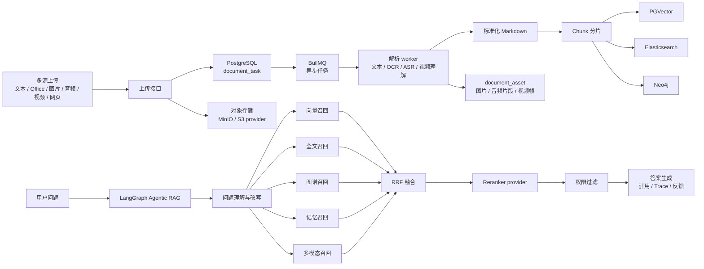
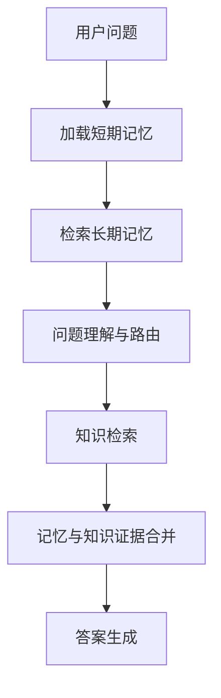

# 企业知识库成熟化升级执行计划

## 1. 目标

把当前项目从“知识库问答 + 数字人 MVP”升级为可长期迭代的企业知识资产平台。核心能力包括：

- 多模态文档录入：文本、PDF、Word、Excel、PPT、图片、音频、视频、网页。
- 可信 RAG：PGVector、Elasticsearch、Neo4j、记忆、多模态多路召回，RRF 融合，Reranker 重排，引用可追溯。
- Agentic RAG：继续使用 LangGraph 承载问题路由、工具调用、多跳检索、图谱推理、记忆召回。
- 记忆体系：Redis 做短期记忆和任务基础设施，mem0 做长期记忆，并通过 provider 隔离第三方 SDK。
- 权限体系：从当前轻量角色升级为 RBAC + 数据权限，覆盖页面、菜单、按钮、接口和检索数据。
- 运维与评估：任务状态、检索 Trace、RAG 评估集、成本、耗时、失败原因、质量指标可查看。

## 2. 技术边界

### 2.1 保留

- 后端继续使用 NestJS、TypeORM、PostgreSQL、PGVector、Elasticsearch、Neo4j。
- Agentic RAG 主流程继续使用 LangGraph，不引入 Deep Agents 做主流程。
- 现有文档、知识库、会话、通知、API Key、Dashboard 等模块继续演进，不重建。
- 现有数字人、ASR、TTS、WebSocket 语音链路保留。

### 2.2 新增

- Redis：短期记忆、检索缓存、任务队列依赖。
- BullMQ：文档解析、OCR、ASR、视频处理、索引写入、图谱同步等后台任务。
- S3 兼容对象存储 provider：默认实现使用 MinIO。
- mem0 provider：长期记忆能力通过接口封装。
- Reranker provider：LLM rerank 和专用 reranker 模型可切换。
- RBAC 权限模型：角色、权限、菜单、按钮、数据范围、文档 ACL。

### 2.3 开发方式

本项目按功能切片推进，不要求先把所有基础设施一次性接完再开发业务功能。每个切片只引入当前功能真正需要的依赖，并保留后续替换空间。

第一条切片为“文档上传异步化 + 任务状态可见”：

- 第一版先落库 `document_task`、`document_task_step`，并用进程内异步执行器跑通任务状态。
- 暂不强制第一天接入 BullMQ、MinIO、mem0、完整 RBAC、专用 Reranker。
- 上传文件的二进制在第一版可由当前进程传给异步执行器；接入对象存储后再支持服务重启后的任务恢复。
- 对外 API 先稳定为任务驱动，后续把执行器从进程内替换成 BullMQ 时，前端和调用方不需要大改。
- 每个切片都必须可运行、可测试、可回退，避免长期只建设基础设施但没有可验证产品能力。

## 3. 总体架构



## 4. 阶段安排

### 阶段 0：工程基线整理，2 天

目标：为大规模改造建立稳定起点。

后端任务：

- 梳理当前 RAG、文档、权限、会话、通知、Dashboard 模块依赖关系。
- 补一份当前能力矩阵，标记已有、部分已有、新增三类。
- 固定主干构建命令：`pnpm build`、`pnpm test --runInBand`、必要 e2e。
- 确认 `docker-compose.rag.yml` 中 PostgreSQL、Elasticsearch、Neo4j 的启动方式。

前端任务：

- 梳理当前路由、导航、文档管理、搜索、问答验证、个人中心。
- 标记哪些页面要承接多模态、任务、权限、记忆功能。

验收标准：

- 后端构建和单测通过。
- 形成一份模块关系说明。
- 明确后续所有迁移文件编号和命名规范。

## 5. 阶段 1：异步任务与对象存储基础，1 周

目标：先把“上传后后台处理”的基础打好，为多模态做准备。

### 5.1 后端模块

新增模块：

- `QueueModule`
- `DocumentTaskModule`
- `ObjectStorageModule`
- `DocumentAssetModule`

建议目录：

```text
src/queue/
src/storage/
src/knowledge/document-task/
src/knowledge/document-asset/
```

### 5.2 Redis + BullMQ

依赖建议：

- `ioredis`
- `bullmq`

环境变量：

```text
REDIS_URL=redis://localhost:6379
DOCUMENT_QUEUE_NAME=document-processing
DOCUMENT_QUEUE_CONCURRENCY=3
```

Docker Compose 要同步新增 Redis 服务，并显式配置队列安全要求：

- Redis 使用持久化卷，避免服务重启导致待处理任务丢失。
- 生产环境禁止队列 key 被自动淘汰，避免 BullMQ 任务元数据异常。
- API 服务和 worker 服务都通过同一个 `REDIS_URL` 访问 Redis。

第一版任务类型保持粗阶段，降低从同步流水线迁移到异步任务的风险：

```ts
type DocumentJobType = 'parse' | 'index' | 'graph_sync';
```

阶段职责：

- `parse`：读取对象存储中的原文件，完成文本抽取、OCR、ASR 或视频基础解析，输出标准化 Markdown 和资源清单。
- `index`：读取 Markdown，完成分片、Embedding、PG chunk 写入、Elasticsearch 索引写入，并更新文档可检索状态。
- `graph_sync`：读取当前文档 chunk，执行实体关系抽取和 Neo4j 同步。该阶段失败不阻塞基础文本检索。

第二版在 3 个粗阶段稳定后，再把 `parse` 和 `index` 内部细拆为 `parse_text`、`parse_image_ocr`、`parse_audio_asr`、`parse_video`、`chunk_document`、`write_embedding`、`write_keyword_index`、`finalize_document`。

进程模型：

- 阶段 1 起就使用独立 worker 进程处理文档任务，避免 OCR、ASR、视频处理影响 HTTP 和 WebSocket。
- 新增入口文件：`src/worker.main.ts`。
- 新增脚本：`"start:worker": "node dist/worker.main.js"`。
- Docker Compose 中 API 和 Worker 作为两个独立 service，共享同一 Redis、PostgreSQL、Elasticsearch、Neo4j、MinIO 配置。

### 5.3 对象存储 provider

接口设计：

```ts
export interface ObjectStorageProvider {
  putObject(input: PutObjectInput): Promise<StoredObject>;
  getObject(input: GetObjectInput): Promise<NodeJS.ReadableStream>;
  deleteObject(input: DeleteObjectInput): Promise<void>;
  createPresignedGetUrl(input: PresignedGetUrlInput): Promise<string>;
}
```

默认实现：

- `S3ObjectStorageProvider`
- 本地和私有化部署使用 MinIO。
- 业务代码只依赖 `ObjectStorageProvider` token。

环境变量：

```text
OBJECT_STORAGE_PROVIDER=s3
S3_ENDPOINT_INTERNAL=http://minio:9000
S3_ENDPOINT_EXTERNAL=http://localhost:9000
S3_REGION=us-east-1
S3_BUCKET=enterprise-kb
S3_ACCESS_KEY=minioadmin
S3_SECRET_KEY=minioadmin
S3_FORCE_PATH_STYLE=true
```

Endpoint 使用规则：

- 后端上传、下载、删除对象时使用 `S3_ENDPOINT_INTERNAL`，适配 Docker 内部网络。
- 返回给浏览器的预签名 URL 使用 `S3_ENDPOINT_EXTERNAL`，避免前端拿到 `http://minio:9000` 这类无法解析的容器内地址。
- 云上对象存储可以把两个端点配置为同一个公网或内网可达域名。

### 5.4 数据库迁移

新增 `document_task`：

```text
id uuid primary key
document_id uuid null
knowledge_base_id uuid not null
job_id text null
task_type text not null
status text not null
stage text not null
progress int not null default 0
attempt int not null default 0
max_attempts int not null default 3
error text null
metadata jsonb null
checkpoint_data jsonb null
ingest_run_id uuid not null
started_at timestamptz null
finished_at timestamptz null
created_at timestamptz not null
updated_at timestamptz not null
```

新增 `document_task_step`：

```text
id uuid primary key
task_id uuid not null
document_id uuid null
knowledge_base_id uuid not null
step text not null
status text not null
attempt int not null default 0
input_hash text null
output_hash text null
checkpoint jsonb null
error text null
started_at timestamptz null
finished_at timestamptz null
created_at timestamptz not null
updated_at timestamptz not null
```

`document_task` 保存整体任务状态，`document_task_step` 保存解析、分片、向量写入、ES 写入、图谱同步等步骤状态。重试时按 step 判断是否跳过已完成步骤，避免重复写入和重复计费。

新增 `document_asset`：

```text
id uuid primary key
document_id uuid not null
knowledge_base_id uuid not null
asset_type text not null
mime_type text null
filename text null
storage_key text not null
url text null
page_no int null
start_ms int null
end_ms int null
caption text null
ocr_text text null
metadata jsonb null
created_at timestamptz not null
updated_at timestamptz not null
```

扩展 `knowledge_document`：

```text
original_storage_key text null
markdown_storage_key text null
parse_result_storage_key text null
chunk_manifest_storage_key text null
parse_strategy text null
parser_version text null
asset_count int not null default 0
current_ingest_run_id uuid null
```

中间产物存储策略：

- 原文件统一进入对象存储，路径写入 `original_storage_key`。
- 解析结果以 Markdown 和 JSON 两种形式保存，分别写入 `markdown_storage_key`、`parse_result_storage_key`。
- 分片清单保存为 JSON，写入 `chunk_manifest_storage_key`，用于重试和任务排查。
- `document_task.checkpoint_data` 保存当前任务关键产物引用。
- `document_task_step.checkpoint` 保存单个步骤的输入、输出、外部写入结果和耗时。
- PostgreSQL 只保存元数据、任务状态、chunk 和业务字段，大文件与大型解析结果不直接写入表字段。

### 5.5 幂等与一致性策略

文档处理是跨 PostgreSQL、Elasticsearch、Neo4j、对象存储的多步骤流程，不能依赖单个数据库事务覆盖全部外部系统。因此第一版必须把幂等和补偿策略写入任务框架：

- 每次处理生成新的 `ingestRunId`，写入 `document_task.ingest_run_id` 和 `knowledge_document.current_ingest_run_id`。
- Worker 每一步开始前校验当前任务的 `ingestRunId` 是否仍是文档最新处理批次，旧任务晚完成时不能覆盖新结果。
- 分片前先清理当前文档当前版本的旧 chunk、旧向量和旧 ES 索引。
- ES 写入前按 `documentId + ingestRunId` 或 `documentId + versionGroupId + versionNo` 做幂等删除。
- Neo4j 同步前先删除当前文档旧实体关系，再写入本次抽取结果。
- 当前步骤失败重试时，只清理该步骤可能产生的半成品，不默认全量重跑所有步骤。
- `document_task_step.checkpoint` 记录外部写入结果，便于失败后定位和跳过已完成步骤。
- 文档最终状态只在全部关键步骤完成后标记 `completed`；图谱失败可以单独记录为 `graph_sync_status = failed`，不阻塞基础文本检索。

第一版重试策略：

- `parse` 失败：只重试解析，不清理已有索引。
- `index` 失败：清理当前 `ingestRunId` 或当前文档版本产生的 chunk、ES 索引，再重新写入。
- `graph_sync` 失败：清理当前文档图谱节点和关系，再重新同步。
- 已完成 step 只有在输入 hash 变化时才重新执行。

### 5.6 API

新增：

- `POST /knowledge-bases/:kbId/documents/upload`
- `GET /documents/:documentId/tasks`
- `GET /documents/:documentId/assets`
- `GET /document-tasks/:taskId`
- `POST /document-tasks/:taskId/retry`

兼容：

- 旧的上传接口继续可用，但内部转为创建任务。

### 5.7 前端

文档管理上传抽屉增强：

- 展示文件上传进度。
- 展示后台任务阶段。
- 展示对象存储资源。
- 支持失败任务重试。
- 支持查看解析后的 Markdown。

验收标准：

- 上传文档后 HTTP 请求快速返回。
- 后台任务可查询状态。
- 原文件进入对象存储。
- 任务失败可看到原因并重试。

### 5.8 本地基础设施

`docker-compose.rag.yml` 需要在现有 Elasticsearch、Kibana、Neo4j 基础上新增：

- `redis`：暴露 `6379`，用于 BullMQ、短期记忆和检索缓存。
- `minio`：暴露 API 端口 `9000` 和 Console 端口 `9001`。
- `api`：NestJS HTTP/WebSocket 服务。
- `worker`：文档任务 worker 服务。

MinIO 配置要求：

- bucket 启动时自动创建，默认名 `enterprise-kb`。
- API 服务内部访问 `http://minio:9000`。
- 浏览器预签名 URL 使用 `http://localhost:9000` 或外部可访问域名。

运维工具：

- 第一版先以 `document_task`、`document_task_step` 接口和前端任务列表为主。
- Bull Board 或 Arena 可作为阶段 1 后半段增强项，接入时必须增加管理员权限校验。

## 6. 阶段 2：多模态解析，2 周

目标：支持文本、Office、图片、音频、视频、网页统一进入知识库。

### 6.1 解析 provider 设计

```ts
export interface DocumentParserProvider {
  supports(input: ParseInput): boolean;
  parse(input: ParseInput): Promise<ParseOutput>;
}
```

`ParseOutput`：

```ts
interface ParseOutput {
  markdown: string;
  assets: ParsedAsset[];
  metadata: Record<string, unknown>;
}
```

解析器列表：

- `PlainTextParser`
- `PdfParser`
- `OfficeParser`
- `ImageOcrParser`
- `AudioAsrParser`
- `VideoParser`
- `WebPageParser`

文件大小策略：

- 第一版不做分片上传，先通过服务端配置限制最大文件大小。
- 文本、PDF、Office、图片、音频、视频分别设置上限，视频第一版建议限制在 100MB 以内。
- 超限文件在前端上传前提示，在后端上传接口再次校验。
- 分片上传、断点续传、大视频异步转码放到多模态稳定后的增强阶段。

### 6.2 文本与 Office

第一版：

- PDF：继续使用当前 `pdf-parse`，输出 Markdown。
- TXT / MD / CSV / JSON：直接转 Markdown。
- DOCX / PPTX / XLSX：新增解析器，优先用稳定 Node 生态库；复杂格式可先抽文本。

第二版：

- 表格保持为 Markdown table。
- PPT 页标题和备注保留。
- Excel 多 sheet 保留 sheet 名。

### 6.3 图片

第一版：

- 图片上传到对象存储。
- OCR 得到文字。
- 视觉模型生成图片描述。
- 生成 Markdown：

```md


OCR 文本：
...

图片描述：
...
```

第二版：

- 生成图片 embedding。
- 支持以图搜图。
- 支持图片作为问答引用。

### 6.4 音频

第一版：

- 音频上传到对象存储。
- ASR 转写文本。
- 按时间段切分。
- chunk metadata 记录 `startMs`、`endMs`。

第二版：

- 说话人分离。
- 音频片段预签名播放。
- 问答引用可跳转到音频时间点。

### 6.5 视频

第一版：

- 视频上传到对象存储。
- 抽音频走 ASR。
- 抽关键帧做 OCR 和图片描述。
- 合并为 Markdown。

第二版：

- 视频理解模型生成镜头描述。
- 视频片段引用带时间点。
- 视频向量进入多模态召回。

### 6.6 网页 URL

第一版：

- 抓取网页正文。
- 转 Markdown。
- 保存 source URL。

第二版：

- 定时刷新。
- 页面变化检测。
- 保留历史版本。

验收标准：

- 至少支持 PDF、TXT、MD、图片、音频、视频基础入库。
- 每种类型都能生成 Markdown、chunk、embedding、ES 索引。
- 引用详情能看到原始资源或对应片段。

## 7. 阶段 3：RAG 检索质量升级，2 周

目标：把当前已有的混合检索升级为可配置、可观察、可评估的检索系统。

### 7.1 保留现状

当前已有：

- PGVector 向量检索。
- Elasticsearch / PG 关键词检索。
- Neo4j 图谱检索。
- RRF 融合。
- LLM Reranker。
- LangGraph RAG 编排。

本阶段不重写这些能力，而是增强。

### 7.2 RetrievalStrategy

基于当前项目已有的 `RetrievalStrategy` 增量扩展，不重新定义一套并行类型。现有字段如 `useVector`、`useKeyword`、`useGraph`、`useMultiQuery`、`useExactPhrase`、`needRetrieval` 保留，新字段通过 `normalizeRetrievalStrategy()` 统一补默认值。

扩展后的策略字段：

```ts
interface RetrievalStrategy {
  name: string;
  useVector: boolean;
  useKeyword: boolean;
  useGraph: boolean;
  useMultiQuery: boolean;
  useExactPhrase: boolean;
  needRetrieval: boolean;
  useMemory: boolean;
  useMultimodal: boolean;
  vectorTopK: number;
  keywordTopK: number;
  graphTopK: number;
  memoryTopK: number;
  rrfK: number;
  rerankTopK: number;
  minRerankScore: number;
}
```

预设：

- `precise`
- `balanced`
- `broad`
- `graph_first`
- `memory_aware`
- `multimodal`

预设策略以工厂函数形式提供，不做成孤立枚举：

```ts
function createRetrievalStrategyPreset(
  preset: RetrievalPreset,
  overrides?: Partial<RetrievalStrategy>,
): RetrievalStrategy;
```

所有入口仍然调用统一的 `normalizeRetrievalStrategy()`，避免知识库配置、搜索页、问答验证、LangGraph 节点各自维护默认值。

### 7.3 RRF 融合约束

多路召回的原始分数尺度不同，PGVector 相似度、Elasticsearch BM25、Neo4j 图谱分、记忆分、多模态分不能直接相加。RRF 主计算必须只使用各召回通道内的排名：

```text
RRF_Score(d) = sum(1 / (rrfK + rank_m(d)))
```

工程约束：

- 各召回通道返回排序数组和原始分数，但 RRF 只读取通道内排名。
- 原始分数只用于 Trace 展示、调试和同通道内部排序，不参与跨通道直接加权。
- 新增 memory、多模态召回时也必须遵守同一规则。
- 单测覆盖 BM25 高分不会压过多个通道共同命中的结果。
- RRF 后仍保留 `retrieval_sources`、`channel_rank`、`raw_score`，方便前端解释。

实现方式：

- 将当前 `fuseVectorAndKeywordResults` 和 `fuseHybridAndGraphChannels` 收敛为通用 N 路融合函数。
- 新函数签名建议为 `fuseMultiChannelResults(channels: Map<string, KnowledgeChunk[]>, options)`。
- 通道名统一为 `vector`、`keyword`、`graph`、`memory`、`multimodal`。
- 旧函数短期保留为兼容包装，内部调用 `fuseMultiChannelResults`。

### 7.4 Reranker provider

接口：

```ts
export interface RerankerProvider {
  rerank(input: RerankInput): Promise<RerankOutput>;
}
```

实现：

- `LlmRerankerProvider`：兼容现有能力。
- `DashScopeRerankerProvider`：可选。
- `BgeRerankerProvider`：可选。
- `NoopRerankerProvider`：测试和降级。

与现有代码的衔接：

- 保留当前 `RerankerService` 作为门面服务，不让 LangGraph、`KnowledgeSearchService` 直接依赖具体 provider。
- 新增 `RerankerModule`，根据 `RERANKER_PROVIDER` 注入一个 `RerankerProvider`。
- 当前 LLM 重排逻辑迁移到 `LlmRerankerProvider`。
- `RerankerService` 负责调用 provider、记录耗时、统一异常处理和降级。
- `NoopRerankerProvider` 只返回原始排序，用于测试、故障降级和本地无模型环境。
- 搜索层仍保留“Reranker 失败后回退原排序”的保护，避免 provider 异常影响基础检索。

环境变量：

```text
RERANKER_PROVIDER=llm
RERANKER_MODEL_NAME=
RERANKER_TIMEOUT_MS=8000
RERANKER_MAX_CANDIDATES=30
```

### 7.5 检索 Trace

扩展返回：

```ts
interface RetrievalTrace {
  queryRewrite: string[];
  channels: {
    vector: ChannelTrace;
    keyword: ChannelTrace;
    graph: ChannelTrace;
    memory: ChannelTrace;
    multimodal: ChannelTrace;
  };
  rrfFusion: RrfTraceItem[];
  rerank: RerankTraceItem[];
  permissionFilter: {
    before: number;
    after: number;
    filtered: number;
  };
  finalChunks: string[];
}
```

`RrfTraceItem` 至少包含：

```ts
interface RrfTraceItem {
  chunkId: string;
  retrievalSources: string[];
  channelRanks: Record<string, number>;
  rawScores: Record<string, number>;
  rrfScore: number;
}
```

### 7.6 前端

智能搜索和问答验证页增强：

- 展示每路召回数量。
- 展示 RRF 分数。
- 展示 rerank 分数。
- 展示最终进入 prompt 的 chunk。
- 支持按策略运行同一个问题。
- 支持对比策略效果。

### 7.7 评估指标

新增：

- `hit@1`
- `hit@3`
- `recall@5`
- `recall@10`
- 引用准确率。
- 无引用回答率。
- 低评分回答数。
- 平均检索耗时。
- 平均 rerank 耗时。

验收标准：

- 同一个问题能看到完整检索 Trace。
- 能切换检索策略。
- Reranker provider 可替换。
- 评估用例能产出命中率和召回率。

## 8. 阶段 4：Redis 短期记忆与 mem0 长期记忆，2 周

目标：让问答具备连续上下文和用户长期偏好，同时不污染企业知识库。

### 8.1 模块

新增：

- `MemoryModule`
- `ShortTermMemoryService`
- `LongTermMemoryService`
- `MemoryRetrieverService`
- `MemoryPolicyService`

### 8.2 Redis 短期记忆

Key 设计：

```text
conversation:{conversationId}:window
conversation:{conversationId}:summary
rag:retrieval-cache:{queryHash}
user:{userId}:active-context
```

短期记忆内容：

- 最近 N 轮用户和助手消息。
- 会话滚动摘要。
- 当前任务背景。
- 临时检索缓存。

策略：

- 最近窗口用 TTL。
- 摘要写 PostgreSQL 备份字段。
- 敏感内容不写入共享缓存。
- Redis 不可用时，短期记忆读取返回空结果，问答主流程继续执行。
- Redis 连续失败达到阈值后进入短暂熔断期，熔断期内跳过短期记忆和检索缓存。

### 8.3 mem0 长期记忆

provider 接口：

```ts
export interface LongTermMemoryProvider {
  add(input: AddMemoryInput): Promise<MemoryRecord>;
  search(input: SearchMemoryInput): Promise<MemoryRecord[]>;
  delete(input: DeleteMemoryInput): Promise<void>;
}
```

记忆分类：

- 用户偏好。
- 用户岗位和部门背景。
- 常用业务语境。
- 长期任务目标。
- 会话沉淀摘要。

权限字段：

```text
ownerId
department
visibility
sourceConversationId
confidence
expiresAt
```

降级策略：

- mem0 不可用时返回空长期记忆，不阻断 RAG。
- `LongTermMemoryService` 记录失败次数，连续失败后进入熔断期。
- 熔断期结束后允许一次探测请求，成功后恢复长期记忆召回。
- 记忆写入失败不影响对话消息落库。
- 记忆检索失败只进入 Trace 和日志，不向用户暴露内部错误。

### 8.4 LangGraph 接入

新增节点：

- `load_short_term_memory`
- `retrieve_long_term_memory`
- `filter_memory_by_policy`
- `merge_memory_context`

节点可靠性要求：

- `load_short_term_memory`、`retrieve_long_term_memory` 必须有 try-catch 降级。
- 记忆节点配置独立 retry policy，重试次数低于核心知识检索节点。
- 记忆节点失败时返回空记忆并继续走知识库检索。
- 记忆召回结果必须经过 `filter_memory_by_policy`，按 owner、department、visibility 校验。

建议流程：



记忆与知识合并规则：

- 上下文优先级固定为：系统规则 > 企业知识库事实 > 当前会话上下文 > 用户长期偏好。
- 长期记忆只能影响称呼偏好、输出格式偏好、常用业务背景和会话连续性。
- 长期记忆不能改写企业制度、合同、流程、财务、人事、安全规范等客观知识。
- `merge_memory_context` 必须把企业知识和用户记忆分区输出，禁止混成一段普通文本。
- Prompt 中使用隔离标签，例如 `<knowledge_base>`、`<conversation_context>`、`<user_preference>`。
- 当长期记忆与知识库证据冲突时，答案以知识库证据为准，并可提示用户“当前回答以企业知识库资料为准”。

Prompt 输入建议结构：

```xml
<knowledge_base>
企业知识库证据、引用和出处
</knowledge_base>

<conversation_context>
当前会话短期上下文和摘要
</conversation_context>

<user_preference>
用户偏好、常用格式、长期业务背景
</user_preference>
```

### 8.5 前端

个人中心新增“记忆管理”：

- 查看长期记忆。
- 删除长期记忆。
- 关闭个人记忆。
- 查看记忆来源会话。

问答页：

- 展示本次回答使用了哪些记忆。
- 用户可反馈“这条记忆不准确”。

验收标准：

- 同一会话内能使用 Redis 短期上下文。
- 跨会话能召回用户长期记忆。
- 用户能查看和删除自己的长期记忆。
- 记忆召回不会越过权限范围。

## 9. 阶段 5：RBAC 与数据权限，3 周

目标：把当前 `user/admin + department + visibility` 升级为完整权限体系。

迁移原则：

- 现有 `user.role` 字段保留，用于兼容旧接口、旧 token 和简单角色判断。
- 新角色模型通过 `user_role` 关联表承载，逐步替代直接读取 `user.role` 的业务逻辑。
- 当前 `RolesGuard` 保留，新增权限体系先与它并行运行。
- 新增 `AuthorizationService` 作为统一权限判断入口，`RolesGuard` 和 `PermissionGuard` 都调用该服务，避免 guard 之间互相依赖。
- 当前 `KnowledgeAccessScope` 保留，第一阶段继续支持 owner、department、visibility；ACL 在此基础上增量扩展。

### 9.1 数据模型

新增表：

```text
role
permission
user_role
role_permission
department
menu_permission
document_acl
knowledge_base_acl
```

`permission` 建议字段：

```text
id uuid primary key
code text unique not null
name text not null
type text not null
resource text not null
action text not null
description text null
created_at timestamptz not null
updated_at timestamptz not null
```

权限类型：

- `page`
- `menu`
- `button`
- `api`
- `data`

### 9.2 权限编码

示例：

```text
dashboard:view
documents:view
documents:upload
documents:delete
documents:retry
documents:archive
documents:version:set-current
search:view
chat:view
eval:view
eval:run
api-key:manage
system:role-manage
```

### 9.3 数据范围

数据权限范围：

- `self`
- `department`
- `company`
- `custom`

文档 ACL：

```text
document_id
subject_type: user | role | department
subject_id
actions: read | write | delete | manage
```

检索权限索引字段：

```text
allowed_user_ids text[] null
allowed_role_ids text[] null
allowed_department_ids text[] null
security_level int not null default 0
acl_version int not null default 1
```

说明：

- ACL 关系表负责权限管理和审计。
- Chunk、Elasticsearch 文档和图谱节点元数据中写入扁平化权限字段，用于高频检索过滤。
- `acl_version` 用于判断索引中的权限元数据是否过期。
- 单文档特殊授权优先写入 ACL 表，再异步刷新 chunk、ES、Neo4j 元数据。

### 9.4 后端

新增：

- `PermissionGuard`
- `AuthorizationService`
- `DataScopeService`
- `RbacService`
- `PermissionDecorator`

接口：

- `GET /rbac/roles`
- `POST /rbac/roles`
- `PATCH /rbac/roles/:id`
- `DELETE /rbac/roles/:id`
- `GET /rbac/permissions`
- `POST /rbac/users/:userId/roles`
- `GET /rbac/me/permissions`
- `GET /rbac/me/menus`

检索必须接入：

- PGVector SQL 权限条件。
- Elasticsearch filter。
- Neo4j 查询条件。
- RRF 后二次过滤。
- 引用详情权限检查。

权限过滤策略：

- 第一阶段保持现有 `applyDocumentAccessScope` 可用，只在需要精细授权的文档上叠加 ACL 判断。
- 召回前使用扁平化字段过滤：`allowed_user_ids`、`allowed_role_ids`、`allowed_department_ids`、`security_level`。
- RRF 后再次调用 `DataScopeService` 做安全过滤，防止索引刷新延迟造成越权结果进入答案。
- 权限变更后创建 `refresh_acl_index` 任务，异步刷新 PG chunk 元数据、ES filter 字段和 Neo4j 节点权限字段。
- 如果检索结果的 `acl_version` 低于文档当前版本，后置过滤必须重新读取数据库权限再判断。
- 被过滤数量只进入 Trace 统计，不向用户暴露无权文档标题和内容。

WebSocket 权限：

- 阶段 5 需要复核当前 WebSocket handshake 的 JWT 校验和用户上下文注入。
- 文本、语音、会话初始化等 WebSocket 消息都要复用 `AuthorizationService` 判断 persona、知识库和会话访问范围。
- WebSocket 权限失败时只返回通用错误，不返回无权资源信息。

### 9.5 前端

新增系统管理：

- 用户管理。
- 角色管理。
- 权限管理。
- 部门管理。

导航和按钮：

- 根据 `GET /rbac/me/menus` 渲染菜单。
- 根据权限 code 控制按钮展示。
- 前端路由增加 route guard，未授权页面跳转到无权限页或默认首页。
- 后端仍然做最终校验。

验收标准：

- 不同角色看到不同菜单和按钮。
- 普通用户无法访问无权接口。
- 搜索和问答不会返回无权文档。
- 管理员能管理角色和权限。

## 10. 阶段 6：知识图谱与多跳推理增强，2 周

目标：让 Neo4j 不只是辅助召回，而是能参与复杂业务问题回答。

后端任务：

- 图谱抽取结果增加可信度、来源 chunk、证据文本。
- 实体去重和归一化。
- 关系类型可配置。
- LangGraph 增加图谱推理节点。
- 对复杂问题先走图谱扩展，再合并文本证据。

API：

- `GET /knowledge-bases/:kbId/graph/entities`
- `GET /knowledge-bases/:kbId/graph/relations`
- `GET /knowledge-bases/:kbId/graph/neighborhood`
- `POST /knowledge-bases/:kbId/graph/rebuild`

前端：

- 知识库详情新增图谱页。
- 支持实体搜索、邻居查看、关系证据查看。
- 图谱节点可跳到原文引用。

验收标准：

- 用户能查看实体和关系来源。
- 多跳问题能看到图谱推理 Trace。
- 图谱失败不会影响基础问答。

## 11. 阶段 7：观测、评估与运营看板，2 周

目标：让系统质量可监控、可评估、可持续优化。

### 11.1 LangSmith / LangFuse

本地开发：

- LangSmith 用于调试。

线上：

- LangFuse 用于请求链路、成本、耗时、模型输出、RAG 证据记录。

### 11.2 指标

RAG 指标：

- 检索耗时。
- Rerank 耗时。
- LLM 耗时。
- 召回命中率。
- 引用准确率。
- 无引用回答率。
- 用户点踩率。

文档指标：

- 解析成功率。
- 解析失败率。
- 平均处理耗时。
- 多模态文件占比。
- 图谱同步成功率。

权限指标：

- 被权限过滤的检索结果数量。
- 越权访问拦截次数。

健康检查：

- PostgreSQL 连接状态。
- Elasticsearch 读写索引状态。
- Neo4j 连接状态。
- Redis 连接状态和队列延迟。
- MinIO bucket 可访问状态。
- Worker 存活状态和最近任务处理时间。

### 11.3 Dashboard

首页大盘增强：

- 多模态文档数量。
- 最近失败任务。
- RAG 质量趋势。
- 热门问题。
- 低评分回答。
- 解析失败类型分布。

验收标准：

- 能追踪一次问答的完整请求链路。
- 能查看文档处理失败原因统计。
- 能查看 RAG 质量变化。

## 12. 阶段 8：前端产品化，贯穿执行

目标：把后端能力转成清晰可用的产品体验。

### 12.1 新增或增强页面

- 文档管理：多模态上传、任务进度、资产查看、Markdown 查看。
- 上传中心：批量文件、失败重试、处理阶段。
- 智能搜索：多路召回 Trace、策略切换、引用详情。
- AI 问答：记忆提示、引用详情、回答反馈、重新生成。
- 问答验证：评估集、批量运行、策略对比、失败分析。
- 个人中心：API Key、个人记忆、权限信息。
- 系统管理：用户、角色、权限、部门。
- 知识库详情：文档、健康、图谱、验证、权限。

### 12.2 前端类型

新增或扩展：

- `DocumentTask`
- `DocumentAsset`
- `ParseResult`
- `RetrievalTrace`
- `RerankTrace`
- `MemoryRecord`
- `Role`
- `Permission`
- `Department`
- `MenuItem`

### 12.3 交互要求

- 后台任务要可刷新、可重试、可查看错误。
- 引用详情要能打开原始资源。
- 无权限入口不要展示。
- 有权限风险的操作需要确认。
- 上传后用户能知道当前处理阶段。

验收标准：

- 用户能上传图片、音频、视频，并看到处理结果。
- 用户能从回答引用跳回原始证据。
- 用户能查看自己的权限和长期记忆。
- 管理员能配置角色权限。

## 13. 数据迁移顺序

建议迁移顺序：

1. `025_document_task_and_asset.sql`：`document_task`、`document_task_step`、`document_asset`、对象存储字段。
2. `026_document_ingest_metadata.sql`：`parse_strategy`、`parser_version`、`asset_count`、`current_ingest_run_id`、中间产物 storage key。
3. `027_rag_trace_extensions.sql`：RAG Trace 字段扩展。
4. `028_memory_tables.sql`：memory 相关表。
5. `029_rbac_base_tables.sql`：RBAC 基础表。
6. `030_document_acl_and_flattened_scope.sql`：文档 ACL、知识库 ACL、扁平化权限字段和 `acl_version`。
7. `031_dashboard_metric_views.sql`：Dashboard 指标相关字段或视图。

迁移编号从 `025_` 开始，保持递增和语义化命名。旧迁移文件不改名，避免破坏已有环境。

迁移要求：

- 旧文档默认生成 `document_task` 历史记录，状态为 `completed`。
- 旧文档默认生成 `document_task_step` 历史记录，关键步骤状态为 `completed`。
- 旧文档初始化 `current_ingest_run_id`，后续重建索引用新批次覆盖。
- 旧文档默认 `visibility = company` 或保持当前值。
- 旧 chunk 和 ES 索引补齐 `allowed_user_ids`、`allowed_role_ids`、`allowed_department_ids`、`acl_version`。
- 旧用户默认分配 `user` 角色。
- 现有管理员默认分配 `admin` 角色。
- 旧 API 不立即删除，保留兼容期。

## 14. 测试计划

### 14.1 后端单元测试

- ObjectStorage provider mock。
- Document parser provider 选择逻辑。
- Document task 状态流转。
- Document task step 断点重试和跳过已完成步骤。
- `parse`、`index`、`graph_sync` 三阶段任务状态流转。
- `ingestRunId` 防止旧任务覆盖新任务。
- BullMQ job 重试和失败记录。
- RRF 融合排序。
- 通用 N 路 RRF 融合函数能兼容 vector、keyword、graph、memory、multimodal。
- RRF 不直接使用 BM25、向量相似度等原始分数做跨通道加权。
- Reranker provider 降级。
- `RerankerService` 门面服务能按配置选择 provider。
- Redis 短期记忆读写。
- Redis 熔断时问答主流程继续执行。
- mem0 provider mock。
- mem0 失败时返回空记忆且不阻断问答。
- 记忆与知识冲突时优先使用知识库证据。
- RBAC 权限判断。
- `AuthorizationService` 同时支持旧 `user.role` 和新 `user_role`。
- 数据权限过滤。
- ACL 扁平化字段和 `acl_version` 过期判断。

### 14.2 后端 e2e

- 上传图片到处理完成，再搜索命中 OCR 文本。
- 上传音频到处理完成，再问答引用 ASR 片段。
- 上传视频到处理完成，再搜索关键帧描述。
- 多路召回返回 Trace。
- 检索 Trace 返回 channel rank、raw score、RRF score、rerank score。
- Reranker provider 切换后接口稳定。
- Redis 或 mem0 模拟不可用时，问答接口仍能基于知识库回答。
- 普通用户无法检索无权文档。
- 文档权限变更后，ACL 刷新任务完成前后都不会返回无权结果。
- 管理员能创建角色并分配权限。

### 14.3 前端测试

- 上传中心批量任务状态。
- 文档资产抽屉。
- 搜索 Trace 展示。
- 问答引用详情。
- 记忆管理列表和删除。
- RBAC 菜单和按钮展示。
- 系统管理角色编辑。

### 14.4 手工验收

- 用户上传一份扫描 PDF，系统能 OCR 并问答。
- 用户上传一段音频，系统能转写并搜索。
- 用户上传一个视频，系统能基于字幕或关键帧回答。
- 用户能看懂为什么某条结果被引用。
- 用户无法看到无权资料。
- 管理员能查看处理失败原因并重试。

## 15. 发布策略

### 15.1 开发环境

- 使用 Docker Compose 启动 PostgreSQL、Elasticsearch、Neo4j、Redis、MinIO。
- Docker Compose 中 MinIO 要同时验证容器内访问地址和浏览器预签名 URL 地址。
- 任务 worker 和 API 服务从阶段 1 起分进程启动，避免多模态任务影响 HTTP 和 WebSocket。
- 本地开发至少提供两个启动命令：`pnpm start:dev` 和 `pnpm start:worker:dev`。

### 15.2 测试环境

- API 服务和 worker 分进程。
- 固定一批多模态测试文件。
- 开启 LangSmith 或 LangFuse 采样。

### 15.3 生产环境

- API、worker、定时任务分开部署。
- Redis 配置禁止队列 key 被自动淘汰。
- MinIO 或云对象存储开启 bucket 权限隔离。
- 对象存储同时配置内部端点和外部端点，预签名 URL 必须使用浏览器可访问地址。
- 所有下载通过预签名 URL，不暴露永久公开地址。
- 权限校验失败记录安全日志。

## 16. 主要风险与处理

| 风险                        | 处理方式                                  |
| --------------------------- | ----------------------------------------- |
| 多模态解析耗时长            | 全部走后台任务，前端只看状态              |
| OCR / ASR 模型成本高        | provider 化，支持本地和云模型切换         |
| 视频处理资源占用高          | 第一版只做音频 ASR 和关键帧，限制文件大小 |
| 权限接入影响检索性能        | 查询前过滤 + 索引字段 + 融合后二次过滤    |
| ACL 索引刷新延迟            | 检索后按 `acl_version` 再查库校验         |
| Reranker 慢                 | 设超时和降级，候选数做上限                |
| mem0 或 Redis 不稳定        | 记忆节点降级为空结果，主流程继续执行      |
| 记忆泄露                    | ownerId、department、visibility 全程校验  |
| 长期记忆影响客观事实        | LangGraph 合并上下文时固定知识库证据优先  |
| 对象存储 URL 泄露           | 统一用短期预签名 URL                      |
| Docker 内外 Endpoint 不一致 | S3 内部写入和外部预签名 URL 分开配置      |
| 视频文件过大                | 第一版限制文件大小，分片上传放到后续增强  |

## 17. 推荐实施顺序

1. 阶段 0：工程基线。
2. 阶段 1：Redis、BullMQ、对象存储、任务状态。
3. 阶段 2：多模态解析。
4. 阶段 3：RAG 检索质量升级。
5. 阶段 4：记忆体系。
6. 阶段 5：RBAC。
7. 阶段 6：知识图谱增强。
8. 阶段 7：观测和评估。
9. 阶段 8：前端产品化贯穿每个阶段。

最小可发布版本建议包含：

- Redis + BullMQ。
- `document_task_step` 和 `ingestRunId` 幂等机制。
- 独立 worker 进程。
- S3 provider + MinIO。
- S3 内外 Endpoint 配置。
- 图片 OCR。
- 音频 ASR。
- 检索 Trace。
- Reranker provider。
- RBAC 基础表和后端 guard。

## 18. 里程碑

| 里程碑 |        周期 | 交付                                     |
| ------ | ----------: | ---------------------------------------- |
| M1     |     第 1 周 | 异步任务、对象存储、任务状态 UI          |
| M2     |   第 2-3 周 | 图片、音频、视频基础入库                 |
| M3     |   第 4-5 周 | 检索策略、Reranker provider、Trace、评估 |
| M4     |   第 6-7 周 | Redis 短期记忆、mem0 provider、记忆管理  |
| M5     |  第 8-10 周 | RBAC、数据权限、系统管理                 |
| M6     | 第 11-12 周 | 图谱增强、观测看板、验收修正             |

## 19. 第一批开发任务清单

第一批建议从后端基础开始：

- 新增 `QueueModule` 和 Redis 连接封装。
- 新增 `DocumentTask`、`DocumentTaskStep` 实体、迁移、service、controller。
- 新增 `ObjectStorageProvider` 接口和 S3 实现。
- 修改 `docker-compose.rag.yml`，新增 Redis、MinIO、API、Worker 服务。
- 新增 `src/worker.main.ts` 和 `start:worker`、`start:worker:dev` 脚本。
- 配置 `S3_ENDPOINT_INTERNAL` 和 `S3_ENDPOINT_EXTERNAL`，并验证预签名 URL 可被浏览器打开。
- 改造文档上传接口：上传原文件到对象存储，创建任务，返回任务 ID。
- 引入 `ingestRunId`，防止旧任务覆盖新任务。
- 新增 worker：第一版只实现 `parse`、`index`、`graph_sync` 三个粗阶段。
- 第一批代码可先用进程内异步执行器跑通任务状态，BullMQ 在接口稳定后替换执行器。
- Worker 写入前按 `documentId`、当前版本和 `ingestRunId` 做幂等清理。
- 前端上传中心改为任务驱动。
- 增加任务失败重试。
- 增加对应单测和 e2e。

完成这批后，再进入图片 OCR、音频 ASR、视频解析。
