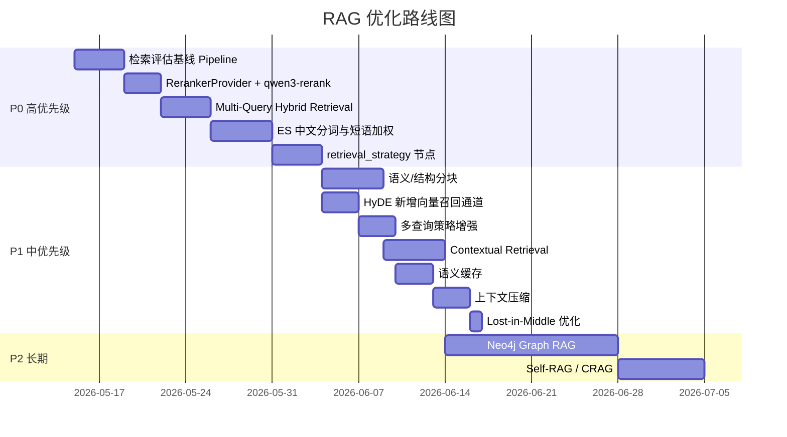

# Digital Human Agent — RAG 优化技术与改进计划

## 一、当前实现评价

### ✅ 做得好的部分
- **混合检索 + RRF 融合**：语义 + 关键词双通道，业界主流方案
- **逐层降级**：每个环节都有 fallback，鲁棒性强
- **Multi-Hop 多跳**：复杂问题拆解，避免单次检索不足
- **Query Rewrite**：LLM 改写提升检索召回，当前是单条检索 query
- **Web Fallback**：知识库不足时联网补充

### ⚠️ 可改进的方向

下面按 **影响力 × 实现难度** 分为 P0/P1/P2 三个优先级。

---

## 二、专项核对：ES、Rerank、Agentic RAG

> 核对时间：2026-05-15  
> 核对范围：当前仓库真实代码，不只看方案描述。

### 1. ElasticSearch：已经有 BM25 关键词检索，但还没有 IK 中文分词和精确匹配增强

**当前做到的部分**：

- 已经把 ElasticSearch 当作关键词检索后端之一，默认仍走 PostgreSQL，配置切到 `HYBRID_KEYWORD_BACKEND=elastic` 且 `ELASTICSEARCH_ENABLED=true` 后才走 ES。
- ES 作为派生索引使用，PostgreSQL / Supabase 仍是主数据源。
- ES 查询使用 `match` 搜索 `content`、`source`、`category`，并按 `_score` 排序。ES text 字段默认相似度是 BM25，所以当前已经有 BM25 关键词相关性评分。
- 当前还有 `content.ngram` 子字段，用 2-6 gram 方式增强短词、片段和部分匹配。
- 检索主链路是“向量检索 + 关键词检索并行”，再用 RRF 融合排序。

**代码落点**：

- `src/knowledge-content/elasticsearch/elasticsearch-index.service.ts`
  - 创建 ES 索引、read/write alias、`content.ngram` analyzer。
- `src/knowledge-content/keyword-retrievers/elastic-keyword-retriever.service.ts`
  - 使用 `match` 查询 `content/source/category/content.ngram`。
- `src/knowledge-content/services/knowledge-hybrid-retriever.service.ts`
  - 向量检索和关键词检索并行执行，并用 RRF 融合。
- `src/knowledge-content/services/knowledge-keyword-retriever.service.ts`
  - ES 不可用时回退到 PG 关键词检索。

**还没做到的部分**：

- 没有配置 IK 分词器。当前 analyzer 是 `standard tokenizer + lowercase + ngram`，中文分词能力不如 IK。
- 没有针对正文做明确的精确短语加权，例如 `match_phrase`。
- `source.keyword`、`category.keyword` 字段已经建了，但当前查询没有用 `term` 做精确字段命中加权。
- `content` 没有专门的中文 analyzer 字段，也没有单独的 `content.ik` / `content.exact` 这类多字段设计。

**建议优化**：

第一步先把 ES 查询升级为“三层关键词召回”：

```text
精确短语命中（match_phrase，高权重）
  + 中文分词 BM25（IK 分词，中高权重）
  + ngram 片段匹配（低权重，兜底召回）
```

推荐索引方案：

```text
content:
  type: text
  analyzer: ik_max_word
  search_analyzer: ik_smart
  fields:
    ngram:
      type: text
      analyzer: knowledge_content_ngram_analyzer
      search_analyzer: standard
```

推荐查询结构：

```text
bool.should:
  - match_phrase content, boost 8
  - match content, boost 4
  - match source/category, boost 2
  - term source.keyword/category.keyword, boost 3
  - match content.ngram, boost 1.2
```

注意：启用 IK 需要使用带 IK 插件的 ES 镜像或在镜像里安装插件；索引 analyzer 变更后不能原地修改旧字段，需要新建索引版本并回填。

ES 改造必须作为索引迁移任务处理，不能只改查询代码。最小执行清单：

```text
1. 将 docker-compose.elastic.yml 换成带 IK 插件的 ES 镜像，或新增自定义镜像安装 analysis-ik。
2. bump DEFAULT_ELASTICSEARCH_INDEX_VERSION，例如 v1 -> v2。
3. 新索引 mapping 增加 IK analyzer，并保留 ngram 兜底字段。
4. 通过 backfill 命令把 PostgreSQL / Supabase 里的 chunk 回填到新索引。
5. 用显式 alias 切换脚本把 read/write alias 切到新索引，保留回滚空间。
6. 用同一批 golden set 对比 PG keyword、旧 ES、新 ES 的 hit@k 和 MRR。
```

### 2. Rerank：已经有重排，但现在是通用 LLM 重排，还没有抽成 Provider

**当前做到的部分**：

- 已经有两阶段检索：
  - Stage 1：向量检索 + 关键词检索 + RRF 融合，拿到候选 chunk。
  - Stage 2：rerank 后取 `finalTopK`，再交给回答生成。
- 默认检索配置里 `rerank: true`，所以正常链路会做重排。
- 当前 rerank 会把候选片段交给通用 LLM，让模型输出 JSON 分数，再按 `rerank_score` 排序。
- rerank 失败时不会让整次问答失败，而是回退到 Stage 1 排序结果。

**代码落点**：

- `src/knowledge-content/services/knowledge-search.service.ts`
  - `retrieveWithStagesInternal()` 中先做 Stage 1，再调用 `rerankerService.rerank()`。
- `src/knowledge-content/services/reranker.service.ts`
  - 当前用 `ChatOpenAI` + `KNOWLEDGE_RERANK_PROMPT` 做 LLM JSON 重排。
- `src/common/constants/knowledge.constants.ts`
  - 默认 `finalTopK: 5`、`rerank: true`。

**还没做到的部分**：

- 还没有接入专用 reranker API。
- `RERANKER_MODEL_NAME` 目前只是切换通用聊天模型，不等于调用专用 rerank API。
- LLM JSON 重排有解析失败、延迟较高、成本较高的问题。

**建议优化**：

把 `RerankerService` 拆成可切换 provider。`qwen3-rerank` 作为推荐 provider，但不要把业务流程写死在某一个模型上：

```text
RerankerService
  - RerankerProvider interface
      - DashScopeQwenRerankerProvider   // 推荐实现：qwen3-rerank
      - LlmJsonRerankerProvider         // 降级实现：当前 LLM JSON 方案
```

新增环境变量：

```text
RERANKER_PROVIDER=dashscope
DASHSCOPE_API_KEY=xxx
RERANKER_MODEL=qwen3-rerank
```

当 `RERANKER_PROVIDER=dashscope` 时，使用千问重排 API。推荐优先接官方原生 DashScope endpoint，和用户现有 DashScope 调用方式保持一致：

```text
POST https://dashscope.aliyuncs.com/api/v1/services/rerank/text-rerank/text-rerank
model: qwen3-rerank
input.query: 用户问题
input.documents: chunk 文本数组
parameters.top_n: finalTopK
parameters.return_documents: false
```

返回结果里的 `index` 对应原始候选文档下标，`relevance_score` 可以映射为 `rerank_score`。官方文档说明，`qwen3-rerank` 面向文本语义检索和 RAG 应用，结果按相关性分数排序。DashScope 也支持不带 `input` 对象的写法，此时 `query` 和 `documents` 与 `model` 同层；两种格式不要混用。

注意：`relevance_score` 只适合在同一次 rerank 请求内比较，不要跨请求当成全局质量分，也不要持久化后用于不同 query 之间的排序。

实现边界：

- 原生 DashScope endpoint 使用 `input` / `parameters`；兼容 rerank endpoint 使用扁平参数。先固定一种 provider 形态，避免同一个 provider 同时支持两套请求体导致排障困难。
- 候选 chunk 数量用 `stage1TopK` 控制，避免一次传入过多文档。
- 单条 chunk 或图谱证据卡过长时要先截断，但必须保留 `chunkId`、`source`、核心证据文本。
- 图谱证据卡可以作为字符串 document 传入 rerank，但最终回答仍要回到原文 chunk 做支撑。
- 可以保留 `instruct`，默认使用问答检索任务；后续如果做 FAQ/相似问匹配，再切换为语义相似度排序说明。
- DashScope 调用失败、超时或返回格式异常时，回退到 `LlmJsonRerankerProvider` 或 Stage 1 排序结果。

参考文档：<https://help.aliyun.com/zh/model-studio/text-rerank-api>

### 3. Agentic RAG：已经有 LangGraph 版自主检索流程，但策略选择还比较粗

**当前做到的部分**：

当前系统已经不是“一次检索后直接回答”的简单 RAG，而是有 LangGraph 编排：

```text
route_question
  -> simple: prepare_query
  -> complex: plan_sub_questions
prepare_query
  -> retrieve_evidence
retrieve_evidence
  -> evaluate_evidence
evaluate_evidence
  -> 证据足够: load_context -> generate_answer
  -> 证据不足且还有子问题: prepare_query -> retrieve_evidence
  -> 证据不足且可联网: web_fallback -> evaluate_evidence
```

它已经具备这些能力：

- 用 LLM 判断问题是 `simple` 还是 `complex`。
- 复杂问题会先拆成多个子问题，再逐跳检索。
- 每次检索后都会评估证据是否足够。
- 本地证据不够时，可以走联网搜索补充。
- 最终回答会同时使用本地知识和联网补充，并输出引用。

**代码落点**：

- `src/agent/langgraph/rag.graph.ts`
  - 定义完整 LangGraph 节点和跳转关系。
- `src/agent/services/rag-route.service.ts`
  - LLM 判断 simple / complex。
- `src/agent/services/multi-hop-planner.service.ts`
  - 复杂问题拆成子问题。
- `src/agent/langgraph/nodes/retrieve.node.ts`
  - 按当前问题或子问题检索证据。
- `src/agent/services/evidence-evaluator.service.ts`
  - LLM 判断证据是否足够，并生成联网搜索 query。
- `src/agent/services/web-fallback.service.ts`
  - 使用 Bocha API 做联网补充。

**还没做到的部分**：

- “是否检索”的判断还不细。当前 simple 问题基本都会检索，没有显式的“纯聊天 / 不查知识库”分支。
- “用哪种检索方式”的选择还不细。当前本地检索统一走 persona 知识库的混合检索，没有按问题动态选择：
  - vector only
  - keyword only
  - ES exact phrase
  - hybrid
  - multi-query
  - HyDE
- 证据不足后的本地补查已能利用 `evaluate_evidence.missingFacts` 追加下一条本地检索 query；复杂问题会在未达到 `maxHops` 前优先补查本地知识库，再考虑 web。
- 联网搜索已支持有限多轮：默认最多 2 次，记录 `webSearchAttempts` 和 `webSearchQueries`，避免同一 query 重复搜索。
- 还没有把每轮决策结果沉淀成可观察的调试报告，例如每轮为什么查、查了什么、为什么够或不够。

**结论**：

当前已经做到“Agentic RAG 的主体流程”，尤其是问题路由、多跳检索、证据评估、缺失信息补查、有限多轮联网补充和最终生成。但还不是完整的“图谱关系推理 + 多层摘要检索”的高级形态。下一步应继续增强图谱检索和真实评估，而不是重写整套图。

建议新增一个 `retrieval_strategy` 节点，但它不能替代现有 Multi-Hop。更合理的位置是：先保留 `route_question` 和 `plan_sub_questions`，再对当前问题或每个子问题选择检索策略。

```text
route_question
  -> simple: plan_retrieval_strategy
  -> complex: plan_sub_questions -> plan_retrieval_strategy
  -> prepare_query
  -> retrieve_evidence
```

复杂问题里，`plan_retrieval_strategy` 可以对每个子问题分别输出策略。例如第一个子问题走 ES 精确短语，第二个子问题走 Neo4j 路径，第三个子问题走向量召回。

策略输出示例：

```json
{
  "needRetrieval": true,
  "useVector": true,
  "useKeyword": true,
  "useGraph": false,
  "useExactPhrase": true,
  "useMultiQuery": false,
  "useHyDE": false,
  "allowWeb": true,
  "reason": "问题涉及知识库事实，需要优先本地检索；包含明确实体，适合短语加权"
}
```

这样可以把“要不要查、怎么查、查完够不够、不够怎么补”从固定规则升级成可解释的策略链路。

### 4. Neo4j / Graph RAG：用知识图谱补上“关系”和“多跳路径”

**核心判断**：

向量库、ES、Neo4j 不应该互相替代，而应该分工协作。当前仓库已经使用 PostgreSQL pgvector 做向量召回，不需要为了多查询混合检索引入 Milvus；Milvus 只作为未来数据量和并发上来后的可选替换项。

| 系统 | 擅长什么 | 不擅长什么 | 在 RAG 里的位置 |
|------|----------|------------|----------------|
| PostgreSQL pgvector / Milvus | 语义模糊匹配、相似问题、同义表达 | 不理解实体关系，检索结果是文本片段 | 召回“语义上可能相关”的 chunk |
| ElasticSearch | 关键词精确命中、中文分词、BM25、过滤筛选 | 文档之间仍是文本孤岛，不会做关系推理 | 召回“词面上明确相关”的 chunk |
| Neo4j | 实体、关系、事件、层级、多跳路径 | 不适合做海量长文本模糊检索 | 找“谁和谁有什么关系、因果链、时间链、层级脉络” |

组合后的目标不是“三套检索都跑一遍”，而是让 `retrieval_strategy` 根据问题类型决定用哪些通道。

#### 4.1 数据写入：同一份知识，同时进入文本索引和图谱索引

知识库 ingest 后建议分成四层存储：

```text
PostgreSQL / Supabase
  - 主数据源：document、chunk、persona 挂载关系、原始元数据

PostgreSQL pgvector（当前）/ Milvus（未来可选）
  - chunk embedding
  - 用于语义召回

ElasticSearch
  - chunk text / source / category
  - 用于关键词、短语、过滤召回

Neo4j
  - Entity / Event / Topic / Document / Chunk 节点
  - 关系边和证据来源
```

Neo4j 不建议存整篇长文本。它更适合存“结构”和“证据指针”：

```text
(:Entity {name, type, aliases})
(:Event {name, time, summary})
(:Topic {name})
(:Document {id, title, source})
(:Chunk {id, source, chunkIndex})

(:Chunk)-[:MENTIONS {span, confidence}]->(:Entity)
(:Entity)-[:ALIAS_OF]->(:Entity)
(:Entity)-[:RELATED_TO {relation, confidence}]->(:Entity)
(:Event)-[:INVOLVES]->(:Entity)
(:Event)-[:CAUSES]->(:Event)
(:Event)-[:BEFORE]->(:Event)
(:Topic)-[:HAS_SUBTOPIC]->(:Topic)
(:Chunk)-[:EVIDENCE_FOR]->(:Event)
(:Document)-[:HAS_CHUNK]->(:Chunk)
```

每条关系都要带来源：

```json
{
  "documentId": "xxx",
  "chunkId": "xxx",
  "extractor": "llm-v1",
  "confidence": 0.82,
  "evidenceText": "原文中的短证据片段"
}
```

这样回答时不是“图谱说了算”，而是“图谱给出路径，chunk 原文负责支撑”。

#### 4.2 写入一致性：Neo4j 必须按派生索引处理

Neo4j 应该和 ES 一样被视为“可重建的派生索引”，不要把它变成主数据源。主数据仍然是 PostgreSQL / Supabase。

建议写入策略：

```text
1. document 和 chunk 先写入 PostgreSQL / Supabase。
2. embedding 写入 pgvector 当前表结构。
3. ES 和 Neo4j 都通过独立 sync service 写入。
4. Neo4j 写入必须幂等，用 documentId/chunkId/entity key 做 MERGE。
5. ingest 失败时，按 documentId 清理 chunk、ES、Neo4j。
6. 删除 document 时，必须同步删除 ES 文档和 Neo4j 里的 Document/Chunk 及其派生边。
7. Neo4j 失败时记录 graph_index_status，允许后台重试和手工 rebuild。
```

建议新增服务边界：

```text
KnowledgeGraphSyncService
  - safeBulkUpsertGraph(documentId, chunks, extractedGraph)
  - safeDeleteByDocumentId(documentId)
  - rebuildByDocumentId(documentId)
  - backfillByCursor(cursor, limit)
```

这样就能延续当前 ES 的处理方式：图谱检索可以暂时不可用，但不能留下脏节点和脏关系污染后续回答。

需要补齐的工程规则：

```text
幂等写入：
  - Document 用 documentId MERGE。
  - Chunk 用 chunkId MERGE。
  - Entity 用 normalizedName + type MERGE。
  - 关系边带 documentId、chunkId、extractorVersion，重复写入不产生重复边。

失败处理：
  - graph_index_status=pending/indexed/failed/stale。
  - failed/stale 的 document 不参与 GraphRetriever。
  - ES 或 Neo4j 写入失败不影响主数据写入，但必须可观测、可重试。

删除与重建：
  - 删除 document 时按 documentId 清理 Document、Chunk、MENTIONS、EVIDENCE_FOR 等派生关系。
  - rebuildByDocumentId 先清理旧图谱，再从主数据重新抽取和写入。
  - graph:backfill 支持按 document cursor 批量回填，便于新 schema 上线。

索引版本：
  - 关系抽取 prompt、schema、extractorVersion 变更后，要把旧图谱标记为 stale。
  - 新版本回填完成后再让 GraphRetriever 使用。
```

#### 4.3 查询流程：先判断问题类型，再选择检索组合

建议把当前 `retrieval_strategy` 节点扩展为：

```json
{
  "needRetrieval": true,
  "useVector": true,
  "useKeyword": true,
  "useGraph": true,
  "graphMode": "entity_path",
  "graphMaxHops": 2,
  "useExactPhrase": true,
  "allowWeb": true,
  "reason": "问题涉及人物关系和事件原因，需要图谱路径，同时保留语义和关键词召回"
}
```

不同问题走不同组合：

| 问题类型 | 推荐通道 |
|----------|----------|
| “某个概念是什么” | 向量 + ES |
| “原文里有没有提到某句话/某术语” | ES 精确短语 + 向量 |
| “A 和 B 什么关系” | Neo4j entity path + ES/向量补证据 |
| “某事件为什么发生” | Neo4j event chain + 向量补背景 |
| “按时间线讲一下” | Neo4j `BEFORE`/时间属性 + chunk 原文 |
| “对比两个角色/方案” | Neo4j 找关联和差异点 + ES/向量补文本 |

#### 4.4 检索融合：图谱不是最终答案，而是生成候选证据

检索阶段可以并行跑三路：

```text
VectorRetriever
  -> semantic chunks

KeywordRetriever
  -> BM25 / phrase chunks

GraphRetriever
  -> graph paths
  -> graph evidence cards
  -> related chunk ids
```

`GraphRetriever` 输出不要只是一串节点名，而要变成可给 LLM 阅读的证据卡：

```text
[图谱证据 1]
路径：林黛玉 -> 关系: 爱慕/牵挂 -> 贾宝玉 -> 事件: 宝玉成婚
支撑片段：
- chunkId=abc, source=红楼梦人物关系.md, span=...
- chunkId=def, source=红楼梦情节梳理.md, span=...
可信度：0.84
```

融合策略建议：

```text
1. 向量和 ES 继续走 RRF，得到文本候选。
2. 图谱路径按 entity 命中、关系置信度、路径长度、证据 chunk 数计算 graph_score。
3. 图谱关联的 chunk id 反查原文 chunk，加入候选池。
4. 候选池统一交给 RerankerProvider。
5. qwen3-rerank 可以作为推荐 reranker，对文本 chunk 和图谱证据卡一起排序。
```

排序时不要让图谱路径直接压过原文证据。更稳的做法是：

```text
final_score = rerank_score
如果命中图谱关系，再加少量 graph_boost
如果没有原文证据支撑，不进入最终上下文
```

#### 4.5 接入当前 LangGraph 流程的位置

当前图可以从：

```text
route_question
  -> complex: plan_sub_questions
  -> prepare_query
  -> retrieve_evidence
  -> evaluate_evidence
```

升级为：

```text
route_question
  -> simple: plan_retrieval_strategy
  -> complex: plan_sub_questions -> plan_retrieval_strategy
  -> prepare_query
  -> retrieve_evidence
      -> vector retrieve
      -> keyword retrieve
      -> graph retrieve
      -> fusion + rerank
  -> evaluate_evidence
      -> 不够：根据 missingFacts 决定补向量、补关键词、扩图谱、或联网
  -> generate_answer
```

`evaluate_evidence` 后的补查也可以更精细：

```text
缺少定义/背景         -> 再做向量检索
缺少原文命中          -> 加强 ES 短语检索
缺少人物/事件关系     -> Neo4j 扩展 1 跳或 2 跳
本地都没有            -> web_fallback
```

#### 4.6 最小可落地版本

第一阶段不要直接做完整 GraphRAG。建议只做这几件事：

1. 先设计固定 schema：`Entity`、`Event`、`Topic`、`Document`、`Chunk`。
2. ingest 时从 chunk 抽取实体、事件、关系，写入 Neo4j，并保留 `chunkId` 证据来源。
3. 查询时只在明显关系类问题启用 `GraphRetriever`。
4. `GraphRetriever` 先支持两类查询：
   - 实体邻居：`Entity -> related entities/events`
   - 两实体路径：`Entity A -> path <= 2 hops -> Entity B`
5. 图谱结果必须回到 chunk 原文，不允许只有图谱路径就生成答案。

这版价值已经够明显：人物关系、事件因果、时间线、章节/层级脉络会比纯向量和 ES 更稳。

---

## 三、P0 — 先把可量化主链路打稳

### 1. 增加检索评估基线 Pipeline

**现状**：当前仓库没有自动化检索质量评估，优化效果主要靠人工判断。后续要改 ES、rerank、strategy、HyDE、Graph RAG，必须先有一套稳定基线，否则很难判断收益和回归。

**优先方案**：先自建最小评估脚本，不一开始就引入 RAGAS。这个项目是 TS / NestJS，当前没有 RAGAS 或 eval 依赖，先用本仓库数据结构做轻量评估更稳。

推荐 golden set 格式：

```json
{
  "id": "rag_case_001",
  "personaId": "persona_xxx",
  "query": "林黛玉的结局是什么？",
  "expected_evidence_spans": [
    {
      "documentId": "doc_red_mansion_001",
      "source": "红楼梦人物关系.md",
      "quote": "林黛玉最终因病去世",
      "answerPoint": "林黛玉病重后去世",
      "snapshotChunkIds": ["chunk_a", "chunk_b"]
    }
  ],
  "snapshot_chunk_ids": ["chunk_a", "chunk_b"],
  "expected_answer_points": ["林黛玉病重", "宝玉成婚前后去世"],
  "retrieval_config": {
    "threshold": 0.6,
    "stage1TopK": 20,
    "finalTopK": 5,
    "rerank": true
  }
}
```

`snapshot_chunk_ids` 和 `expected_evidence_spans[].snapshotChunkIds` 只用于当前索引快照下的快速核对，不能作为长期唯一标准。后续做结构分块、Parent-Child 或重建 embedding 时，chunk id 很可能变化；真正稳定的评估依据应该是 `documentId/source + quote + answerPoint`。

第一阶段只评估检索，不评估最终回答：

| 指标 | 含义 |
|------|------|
| Stage1 evidence hit@k | 候选召回阶段是否覆盖了标准证据片段 |
| Stage2 evidence hit@k | rerank 后进入最终上下文的证据覆盖率 |
| MRR | 第一个标准证据片段的排序位置 |
| rerank_retention | rerank 是否保留了 Stage1 里的关键证据片段 |
| answer_point_coverage | 最终上下文能否支撑标准答案要点，可先人工标注 |

建议落点：

```text
eval/rag-golden-set.json
scripts/eval-rag-retrieval.ts
reports/rag-eval-YYYYMMDD.json
```

`package.json` 需要新增脚本：

```json
{
  "scripts": {
    "eval:rag": "node -r ts-node/register -r tsconfig-paths/register ./scripts/eval-rag-retrieval.ts"
  }
}
```

执行环境：

```text
必需：
  - DATABASE_URL
  - SUPABASE_URL
  - SUPABASE_SERVICE_ROLE_KEY
  - OPENAI_API_KEY 或 DASHSCOPE_API_KEY

可选：
  - ELASTICSEARCH_ENABLED=true
  - HYBRID_KEYWORD_BACKEND=elastic

没有 ES 时只跑 PG keyword + vector baseline；有 ES 时额外输出 PG keyword、旧 ES、新 ES 的对比。
```

验收标准：

```text
pnpm eval:rag
  -> 输出每个 case 的 Stage1 evidence hit@k、Stage2 evidence hit@k、MRR
  -> 输出整体均值
  -> 支持指定 personaId 和 retrieval_config
  -> 把运行配置、模型名、ES backend、索引版本写入 reports/rag-eval-YYYYMMDD.json
```

---

### 2. 抽象 RerankerProvider，并接入 qwen3-rerank

**现状**：用通用 LLM + 自定义 Prompt 做 rerank，需要解析 JSON 输出，速度慢、成本高、解析易出错。

**优化**：抽出 `RerankerProvider`，让重排能力可替换。首个专用 provider 可以使用 `qwen3-rerank`，当前 LLM JSON 重排保留为 fallback。

| 方案 | 定位 |
|------|------|
| `DashScopeQwenRerankerProvider` | 推荐 provider，模型可配置为 `qwen3-rerank` |
| `LlmJsonRerankerProvider` | 降级 provider，复用当前 LLM JSON 方案 |

**收益**：
- 延迟预计明显低于通用 LLM JSON 重排
- 消除 JSON 解析失败风险
- 精排质量提升
- 不把 RAG 主流程绑定死在某个厂商或模型上

**接口设计**：

```text
POST https://dashscope.aliyuncs.com/api/v1/services/rerank/text-rerank/text-rerank
Authorization: Bearer $DASHSCOPE_API_KEY
model: qwen3-rerank
input.query: 用户问题
input.documents: stage1 候选 chunk 文本数组
parameters.top_n: finalTopK
parameters.return_documents: false
```

**结果映射**：

```text
results[].index            -> 原始 candidates 下标
results[].relevance_score  -> chunk.rerank_score
```

注意：`relevance_score` 只在同一次请求内有比较意义，不要跨 query 比较，也不要当成全局文档质量分。

**建议代码结构**：

```text
src/knowledge-content/rerankers/
  reranker-provider.interface.ts
  dashscope-qwen-reranker.provider.ts
  llm-json-reranker.provider.ts

src/knowledge-content/services/reranker.service.ts
  - 读取 RERANKER_PROVIDER
  - 选择 provider
  - 统一处理 fallback、日志、AbortSignal
```

验收标准：

```text
同一批 golden set 下，Stage2 hit@k 和 MRR 不低于 LLM JSON rerank；
异常、超时、返回格式错误时能回退到 LlmJsonRerankerProvider 或 Stage1 排序。
```

---

### 3. Multi-Query Hybrid Retrieval 主链路

**目标**：不新增 Milvus 依赖，在当前 PostgreSQL pgvector + ElasticSearch 的基础上，达到同样的混合检索效果。

目标链路：

```text
LLM 生成 3 条多角度检索 query
  -> 每条 query 分别走 ES keyword recall + PostgreSQL pgvector vector recall
  -> 全量候选按 chunk.id 合并去重
  -> qwen3-rerank 用原始用户问题精排
  -> generate_answer 基于 top chunks 作答
```

这里的“ES + Milvus”应该理解成“关键词检索 + 向量检索”两类通道。当前仓库里的向量通道就是 PostgreSQL pgvector，因此第一版不需要引入 Milvus、Milvus SDK 或新的向量库部署。

当前代码与目标的差距：

| 位置 | 当前实现 | 需要改到 |
|------|----------|----------|
| `QueryRewriteService` | 只输出 `rewrittenQuery` 和 `keywords` | 额外输出 3 条 `expandedQueries`，每条带 `query`、`keywords`、`angle` |
| `KnowledgeSearchService` | 只对一条 `rewrite.rewrittenQuery` 做 embedding 和混合检索 | 对 3 条扩展 query 逐条 embedding，并逐条调用 hybrid retrieve |
| `KnowledgeHybridRetrieverService` | 已经支持单 query 的 vector + keyword 并行召回 | 保持单 query 职责不变，由上层循环调用，避免把多 query 状态塞进 hybrid retriever |
| `KnowledgeVectorRetrieverService` | 通过 `match_knowledge` RPC 调 pgvector | 继续作为向量通道，不新增数据库依赖 |
| `KnowledgeKeywordRetrieverService` | 可走 ES，也可回退 PG keyword | 优先 ES；ES 不可用时仍可回退 PG keyword，但 trace 必须标记 backend |
| `RerankerService` | 通用 LLM JSON rerank | 抽 provider 后优先 qwen3-rerank，失败回退当前实现 |

推荐数据结构：

```ts
export interface RetrievalQueryItem {
  index: number;
  query: string;
  keywords: string[];
  angle: 'original' | 'entity' | 'semantic' | 'symptom' | 'detail';
}

export interface KnowledgeQueryRewriteResult {
  originalQuery: string;
  rewrittenQuery: string;
  keywords: string[];
  expandedQueries: RetrievalQueryItem[];
  changed: boolean;
  reason: string;
}
```

推荐默认策略：

```text
检索串数量：
  - 默认使用 3 条 LLM 扩展 query。
  - 原始问题保留给 rerank 和最终回答。
  - 对强实体、订单号、编号类问题，可以把原始问题作为第 1 条检索串，LLM 再补 2 条变体。

召回数量：
  - perQueryTopK = max(4, ceil(stage1TopK / queryCount))
  - 每条 query 分别拿 perQueryTopK 个 ES 结果和 perQueryTopK 个 pgvector 结果。
  - 全量合并去重后，再裁剪到 globalStage1TopK。
```

去重和元数据规则：

```text
去重键：
  - 优先 chunk.id。
  - chunk.id 缺失时才退到 documentId + chunk_index。

合并时保留：
  - retrieval_sources: vector / keyword
  - matched_queries: 命中过的 query index 列表
  - keywordBackend: elastic / pg
  - vectorBackend: pgvector
  - similarity、keyword_score、hybrid_score 的最大值
```

LangGraph 接入方式：

```text
START
  -> route_question
  -> plan_sub_questions?（复杂问题保留）
  -> prepare_query
  -> retrieve_evidence
       -> KnowledgeSearchService 内部执行 multi-query hybrid retrieval
  -> evaluate_evidence
  -> load_context
  -> generate_answer
  -> END
```

第一版不建议把 `query_augment`、`es_recall`、`pgvector_recall` 都拆成独立 LangGraph 节点。当前仓库已经把知识检索封装在 `KnowledgeSearchService`，先在这个服务内完成多查询编排，并通过 trace 暴露每条 query 的召回数量、后端和去重结果，更符合现有结构。

验收标准：

```text
一次问答 trace 至少能看到：
  - LLM 生成的 3 条检索 query
  - 每条 query 的 ES resultCount
  - 每条 query 的 pgvector resultCount
  - 全量合并前候选数
  - 按 chunk.id 去重后的候选数
  - qwen3-rerank 后的 top chunk id

同一批 golden set 下：
  - Multi-Query Stage1 hit@k 高于或不低于单 query baseline
  - Stage2 evidence hit@k 不低于当前 LLM JSON rerank baseline
  - ES 关闭时仍能通过 PG keyword + pgvector 跑通，但报告里要显示 keywordBackend=pg
```

---

### 4. ES 中文分词 + 精确短语加权

**现状**：ES 已经用于 BM25 关键词检索，但当前 analyzer 仍是 `standard tokenizer + ngram`，还没有 IK 中文分词，也没有明确的 `match_phrase` 精确短语加权。

**定位**：这是主链路跑通后的质量增强项，不是 Multi-Query Hybrid Retrieval 的前置条件。当前 ES + pgvector 已经能完成“关键词 + 向量”的双通道召回，先把多查询主链路跑通，再用 ES IK 和短语加权提升中文命中质量。

**优化**：把 ES 从“能搜到”升级为“更容易搜准”：

```text
match_phrase content      高权重，命中完整短语
match content with IK     中高权重，中文分词 BM25
match content.ngram       低权重，片段兜底
term source/category      精确字段加权
```

执行清单：

```text
1. docker-compose.elastic.yml 换成带 IK 插件的 ES 镜像，或新增自定义镜像。
2. bump DEFAULT_ELASTICSEARCH_INDEX_VERSION，例如 v1 -> v2。
3. 新索引 mapping 增加 IK analyzer 和 phrase/ngram 多字段。
4. 回填 PostgreSQL / Supabase 里的 chunk 到新索引。
5. 用独立脚本切换 read/write alias，保留旧索引用于回滚。
6. 用 P0-1 的 golden set 对比 PG keyword、旧 ES、新 ES。
```

需要补两个脚本：

```text
scripts/switch-elasticsearch-alias.ts
  - 参数：--from v1 --to v2
  - 校验新索引存在、文档数大于 0、health 可用
  - 原子更新 read/write alias 指向新索引
  - 输出切换前后的 alias map

scripts/rollback-elasticsearch-alias.ts
  - 参数：--to v1
  - 将 read/write alias 切回旧索引
  - 输出切换前后的 alias map
```

注意：当前 `ensureAlias()` 只会在 alias 不存在时创建 alias；当 alias 已存在但没有指向新索引时，它只记录 warning，不会自动切换。因此 ES v2 上线不能只依赖服务启动，必须走显式切换脚本。

验收标准：

```text
明确实体、短语、中文术语类 query 的 stage1 hit@k 和 MRR 优于旧 ES。
切换 alias 后 pnpm eval:rag 的报告里能看到 elastic backend 和 v2 indexVersion。
回滚 alias 后同一批 query 能重新命中旧 ES 结果。
```

---

### 5. 增加 retrieval_strategy 节点

**现状**：当前 Agentic RAG 已经有问题路由、多跳规划、证据评估和联网补充，但本地检索方式仍基本固定为 persona 知识库混合检索。

**优化**：在保留现有 Multi-Hop 的前提下，让每个问题或子问题先选择检索策略：

```text
route_question
  -> simple: plan_retrieval_strategy
  -> complex: plan_sub_questions -> plan_retrieval_strategy
  -> prepare_query
  -> retrieve_evidence
```

策略至少包括：

```json
{
  "needRetrieval": true,
  "useVector": true,
  "useKeyword": true,
  "useGraph": false,
  "useExactPhrase": true,
  "useMultiQuery": false,
  "useHyDE": false,
  "allowWeb": true,
  "reason": "问题涉及知识库事实，需要优先本地检索；包含明确实体，适合短语加权"
}
```

第一阶段先让 strategy 控制已有通道：

```text
needRetrieval / useVector / useKeyword / useExactPhrase / allowWeb
```

等后续能力上线后，再扩展到：

```text
useMultiQuery / useHyDE / useGraph / graphMode / graphMaxHops
```

`needRetrieval=false` 必须在第一阶段落地，否则“纯聊天 / 不查知识库”仍然只是字段设计。推荐路径：

```text
route_question
  -> simple: plan_retrieval_strategy
plan_retrieval_strategy
  -> needRetrieval=false: load_context -> generate_answer
  -> needRetrieval=true: prepare_query -> retrieve_evidence
```

第一阶段代码合同：

| 位置 | 需要新增/调整 |
|------|---------------|
| `src/agent/types/rag-workflow.types.ts` | 新增 `RetrievalStrategy`、`RetrievalChannel`、`RetrievalHistoryItem.strategy` |
| `src/agent/langgraph/rag.state.ts` | 新增 `retrievalStrategy`、`retrievalStrategyReason`，初始值使用保守默认策略 |
| `src/agent/langgraph/rag.graph.ts` | 新增 `plan_retrieval_strategy` node；调整 `route_question` ends；把 `plan_sub_questions -> prepare_query` 改成 `plan_sub_questions -> plan_retrieval_strategy` |
| `src/agent/langgraph/nodes/retrieval-strategy.node.ts` | 新增节点，输出 structured strategy；失败时回退为 `needRetrieval=true,useVector=true,useKeyword=true,allowWeb=true` |
| `src/knowledge-content/types/knowledge-content.types.ts` | `RetrieveKnowledgeOptions` 增加 `strategy?: RetrievalStrategy` 或等价的 retrieval flags |
| `src/knowledge-content/services/knowledge-hybrid-retriever.service.ts` | 允许只跑 vector、只跑 keyword、或两路都跑；关闭通道时 trace 里记录原因 |
| `src/knowledge-content/keyword-retrievers/keyword-retriever.interface.ts` | 增加 `useExactPhrase?: boolean`，ES backend 用它打开 `match_phrase` 权重 |
| `src/agent/langgraph/nodes/retrieve.node.ts` | 将 state 里的 strategy 传给 `retrieveForPersona()` |

默认行为：

```text
strategy 缺失或解析失败：
  -> needRetrieval=true
  -> useVector=true
  -> useKeyword=true
  -> useExactPhrase=false
  -> allowWeb=webFallbackService.isEnabled()

useVector=false 且 useKeyword=false：
  -> 当作 needRetrieval=false，直接 load_context

needRetrieval=false：
  -> 不调用 KnowledgeSearchService
  -> 不执行 evidence evaluate
  -> retrievalHistory 记录 skipped=true 和 reason
```

LangGraph 迁移注意点：

```text
addNode('route_question', ..., { ends: ['plan_retrieval_strategy', 'plan_sub_questions'] })
addNode('plan_retrieval_strategy', ..., { ends: ['prepare_query', 'load_context'] })
addEdge('plan_sub_questions', 'plan_retrieval_strategy')
```

节点返回 `Command(goto=...)` 时，`ends` 必须列出所有可能目标，避免图编译或运行时路径不可达。

验收标准：

```text
每次回答的 trace 能看到：是否检索、用了哪些通道、为什么这样选、证据不足时下一步查什么。
needRetrieval=false 的问题不会触发 retrieve_evidence，也不会产生空证据误判。
关闭 vector 或 keyword 后，eval 报告能看到对应通道 resultCount=0 且不是错误。
```

---

## 四、P1 — 扩展召回质量和上下文质量

### 6. 语义分块替换固定分块

**现状**：`RecursiveCharacterTextSplitter(chunkSize=500, chunkOverlap=100)`，固定长度切分，可能在语义中间截断。

**优化方案**：

**方案 A — Markdown/结构感知分块**：

```text
按文档结构（标题、段落、列表）切分
  -> 保持语义单元完整
  -> 适合结构化文档
```

**方案 B — 语义分块（Semantic Chunking）**：

```text
文本逐句 -> 计算相邻句子的 embedding 相似度
  -> 相似度明显下降处切分
  -> 自适应 chunk 大小
```

**方案 C — Parent-Child 分块**：

```text
大块（Parent, ~2000 字）用于 LLM 上下文
小块（Child, ~200 字）用于检索索引
  -> 检索命中小块后，返回对应的大块给 LLM
  -> 解决“检索精准但上下文不足”的问题
```

推荐组合：结构感知分块 + Parent-Child。改动前后必须用 P0-1 golden set 对比，避免 chunk id 和召回结果大幅漂移后无法解释。

---

### 7. HyDE（Hypothetical Document Embedding）作为新增向量召回通道

**现状**：Query Rewrite 改写查询文本，但向量检索时 query embedding 和 document embedding 的分布天然不同（问题 vs 陈述句）。

**风险修正**：不要用 HyDE 的 embedding 替换整条查询。当前代码里 `rewrite.rewrittenQuery` 同时用于 query embedding、关键词检索和混合检索；直接替换会影响 ES/PG keyword 的词面命中。

**更稳的实现方式**：

```text
原始/改写 query
  -> keyword retrieve
  -> normal vector retrieve

LLM 生成 hypothetical answer
  -> hyde vector retrieve

keyword results + normal vector results + hyde vector results
  -> RRF / fusion
  -> RerankerProvider
```

实现建议：

```text
QueryRewriteService
  - generateHypotheticalAnswer(query, personaContext)
  - 输出只用于 HyDE 向量召回，不覆盖 rewrittenQuery 和 keywords

KnowledgeHybridRetrieverService
  - 支持第二路向量结果 hydeVectorResults
  - 或抽成 multi-source fusion，统一处理 vector/keyword/hyde/graph

KnowledgeSearchService
  - 保留 rewrite.rewrittenQuery 给 normal vector 和 keyword
  - 在 strategy.useHyDE=true 时额外生成 HyDE embedding
```

验收标准：

```text
HyDE 开关关闭时，检索结果与当前链路一致；
HyDE 开启时，Stage1 hit@k 提升或至少不降低，Stage2 由 rerank 负责筛掉误召回。
```

---

### 8. 多查询策略增强

**现状**：P0 已经把“3 条 query 分别 ES + pgvector，再合并去重和 rerank”作为目标主链路。本节不再重复主流程，只补后续增强点。

**优化**：在固定 3 条 query 跑稳后，再让策略层动态控制 query 数量和查询角度。

```text
简单事实问题：
  -> 1 条原始/改写 query

实体、编号、订单类问题：
  -> 原始 query + 2 条保守变体

模糊描述、口语化问题：
  -> 3 条多角度 query

复杂多跳问题：
  -> 先按子问题拆解，再给每个子问题生成 1-2 条 query
```

验收标准：

```text
query 数量可由 retrieval_strategy 控制；
无效扩展 query 不会明显稀释候选池；
总候选数、embedding 调用次数和 rerank 文档数都有上限。
```

---

### 9. Contextual Retrieval（上下文增强检索）

**来源**：[Anthropic Contextual Retrieval](https://www.anthropic.com/news/contextual-retrieval)

**原理**：在 ingest 时为每个 chunk 前置一段文档级上下文摘要：

```text
原始 chunk: “她最终含恨离世，年仅十七岁。”
  -> 增强 chunk: “[本文档描述《红楼梦》主要人物林黛玉的生平] 她最终含恨离世，年仅十七岁。”
```

**收益**：解决小 chunk 脱离上下文后语义不明确的问题。Anthropic 报告检索失败率降低 49%。

**代价**：ingest 时需要额外 LLM 调用，可异步生成并缓存。

---

### 10. 语义缓存（Semantic Cache）

**现状**：每次查询都走完整的检索链路。

**风险修正**：不建议默认缓存最终答案。当前检索是按 `personaId` 聚合多个挂载知识库，缓存命中条件必须包含 persona、知识库版本和检索配置，否则容易串结果。

更稳的缓存对象：

```text
候选检索结果
压缩后的上下文
rerank 后的 chunk id 列表
```

缓存键至少包含：

```text
normalizedQueryHash
personaId
mountedKnowledgeBaseIds
mountedKnowledgeBaseFingerprints
retrieval_config
embeddingModel
rerankerProvider
rerankerModel
allowWeb
strategyFlags(useVector/useKeyword/useGraph/useHyDE/useMultiQuery/useExactPhrase)
```

`mountedKnowledgeBaseFingerprints` 需要先定义清楚，不能只写成抽象的“版本”。当前检索挂载只读取 `knowledge_base.id` 和 `retrieval_config`，要支持缓存，至少需要在查询挂载时额外取以下信息并组合成稳定 fingerprint：

```text
knowledge_base.id
knowledge_base.updated_at
persona_knowledge_base.created_at
document_count
max(knowledge_document.created_at)
sum(knowledge_document.chunk_count)
elasticsearchIndexVersion
graphExtractorVersion
chunkingVersion
embeddingModel
```

更长期的做法是新增 `knowledge_index_version` 或 `knowledge_base.index_fingerprint` 字段。每次文档新增、删除、重建分块、重建 embedding、ES alias 切换或 Graph schema 变更时更新它，缓存键只引用这个 fingerprint。

推荐流程：

```text
新查询 -> 计算 embedding -> 在同一 persona + 同一 KB fingerprint + 同一 config 下找相似查询
  -> 命中：复用检索候选或上下文片段
  -> 未命中：走完整检索链路，写入缓存（TTL 30min）
```

---

### 11. 上下文压缩（Context Compression）

**现状**：检索到的完整 chunk 文本直接拼入 prompt。

**优化**：用 LLM 或规则对每个 chunk 提取与问题相关的关键段落：

```text
chunk (500 字) -> 与问题相关的核心段落 (100 字)
  -> 同样 token 预算可以放入更多 chunk
```

**方案**：
- LangChain 的 `ContextualCompressionRetriever`
- 自定义 extractive summarization

---

### 12. Lost-in-the-Middle 优化

**现状**：chunks 按分数降序排列后直接拼入 prompt。

**问题**：[研究表明](https://arxiv.org/abs/2307.03172) LLM 对 prompt 中间部分的内容注意力最弱。

**优化**：将最相关的 chunk 放在开头和结尾，次相关的放中间：

```text
排序: [1st, 2nd, 3rd, 4th, 5th]
  -> 重排: [1st, 3rd, 5th, 4th, 2nd]
```

---

## 五、P2 — 图谱和更高阶检索治理

### 13. Neo4j Graph RAG

**思想**：详见“二、专项核对”里的 Neo4j / Graph RAG 方案。这里作为长期架构项保留，不重复展开。

**第一阶段边界**：只做 `Entity`、`Event`、`Topic`、`Document`、`Chunk` 五类节点，以及 1-2 跳关系查询。必须先解决 graph sync 的幂等、失败清理、回填、重建和版本状态。

**接入前置条件**：

```text
1. P0-1 评估基线已经存在。
2. Graph schema 和 extractorVersion 已固定。
3. graph_index_status 能区分 pending/indexed/failed/stale。
4. GraphRetriever 不读取 failed/stale 文档。
5. 图谱证据必须回到 chunk 原文，不允许只有路径就生成答案。
```

**参考**：[Microsoft GraphRAG](https://github.com/microsoft/graphrag)

---

### 14. Self-RAG / Corrective RAG

**Self-RAG**：生成回答时自我评估，决定是否需要额外检索。

**CRAG（Corrective RAG）**：

```text
检索结果 -> 相关性评分
  -> 相关：正常使用
  -> 模糊：知识精炼，提取关键信息
  -> 不相关：触发 web 搜索
```

当前系统的 `evaluate_evidence` + `web_fallback` 已经实现了 CRAG 的核心思想，并已把 `missingFacts` 接成本地补查 query：复杂问题在还有跳数时会优先补查缺失事实，仍不足时再进入 web fallback。web fallback 默认最多 2 次，后一轮必须是新的 `webQuery`，避免重复搜索。

---

### 15. RAPTOR（递归摘要树）

**思想**：对 chunks 建立多层摘要树：

```text
Layer 0: 原始 chunks
Layer 1: 每 5 个 chunks 聚类 -> 生成摘要
Layer 2: 每 5 个 Layer 1 摘要 -> 生成更高层摘要
检索时同时搜索所有层级
```

**收益**：支持不同范围的问题，细节问题命中 Layer 0，概述问题命中高层。

---

## 六、推荐改进路线图



---

## 七、快速收益矩阵

| 优化项 | 影响力 | 难度 | 预期收益 |
|--------|--------|------|---------|
| 检索评估基线 Pipeline | ⭐⭐⭐⭐⭐ | ⭐⭐ | 先建立可量化基线，避免后续优化无法判断收益 |
| RerankerProvider + qwen3-rerank | ⭐⭐⭐⭐⭐ | ⭐⭐ | 精排更稳，模型可替换，避免 JSON 解析风险 |
| Multi-Query Hybrid Retrieval | ⭐⭐⭐⭐⭐ | ⭐⭐⭐ | 当前依赖内实现 3 条 query 分别 ES + pgvector 召回，再全量合并去重 |
| ES 中文分词 + 短语加权 | ⭐⭐⭐⭐⭐ | ⭐⭐⭐ | 主链路跑通后的中文关键词质量增强，减少只靠向量召回的漏检 |
| retrieval_strategy 节点 | ⭐⭐⭐⭐⭐ | ⭐⭐⭐ | 保留 Multi-Hop，同时让每个问题选择向量、关键词、图谱或联网 |
| 语义/结构分块 | ⭐⭐⭐⭐ | ⭐⭐⭐ | 召回质量提升，减少截断问题 |
| HyDE 新增向量召回通道 | ⭐⭐⭐⭐ | ⭐⭐ | 增加向量召回覆盖，同时不破坏关键词检索 |
| 多查询策略增强 | ⭐⭐⭐ | ⭐⭐ | 在主链路稳定后按问题类型控制 query 数量和查询角度 |
| Contextual Retrieval | ⭐⭐⭐⭐ | ⭐⭐⭐ | 降低小 chunk 脱离上下文后的检索失败率 |
| 语义缓存 | ⭐⭐⭐ | ⭐⭐ | 重复查询更快，降低 LLM 调用成本，同时避免跨 persona 串结果 |
| Neo4j Graph RAG | ⭐⭐⭐⭐⭐ | ⭐⭐⭐⭐⭐ | 关系、多跳路径、时间线和层级脉络能力明显增强 |

> [!IMPORTANT]
> **基于本次代码核对，建议最先做的 5 件事**：① 检索评估基线 Pipeline → ② 抽 `RerankerProvider` 并接入 `qwen3-rerank` → ③ Multi-Query Hybrid Retrieval（3 条 query 分别 ES + pgvector）→ ④ ES 中文分词 + 精确短语召回 → ⑤ 增加 `retrieval_strategy` 节点。完成这 5 件后，再进入分块、HyDE、多查询策略增强和 Graph RAG。

---

## 八、实现状态（2026-05-15）

### 已完成

1. **检索评估基线 Pipeline**
   - 新增 `eval/rag-golden-set.json`，golden case 使用 `source + quote + answerPoint` 作为稳定证据锚点；`snapshotChunkIds` 只允许作为当前索引快照提示，当前样例不再包含占位 chunk id。
   - 新增 `src/knowledge-content/evaluation/rag-eval.metrics.ts`，计算 Stage1 evidence hit@k、Stage2 evidence hit@k、MRR、rerank_retention、answer_point_coverage；`rerank_retention` 只统计 Stage1 已命中且 Stage2 仍保留的证据；报告同时保留 camelCase 与 snake_case 指标字段。
   - 新增 `src/knowledge-content/evaluation/rag-golden-set.validation.ts`，校验 golden set 不能含 `replace-with-*` 占位，且每条证据必须有 `documentId` 或 `source` 之一，并必须有 `quote` 和 `answerPoint`。
   - 新增 `scripts/eval-rag-retrieval.ts`，通过 `KnowledgeSearchService.retrieveForPersonaWithStages()` 生成报告，报告包含 backend、模型名、ES/Graph/Chunking index versions、每个 case 的检索 query 和 trace。
   - `elastic-only` 评估模式复用 `buildRagElasticOnlyQuery()`，查询包含 `match_phrase content`、`source.keyword`、`category.keyword` 和 `content.ngram`，并与主 ES 关键词检索共用 `buildElasticKeywordShouldClauses()`，避免评估查询和线上查询漂移。
   - eval 报告的每个 case 已写入 `expectedEvidenceSpans` 和 `expectedAnswerPoints`；live 模式还会写入 `rewrite` 和标准化后的 `options`，便于确认 `skipQueryRewrite`、strategy 和重排开关。
   - 新增 `src/knowledge-content/evaluation/rag-eval-report.ts`，统一生成 eval runtime metadata，并格式化 ES 连接错误、live eval env blocker。
   - live eval 启动 Nest 前先做必需 env 和数据库 preflight；数据库不可达时快速输出 host、错误码和阻塞原因。
   - live eval preflight 失败时会写入 `reports/rag-eval-blocked-YYYYMMDD.json` 和按 mode 区分的 `reports/rag-eval-blocked-live-YYYYMMDD.json`，记录 `status=blocked`、mode、脱敏数据库形态、backend、模型名、index versions 和下一步命令。
   - 新增 `eval/fixtures/mock-legal-service-agreement.md`，作为当前 golden case 的稳定文本来源。
   - `package.json` 新增 `eval:rag`、`eval:rag:validate`、`eval:rag:fixture` 和 `eval:rag:live-keyword`。
   - eval CLI 会显式校验 `--mode`，未知模式会直接失败并列出可选值，避免误进入 live 路径。
   - `live-keyword-only` 使用 `RagLiveKeywordEvalModule`，不会静态加载完整 `AppModule` 的模型环境校验；模型密钥为空时仍能进入数据库 preflight。

2. **RerankerProvider**
   - 新增 `src/knowledge-content/rerankers/reranker-provider.interface.ts`。
   - 新增 `DashScopeQwenRerankerProvider`，默认模型 `qwen3-rerank`，通过 `RERANKER_PROVIDER=dashscope` 启用。
   - 新增 `LlmJsonRerankerProvider`，复用原 LLM JSON 重排逻辑。
   - `RerankerService` 负责 provider 选择、fallback 和 AbortError 透传：DashScope 失败、超时或返回格式异常时回退 LLM JSON；LLM JSON 也失败时回退 Stage1 排序。
   - DashScope 内部超时会转换为普通错误交给上层 provider fallback；用户主动中断仍保留 AbortError 语义。
   - `.env.example` 已补充 `RERANKER_PROVIDER`、`RERANKER_MODEL`、`RERANKER_TIMEOUT_MS` 和 `DASHSCOPE_RERANKER_ENDPOINT`，避免把 `qwen3-rerank` 写死在业务链路里。

3. **Multi-Query Hybrid Retrieval**
   - `QueryRewriteService` 输出 `expandedQueries`，每条包含 `query`、`keywords`、`angle`。
   - `KnowledgeSearchService` 对 expanded query 逐条执行 embedding + hybrid retrieve，并按 `chunk.id` 合并去重。
   - trace 记录每条 query 的 vector result count、keyword result count、HyDE result count、keyword backend、fallbackToPg、skipped channels。
   - `useVector=false` 时不会生成 embedding，trace 的 `vectorBackend` 明确标记为 `disabled`，纯关键词 chunk 不再写入 `vector_backend=pgvector`，fixture-only / elastic-only 报告也不会误报 pgvector。
   - `useKeyword=false` 时不会调用关键词检索，`keywordBackend` 明确标记为 `disabled`，避免 trace 误读为 PG fallback。
   - rerank 仍使用原始用户问题。
   - 向量通道继续使用 PostgreSQL pgvector，没有引入 Milvus。

4. **ES 精确短语和字段加权**
   - `KeywordRetrieveParams` 增加 `useExactPhrase`。
   - `ElasticKeywordRetrieverService` 在开启 `useExactPhrase` 时加入 `match_phrase content` 高权重查询。
   - ES 查询增加 `source.keyword`、`category.keyword` 的 `term` 精确加权。
   - 主 ES 检索和 ES-only eval 现在共用 `buildElasticKeywordShouldClauses()`。
   - PG fallback 逻辑保持不变。

5. **ES alias 显式切换脚本**
   - 新增 `scripts/switch-elasticsearch-alias.ts`。
   - 新增 `scripts/rollback-elasticsearch-alias.ts`。
   - `scripts/backfill-elasticsearch.ts` 启动 Nest 前会先执行数据库轻量预检；数据库不可达时输出脱敏 host、错误码和 `pnpm rag:preflight` 提示，避免进入 TypeORM 9 次重试。
   - `package.json` 新增 `es:alias:switch` 和 `es:alias:rollback`。
   - `es:alias:switch` 和 `es:alias:rollback` 支持 `--dry-run`，会输出当前 alias map、目标索引状态、`ready`、拒绝原因和将执行的 actions，但不调用 `updateAliases`；switch 要求 read/write alias 唯一指向 `--from` 来源索引，要求 write alias 带 `is_write_index=true`，并拒绝 `--from` 与 `--to` 相同的自切换；rollback dry-run 在目标索引不存在时也输出结构化拒绝原因。
   - 当前 `ensureAlias()` 仍只负责 alias 不存在时初始化；版本迁移必须走显式脚本，不自动切换。

6. **retrieval_strategy LangGraph 合同**
   - `RagWorkflowState` / `RagGraphState` 增加 `retrievalStrategy`、`retrievalStrategyReason`。
   - 新增 `RetrievalStrategyService` 和 `plan_retrieval_strategy` 节点。
   - LangGraph 保留 `route_question`、`plan_sub_questions`、`prepare_query`、`retrieve_evidence`、`evaluate_evidence`、`web_fallback`、`load_context`、`generate_answer`，只在 route / multi-hop 后增加策略节点。
   - `retrieve.node` 将 strategy 传给 `KnowledgeSearchService.retrieveForPersona()`。
   - `needRetrieval=false` 时直接跳过 `KnowledgeSearchService` 和 `evaluate_evidence`，`retrievalHistory` 写入 `skipped=true` 和原因。
   - `allowWeb=false` 会阻止 web fallback。
   - GraphRetriever 已有 PostgreSQL 派生图谱版本；`ENABLE_GRAPH_RETRIEVAL=false` 时仍会把 graph-only 策略归一为不可执行检索，避免未回填图谱影响默认检索。

7. **P1 安全项**
   - HyDE 已作为额外向量召回通道接入，受 `strategy.useHyDE` 控制，不替换原始 query / rewritten query / keyword query。
   - 多查询数量受 `strategy.queryCount` 控制。
   - Lost-in-the-Middle 排序通过 `strategy.lostInMiddle` 控制；排序会把最高相关证据放在开头、次高相关证据放在末尾，避免高相关证据集中落到上下文中部。
   - 规则式上下文压缩通过 `strategy.contextCompression` 控制。
   - Markdown 结构感知分块已接入 ingest：按标题边界形成 chunk，普通文本和超长章节继续回退现有 RecursiveCharacterTextSplitter。
   - embedding 语义分块已作为默认关闭的 ingest 增强接入：`ENABLE_SEMANTIC_CHUNKING=true` 时按相邻句子 embedding 相似度断点切分；失败时回退现有 RecursiveCharacterTextSplitter。
   - 语义缓存的安全缓存键已实现为纯函数：包含 normalized query hash、personaId、挂载知识库 fingerprints、retrieval_config、embedding model、reranker provider/model、web flag、strategy flags 和 index versions；已新增 PostgreSQL 表/RPC 迁移和默认关闭的 store service，并已在 persona 检索路径接入精确命中、相似命中和 miss 后写入。
   - Contextual Retrieval 已作为默认关闭的 ingest 增强接入：`ENABLE_CONTEXTUAL_RETRIEVAL=true` 时为 chunk 前置文档级上下文；失败或关闭时保留原 chunk。
   - 邻近 chunk 上下文窗口已作为默认关闭的 stage2 后处理接入：`strategy.chunkContextWindow=1/2` 时按 `document_id + chunk_index` 带入命中段落前后相邻 chunk，默认 0，不改变 Stage1 召回和 rerank 输入。
   - Parent context 已作为默认关闭的 stage2 后处理接入：`strategy.parentContext=true` 时把命中的小 chunk 扩展为同文档大块上下文，并用 `parentContextMaxChars` 控制每个大块长度；不改变 Stage1 索引结构。

8. **测试覆盖**
   - `reranker.service.spec.ts` 覆盖 provider fallback 和 Stage1 安全回退。
   - `dashscope-qwen-reranker.provider.spec.ts` 覆盖 DashScope 内部超时可回退、用户中断仍按 AbortError 透传。
   - `retrieval-strategy.service.spec.ts` 覆盖策略规划失败后的启发式 fallback：寒暄跳过检索、明确短语启用 exact phrase，以及 AbortError 不降级。
   - `knowledge-content-runtime.service.spec.ts` 覆盖 `skipQueryRewrite` 被保留到标准化检索选项，保证 eval/debug report 可观测。
   - `knowledge-search.service.spec.ts` 覆盖 multi-query merge / de-dup、HyDE 额外向量召回通道、原始问题 rerank，以及 `useVector=false` 的 trace 和 chunk backend 可观测性。
   - `knowledge-hybrid-retriever.service.spec.ts` 覆盖关键词通道禁用时不调用 keyword retriever，并把 backend 标记为 `disabled`。
   - `retrieval-strategy.node.spec.ts` 覆盖 `needRetrieval=false` 跳过检索与正常进入检索。
   - `retrieval-strategy-web-routing.node.spec.ts` 覆盖 `allowWeb=false` 时 `prepare_query` / `evaluate_evidence` 不进入 `web_fallback`。
   - `elastic-keyword-retriever.service.spec.ts` 覆盖 ES `match_phrase` 和 keyword 字段加权查询构造。
   - `elasticsearch-backfill-preflight.spec.ts` 覆盖 ES backfill 数据库预检的空连接串、脱敏错误和成功继续执行。
   - `rag-eval.metrics.spec.ts` 覆盖评估指标计算，并验证 `rerank_retention` 不会被 Stage2 新命中的证据误抬高。
   - `rag-elastic-only-query.spec.ts` 覆盖 `elastic-only` 安全评估查询，确认包含短语、source/category 精确字段加权和 ngram 兜底。
   - `rag-golden-set.validation.spec.ts` 覆盖 golden set 稳定锚点校验、占位值拒绝和 chunk-only 证据拒绝。
   - `answer-context.service.spec.ts` 覆盖 Lost-in-the-Middle 首尾保护和上下文压缩。
   - `knowledge-document-chunking.service.spec.ts` 和 `knowledge-document.service.spec.ts` 覆盖结构感知分块、embedding 语义分块、普通文本回退和 ingest 接入。
   - `rag-semantic-cache-key.spec.ts` 覆盖语义缓存键字段完整性、知识库顺序稳定性，以及 reranker/web/strategy 变化时的 key 隔离。
   - `knowledge-contextual-retrieval.service.spec.ts` 和 `knowledge-document.service.spec.ts` 覆盖 Contextual Retrieval 默认关闭、开启增强和 ingest 接入。
   - `retrieval-strategy.utils.spec.ts`、`knowledge-chunk-context-expansion.service.spec.ts` 和 `knowledge-search.service.spec.ts` 覆盖 `chunkContextWindow` 默认关闭、窗口限制、相邻 chunk 合并、stage2 后处理和缓存键隔离。
   - `retrieval-strategy.utils.spec.ts` 覆盖 graph-only 策略默认关闭，以及 `ENABLE_GRAPH_RETRIEVAL=true` 后可进入图谱检索。
   - `rag-eval-report.spec.ts` 覆盖 eval runtime metadata、chunking indexVersion、live eval env blocker、`live-keyword-only` 不要求模型密钥，以及 ES 空 message 错误格式化。
   - `rag-live-keyword-eval.module.spec.ts` 覆盖 `live-keyword-only` 使用轻量评估模块，而不是完整 `AppModule`。
   - `rag-runtime-preflight.helpers.spec.ts` 覆盖数据库 URL 脱敏、Direct host 提示、同区域 pooler 候选生成和候选连接串构造。

### 阻塞或未启用

1. **`pnpm eval:rag` live 运行阻塞**
   - 脚本已能编译；live 模式会先执行 preflight，数据库不可达时不再进入 Nest 9 次重试。
   - `.env` 中 `DATABASE_URL`、`SUPABASE_URL`、`SUPABASE_SERVICE_ROLE_KEY`、`OPENAI_API_KEY`、`DASHSCOPE_API_KEY` 均存在；本文档只记录连接形态和错误，不记录密钥。
   - 当前 `pnpm eval:rag` 输出：`live eval preflight failed database host=aws-1-ap-southeast-1.pooler.supabase.com: getaddrinfo ENOTFOUND aws-1-ap-southeast-1.pooler.supabase.com code=ENOTFOUND`。
   - 脱离沙箱运行 `pnpm rag:preflight` 后，ES 可用，但数据库连接被 Supabase pooler 拒绝：`tenant/user post...ccgf not found`。
   - 当前 `.env` 里的 `DIRECT_URL` 仍指向 pooler host，不是 `db.<project-ref>.supabase.co` direct host；预检已增加脱敏诊断，会标记 `directUrlLooksLikePooler=true` 并给出期望 direct host。
   - `pnpm rag:preflight -- --skip-es --check-pooler-candidates` 已新增同区域 pooler 候选脱敏诊断；当前 `aws-0/1-ap-southeast-1` 的 5432/6543 均返回同一 `tenant/user post...ccgf not found`。
   - Supabase REST 只读探测在 TLS 建连前失败：`ECONNRESET`。
   - 已申请脱离沙箱执行 live `pnpm eval:rag`，审批因真实知识库候选内容可能发送到外部模型/API 被拒。
   - 已新增安全评估模式：`pnpm eval:rag -- --mode=elastic-only --indexVersion=v1`，只访问本地 ES，不连接数据库、不调用 LLM/embedding/rerank。
   - `pnpm eval:rag:validate` 可在不连接 DB/ES/LLM 的情况下验证 golden set；当前 1 条 case 校验通过，并会确认 fixture source 存在且包含 quote。
   - `pnpm eval:rag:fixture` 可在不连接 DB/ES/LLM 的情况下读取 `eval/fixtures`，验证报告和指标在命中场景下能输出正数；该模式的 backend 会标记为 `fixture-only`，不能当作 live 质量数值。
   - 已新增 `pnpm eval:rag:live-keyword`：该模式读取 `.env` 并连接真实数据库，但强制 `useVector=false`、`skipQueryRewrite=true`、`rerank=false`，只验证 PostgreSQL/关键词检索路径，不调用 embedding、LLM rewrite、rerank 或外部模型服务。
   - `live-keyword-only` 已验证在 `OPENAI_API_KEY`、`DASHSCOPE_API_KEY`、`MODEL_NAME` 为空时不会触发完整应用的模型 env 校验；当前仍停在 Supabase 数据库 preflight。
   - eval CLI 会拒绝空 case 评估；传入不存在的 `personaId` 时直接失败，避免生成 0 case 的误导性报告。
   - 安全评估模式已重新生成 `reports/rag-eval-20260515.json`；报告包含 backend、模型名、`elasticsearch`、`graph`、`chunking` index versions；ES-only 指标为 0，原因是 fixture 文档尚未回填到当前 v1 ES 索引；fixture-only 指标为 1，只证明评估报告链路可用，live 质量数值仍需 DB 连通后重新生成。
   - 因此本次可以完成 eval pipeline、ES-only 安全评估和单元级指标验证，但不能给出完整 live DB/API eval 数值。

2. **ES IK 镜像、v2 索引和 alias 脚本已验证，v2 回填仍被 DB 阻塞**
   - 新增 `docker/elasticsearch/Dockerfile`，基于当前 ES 版本安装 `analysis-ik` 插件。
   - `docker-compose.elastic.yml` 已改为构建 `digital-human-agent-elasticsearch-ik:9.3.3`。
   - `DEFAULT_ELASTICSEARCH_INDEX_VERSION` 默认升为 `v2`，并支持 `ELASTICSEARCH_INDEX_VERSION` 环境变量覆盖。
   - v2 mapping 已将 `content` 主字段切换到 IK analyzer，同时保留 `content.ngram` 兜底字段。
   - 已启动 Docker 并完成 `pnpm es:build`、`pnpm es:up`。
   - 已用 ES `_analyze` 验证 `ik_max_word` 可用，中文短句能被切出 `试用期`、`结束`、`七日`、`删除`、`数据` 等 token。
   - 已新增 `pnpm es:index:ensure`，不依赖数据库即可创建 v2 索引并验证 mapping。
   - 已实际创建 `digital-human-knowledge-chunk-v2`，mapping 中 `content` 使用 `knowledge_content_ik_analyzer` 和 `knowledge_content_ik_search_analyzer`。
   - `pnpm es:alias:switch -- --from=v1 --to=v2` 已验证会在 v2 无文档时安全拒绝切换。
   - `pnpm es:alias:rollback -- --to=v1` 已验证成功，alias 保持在 v1。
   - `pnpm es:backfill` 当前被 `DATABASE_URL` 阻塞：Supabase pooler 返回 `(ENOTFOUND) tenant/user post...ccgf not found`。
   - 已新增 `pnpm rag:preflight`，可在执行 backfill/eval 前提前检查 env、数据库连接和 ES 状态。
   - `.env.example` 已更新：运行时 `DATABASE_URL` 示例改为 Session pooler，`DIRECT_URL` 示例改为 Supabase direct host。
   - 下一步：修正 `.env` 中数据库连接串后执行 `pnpm es:backfill`、`pnpm es:alias:switch -- --from=v1 --to=v2`，再在可安全授权的环境跑 `pnpm eval:rag` 对比。

3. **语义缓存默认关闭**
   - 已新增 PostgreSQL 语义缓存后端：`supabase/migrations/009_rag_semantic_cache.sql` 创建 `rag_semantic_cache` 表、向量索引和 `match_rag_semantic_cache()` RPC。
   - 已新增 `RagSemanticCacheStoreService`，支持按 `cache_key` 精确读取、按 query embedding RPC 查相似缓存、按 TTL upsert 缓存记录。
   - `.env.example` 已新增 `RAG_SEMANTIC_CACHE_ENABLED=false`、`RAG_SEMANTIC_CACHE_TTL_SECONDS` 和 `RAG_SEMANTIC_CACHE_MIN_SIMILARITY`；默认关闭，不影响当前检索链路。
   - 缓存键安全前置已完成：`src/knowledge-content/cache/rag-semantic-cache-key.ts` 包含 `personaId`、挂载知识库 fingerprint、`retrieval_config`、embedding model、reranker provider/model、web flag、strategy flags 和 index versions。
   - 已新增 `buildMountedKnowledgeBaseCacheFingerprint()`，可从知识库更新时间、文档/分块统计、检索配置和索引版本生成稳定 fingerprint。
   - 本次不添加假缓存，也不默认启用缓存；`RAG_SEMANTIC_CACHE_ENABLED=true` 时已接入 `KnowledgeSearchService.retrieveForPersonaWithStages()` 的 persona 检索路径。
   - schema 迁移尚未在真实数据库执行；正式启用前需要补迁移执行记录，并用真实 DB 验证精确命中、相似命中和 miss 后写入。
   - 下一步：在 DB 连通后验证 migration，再运行 live cache 命中与写入测试。

4. **Graph RAG 检索仍未完成**
   - 仓库当前没有 Neo4j 配置；已有默认规则图谱抽取器和 PostgreSQL GraphRetriever，但 graph backfill 尚未真实写入数据库验证。
   - 本次没有声明 Graph RAG 完成，也没有新增 Neo4j 服务。
   - 已新增 PostgreSQL 图谱派生索引 schema、`rag_graph_index_status`、稳定 upsert plan 和 `KnowledgeGraphSyncService`，用于后续图谱抽取与回填。
   - 当前检索策略归一化默认关闭 graph-only 可执行通道；只有 `ENABLE_GRAPH_RETRIEVAL=true` 才允许进入 PostgreSQL GraphRetriever。
   - 下一步：在 DB 可用后执行真实 graph backfill，再扩展生产级抽取器、补 LLM 可读证据卡，并决定是否接入 Neo4j 外部服务。

5. **Self-RAG / Corrective RAG 补查已增强**
   - `evaluate_evidence` 返回 `missingFacts` 且复杂问题仍有可用跳数时，会把缺失事实追加进 `subQuestions`。
   - 下一跳本地检索会优先查询新增缺失事实，避免在本地仍可补查时直接进入 web fallback。
   - web fallback 已支持默认最多 2 次尝试，并记录 `webSearchAttempts`、`maxWebSearchAttempts` 和 `webSearchQueries`；同一 query 不会重复触发联网。
   - 已新增 `evaluate-evidence.node.spec.ts` 覆盖该路由。

6. **完整 Parent-Child 索引、RAPTOR 未实施**
   - 本次已落地无需 schema 迁移的 Markdown 结构感知分块和默认关闭的 embedding 语义分块。
   - Contextual Retrieval 已默认关闭接入，但真实收益仍需要在 live eval 可用后对比。
   - 已新增默认关闭的邻近 chunk 上下文窗口，解决部分命中段落缺少前后文的问题；它只是 stage2 后处理，不创建 parent chunk，不改变索引结构，也不能视为完整 Parent-Child。
   - 已新增默认关闭的 parent context 后处理：检索仍命中小 chunk，但最终上下文可替换为同文档大块内容；这是完整 Parent-Child 索引前的安全过渡层。
   - 完整 Parent-Child 索引和 RAPTOR 会改变 chunk 结构、索引内容或需要回填路径。
   - 后续需要先补回填、回滚和 eval 对比流程，再改写 ingest 数据结构。

### 已运行命令

| 命令 | 退出码 | 结果 |
|------|--------|------|
| `pnpm test --runInBand`（基线，改动前） | 0 | 22 个测试文件、53 个测试通过 |
| `pnpm build`（基线，改动前） | 0 | 构建通过 |
| `pnpm test --runInBand -- reranker.service.spec.ts elastic-keyword-retriever.service.spec.ts retrieval-strategy.node.spec.ts rag-eval.metrics.spec.ts` | 1 | 预期红灯：缺少新节点、新 metrics、provider fallback、ES 加权 |
| `pnpm test --runInBand -- reranker.service.spec.ts elastic-keyword-retriever.service.spec.ts retrieval-strategy.node.spec.ts rag-eval.metrics.spec.ts knowledge-search.service.spec.ts answer-context.service.spec.ts` | 0 | 聚焦测试通过 |
| `pnpm test --runInBand`（实现后） | 0 | 26 个测试文件、60 个测试通过 |
| `pnpm build`（首次实现后） | 1 | trace input 中 `strategy` 类型不满足 LangSmithValue |
| `pnpm build`（修复后） | 0 | 构建通过 |
| `pnpm eval:rag` | 1 | 首次为脚本 TS 推断错误，已修复 |
| `pnpm eval:rag`（修复后） | 1 | 沙箱 DNS 无法解析 Supabase；联网执行审批被拒 |
| `pnpm test --runInBand`（完成审计） | 0 | 26 个测试文件、61 个测试通过 |
| `pnpm build`（完成审计） | 0 | 构建通过 |
| `pnpm eval:rag`（完成审计） | 1 | 沙箱 DNS 无法解析 Supabase；脱离沙箱执行审批因外部数据传输风险被拒 |
| `pnpm test --runInBand -- knowledge-search.service.spec.ts`（HyDE 补强） | 0 | 1 个测试文件、5 个测试通过 |
| `pnpm test --runInBand -- knowledge-document-chunking.service.spec.ts knowledge-document.service.spec.ts`（结构感知分块） | 0 | 2 个测试文件、5 个测试通过 |
| `pnpm test --runInBand`（结构感知分块后） | 0 | 27 个测试文件、65 个测试通过 |
| `pnpm build`（结构感知分块后） | 0 | 构建通过 |
| `pnpm eval:rag`（结构感知分块后） | 1 | 沙箱 DNS 无法解析 Supabase |
| `git diff --check`（结构感知分块后） | 0 | 未发现空白错误 |
| `pnpm test --runInBand -- rag-semantic-cache-key.spec.ts`（语义缓存键） | 0 | 1 个测试文件、3 个测试通过 |
| `pnpm test --runInBand`（语义缓存键后） | 0 | 29 个测试文件、70 个测试通过 |
| `pnpm build`（语义缓存键后） | 0 | 构建通过 |
| `pnpm eval:rag`（语义缓存键后） | 1 | 沙箱 DNS 无法解析 Supabase |
| `git diff --check`（语义缓存键后） | 0 | 未发现空白错误 |
| `pnpm test --runInBand -- knowledge-contextual-retrieval.service.spec.ts knowledge-document.service.spec.ts`（Contextual Retrieval） | 0 | 2 个测试文件、5 个测试通过 |
| `pnpm test --runInBand`（Contextual Retrieval 后） | 0 | 30 个测试文件、73 个测试通过 |
| `pnpm build`（Contextual Retrieval 后） | 0 | 构建通过 |
| `pnpm eval:rag`（Contextual Retrieval 后） | 1 | 沙箱 DNS 无法解析 Supabase |
| `git diff --check`（Contextual Retrieval 后） | 0 | 未发现空白错误 |
| `pnpm test --runInBand -- knowledge-document-chunking.service.spec.ts knowledge-document.service.spec.ts`（语义分块） | 0 | 2 个测试文件、9 个测试通过 |
| `pnpm test --runInBand`（语义分块后） | 0 | 30 个测试文件、76 个测试通过 |
| `pnpm build`（语义分块后） | 0 | 构建通过 |
| `pnpm eval:rag`（语义分块后） | 1 | 沙箱 DNS 无法解析 Supabase |
| `git diff --check`（语义分块后） | 0 | 未发现空白错误 |
| `pnpm test --runInBand -- src/agent/retrieval-strategy.utils.spec.ts src/knowledge-content/services/knowledge-chunk-context-expansion.service.spec.ts src/knowledge-content/services/knowledge-search.service.spec.ts src/knowledge-content/cache/rag-semantic-cache-key.spec.ts`（邻近 chunk 上下文窗口红灯） | 1 | 预期红灯：策略字段、上下文扩展服务、stage2 后处理和缓存键隔离尚未实现 |
| `pnpm test --runInBand -- src/agent/retrieval-strategy.utils.spec.ts src/knowledge-content/services/knowledge-chunk-context-expansion.service.spec.ts src/knowledge-content/services/knowledge-search.service.spec.ts src/knowledge-content/cache/rag-semantic-cache-key.spec.ts`（邻近 chunk 上下文窗口后） | 0 | 4 个测试文件、13 个测试通过 |
| `pnpm test --runInBand`（邻近 chunk 上下文窗口后） | 0 | 32 个测试文件、81 个测试通过 |
| `pnpm build`（邻近 chunk 上下文窗口后） | 0 | 构建通过 |
| `pnpm eval:rag`（邻近 chunk 上下文窗口后） | 1 | 沙箱 DNS 无法解析 Supabase |
| `pnpm test --runInBand -- src/knowledge-content/evaluation/rag-eval-report.spec.ts`（eval 报告元数据红灯） | 1 | 预期红灯：缺少 runtime metadata、错误格式化和 env blocker helper |
| `pnpm test --runInBand -- src/knowledge-content/evaluation/rag-eval-report.spec.ts`（eval 报告元数据后） | 0 | 1 个测试文件、4 个测试通过 |
| `pnpm eval:rag -- --mode=elastic-only --indexVersion=v1`（ES 未启动场景） | 1 | 可观测失败：`ES-only 评估检索失败 node=http://localhost:9200 index=digital-human-knowledge-chunk-v1: ConnectionError statusCode=0` |
| `pnpm eval:rag`（live preflight 后） | 1 | 可观测失败：Supabase pooler DNS `ENOTFOUND`，未进入 Nest 9 次重试 |
| `pnpm test --runInBand`（eval 报告元数据后） | 0 | 33 个测试文件、85 个测试通过 |
| `pnpm build`（eval 报告元数据后） | 0 | 构建通过 |
| `git diff --check`（eval 报告元数据后） | 0 | 未发现空白错误 |
| `pnpm test --runInBand -- src/knowledge-content/evaluation/rag-eval.metrics.spec.ts src/knowledge-content/evaluation/rag-golden-set.validation.spec.ts`（golden set 校验红灯） | 1 | 预期红灯：缺少 golden set validation helper |
| `pnpm test --runInBand -- src/knowledge-content/evaluation/rag-eval.metrics.spec.ts src/knowledge-content/evaluation/rag-golden-set.validation.spec.ts`（golden set 校验后） | 0 | 2 个测试文件、4 个测试通过 |
| `pnpm eval:rag:validate` | 0 | `eval/rag-golden-set.json` 校验通过，1 条 case，无需 DB/ES/LLM |
| `pnpm eval:rag`（golden set 校验后） | 1 | live preflight 阻塞：Supabase pooler DNS `ENOTFOUND` |
| `pnpm eval:rag -- --mode=elastic-only --indexVersion=v1`（golden set 校验后） | 1 | 当前 ES 未启动，脚本输出 node、index 和 `ConnectionError statusCode=0` |
| `pnpm test --runInBand`（golden set 校验后） | 0 | 34 个测试文件、88 个测试通过 |
| `pnpm build`（golden set 校验后） | 0 | 构建通过 |
| `git diff --check`（golden set 校验后） | 0 | 未发现空白错误 |
| `git diff --check`（完成审计） | 0 | 未发现空白错误 |

### 完成度审计（2026-05-15 18:13，18:36，19:19，19:25，19:29，19:32，19:36，19:39，19:43 复核）

按当前仓库源码和本轮重新执行的命令核对：

| 阶段 | 当前完成度 | 证据 |
|------|------------|------|
| P0 | 约 90% 到 95% | 评估脚本、golden set 校验、RerankerProvider、Multi-Query Hybrid、retrieval_strategy、ES 短语/字段加权、IK 镜像构建、IK analyzer、v2 mapping、alias switch/rollback 脚本、alias 版本参数防误操作校验、`--from` 来源 alias 唯一性校验、write alias 写入标记校验、switch 自切换拒绝和 rollback dry-run 结构化拒绝原因均已落地并实测；真实 live eval 数值、ES v2 回填和正式 alias 切换仍受数据库连接与外部数据传输授权限制。 |
| P1 | 约 84% | HyDE、多查询数量控制、Lost-in-the-Middle、规则式上下文压缩、Markdown 结构感知分块、embedding 语义分块、Contextual Retrieval 默认关闭接入、邻近 chunk 上下文窗口、parent context 后处理、语义缓存键安全前置、PostgreSQL 语义缓存表/RPC、默认关闭 store service 和 persona 检索路径接入已完成；真实 DB migration/live cache 验证与完整 Parent-Child 索引仍未实施。 |
| P2 | 约 38% | `evaluate_evidence` + `web_fallback` 保留 CRAG 基础形态，`missingFacts` 已能追加成本地补查 query，web fallback 已支持有限多轮补充；PostgreSQL 图谱派生索引 schema、rollback、稳定 upsert plan、状态写入、stale 标记、文档删除清理、graph backfill dry-run、默认规则抽取器和 PostgreSQL GraphRetriever 已有本地测试覆盖；真实 graph migration/backfill、生产级抽取器扩展、LLM 可读图谱证据卡、Neo4j 和 RAPTOR 仍未实施。 |

本轮审计命令：

| 命令 | 退出码 | 结果 |
|------|--------|------|
| `pnpm es:build` | 1 | 沙箱内无法写入 Docker buildx 活动目录 |
| `pnpm es:build`（脱离沙箱） | 1 | Docker daemon 未启动，无法构建镜像 |
| `open -a Docker` | 0 | Docker Desktop 已启动 |
| `docker info`（脱离沙箱） | 0 | Docker daemon 可用 |
| `pnpm es:build`（Docker 启动后） | 0 | `analysis-ik` 插件安装成功，镜像 `digital-human-agent-elasticsearch-ik:9.3.3` 构建成功 |
| `pnpm es:up` | 0 | ES/Kibana 容器启动成功 |
| `curl http://localhost:9200/_cluster/health` | 0 | ES health 为 `yellow`，单节点可用 |
| `curl http://localhost:9200/_analyze` | 0 | `ik_max_word` 返回中文分词 token |
| `pnpm es:index:ensure` | 0 | 实际创建 `digital-human-knowledge-chunk-v2`；alias 已存在时不自动切换 |
| `curl http://localhost:9200/digital-human-knowledge-chunk-v2/_mapping` | 0 | v2 `content` 字段实际使用 IK analyzer |
| `pnpm es:backfill` | 1 | Supabase pooler 拒绝当前 `DATABASE_URL`：`tenant/user post...ccgf not found` |
| `pnpm es:alias:switch -- --from=v1 --to=v2` | 1 | v2 无文档，脚本按预期拒绝切换 |
| `pnpm es:alias:rollback -- --to=v1` | 0 | alias 成功保持或切回 v1 |
| `pnpm rag:preflight`（沙箱内） | 1 | env 存在；数据库 DNS 解析失败，沙箱内无法连接本机 ES |
| `pnpm rag:preflight`（脱离沙箱） | 1 | env 与 ES 通过；数据库检查失败，Supabase pooler 返回 `tenant/user post...ccgf not found` |
| `pnpm rag:preflight -- --skip-es`（沙箱内） | 1 | env 通过；`DATABASE_URL` 和 `DIRECT_URL` 均因沙箱 DNS 失败；输出已标记当前 `DIRECT_URL` 仍为 pooler |
| `pnpm rag:preflight -- --skip-es`（脱离沙箱） | 1 | env 通过；`DATABASE_URL` 和 `DIRECT_URL` 均被 Supabase pooler 拒绝同一 tenant/user；输出已给出期望 direct host |
| `pnpm rag:preflight -- --skip-es --check-derived-direct`（脱离沙箱） | 1 | derived direct host 为 `db.gode...ccgf.supabase.co:5432`，连接返回 `Connection terminated unexpectedly` |
| Supabase REST 只读探测（脱离沙箱） | 1 | TLS 建连前被重置：`ECONNRESET`，未输出密钥或数据内容 |
| `pnpm eval:rag`（脱离沙箱） | 拒绝执行 | 审批拒绝：会用真实知识库内容驱动评测并可能发送到外部模型/API，存在私有数据外传风险 |
| `pnpm rag:preflight -- --skip-db` | 0 | 跳过数据库后，ES health、v2 index 和 alias 状态检查通过 |
| `pnpm eval:rag -- --validate-only` | 0 | golden set 校验通过：1 个 case，稳定 evidence anchor 可用 |
| `pnpm eval:rag -- --mode=elastic-only --indexVersion=v1`（沙箱内） | 1 | 沙箱内无法连接 `localhost:9200`；错误格式化已补强，后续不会只输出空消息 |
| `pnpm eval:rag -- --mode=elastic-only --indexVersion=v1`（脱离沙箱） | 0 | 安全 ES-only 评估通过，重新生成 `reports/rag-eval-20260515.json`；v1 有 20 条 Stage1 候选、5 条 Stage2 候选，但 fixture 文档尚未回填到当前 v1 ES 索引，指标为 0 |
| `pnpm test --runInBand -- src/knowledge-content/evaluation/rag-eval-report.spec.ts` | 0 | eval report metadata、chunking indexVersion、env blocker 和错误格式化测试通过 |
| `pnpm test --runInBand -- src/knowledge-content/evaluation/rag-eval.metrics.spec.ts src/knowledge-content/evaluation/rag-golden-set.validation.spec.ts` | 0 | metrics 支持 source+quote 锚点和 snake_case 报告字段；golden set 校验测试通过 |
| `pnpm eval:rag:validate` | 0 | `eval/rag-golden-set.json` 校验通过，1 条 case；`eval/fixtures` 中 source 文件存在且包含 quote |
| `pnpm eval:rag:fixture` | 0 | 离线 fixture-only 评估通过：Stage1/Stage2 hit@k、MRR、rerank_retention、answer_point_coverage 均为 1；报告 backend 标记为 `fixture-only` |
| `pnpm test --runInBand -- src/knowledge-content/services/knowledge-search.service.spec.ts src/knowledge-content/evaluation/rag-eval-report.spec.ts`（live-keyword-only 补强） | 0 | 覆盖 `skipQueryRewrite=true` 的关键词检索路径，以及 `live-keyword-only` metadata 不声明 embedding/rewrite/rerank 模型 |
| `pnpm eval:rag -- --mode=live-keyword-only --fixtureDir=eval/fixtures` | 1 | 沙箱内 live keyword preflight 阻塞：数据库 host `aws-1-ap-southeast-1.pooler.supabase.com` DNS 解析失败，错误码 `ENOTFOUND`；未进入 LLM/embedding/rerank |
| `pnpm eval:rag:live-keyword`（脱离沙箱） | 1 | 已读取 `.env` 并连接 Supabase pooler，但 pooler 拒绝当前租户/用户：`tenant/user post...ccgf not found`；未进入 LLM/embedding/rerank |
| `pnpm eval:rag -- --mode=fixture --validate-only` | 1 | 预期失败：未知 mode 会直接提示可选值，避免误进入 live 路径 |
| `pnpm eval:rag -- --validate-only --fixtureDir=eval/fixtures --personaId=missing-persona` | 1 | 预期失败：过滤后没有 case 时拒绝生成空评估 |
| `pnpm eval:rag` | 1 | live preflight 阻塞：数据库 host `aws-1-ap-southeast-1.pooler.supabase.com` DNS 解析失败，错误码 `ENOTFOUND` |
| `pnpm eval:rag -- --mode=elastic-only --indexVersion=v1` | 1 | ES 未启动，脚本输出 node、index 和 `ConnectionError statusCode=0` |
| `pnpm build` | 0 | 构建通过 |
| `pnpm test --runInBand` | 0 | 35 个测试文件、92 个测试通过 |
| `git diff --check` | 0 | 未发现空白格式问题 |

最新复核命令（2026-05-15 18:23-18:36）：

| 命令 | 退出码 | 结果 |
|------|--------|------|
| `pnpm test --runInBand` | 0 | 35 个测试文件、91 个测试通过 |
| `pnpm build` | 0 | 构建通过 |
| `pnpm eval:rag:validate` | 0 | `eval/rag-golden-set.json` 校验通过，1 条 case；fixture source 存在且包含 quote |
| `pnpm eval:rag:fixture` | 0 | 生成 `reports/rag-eval-20260515.json`；Stage1/Stage2 hit@k、MRR、rerank_retention、answer_point_coverage 均为 1；报告包含 backend、models、indexVersions |
| `pnpm eval:rag` | 1 | live preflight 阻塞：数据库 host `aws-1-ap-southeast-1.pooler.supabase.com` DNS 解析失败，错误码 `ENOTFOUND` |
| `pnpm eval:rag -- --mode=elastic-only --indexVersion=v1`（沙箱内） | 1 | 沙箱内无法访问本机 `localhost:9200`，脚本输出 node、index 和 `ConnectionError statusCode=0` |
| `docker compose -f docker-compose.elastic.yml ps`（脱离沙箱） | 0 | 本仓库 ES/Kibana 容器正在运行，ES 映射到 `localhost:9200` |
| `curl -sS http://localhost:9200/_cluster/health`（脱离沙箱） | 0 | ES health 为 `yellow`，单节点可用 |
| `pnpm rag:preflight -- --skip-db`（脱离沙箱） | 0 | env 通过；数据库按参数跳过；ES health、v2 index 和 alias 状态检查通过 |
| `pnpm eval:rag -- --mode=elastic-only --indexVersion=v1`（脱离沙箱） | 0 | ES-only 评估可运行；当前 v1 索引未命中 fixture 证据，Stage1/Stage2 hit@k、MRR、answer_point_coverage 均为 0 |
| `pnpm eval:rag:fixture`（ES-only 后重跑） | 0 | 重新生成离线命中报告，当前 `reports/rag-eval-20260515.json` 保留 fixture-only 命中场景 |
| `pnpm es:alias:switch -- --from=v1 --to=v2`（脱离沙箱） | 1 | v2 索引没有文档，脚本按设计拒绝切换：`目标索引没有文档，拒绝切换` |
| `pnpm es:alias:rollback -- --to=v1`（脱离沙箱） | 0 | alias 保持在 `digital-human-knowledge-chunk-v1`，read/write alias 均指向 v1 |
| `pnpm rag:preflight`（脱离沙箱） | 1 | env 与 ES 通过；runtime/direct 数据库仍被 pooler 拒绝，错误码 `XX000` |
| `pnpm rag:preflight -- --skip-es --check-derived-direct`（脱离沙箱） | 1 | runtime/direct 仍被 pooler 拒绝；derived direct host `db.gode...ccgf.supabase.co` 返回 `Connection terminated unexpectedly` |
| `pnpm rag:preflight -- --skip-es --check-pooler-candidates`（脱离沙箱） | 1 | env 通过；runtime/direct 数据库失败；同区域 `aws-0/1-ap-southeast-1` 的 5432/6543 pooler 候选均返回 `tenant/user ... not found` |
| `pnpm es:backfill`（新增预检前，脱离沙箱） | 1 | 进入 TypeORM 9 次重试后失败，错误为 pooler `tenant/user ... not found` |
| `pnpm test --runInBand -- src/knowledge-content/elasticsearch/elasticsearch-backfill-preflight.spec.ts`（红灯） | 1 | 预期红灯：缺少 ES backfill 数据库预检 helper |
| `pnpm test --runInBand -- src/knowledge-content/elasticsearch/elasticsearch-backfill-preflight.spec.ts`（实现后） | 0 | 1 个测试文件、3 个测试通过 |
| `pnpm es:backfill`（新增预检后，脱离沙箱） | 1 | 约 3 秒快速失败：`ES 回填预检失败 database host=aws-1-ap-southeast-1.pooler.supabase.com ... code=XX000`，未进入 Nest/TypeORM 重试 |
| `pnpm test --runInBand`（backfill 预检后） | 0 | 36 个测试文件、97 个测试通过 |
| `pnpm build`（backfill 预检后） | 0 | 构建通过 |
| `pnpm eval:rag:validate`（backfill 预检后） | 0 | `eval/rag-golden-set.json` 校验通过，1 条 case |
| `pnpm eval:rag:fixture`（backfill 预检后） | 0 | 重新生成 `reports/rag-eval-20260515.json`；fixture-only 指标均为 1 |
| `pnpm eval:rag`（backfill 预检后） | 1 | 沙箱内 live preflight 仍因 Supabase pooler DNS `ENOTFOUND` 阻塞 |
| `git diff --check` | 0 | 未发现空白格式问题 |
| 禁用词扫描 | 1 | `rg` 无匹配时返回 1；`rag_optimization_plan.md`、`src`、`scripts`、`eval`、`package.json`、`docker`、`docker-compose.elastic.yml`、`.env.example` 均未命中禁用词 |

当前轮复核命令（2026-05-15 18:38）：

| 命令 | 退出码 | 结果 |
|------|--------|------|
| `pnpm test --runInBand` | 0 | 36 个测试文件、97 个测试通过 |
| `pnpm build` | 0 | 构建通过 |
| `pnpm eval:rag:fixture` | 0 | 重新生成 `reports/rag-eval-20260515.json`；fixture-only 指标均为 1 |
| `git diff --check` | 0 | 未发现空白格式问题 |
| 禁用词扫描 | 1 | `rg` 无匹配时返回 1；未命中禁用词 |

live-keyword-only 补充复核命令（2026-05-15 18:34）：

| 命令 | 退出码 | 结果 |
|------|--------|------|
| `pnpm test --runInBand -- src/knowledge-content/services/knowledge-search.service.spec.ts src/knowledge-content/evaluation/rag-eval-report.spec.ts` | 0 | 2 个测试文件、14 个测试通过；覆盖跳过 query rewrite、禁用 vector/rerank 后只走关键词召回 |
| `pnpm eval:rag -- --mode=live-keyword-only --fixtureDir=eval/fixtures` | 1 | 沙箱内数据库 preflight 仍因 DNS `ENOTFOUND` 失败；该命令在失败前未调用 embedding、LLM rewrite、rerank 或外部模型 |
| `pnpm eval:rag:live-keyword`（脱离沙箱） | 1 | 已读取 `.env`；Supabase pooler 返回 `tenant/user post...ccgf not found`，错误码 `XX000` |
| Supabase pooler 候选探测（脱离沙箱） | 1 | `aws-0/1-ap-southeast-1` 的 5432/6543 均返回 `tenant/user post...ccgf not found` |
| Supabase REST 状态探测（脱离沙箱） | 1 | TLS 建连前 `ECONNRESET`，未读取表数据、未输出密钥 |
| `pnpm test --runInBand -- src/knowledge-content/evaluation/rag-runtime-preflight.helpers.spec.ts` | 0 | 1 个测试文件、5 个测试通过；覆盖预检脱敏 helper 和 pooler 候选生成 |
| `pnpm rag:preflight -- --skip-es --check-pooler-candidates`（helper 重构后，脱离沙箱） | 1 | 命令行为保持：env 通过；runtime/direct 和同区域 pooler 候选均返回 `tenant/user ... not found` |
| `pnpm test --runInBand -- src/knowledge-content/evaluation/rag-live-keyword-eval.module.spec.ts` | 0 | 1 个测试文件、1 个测试通过；确认 live-keyword-only 使用轻量评估模块 |
| `env OPENAI_API_KEY= DASHSCOPE_API_KEY= MODEL_NAME= pnpm eval:rag:live-keyword` | 1 | 已验证模型 env 为空时不会触发完整应用校验；命令进入数据库 preflight 后被 Supabase pooler 拒绝，错误码 `XX000` |
| `pnpm test --runInBand -- src/knowledge-content/services/knowledge-content-runtime.service.spec.ts src/knowledge-content/services/knowledge-search.service.spec.ts` | 0 | 2 个测试文件、8 个测试通过；确认 `skipQueryRewrite` 会进入 normalized options 并在 debug result 中可观测 |
| `pnpm eval:rag:fixture`（报告 anchors 补强后） | 0 | 重新生成 `reports/rag-eval-20260515.json`；case 已包含 `expectedEvidenceSpans` 和 `expectedAnswerPoints` |
| `pnpm test --runInBand -- src/agent/langgraph/nodes/retrieval-strategy-web-routing.node.spec.ts` | 0 | 1 个测试文件、2 个测试通过；确认 `allowWeb=false` 会阻止 web fallback 路由 |
| `pnpm test --runInBand -- src/agent/services/retrieval-strategy.service.spec.ts` | 0 | 1 个测试文件、3 个测试通过；覆盖策略规划 fallback 和 AbortError 透传 |
| `pnpm test --runInBand -- src/knowledge-content/services/knowledge-search.service.spec.ts`（keyword disabled 元数据修复） | 0 | 1 个测试文件、8 个测试通过；trace 可标记 `keywordBackend=disabled`，但 chunk 元数据不写入非法 backend |
| `pnpm test --runInBand` | 0 | 44 个测试文件、122 个测试通过 |
| `pnpm build` | 0 | 构建通过 |
| `pnpm eval:rag:validate` | 0 | `eval/rag-golden-set.json` 校验通过，1 条 case；fixture source 存在且包含 quote |
| `pnpm eval:rag:fixture` | 0 | 生成 `reports/rag-eval-20260515.json`；Stage1/Stage2 hit@k、MRR、rerank_retention、answer_point_coverage 均为 1 |
| `pnpm eval:rag` | 1 | live preflight 阻塞：数据库 host `aws-1-ap-southeast-1.pooler.supabase.com` DNS 解析失败，错误码 `ENOTFOUND`；未进入真实检索和模型调用 |
| `git diff --check` | 0 | 未发现空白格式问题 |

最终复核命令（2026-05-15 19:25-19:43）：

| 命令 | 退出码 | 结果 |
|------|--------|------|
| `pnpm test --runInBand -- src/knowledge-content/evaluation/rag-elastic-only-query.spec.ts` | 0 | 1 个测试文件、1 个测试通过；覆盖 `elastic-only` 评估查询包含短语、source/category 精确字段加权和 ngram 兜底 |
| `pnpm test --runInBand -- src/knowledge-content/evaluation/rag-eval.metrics.spec.ts` | 0 | 1 个测试文件、3 个测试通过；覆盖 `rerank_retention` 只统计 Stage1 已命中且 Stage2 仍保留的证据 |
| `pnpm test --runInBand src/knowledge-content/evaluation/rag-elastic-only-query.spec.ts src/knowledge-content/keyword-retrievers/elastic-keyword-retriever.service.spec.ts` | 0 | 2 个测试文件、2 个测试通过；确认 ES-only eval 与主 ES 检索共用短语、source/category 精确加权和 ngram 查询结构 |
| `pnpm test --runInBand`（首次 19:11 复核） | 1 | `answer-context.service.spec.ts` 出现一次 Lost-in-the-Middle 断言失败；当前源码复核后判断为测试转换状态不一致，未修改断言绕过 |
| `pnpm test --runInBand src/agent/services/answer-context.service.spec.ts` | 0 | 1 个测试文件、3 个测试通过；覆盖 Lost-in-the-Middle 首尾保护和上下文压缩 |
| `pnpm test --runInBand --no-cache src/agent/services/answer-context.service.spec.ts` | 0 | 1 个测试文件、3 个测试通过，确认当前源码与当前 spec 一致 |
| `pnpm test --runInBand -- src/knowledge-content/services/knowledge-search.service.spec.ts` | 0 | 1 个测试文件、8 个测试通过；覆盖 `useVector=false` 时 `vectorBackend=disabled`，且纯关键词 chunk 不写入 `vector_backend=pgvector` |
| `pnpm test --runInBand -- src/knowledge-content/services/knowledge-hybrid-retriever.service.spec.ts` | 0 | 1 个测试文件、2 个测试通过；覆盖 `useKeyword=false` 的真实通道关闭和 `disabled` backend 可观测性 |
| `pnpm test --runInBand -- src/knowledge-content/rerankers/dashscope-qwen-reranker.provider.spec.ts` | 0 | 1 个测试文件、2 个测试通过；覆盖 DashScope 内部超时与用户中断语义 |
| `pnpm test --runInBand -- src/knowledge-content/services/reranker.service.spec.ts` | 0 | 1 个测试文件、2 个测试通过；确认 provider fallback 链路保持通过 |
| `pnpm test --runInBand -- src/agent/retrieval-strategy.utils.spec.ts` | 0 | 1 个测试文件、2 个测试通过；覆盖 graph-only 策略在 GraphRetriever 缺失时不会被当作可执行检索 |
| `pnpm test --runInBand src/knowledge-content/elasticsearch/elasticsearch-alias-actions.spec.ts`（版本参数防误操作红灯） | 1 | 预期红灯：`replaceElasticsearchIndexVersion()` 尚未拒绝无 `-vN` 后缀的索引名 |
| `pnpm test --runInBand src/knowledge-content/elasticsearch/elasticsearch-alias-actions.spec.ts`（版本参数防误操作后） | 0 | 1 个测试文件、4 个测试通过；覆盖 ES alias switch/rollback 的动作生成、版本替换，以及无版本后缀索引名/非法版本参数拒绝 |
| `pnpm test --runInBand src/knowledge-content/elasticsearch/elasticsearch-alias-actions.spec.ts`（来源 alias 校验红灯） | 1 | 预期红灯：缺少 `buildSwitchAliasRefusalReasons()`，无法把 `--from` 与当前 read/write alias 不一致识别为拒绝原因 |
| `pnpm test --runInBand src/knowledge-content/elasticsearch/elasticsearch-alias-actions.spec.ts`（来源 alias 校验后） | 0 | 1 个测试文件、5 个测试通过；覆盖 `--from` 与当前 read/write alias 不一致时 `ready=false` 的拒绝原因 |
| `pnpm test --runInBand src/knowledge-content/elasticsearch/elasticsearch-alias-actions.spec.ts`（rollback dry-run 可观测红灯） | 1 | 预期红灯：缺少 `buildRollbackAliasRefusalReasons()`，rollback dry-run 无法输出目标索引不存在的结构化拒绝原因 |
| `pnpm test --runInBand src/knowledge-content/elasticsearch/elasticsearch-alias-actions.spec.ts`（rollback dry-run 可观测后） | 0 | 1 个测试文件、6 个测试通过；覆盖目标回滚索引不存在时的拒绝原因 |
| `pnpm test --runInBand src/knowledge-content/elasticsearch/elasticsearch-alias-actions.spec.ts`（alias 多索引残留红灯） | 1 | 预期红灯：当前 read/write alias 同时指向 `--from` 和额外旧索引时，旧逻辑只因包含 `--from` 而放行 |
| `pnpm test --runInBand src/knowledge-content/elasticsearch/elasticsearch-alias-actions.spec.ts`（alias 唯一来源校验后） | 0 | 1 个测试文件、7 个测试通过；覆盖 read/write alias 必须唯一指向 `--from` 来源索引 |
| `pnpm test --runInBand src/knowledge-content/elasticsearch/elasticsearch-alias-actions.spec.ts`（switch 自切换红灯） | 1 | 预期红灯：`--from` 与 `--to` 指向同一索引时没有拒绝原因 |
| `pnpm test --runInBand src/knowledge-content/elasticsearch/elasticsearch-alias-actions.spec.ts`（switch 自切换拒绝后） | 0 | 1 个测试文件、8 个测试通过；覆盖来源索引和目标索引相同时拒绝切换 |
| `pnpm test --runInBand src/knowledge-content/elasticsearch/elasticsearch-alias-actions.spec.ts`（write alias 写入标记红灯） | 1 | 预期红灯：write alias 唯一指向来源索引但缺少 `is_write_index=true` 时没有拒绝原因 |
| `pnpm test --runInBand src/knowledge-content/elasticsearch/elasticsearch-alias-actions.spec.ts`（write alias 写入标记后） | 0 | 1 个测试文件、9 个测试通过；覆盖 write alias 未标记为写入索引时拒绝切换 |
| `env OPENAI_API_KEY= DASHSCOPE_API_KEY= MODEL_NAME= pnpm eval:rag:live-keyword` | 1 | 未触发模型 env 校验；进入数据库 preflight 后被 Supabase pooler 拒绝，错误码 `XX000` |
| `pnpm test --runInBand`（重新执行） | 0 | 44 个测试文件、132 个测试通过 |
| `pnpm build` | 0 | 构建通过 |
| `pnpm eval:rag:validate` | 0 | `eval/rag-golden-set.json` 校验通过，1 条 case；fixture source 存在且包含 quote |
| `pnpm eval:rag:fixture` | 0 | 生成 `reports/rag-eval-20260515.json`；Stage1/Stage2 hit@k、MRR、rerank_retention、answer_point_coverage 均为 1 |
| `pnpm eval:rag` | 1 | 沙箱内 live preflight 阻塞：数据库 host `aws-1-ap-southeast-1.pooler.supabase.com` DNS 解析失败，错误码 `ENOTFOUND`；已写入 `reports/rag-eval-blocked-20260515.json` 和 `reports/rag-eval-blocked-live-20260515.json`；申请脱离沙箱执行被拒，因为完整 live eval 可能把真实知识库候选内容发送到外部模型/API |
| `git diff --check` | 0 | 未发现空白格式问题 |
| `禁止用语扫描（rg，范围：rag_optimization_plan.md src scripts eval package.json docker-compose.elastic.yml）` | 1 | 无匹配，文档和本轮代码未出现禁止用语 |
| `pnpm eval:rag:live-keyword`（脱离沙箱） | 1 | 已读取 `.env`；该模式不调用外部模型，但 Supabase pooler 拒绝当前租户/用户，错误码 `XX000` |
| `pnpm rag:preflight -- --skip-es --check-derived-direct --check-pooler-candidates`（脱离沙箱） | 1 | env key 齐全；`DATABASE_URL` 为 Supabase transaction pooler，`DIRECT_URL` 仍是 session pooler；runtime/direct 和同区域 pooler 候选均返回 `tenant/user ... not found`，derived direct host 返回 `Connection terminated unexpectedly` |
| `pnpm es:alias:switch -- --from=v1 --to=v2 --dry-run`（脱离沙箱） | 0 | 只输出计划，不切换 alias；当前 v2 存在但文档数为 0，`ready=false`，拒绝原因为目标索引没有文档 |
| `pnpm es:alias:rollback -- --to=v1 --dry-run`（脱离沙箱） | 0 | 只输出计划，不切换 alias；当前 read/write alias 仍指向 v1，actions 可观测 |
| `rg -n "DATABASE_URL|DIRECT_URL|RERANKER_|ELASTICSEARCH|SEMANTIC|CONTEXTUAL" .env.example` | 0 | 已包含 Supabase pooler/direct 连接串形态、ES v2、语义分块、Contextual Retrieval、RerankerProvider 和 DashScope rerank endpoint 配置 |
| `git diff --check` | 0 | 未发现空白格式问题 |
| 禁用词扫描 | 1 | `rg` 无匹配时返回 1；未命中禁用词 |

用户更新约束后的复核命令（2026-05-15 19:28）：

| 命令 | 退出码 | 结果 |
|------|--------|------|
| `.env` 脱敏读取 | 0 | `DATABASE_URL`、`DIRECT_URL`、`SUPABASE_URL`、`OPENAI_API_KEY`、`DASHSCOPE_API_KEY`、`SUPABASE_SERVICE_ROLE_KEY` 均存在；未输出密码或完整 key；`DATABASE_URL` 是 `aws-1-ap-southeast-1.pooler.supabase.com:6543`，`DIRECT_URL` 仍是同一 pooler 的 `5432`，不是 direct host |
| `pnpm rag:preflight -- --skip-es --check-derived-direct --check-pooler-candidates`（沙箱内） | 1 | env 通过；沙箱 DNS 无法解析 Supabase host，错误码 `ENOTFOUND` |
| `pnpm rag:preflight -- --skip-es --check-derived-direct --check-pooler-candidates`（脱离沙箱） | 1 | env 通过；runtime/direct pooler 与同区域候选均返回 `tenant/user post...ccgf not found`，错误码 `XX000`；derived direct host 返回 `Connection terminated unexpectedly` |
| `pnpm eval:rag:live-keyword`（脱离沙箱） | 1 | 已读取 `.env`；该模式不调用 embedding、LLM rewrite、rerank 或外部模型；失败点仍是 Supabase pooler 拒绝当前租户/用户，错误码 `XX000`；已写入 `reports/rag-eval-blocked-20260515.json` |
| Supabase HTTP health 探测（脱离沙箱） | 1 | 只请求 `/auth/v1/health`，不读取表数据、不输出 key；TLS 连接返回 `ECONNRESET` |
| `pnpm eval:rag:validate` | 0 | `eval/rag-golden-set.json` 校验通过，1 条 case；fixture source 存在且包含 quote |
| `pnpm eval:rag:fixture` | 0 | 重新生成 `reports/rag-eval-20260515.json`；Stage1/Stage2 hit@k、MRR、rerank_retention、answer_point_coverage 均为 1 |
| `pnpm test --runInBand -- src/knowledge-content/evaluation/rag-eval-report.spec.ts`（mode-specific blocker report 红灯） | 1 | 预期红灯：缺少 `buildRagEvalBlockedReportFileNames()`，同日多模式 blocker report 会互相覆盖 latest 文件 |
| `pnpm test --runInBand -- src/knowledge-content/evaluation/rag-eval-report.spec.ts`（mode-specific blocker report 实现后） | 0 | 1 个测试文件、10 个测试通过；覆盖 latest 与 mode-specific 两个 blocker report 文件名 |
| `pnpm eval:rag:live-keyword`（mode-specific blocker report 后，沙箱内） | 1 | 预期阻塞：数据库 DNS `ENOTFOUND`；脚本同时写入 `reports/rag-eval-blocked-20260515.json` 和 `reports/rag-eval-blocked-live-keyword-only-20260515.json`，避免同日多模式排障报告互相覆盖 |
| `pnpm build` | 0 | 构建通过 |
| `pnpm test --runInBand` | 0 | 44 个测试文件、126 个测试通过 |
| `pnpm eval:rag` | 1 | 预期阻塞：数据库 DNS `ENOTFOUND`；脚本同时写入 `reports/rag-eval-blocked-20260515.json` 和 `reports/rag-eval-blocked-live-20260515.json` |
| blocker report 抽查 | 0 | `reports/rag-eval-blocked-live-20260515.json` 为 `mode=live`，保留模型名；`reports/rag-eval-blocked-live-keyword-only-20260515.json` 为 `mode=live-keyword-only`，模型通道为 `null/disabled`；数据库用户名已脱敏为 `post...ccgf` |
| `pnpm test --runInBand -- src/knowledge-content/evaluation/rag-runtime-preflight.helpers.spec.ts`（preflight username 脱敏红灯） | 1 | 预期红灯：`redactDatabaseUrl()` 和 pooler candidate 输出仍暴露完整 username |
| `pnpm test --runInBand -- src/knowledge-content/evaluation/rag-runtime-preflight.helpers.spec.ts`（preflight username 脱敏后） | 0 | 1 个测试文件、6 个测试通过；覆盖 DATABASE_URL、derived direct 和 pooler candidate username 脱敏 |
| `pnpm rag:preflight -- --skip-es --check-derived-direct --check-pooler-candidates`（preflight username 脱敏后，沙箱内） | 1 | 预期阻塞：数据库 DNS `ENOTFOUND`；实际 JSON 中 runtime、direct、derived direct 和 pooler candidates 的 username 均已脱敏 |
| `pnpm build`（preflight username 脱敏后） | 0 | 构建通过 |
| `pnpm test --runInBand`（preflight username 脱敏后） | 0 | 44 个测试文件、128 个测试通过 |
| DB username 脱敏扫描 | 1 | `rg` 无匹配时返回 1；`rag_optimization_plan.md`、`src`、`scripts`、`eval`、`package.json`、`docker-compose.elastic.yml`、`.env.example` 均未残留完整 Supabase DB username |
| `pnpm test --runInBand -- src/knowledge-content/evaluation/rag-eval-report.spec.ts`（validate-only blocker 红灯） | 1 | 预期红灯：缺少 `shouldWriteRagEvalBlockerReport()`，且 `elastic-only` blocker report 仍附带数据库形态 |
| `pnpm test --runInBand -- src/knowledge-content/evaluation/rag-eval-report.spec.ts`（validate-only blocker 修复后） | 0 | 1 个测试文件、12 个测试通过；覆盖 validate-only/fixture-only 不写 runtime blocker，以及 elastic-only blocker 不附带数据库形态 |
| `pnpm eval:rag -- --validate-only --fixtureDir=eval/fixtures --personaId=missing-persona` | 1 | 预期失败：过滤后没有 case；只输出错误，不写 blocker report |
| `pnpm eval:rag -- --mode=elastic-only --index=missing-index-for-blocker-check` | 1 | 预期失败：ES-only 检索失败；写入 `reports/rag-eval-blocked-elastic-only-20260515.json` |
| elastic-only blocker report 抽查 | 0 | `mode=elastic-only`、`database=null`、模型通道为 `null/disabled`，避免误导为 DB 阻塞 |
| `pnpm test --runInBand`（eval blocker 策略后首次全量） | 1 | `elasticsearch-alias-actions.spec.ts` 出现一次 write alias 标记断言失败；定点复核后通过，未修改断言绕过 |
| `pnpm test --runInBand -- src/knowledge-content/elasticsearch/elasticsearch-alias-actions.spec.ts` | 0 | 1 个测试文件、9 个测试通过；确认 ES alias 安全检查当前源码有效 |
| `pnpm test --runInBand`（eval blocker 策略后重跑） | 0 | 44 个测试文件、132 个测试通过 |
| `pnpm build`（eval blocker 策略后） | 0 | 构建通过 |
| `pnpm eval:rag:validate`（eval blocker 策略后） | 0 | `eval/rag-golden-set.json` 校验通过，1 条 case |
| `pnpm eval:rag:fixture`（eval blocker 策略后） | 0 | 重新生成 `reports/rag-eval-20260515.json`；Stage1/Stage2 hit@k、MRR、rerank_retention、answer_point_coverage 均为 1 |
| `pnpm eval:rag`（eval blocker 策略后） | 1 | 预期阻塞：数据库 DNS `ENOTFOUND`；写入 latest 与 `live` 专属 blocker report |
| report artifact 抽查 | 0 | `reports/rag-eval-20260515.json` 为 `fixture-only` 且指标均为 1；`reports/rag-eval-blocked-live-20260515.json` 保留脱敏数据库形态；`reports/rag-eval-blocked-elastic-only-20260515.json` 的 `database=null` |
| `pnpm test --runInBand -- src/agent/langgraph/nodes/retrieve.node.spec.ts`（retrieve 节点级跳过红灯） | 1 | 预期红灯：`needRetrieval=false` 时若误入 `retrieve_evidence` 节点，仍会进入检索合并路径 |
| `pnpm test --runInBand -- src/agent/langgraph/nodes/retrieve.node.spec.ts`（retrieve 节点级跳过后） | 0 | 1 个测试文件、1 个测试通过；确认 `retrieve_evidence` 节点自身也不会调用 `KnowledgeSearchService`，并写入 skipped history |
| `pnpm test --runInBand`（retrieve 节点级跳过后首次全量） | 1 | `rag-eval-report.spec.ts` 暴露 `elastic-only` blocker 的 nextCommands 仍指向 DB preflight/backfill；定点无缓存复核确认源码已修正 |
| `pnpm test --runInBand --no-cache -- src/knowledge-content/evaluation/rag-eval-report.spec.ts` | 0 | 1 个测试文件、12 个测试通过；确认 `elastic-only` blocker 指向 ES 启动、索引初始化和 ES-only eval 命令 |
| `pnpm test --runInBand --no-cache` | 0 | 45 个测试文件、133 个测试通过 |
| `pnpm build`（retrieve 节点级跳过后） | 0 | 构建通过 |
| `pnpm eval:rag`（retrieve 节点级跳过后） | 1 | 预期阻塞：数据库 DNS `ENOTFOUND`；写入 latest 与 `live` 专属 blocker report，未进入真实检索和模型调用 |
| `git diff --check` | 0 | 未发现空白格式问题 |
| 最终敏感 username 与禁用词扫描 | 1 | `rg` 无匹配时返回 1；未残留完整 Supabase DB username，也未命中禁用词 |

### 后续建议

1. 从 Supabase Dashboard Connect 面板重新复制连接串到 `.env`；应用运行建议使用当前项目的 Pooler 连接串，直连排障或 migration 才使用 Direct connection。当前 `DIRECT_URL` 仍指向 pooler，不是 `db.<project-ref>.supabase.co:5432` 形态；runtime/direct pooler 都返回租户/用户不存在，derived direct host 也无法完成连接。
2. DB 连通后执行 `pnpm es:backfill`，确认 v2 文档数非 0 后再执行 `pnpm es:alias:switch -- --from=v1 --to=v2`。
3. DB 连通后先跑 `pnpm eval:rag:live-keyword` 验证真实数据库关键词检索链路；再把 `eval/fixtures/mock-legal-service-agreement.md` 导入本地知识库，并把 `eval/rag-golden-set.json` 的 `personaId` 调整为真实挂载该知识库的 persona。
4. 若允许真实知识库候选内容发送到配置的模型服务，再跑完整 live `pnpm eval:rag`，用于验证 embedding、query rewrite 和 rerank 后的真实质量数值。
5. 若要推进缓存，先补知识库 fingerprint 字段或可计算版本，再实现真实 cache backend。
6. 若要推进 Graph RAG，先实现 graph 派生索引的同步、删除、重建和回填，再接检索。

### 目标完成审计清单（2026-05-15 19:43 初版，20:11 复核）

本节按本次目标的 `Done when` 逐项映射到真实文件、命令和阻塞项。结论：代码侧可安全落地的 P0 主链路与 P1 增强已经完成并通过测试；目标不能标记为完全完成，原因是 live DB/API eval、ES v2 回填与正式 alias 切换仍被数据库连接和真实数据外发授权阻塞。

| 序号 | 要求 | 证据 | 状态 |
|------|------|------|------|
| 1 | 最小 RAG evaluation pipeline，输出 Stage1/Stage2 hit@k、MRR、rerank_retention、answer_point_coverage、backend、模型名、index versions | `eval/rag-golden-set.json`、`scripts/eval-rag-retrieval.ts`、`src/knowledge-content/evaluation/rag-eval.metrics.ts`、`src/knowledge-content/evaluation/rag-eval-report.ts`、`src/knowledge-content/evaluation/rag-elastic-only-query.ts`、`src/knowledge-content/evaluation/rag-live-keyword-eval.module.ts`、`package.json` 的 `eval:rag`；metrics 已输出 `stage1_evidence_hit_at_k`、`stage2_evidence_hit_at_k`、`rerank_retention`、`answer_point_coverage`；`rerank_retention` 已修正为只统计 Stage1 已命中且 Stage2 仍保留的证据；`answer_point_coverage` 已补测部分覆盖时按 Stage2 覆盖比例计算；`pnpm eval:rag -- --mode=elastic-only --indexVersion=v1` 可生成 ES-only 报告，且 ES-only 查询包含 source/category 精确字段加权；`pnpm eval:rag:fixture` 可生成命中场景报告，`pnpm eval:rag:live-keyword` 可在不调用外部模型且不要求模型 env 的前提下验证真实 DB 关键词检索；live preflight 失败会生成 `reports/rag-eval-blocked-YYYYMMDD.json`，并额外生成 `reports/rag-eval-blocked-<mode>-YYYYMMDD.json`；blocker report 的 `nextCommands` 已按 live / live-keyword-only / elastic-only 区分，避免 ES-only 失败时误提示数据库预检或回填 | 已完成；live 质量数值阻塞 |
| 2 | golden set 使用稳定 evidence anchor，chunk id 只作为快照提示 | `eval/rag-golden-set.json` 使用 `source + quote + answerPoint`；无占位 documentId / snapshot chunk id；`pnpm eval:rag:validate` 通过；`rag-golden-set.validation.spec.ts` 覆盖占位和 chunk-only 拒绝 | 已完成 |
| 3 | RerankerProvider：接口、qwen3-rerank DashScope provider、LLM JSON fallback；失败/超时/格式异常安全回退 | `src/knowledge-content/rerankers/*`、`src/knowledge-content/services/reranker.service.ts`、`reranker.service.spec.ts`、`dashscope-qwen-reranker.provider.spec.ts`；已覆盖 provider 超时、用户中断、返回格式异常和上层 fallback | 已完成 |
| 4 | Multi-Query Hybrid Retrieval，不引入 Milvus；expandedQueries 分别走 pgvector + keyword，按 chunk.id 合并，trace 记录 per-query counts，rerank 用原问题 | `query-rewrite.service.ts`、`knowledge-search.service.ts`、`knowledge-hybrid-retriever.service.ts`、`knowledge-search.service.spec.ts` | 已完成 |
| 5 | ES keyword retrieval 支持 exact phrase 与 source/category exact weighting，并保留 PG fallback | `elastic-keyword-query.builder.ts`、`elastic-keyword-retriever.service.ts`、`rag-elastic-only-query.ts`、`keyword-retriever.interface.ts`、`elastic-keyword-retriever.service.spec.ts`、`rag-elastic-only-query.spec.ts`、`knowledge-keyword-retriever.service.spec.ts`；ES 失败回退 PG 时会保留 `useExactPhrase` 等上游检索参数 | 已完成 |
| 6 | ES migration/backfill/alias scripts，switch 与 rollback 行为明确；ensureAlias 不冒充自动迁移 | `scripts/ensure-elasticsearch-index.ts`、`scripts/backfill-elasticsearch.ts`、`scripts/switch-elasticsearch-alias.ts`、`scripts/rollback-elasticsearch-alias.ts`、`src/knowledge-content/elasticsearch/elasticsearch-alias-actions.ts`、`docker-compose.elastic.yml`；switch 在 v2 无文档时安全拒绝，rollback 已验证；alias 动作生成已抽成可测试 helper；switch/rollback 均支持 `--dry-run` 输出 actions 且不修改 alias；版本替换 helper 会拒绝缺少 `-vN` 后缀的索引名和非法版本参数，避免生成错误迁移目标；switch 会校验当前 read/write alias 是否唯一指向 `--from` 索引、write alias 是否带 `is_write_index=true`，不一致、同时指向多个索引、缺少写入标记或 `--from` 与 `--to` 相同时 dry-run `ready=false`，正式执行拒绝；rollback dry-run 在目标索引不存在时也输出 `ready=false/refusalReasons`；backfill 现在会在 Nest 启动前执行数据库预检并快速输出脱敏阻塞原因 | 脚本完成；backfill 被 DB 阻塞 |
| 7 | `retrieval_strategy` 是真实 LangGraph state/node contract，并影响 vector/keyword/exact/web 行为 | `rag.state.ts`、`rag.graph.ts`、`retrieval-strategy.node.ts`、`retrieve.node.ts`、`rag-workflow.types.ts`、`knowledge-content.types.ts`、`retrieval-strategy.node.spec.ts`、`rag.state.spec.ts`、`retrieval-strategy.utils.spec.ts`；`knowledge-hybrid-retriever.service.spec.ts` 覆盖 `useExactPhrase=true` 从 search/hybrid 传到关键词检索器；`evaluate-evidence.node.spec.ts` 覆盖缺失事实优先追加成本地补查 query；graph-only 策略默认关闭，显式 `ENABLE_GRAPH_RETRIEVAL=true` 后可进入 PostgreSQL GraphRetriever | 已完成 |
| 8 | `needRetrieval=false` 跳过 KnowledgeSearchService，避免误评估 evidence，history 记录 skipped/reason | `retrieval-strategy.node.ts`、`retrieve.node.ts`、`evaluate-evidence.node.ts`、`retrieval-strategy.node.spec.ts`、`retrieve.node.spec.ts`、`retrieval-strategy-web-routing.node.spec.ts`、`langgraph-rag-orchestrator.service.spec.ts`；graph 路由会从 strategy 节点直接去 `load_context`，`retrieve_evidence` 和 `evaluate_evidence` 节点自身也有保护，完整 orchestrator 路径断言检索、证据评估和联网补充都未调用 | 已完成 |
| 9 | 安全 P1：HyDE、多查询增强、Lost-in-the-Middle、context compression、parent context 可验证接入 | `knowledge-search.service.ts`、`query-rewrite.service.ts`、`answer-context.service.ts`、`knowledge-chunk-context-expansion.service.ts`、对应 spec；Lost-in-the-Middle 已验证最高相关证据在开头、次高相关证据在末尾；parent context 已验证保留命中元数据并用同文档大块上下文替换最终 stage2 内容 | 已完成 |
| 10 | Semantic cache 不启用，除非 key 包含 personaId、知识库 fingerprints、retrieval_config、模型、reranker、web、strategy flags；无 backend 时说明阻塞 | `src/knowledge-content/cache/rag-semantic-cache-key.ts`、`rag-semantic-cache-key.spec.ts`；已覆盖 persona、知识库版本、检索配置、模型、ES index version、graph strategy flags、parent context 参数变化时 key 隔离；已新增 `buildMountedKnowledgeBaseCacheFingerprint()`，可从知识库更新时间、文档/分块统计、检索配置和索引版本生成稳定 fingerprint；`supabase/migrations/009_rag_semantic_cache.sql` 和 `RagSemanticCacheStoreService` 已提供真实 PostgreSQL 表/RPC/store；`KnowledgeSearchService.retrieveForPersonaWithStages()` 已在 `RAG_SEMANTIC_CACHE_ENABLED=true` 时接入精确命中、相似命中和 miss 后写入；默认关闭；`supabase/rollbacks/009_rag_semantic_cache.rollback.sql` 与 `db:rollback:rag-semantic-cache` 已提供 dry-run 回退路径 | 已完成本地接入；live 启用验证被 DB 阻塞 |
| 11 | Neo4j Graph RAG 不冒充完成；若缺外部 infra，写明停止原因和下一步 | `supabase/migrations/010_rag_graph_index.sql`、`supabase/rollbacks/010_rag_graph_index.rollback.sql`、`knowledge-graph-upsert-plan.ts`、`knowledge-graph-sync.service.ts`、`knowledge-graph-extractor.service.ts`、`knowledge-graph-retriever.service.ts`、`knowledge-graph-backfill.service.ts`、`scripts/backfill-knowledge-graph.ts` 已提供 PostgreSQL 派生图索引、默认规则抽取、dry-run 回填和默认关闭的图谱检索入口；当前仍无 Neo4j 配置、真实 graph migration/backfill 验证和 LLM 可读图谱证据卡 | 本地前置增强；真实环境阻塞 |
| 12 | 单元或聚焦集成测试覆盖 provider fallback、multi-query de-dup、strategy routing、ES query、eval metrics | 21:31 复核中 `pnpm test --runInBand --no-cache` 通过，55 个测试文件、179 个测试通过；相关 spec 均存在 | 已完成 |
| 13 | 运行并汇总 `pnpm test --runInBand`、`pnpm build`、`pnpm eval:rag` 或 skip reason、`git diff --check` | 命令表已记录：test/build/diff 通过；fixture-only 和 ES-only eval 通过；live-keyword-only 已新增，沙箱内被 DNS 阻塞，脱离沙箱后被 Supabase pooler 拒绝；完整 live eval 已增加 `--allow-model-calls` 显式授权开关，默认 `pnpm eval:rag` 会写入 latest 与 mode-specific blocker report 后退出；完整 live eval 只有在 DB 连通且确认真实知识库候选内容可进入配置的模型服务后才执行；Supabase REST 预检已补为可选项，当前脱离沙箱仍在 TLS 建连前断开；blocker report 的 nextCommands 已包含 REST 预检；21:31 复核最新本地记录为 55 个测试文件、179 个测试通过 | 已完成 |
| 14 | `rag_optimization_plan.md` 以实现状态、命令、阻塞项和后续工作收尾 | 当前“实现状态”“完成度审计”“后续建议”“目标完成审计清单”以及 19:52-21:18 的追加验证均已写入 | 已完成 |

当前不能继续自动完成的事项：

1. `pnpm es:backfill` 需要可用的 PostgreSQL/Supabase 连接；当前 `.env` 连接串被 pooler 拒绝。
2. `pnpm eval:rag:live-keyword` 已避开外部模型调用，但仍需要可用的数据库连接。
3. 完整 live `pnpm eval:rag` 需要明确允许真实知识库候选内容发送到配置的模型服务；当前审批拒绝，不能绕过。
4. 用户已取消“新增包或镜像必须停止”的限制；当前剩余阻塞不是包或镜像，而是数据库连接串与真实数据外发授权。
5. 语义缓存已在 persona 检索路径默认关闭接入；启用前还需要先在真实 DB 应用 migration，并完成 live cache 命中与写入验证。
6. Neo4j Graph RAG、完整 Parent-Child 索引、RAPTOR 需要新增 schema、回填和回滚方案，不能在路径不清时声明完成。

## 用户放开约束后的追加执行状态（2026-05-15 19:52-19:54）

用户已确认可以从 `.env` 读取真实数据库配置，并取消“新增包或镜像时必须停止”的限制。本轮没有新增依赖，也没有启动或替换外部服务；实际继续推进的是 P0 中 `needRetrieval=false` 的节点级防护与真实环境预检。

### 本轮新增实现

1. `src/agent/langgraph/nodes/evaluate-evidence.node.ts`
   - 增加 `needRetrieval=false` 或 `stopReason=retrieval_skipped` 时的早返回。
   - 即使图节点被误调用到 `evaluate_evidence`，也不会调用 `EvidenceEvaluatorService.evaluate()` 去评估空证据。
   - 直接进入 `load_context`，并保留 `stopReason=retrieval_skipped`、`evaluationReason` 和空 `missingFacts`。
2. `src/agent/langgraph/nodes/retrieval-strategy-web-routing.node.spec.ts`
   - 新增测试覆盖 `evaluate_evidence` 节点在 `needRetrieval=false` 时不评估空证据。

### 本轮命令记录

| 命令 | 退出码 | 结果 |
|------|--------|------|
| `pnpm test --runInBand -- src/agent/langgraph/nodes/retrieval-strategy-web-routing.node.spec.ts`（红灯） | 1 | 预期红灯：`evaluate_evidence` 在 `needRetrieval=false` 时仍调用了 `EvidenceEvaluatorService.evaluate()` |
| `pnpm test --runInBand -- src/agent/langgraph/nodes/retrieval-strategy-web-routing.node.spec.ts`（实现后） | 0 | 1 个测试文件、3 个测试通过；确认 `allowWeb=false` 与 `needRetrieval=false` 路由防护均有效 |
| `pnpm test --runInBand --no-cache` | 0 | 45 个测试文件、134 个测试通过 |
| `pnpm build` | 0 | 构建通过 |
| `pnpm eval:rag:validate` | 0 | golden set 校验通过，1 条 case；fixture source 存在且包含 quote |
| `pnpm eval:rag:fixture` | 0 | 重新生成 `reports/rag-eval-20260515.json`；Stage1/Stage2 hit@k、MRR、rerank_retention、answer_point_coverage 均为 1 |
| `.env` 脱敏读取 | 0 | `DATABASE_URL`、`DIRECT_URL`、`SUPABASE_URL`、`SUPABASE_SERVICE_ROLE_KEY`、`OPENAI_API_KEY`、`DASHSCOPE_API_KEY` 均存在；未输出密码或完整 key |
| `pnpm rag:preflight -- --skip-es --check-derived-direct --check-pooler-candidates`（沙箱内） | 1 | env 通过；数据库 host 在沙箱内 DNS 解析失败，错误码 `ENOTFOUND`；输出已脱敏 username |
| `pnpm rag:preflight -- --skip-es --check-derived-direct --check-pooler-candidates`（脱离沙箱申请） | 拒绝执行 | 审批系统因本轮额度限制拒绝外连执行；未绕过执行 |
| `pnpm eval:rag`（沙箱内） | 1 | live preflight 被数据库 DNS `ENOTFOUND` 阻塞；已写入 `reports/rag-eval-blocked-20260515.json` 和 `reports/rag-eval-blocked-live-20260515.json` |
| `pnpm eval:rag:live-keyword`（沙箱内） | 1 | live keyword preflight 被数据库 DNS `ENOTFOUND` 阻塞；该模式仍未进入 embedding、LLM rewrite、rerank 或外部模型；已写入 `reports/rag-eval-blocked-live-keyword-only-20260515.json` |

### 本轮后仍阻塞的事项

1. 真实 PostgreSQL/Supabase 连通性仍未确认：沙箱内是 DNS 阻塞；脱离沙箱预检本轮被审批系统拒绝执行。
2. `pnpm es:backfill` 仍需要可用数据库连接，当前不能验证 v2 索引真实回填。
3. `pnpm eval:rag:live-keyword` 仍需要可用数据库连接。
4. 完整 `pnpm eval:rag` 除数据库连接外，还需要允许真实知识库候选内容进入配置的模型服务。
5. 新增包或镜像限制已取消，但当前剩余问题不是依赖或镜像，而是数据库连接与真实数据外发授权。

## 编排层补充验证（2026-05-15 19:57）

外部数据库预检再次申请脱离沙箱执行，但审批系统仍因本轮额度限制拒绝。未绕过执行同等外联操作。本轮改为补强本地可验证项：增加完整 LangGraph 编排层测试，确认 `needRetrieval=false` 不只在单个节点里生效，也能在 orchestrator 运行时跳过检索、证据评估和联网补充。

### 本轮新增测试

1. `src/agent/orchestrators/langgraph-rag-orchestrator.service.spec.ts`
   - 新增 `needRetrieval=false 时整条图跳过检索和证据评估，并记录 skipped 历史`。
   - 覆盖完整 `LangGraphRagOrchestratorService.run()` 路径。
   - 断言 `KnowledgeSearchService.retrieveForPersona()`、`EvidenceEvaluatorService.evaluate()`、`WebFallbackService.search()` 均未调用。
   - 断言 `retrievalHistory` 写入 `skipped=true`、`reason` 和 `resultCount=0`，最终 `stopReason=retrieval_skipped`。

### 本轮命令记录

| 命令 | 退出码 | 结果 |
|------|--------|------|
| `pnpm rag:preflight -- --skip-es --check-derived-direct --check-pooler-candidates`（脱离沙箱申请） | 拒绝执行 | 审批系统因本轮额度限制拒绝外连执行；未绕过执行 |
| `pnpm test --runInBand -- src/agent/orchestrators/langgraph-rag-orchestrator.service.spec.ts` | 0 | 1 个测试文件、10 个测试通过；新增完整图层 `needRetrieval=false` 跳过路径覆盖 |
| `pnpm test --runInBand --no-cache` | 0 | 45 个测试文件、135 个测试通过 |
| `pnpm build` | 0 | 构建通过 |
| `pnpm eval:rag:validate` | 0 | golden set 校验通过，1 条 case |
| `pnpm eval:rag:fixture` | 0 | 重新生成 `reports/rag-eval-20260515.json`；Stage1/Stage2 hit@k、MRR、rerank_retention、answer_point_coverage 均为 1 |
| `pnpm eval:rag` | 1 | live preflight 被数据库 DNS `ENOTFOUND` 阻塞；已写入 latest 与 `live` 专属 blocker report |
| `git diff --check` | 0 | 未发现空白格式问题 |

### 目标状态更新

1. 第 8 条 `needRetrieval=false` 现在同时有策略节点、检索节点、证据评估节点和完整 orchestrator 路径测试覆盖。
2. 当前仍不能标记目标完全完成：live 数据库检索、ES v2 backfill、正式 alias 切换和完整 live eval 仍依赖真实数据库连通性；完整 live eval 还依赖真实知识库内容进入模型服务的授权。

## ES 脚本可观测性补强（2026-05-15 20:01）

执行 ES alias dry-run 时发现一个命令级问题：当沙箱访问不到本机 ES 时，`switch-elasticsearch-alias` 和 `rollback-elasticsearch-alias` 只输出空白失败信息。该问题会影响 alias 切换和回滚排障，已补强。

### 本轮新增实现

1. `src/knowledge-content/elasticsearch/elasticsearch-error-format.ts`
   - 新增 `formatElasticsearchError()`，在 Elasticsearch `ConnectionError` 的 `message` 为空时，仍输出 `name`、`statusCode`、`attempts`、脱敏 `url`、`cause` 等信息。
2. `src/knowledge-content/elasticsearch/elasticsearch-error-format.spec.ts`
   - 覆盖 `ConnectionError` 空 message 场景，并确认 URL 中账号密码会被移除。
3. `scripts/switch-elasticsearch-alias.ts`
   - alias 切换失败时使用结构化错误格式。
4. `scripts/rollback-elasticsearch-alias.ts`
   - alias 回滚失败时使用结构化错误格式。
5. `scripts/ensure-elasticsearch-index.ts` 与 `src/knowledge-content/elasticsearch/elasticsearch-index.service.ts`
   - 索引初始化失败时也输出同样格式，避免 warning 只有空消息。

### 本轮命令记录

| 命令 | 退出码 | 结果 |
|------|--------|------|
| `pnpm es:alias:switch -- --from=v1 --to=v2 --dry-run`（补强前） | 1 | 沙箱访问不到本机 ES；脚本只输出空白失败信息，暴露可观测性问题 |
| `pnpm es:alias:rollback -- --to=v1 --dry-run`（补强前） | 1 | 沙箱访问不到本机 ES；脚本只输出空白失败信息，暴露可观测性问题 |
| `pnpm test --runInBand -- src/knowledge-content/elasticsearch/elasticsearch-error-format.spec.ts`（红灯） | 1 | 预期红灯：缺少 `elasticsearch-error-format` helper |
| `pnpm test --runInBand -- src/knowledge-content/elasticsearch/elasticsearch-error-format.spec.ts`（实现后） | 0 | 1 个测试文件、1 个测试通过 |
| `pnpm es:alias:switch -- --from=v1 --to=v2 --dry-run`（首次接入后） | 1 | ts-node 编译发现 helper 类型问题，已修复 |
| `pnpm test --runInBand -- src/knowledge-content/elasticsearch/elasticsearch-error-format.spec.ts src/knowledge-content/elasticsearch/elasticsearch-alias-actions.spec.ts` | 0 | 2 个测试文件、10 个测试通过 |
| `pnpm es:alias:switch -- --from=v1 --to=v2 --dry-run`（补强后） | 1 | 沙箱访问不到本机 ES；失败信息已包含 `name=ConnectionError statusCode=0`，不再为空白 |
| `pnpm es:alias:rollback -- --to=v1 --dry-run`（补强后） | 1 | 沙箱访问不到本机 ES；失败信息已包含 `name=ConnectionError statusCode=0`，不再为空白 |
| `pnpm test --runInBand --no-cache` | 0 | 46 个测试文件、136 个测试通过 |
| `pnpm build` | 0 | 构建通过 |
| `pnpm eval:rag:validate` | 0 | golden set 校验通过，1 条 case |
| `pnpm eval:rag:fixture` | 0 | 重新生成 `reports/rag-eval-20260515.json`；Stage1/Stage2 hit@k、MRR、rerank_retention、answer_point_coverage 均为 1 |
| `pnpm eval:rag` | 1 | live preflight 被数据库 DNS `ENOTFOUND` 阻塞；已写入 latest 与 `live` 专属 blocker report |
| `git diff --check` | 0 | 未发现空白格式问题 |
| 敏感 username 与禁用词扫描 | 1 | `rg` 无匹配时返回 1；未残留完整 Supabase DB username，也未命中禁用词 |

### 状态更新

1. ES alias 脚本仍未在当前沙箱内成功读取本机 ES，因为 `localhost:9200` 不可达；这不是 alias 逻辑失败，而是当前运行环境无法访问 ES。
2. alias 脚本失败时现在有明确错误形态，后续在可访问 ES 的环境里能继续区分连接问题、索引不存在、目标索引无文档、alias 来源不一致、write alias 缺写入标记等情况。
3. `docker compose -f docker-compose.elastic.yml ps` 在沙箱内被 Docker socket 权限拒绝；申请脱离沙箱读取容器状态也被审批系统因本轮额度限制拒绝。当前不能确认本机 ES 容器状态，也不能进一步验证 9.3.3 ES/Kibana 镜像与 8.17.0 JS client 的实机兼容性。

## ensureAlias 非自动迁移行为补测（2026-05-15 20:05）

P0 第 6 条要求 ES alias migration 必须由显式 switch/rollback 脚本表达，不能把当前 `ensureAlias` 误当成自动 alias 迁移。本轮补了对应单测，防止后续维护时把 `ensureKnowledgeChunkIndex()` 改成隐式切 alias。

### 本轮新增测试

1. `src/knowledge-content/elasticsearch/elasticsearch-index.service.spec.ts`
   - 新增 `已有 alias 指向旧索引时不会自动切换到新索引`。
   - 模拟 v2 索引已存在，但 read/write alias 仍指向 v1。
   - 断言 `ensureKnowledgeChunkIndex()` 不调用 `putAlias()`，只读取 alias 并告警，迁移仍必须走 `pnpm es:alias:switch`。

### 本轮命令记录

| 命令 | 退出码 | 结果 |
|------|--------|------|
| `pnpm test --runInBand -- src/knowledge-content/elasticsearch/elasticsearch-index.service.spec.ts` | 0 | 1 个测试文件、3 个测试通过；覆盖 IK mapping、indexVersion override 和 ensureAlias 非自动迁移行为 |
| `pnpm test --runInBand --no-cache` | 0 | 46 个测试文件、137 个测试通过 |
| `pnpm build` | 0 | 构建通过 |

## 语义缓存键隔离补测（2026-05-15 20:07）

第 10 条要求语义缓存不能在 key 缺少关键上下文字段时启用。本轮没有启用 cache backend，只补强 key 级测试，确保后续接入真实 cache backend 前不会出现跨 persona、跨知识库版本、跨检索配置或跨模型串结果。

### 本轮新增测试

1. `src/knowledge-content/cache/rag-semantic-cache-key.spec.ts`
   - 新增 `persona、知识库版本、检索配置、模型和索引版本变化时会隔离缓存键`。
   - 覆盖 `personaId`、挂载知识库 fingerprint、`retrievalConfig.stage1TopK`、embedding model、reranker model、ES index version、graph strategy flags 变化都会生成不同 key。

### 本轮命令记录

| 命令 | 退出码 | 结果 |
|------|--------|------|
| `pnpm test --runInBand -- src/knowledge-content/cache/rag-semantic-cache-key.spec.ts` | 0 | 1 个测试文件、4 个测试通过；覆盖缓存 key 字段完整性、顺序稳定性和关键字段隔离 |
| `pnpm test --runInBand --no-cache` | 0 | 46 个测试文件、138 个测试通过 |
| `pnpm build` | 0 | 构建通过 |
| `pnpm eval:rag:validate` | 0 | golden set 校验通过，1 条 case |
| `pnpm eval:rag:fixture` | 0 | 重新生成 `reports/rag-eval-20260515.json`；Stage1/Stage2 hit@k、MRR、rerank_retention、answer_point_coverage 均为 1 |
| `git diff --check` | 0 | 未发现空白格式问题 |

## 脱敏测试样例清理（2026-05-15 20:18）

敏感字符串扫描发现 `rag-eval-report.spec.ts` 中用于测试脱敏逻辑的样例连接串仍包含完整 Supabase DB username 形态。虽然它只是测试字符串，但仍不应该保留真实项目形态。本轮已改为非真实形态的 `postgres.project-ref`，同时保留脱敏行为测试。

### 本轮命令记录

| 命令 | 退出码 | 结果 |
|------|--------|------|
| `rg -n "postgres\\.[a-z0-9]{8,}" rag_optimization_plan.md src scripts eval package.json docker-compose.elastic.yml .env.example docker`（清理前） | 0 | 发现 `rag-eval-report.spec.ts` 中测试字符串残留完整 DB username 形态 |
| `pnpm test --runInBand -- src/knowledge-content/evaluation/rag-eval-report.spec.ts src/knowledge-content/evaluation/rag-runtime-preflight.helpers.spec.ts` | 0 | 2 个测试文件、19 个测试通过；脱敏逻辑仍有效 |
| `rg -n "postgres\\.[a-z0-9]{8,}" rag_optimization_plan.md src scripts eval package.json docker-compose.elastic.yml .env.example docker`（清理后） | 1 | `rg` 无匹配时返回 1；未再发现完整 DB username 形态 |
| `pnpm test --runInBand --no-cache` | 0 | 46 个测试文件、145 个测试通过 |
| `pnpm build` | 0 | 构建通过 |
| `pnpm eval:rag:validate` | 0 | golden set 校验通过，1 条 case |
| `pnpm eval:rag:fixture` | 0 | 重新生成 `reports/rag-eval-20260515.json`；Stage1/Stage2 hit@k、MRR、rerank_retention、answer_point_coverage 均为 1 |
| `git diff --check` | 0 | 未发现空白格式问题 |

## Multi-Query 关闭策略补测（2026-05-15 20:17）

第 4 条要求实现 Multi-Query Hybrid Retrieval，但它不能变成不可关闭的全局行为。本轮补强 `useMultiQuery=false` 的策略测试，确认策略关闭时即使 query rewrite 返回多条 expanded queries，也只执行单查询召回。

### 本轮新增测试

1. `src/knowledge-content/services/knowledge-search.service.spec.ts`
   - 新增 `useMultiQuery=false 时即使 rewrite 返回 expandedQueries 也只执行单查询召回`。
   - 模拟 rewrite 返回 original + entity 两个检索角度。
   - 设置 `useMultiQuery=false` 且 `queryCount=5`。
   - 断言 embedding 与 hybrid retriever 都只调用一次，`retrievalQueries` 只保留 rewrittenQuery 的 `original` 查询。

### 本轮命令记录

| 命令 | 退出码 | 结果 |
|------|--------|------|
| `pnpm test --runInBand -- src/knowledge-content/services/knowledge-search.service.spec.ts src/knowledge-content/services/query-rewrite.service.spec.ts src/knowledge-content/services/knowledge-hybrid-retriever.service.spec.ts` | 0 | 3 个测试文件、15 个测试通过；覆盖 Query Rewrite、Multi-Query 开启/关闭和 hybrid 通道行为 |
| `pnpm test --runInBand --no-cache` | 0 | 46 个测试文件、144 个测试通过 |
| `pnpm build` | 0 | 构建通过 |
| `pnpm eval:rag:validate` | 0 | golden set 校验通过，1 条 case |
| `pnpm eval:rag:fixture` | 0 | 重新生成 `reports/rag-eval-20260515.json`；Stage1/Stage2 hit@k、MRR、rerank_retention、answer_point_coverage 均为 1 |
| `git diff --check` | 0 | 未发现空白格式问题 |

## 当前复核记录（2026-05-15 20:15）

本段只记录当前工作树的最新复核结果。完整 live eval 本轮未脱离沙箱执行，因为该路径可能把真实知识库候选内容发送到配置的模型服务；本轮只执行了不调用外部模型服务的 `live-keyword-only` 路径。

| 命令 | 退出码 | 结果 |
|------|--------|------|
| `pnpm test --runInBand --no-cache` | 0 | 46 个测试文件、143 个测试通过 |
| `pnpm build` | 0 | 构建通过 |
| `pnpm eval:rag:validate` | 0 | golden set 校验通过，1 条 case |
| `pnpm eval:rag:fixture` | 0 | 重新生成 `reports/rag-eval-20260515.json`；Stage1/Stage2 hit@k、MRR、rerank_retention、answer_point_coverage 均为 1 |
| `pnpm rag:preflight -- --skip-es --check-derived-direct --check-pooler-candidates`（沙箱内） | 1 | env 通过；数据库 host DNS 解析失败，错误码 `ENOTFOUND`；输出中的数据库用户名已脱敏 |
| `pnpm rag:preflight -- --skip-es --check-derived-direct --check-pooler-candidates`（脱离沙箱） | 1 | env 通过；runtime/direct pooler 和同区域候选均返回 `tenant/user post...ccgf not found`，错误码 `XX000`；derived direct host 返回 `Connection terminated unexpectedly` |
| `pnpm eval:rag:live-keyword`（脱离沙箱） | 1 | 写入 `reports/rag-eval-blocked-20260515.json` 和 `reports/rag-eval-blocked-live-keyword-only-20260515.json`；未进入 embedding、LLM rewrite、rerank 或外部模型服务；失败点仍是 Supabase pooler `XX000` |

当前状态：

1. P0/P1 中不依赖真实数据库连通性的实现与测试已经落地：eval pipeline、RerankerProvider、多查询混合检索、ES 精确短语与字段加权、retrieval strategy、`needRetrieval=false` 跳过保护、分块增强、Contextual Retrieval 默认关闭接入、语义缓存 key 安全前置等均有本地测试覆盖。
2. 目标仍不能标记为完全完成：真实 DB 关键词检索、ES v2 backfill、正式 alias 切换、完整 live eval、live cache 命中与写入验证、Neo4j Graph RAG、完整 Parent-Child 索引/RAPTOR 仍缺当前环境可执行证据。
3. 下一步应先修正 Supabase Dashboard Connect 面板里的运行时 pooler 连接串与 direct 连接串；DB 连通后再依次执行 `pnpm eval:rag:live-keyword`、`pnpm es:backfill`、`pnpm es:alias:switch -- --from=v1 --to=v2`，最后在获得真实内容外发授权后执行完整 `pnpm eval:rag`。

## vector 通道关闭补测（2026-05-15 20:15）

第 7 条要求 `retrieval_strategy` 对 vector/keyword/exact/web 的决策影响真实检索行为。本轮补强 hybrid 层 `useVector=false` 的直接测试。

### 本轮新增测试

1. `src/knowledge-content/services/knowledge-hybrid-retriever.service.spec.ts`
   - 新增 `useVector=false 时不会调用向量检索，并记录 vector/hyde 跳过通道`。
   - 即使输入里同时带有 `queryEmbedding` 和 `hydeQueryEmbedding`，只要策略关闭 vector，`KnowledgeVectorRetrieverService.retrieve()` 就不会被调用。
   - 断言 `vectorResultCount=0`、`hydeVectorResultCount=0`，且 `skippedChannels` 包含 `vector` 和 `hyde`。

### 本轮命令记录

| 命令 | 退出码 | 结果 |
|------|--------|------|
| `pnpm test --runInBand -- src/knowledge-content/services/knowledge-hybrid-retriever.service.spec.ts src/knowledge-content/services/knowledge-search.service.spec.ts src/agent/retrieval-strategy.utils.spec.ts` | 0 | 3 个测试文件、14 个测试通过；覆盖 strategy 归一化、search 层和 hybrid 层通道关闭 |
| `pnpm test --runInBand --no-cache` | 0 | 46 个测试文件、143 个测试通过 |
| `pnpm build` | 0 | 构建通过 |
| `pnpm eval:rag:validate` | 0 | golden set 校验通过，1 条 case |
| `pnpm eval:rag:fixture` | 0 | 重新生成 `reports/rag-eval-20260515.json`；Stage1/Stage2 hit@k、MRR、rerank_retention、answer_point_coverage 均为 1 |
| `git diff --check` | 0 | 未发现空白格式问题 |

## answer_point_coverage 指标补测（2026-05-15 20:13）

第 1 条要求评估报告输出 `answer_point_coverage`。本轮补了部分覆盖测试，防止该指标退化为只要命中一个证据就给满分。

### 本轮新增测试

1. `src/knowledge-content/evaluation/rag-eval.metrics.spec.ts`
   - 新增 `answer_point_coverage 按最终 Stage2 覆盖的答案点比例计算`。
   - 构造 2 个 expected answer points，Stage2 只覆盖其中 1 个。
   - 断言 `stage2EvidenceHitAtK=0.5` 且 `answerPointCoverage=0.5` / `answer_point_coverage=0.5`。

### 本轮命令记录

| 命令 | 退出码 | 结果 |
|------|--------|------|
| `pnpm test --runInBand -- src/knowledge-content/evaluation/rag-eval.metrics.spec.ts src/knowledge-content/evaluation/rag-fixture-eval.spec.ts src/knowledge-content/evaluation/rag-eval-report.spec.ts` | 0 | 3 个测试文件、17 个测试通过；覆盖 metrics、fixture eval 和 report metadata |
| `pnpm test --runInBand --no-cache` | 0 | 46 个测试文件、142 个测试通过 |
| `pnpm build` | 0 | 构建通过 |
| `pnpm eval:rag:validate` | 0 | golden set 校验通过，1 条 case |
| `pnpm eval:rag:fixture` | 0 | 重新生成 `reports/rag-eval-20260515.json`；Stage1/Stage2 hit@k、MRR、rerank_retention、answer_point_coverage 均为 1 |
| `git diff --check` | 0 | 未发现空白格式问题 |

## ES 到 PG fallback 参数保留补测（2026-05-15 20:12）

第 5 条要求 ES 关键词检索增强时仍保留 PG fallback。本轮补强 fallback 参数测试，确认 ES 失败后 PG 路径不会丢失上游策略参数。

### 本轮新增测试

1. `src/knowledge-content/services/knowledge-keyword-retriever.service.spec.ts`
   - 新增 `ES 回退 PG 时保留 useExactPhrase 参数`。
   - 模拟 `HYBRID_KEYWORD_BACKEND=elastic`、ES 启用但检索抛错。
   - 断言 ES retriever 和 PG retriever 收到同一份 `KeywordRetrieveParams`，包括 `useExactPhrase: true`。

### 本轮命令记录

| 命令 | 退出码 | 结果 |
|------|--------|------|
| `pnpm test --runInBand -- src/knowledge-content/services/knowledge-keyword-retriever.service.spec.ts src/knowledge-content/services/knowledge-hybrid-retriever.service.spec.ts src/knowledge-content/keyword-retrievers/elastic-keyword-retriever.service.spec.ts` | 0 | 3 个测试文件、8 个测试通过；覆盖 ES 优先、ES 未启用回 PG、ES 抛错回 PG、fallback 参数保留、exact phrase 策略传递和 ES 查询构造 |
| `pnpm test --runInBand --no-cache` | 0 | 46 个测试文件、141 个测试通过 |
| `pnpm build` | 0 | 构建通过 |
| `pnpm eval:rag:validate` | 0 | golden set 校验通过，1 条 case |
| `pnpm eval:rag:fixture` | 0 | 重新生成 `reports/rag-eval-20260515.json`；Stage1/Stage2 hit@k、MRR、rerank_retention、answer_point_coverage 均为 1 |
| `git diff --check` | 0 | 未发现空白格式问题 |

## exact phrase 策略传递补测（2026-05-15 20:10）

第 7 条要求 `retrieval_strategy` 不只是状态字段，还要真实影响 vector、keyword、exact、web 等通道。本轮补强 exact phrase 从 hybrid 层传到关键词检索器的测试。

### 本轮新增测试

1. `src/knowledge-content/services/knowledge-hybrid-retriever.service.spec.ts`
   - 新增 `useExactPhrase=true 时会把精确短语策略传给关键词检索`。
   - 断言 hybrid retriever 调用 keyword retriever 时携带 `useExactPhrase: true`。

### 本轮命令记录

| 命令 | 退出码 | 结果 |
|------|--------|------|
| `pnpm test --runInBand -- src/knowledge-content/services/knowledge-hybrid-retriever.service.spec.ts src/knowledge-content/services/knowledge-search.service.spec.ts src/knowledge-content/keyword-retrievers/elastic-keyword-retriever.service.spec.ts` | 0 | 3 个测试文件、12 个测试通过；覆盖 search -> hybrid -> keyword exact phrase 策略传递，以及 ES 查询构造 |
| `pnpm test --runInBand --no-cache` | 0 | 46 个测试文件、140 个测试通过 |
| `pnpm build` | 0 | 构建通过 |
| `pnpm eval:rag:validate` | 0 | golden set 校验通过，1 条 case |
| `pnpm eval:rag:fixture` | 0 | 重新生成 `reports/rag-eval-20260515.json`；Stage1/Stage2 hit@k、MRR、rerank_retention、answer_point_coverage 均为 1 |
| `git diff --check` | 0 | 未发现空白格式问题 |

## RerankerProvider 格式异常补测（2026-05-15 20:09）

第 3 条要求 provider 失败、超时和返回格式异常时都能安全降级。代码已能处理 DashScope 返回格式异常，本轮补测试把该行为固定下来。

### 本轮新增测试

1. `src/knowledge-content/rerankers/dashscope-qwen-reranker.provider.spec.ts`
   - 新增 `返回格式异常时抛出普通错误，允许上层继续降级`。
   - 模拟 DashScope HTTP 成功但 `results` 中 `index` 和 `relevance_score` 都不可用。
   - 断言 provider 抛出普通错误 `DashScope rerank 返回结果为空或格式异常`，不伪装成用户中断，便于 `RerankerService` 继续降级到 LLM JSON provider 或 Stage1。

### 本轮命令记录

| 命令 | 退出码 | 结果 |
|------|--------|------|
| `pnpm test --runInBand -- src/knowledge-content/rerankers/dashscope-qwen-reranker.provider.spec.ts src/knowledge-content/services/reranker.service.spec.ts` | 0 | 2 个测试文件、5 个测试通过；覆盖 provider 超时、用户中断、格式异常和上层 fallback |
| `pnpm test --runInBand --no-cache` | 0 | 46 个测试文件、139 个测试通过 |
| `pnpm build` | 0 | 构建通过 |
| `pnpm eval:rag:validate` | 0 | golden set 校验通过，1 条 case |
| `pnpm eval:rag:fixture` | 0 | 重新生成 `reports/rag-eval-20260515.json`；Stage1/Stage2 hit@k、MRR、rerank_retention、answer_point_coverage 均为 1 |
| `git diff --check` | 0 | 未发现空白格式问题 |

## blocker reason 脱敏补强（2026-05-15 20:19）

最新 `live-keyword-only` blocker report 复核时发现一个安全缺口：结构化 `database.username` 已脱敏，但 `reason` 字段和 CLI 错误输出仍会透出完整数据库用户名。本轮已统一改为使用 `redactRagEvalBlockerReason()`，报告和控制台输出都只保留脱敏形态。

### 本轮新增实现

1. `src/knowledge-content/evaluation/rag-eval-report.ts`
   - `buildRagEvalBlockerReport()` 写入 `reason` 前会替换 `DATABASE_URL` / `DIRECT_URL` 中的用户名和密码。
   - 新增导出的 `redactRagEvalBlockerReason()`，供 CLI 错误输出复用。
2. `scripts/eval-rag-retrieval.ts`
   - `catch` 分支先脱敏 `formatRagEvalError(error)`，再写 blocker report 和打印 `RAG eval failed`。
3. `src/knowledge-content/evaluation/rag-eval-report.spec.ts`
   - 新增 blocker reason 脱敏测试，并把测试样例连接串改成非真实项目形态。

### 本轮命令记录

| 命令 | 退出码 | 结果 |
|------|--------|------|
| `pnpm test --runInBand -- src/knowledge-content/evaluation/rag-eval-report.spec.ts`（红灯） | 1 | 预期红灯：blocker `reason` 仍保留完整数据库用户名和密码 |
| `pnpm test --runInBand -- src/knowledge-content/evaluation/rag-eval-report.spec.ts`（实现后） | 0 | 1 个测试文件、13 个测试通过 |
| `pnpm eval:rag:live-keyword`（脱离沙箱，脱敏修复后） | 1 | 预期阻塞：Supabase pooler 返回 `XX000`；CLI 输出和 `reports/rag-eval-blocked-live-keyword-only-20260515.json` 均只保留 `post...ccgf` |
| `rg -n "postgres\\.[a-z0-9]{8,}|pw-demo|pw-value@" reports/rag-eval-blocked-live-keyword-only-20260515.json reports/rag-eval-blocked-20260515.json` | 1 | `rg` 无匹配时返回 1；最新 blocker reports 未残留完整数据库用户名或密码 |
| `pnpm test --runInBand --no-cache` | 0 | 46 个测试文件、146 个测试通过 |
| `pnpm build` | 0 | 构建通过 |
| `pnpm eval:rag:validate` | 0 | golden set 校验通过，1 条 case |
| `pnpm eval:rag:fixture` | 0 | 重新生成 `reports/rag-eval-20260515.json`；Stage1/Stage2 hit@k、MRR、rerank_retention、answer_point_coverage 均为 1 |

## 知识库 fingerprint 派生补强（2026-05-15 20:24）

第 10 条要求语义缓存不能在缺少知识库版本信息时启用。此前已有安全 cache key，但 fingerprint 只能由调用方手工传入。本轮新增本地纯函数，先把“如何从知识库当前状态生成稳定 fingerprint”固化下来，仍不启用 cache backend，也不改数据库 schema。

### 本轮新增实现

1. `src/knowledge-content/cache/rag-semantic-cache-key.ts`
   - 新增 `buildMountedKnowledgeBaseCacheFingerprint()`。
   - fingerprint 材料包含知识库 id、`updatedAt`、文档数、完成文档数、chunk 数、最大文档创建时间、最大 chunk 创建时间、知识库 `retrievalConfig` 和 ES/Graph/Chunking index versions。
   - 日期统一归一为 ISO 字符串，计数统一为非负整数，避免等价输入生成不同 fingerprint。
2. `src/knowledge-content/cache/rag-semantic-cache-key.spec.ts`
   - 新增测试覆盖 fingerprint 稳定性。
   - 确认内容统计、检索配置或索引版本变化时 fingerprint 会变化。

### 本轮命令记录

| 命令 | 退出码 | 结果 |
|------|--------|------|
| `pnpm test --runInBand -- src/knowledge-content/cache/rag-semantic-cache-key.spec.ts`（红灯） | 1 | 预期红灯：`buildMountedKnowledgeBaseCacheFingerprint()` 尚未实现 |
| `pnpm test --runInBand -- src/knowledge-content/cache/rag-semantic-cache-key.spec.ts`（实现后） | 0 | 1 个测试文件、5 个测试通过 |
| `pnpm test --runInBand --no-cache` | 0 | 46 个测试文件、148 个测试通过 |
| `pnpm build` | 0 | 构建通过 |
| `pnpm eval:rag:validate` | 0 | golden set 校验通过，1 条 case |
| `pnpm eval:rag:fixture` | 0 | 重新生成 `reports/rag-eval-20260515.json`；Stage1/Stage2 hit@k、MRR、rerank_retention、answer_point_coverage 均为 1 |

## PostgreSQL 语义缓存后端前置（2026-05-15 20:32）

第 10 条原先只完成了缓存 key 和 fingerprint。仓库已有 Supabase migration 目录，本轮补上真实 PostgreSQL 后端的最小可审计边界：表、RPC、默认关闭的 store service。本节记录的是后端前置阶段；后续已把默认关闭的缓存路径接入 persona 检索主流程。

### 本轮新增实现

1. `supabase/migrations/009_rag_semantic_cache.sql`
   - 新增 `rag_semantic_cache` 表。
   - 字段包含 `cache_key`、`persona_id`、`normalized_query_hash`、`query_embedding VECTOR(1024)`、挂载知识库 ids/fingerprints、retrieval config、backend、models、strategy flags、index versions、payload 和 `expires_at`。
   - 新增向量索引和 `match_rag_semantic_cache()` RPC；RPC 会按 persona、fingerprints、retrieval config、models、strategy flags、index versions 和 TTL 过滤，再按 query embedding 相似度返回缓存。
2. `src/knowledge-content/cache/rag-semantic-cache-store.service.ts`
   - 默认读取 `RAG_SEMANTIC_CACHE_ENABLED=false`，关闭时不访问 Supabase。
   - 开启后支持 `getByKey()`、`findSimilar()` 和 `upsert()`。
   - 写入使用 `RAG_SEMANTIC_CACHE_TTL_SECONDS`，相似查询使用 `RAG_SEMANTIC_CACHE_MIN_SIMILARITY`。
3. `src/knowledge-content/cache/rag-semantic-cache-store.service.spec.ts`
   - 覆盖默认关闭不访问 Supabase。
   - 覆盖精确 cache key 读取、RPC 相似缓存查询和 TTL upsert。
4. `.env.example`
   - 新增 `RAG_SEMANTIC_CACHE_ENABLED=false`、`RAG_SEMANTIC_CACHE_TTL_SECONDS=1800`、`RAG_SEMANTIC_CACHE_MIN_SIMILARITY=0.92`。

### 本轮命令记录

| 命令 | 退出码 | 结果 |
|------|--------|------|
| `pnpm test --runInBand -- src/knowledge-content/cache/rag-semantic-cache-store.service.spec.ts`（红灯） | 1 | 预期红灯：`RagSemanticCacheStoreService` 尚未实现 |
| `pnpm test --runInBand -- src/knowledge-content/cache/rag-semantic-cache-store.service.spec.ts`（实现后） | 0 | 1 个测试文件、4 个测试通过 |
| `pnpm test --runInBand -- src/knowledge-content/cache/rag-semantic-cache-key.spec.ts src/knowledge-content/cache/rag-semantic-cache-store.service.spec.ts` | 0 | 2 个测试文件、9 个测试通过 |
| `pnpm build` | 0 | 构建通过 |
| `pnpm test --runInBand --no-cache` | 0 | 47 个测试文件、152 个测试通过 |
| `pnpm eval:rag:validate` | 0 | golden set 校验通过，1 条 case |
| `pnpm eval:rag:fixture` | 0 | 重新生成 `reports/rag-eval-20260515.json`；Stage1/Stage2 hit@k、MRR、rerank_retention、answer_point_coverage 均为 1 |

## 真实 `.env` 预检与输出脱敏复核（2026-05-15 20:30）

用户已确认可以读取项目 `.env`，并取消“新增包或镜像即停止”的限制。本轮据此重新做真实运行时预检，但仍不在文档和控制台保留完整数据库用户名、密码或 Supabase 项目 ref。

### 本轮新增实现

1. `src/agent/services/answer-context.service.spec.ts`
   - 补充 `contextCompression=false` 与 `lostInMiddle=false` 时不压缩、不重排的测试。
   - 同时确认策略开启后会执行规则式上下文压缩和 Lost-in-the-Middle 排序。
2. `src/knowledge-content/evaluation/rag-runtime-preflight.helpers.ts`
   - `redactDatabaseUrl()` 会对 `db.<project-ref>.supabase.co` 和 `<project-ref>.supabase.co` 做掩码。
   - `buildDatabaseHints()` 不再输出完整 project ref。
   - 新增 `redactRuntimeDiagnostic()`，用于清理错误消息中的 pooler 用户名、direct host 和连接串片段。
3. `scripts/rag-runtime-preflight.ts`
   - 数据库和 ES 预检失败时复用 `redactRuntimeDiagnostic()`，避免错误消息泄露完整连接标识。
4. `src/knowledge-content/elasticsearch/elasticsearch-backfill-preflight.ts`
   - ES 回填数据库预检失败时复用同一套脱敏逻辑，仍保留 host、错误码和失败类型。
5. `rag_optimization_plan.md`
   - 旧记录里的完整 direct host 已改为掩码形态。

### 当前完成度

| 阶段 | 当前完成度 | 说明 |
|------|------------|------|
| P0 | 约 90% 到 95% | 主链路代码、可观测 trace、本地 eval、RerankerProvider、Multi-Query Hybrid、retrieval_strategy、ES v2 索引/alias 脚本、回填预检和测试均已落地；真实 DB 仍未连通，ES v2 无法回填，正式 alias 切换和完整 live eval 不能算完成。 |
| P1 | 约 84% | HyDE、多查询增强、Lost-in-the-Middle、上下文压缩、结构化分块、Contextual Retrieval 默认关闭接入、parent context 后处理、语义缓存 key、fingerprint、store、schema 与 persona 检索路径开关接入已有测试；真实 DB migration 和 live cache 命中验证仍被 DB 阻塞；完整 Parent-Child 索引/RAPTOR 未做。 |
| P2 | 约 38% | `evaluate_evidence` 与 `web_fallback` 保留 CRAG 基础形态，missingFacts 本地补查和有限多轮 web fallback 已接入；PostgreSQL 图谱派生索引 schema、rollback、稳定 upsert plan、状态写入、stale 标记、文档删除清理、graph backfill dry-run、默认规则抽取器和 PostgreSQL GraphRetriever 已有本地测试覆盖；真实 graph migration/backfill、生产级抽取器扩展、LLM 可读图谱证据卡、Neo4j 和 RAPTOR 仍未实施。 |

### 本轮命令记录

| 命令 | 退出码 | 结果 |
|------|--------|------|
| `.env` 存在性检查 | 0 | `DATABASE_URL`、`DIRECT_URL`、`SUPABASE_URL`、`SUPABASE_SERVICE_ROLE_KEY`、`OPENAI_API_KEY`、`DASHSCOPE_API_KEY` 均存在；未输出密钥原文 |
| `pnpm test --runInBand -- src/agent/services/answer-context.service.spec.ts src/agent/retrieval-strategy.utils.spec.ts src/knowledge-content/cache/rag-semantic-cache-key.spec.ts` | 0 | 3 个测试文件、10 个测试通过；覆盖上下文策略开关、检索策略和语义缓存 key |
| `pnpm test --runInBand -- src/knowledge-content/evaluation/rag-runtime-preflight.helpers.spec.ts`（脱敏正则修复前） | 1 | 预期失败：direct host 脱敏后被通用 Supabase host 正则二次处理 |
| `pnpm test --runInBand -- src/knowledge-content/evaluation/rag-runtime-preflight.helpers.spec.ts`（修复后） | 0 | 1 个测试文件、7 个测试通过 |
| `pnpm test --runInBand -- src/knowledge-content/evaluation/rag-runtime-preflight.helpers.spec.ts src/knowledge-content/elasticsearch/elasticsearch-backfill-preflight.spec.ts` | 0 | 2 个测试文件、10 个测试通过；覆盖预检和回填预检输出脱敏 |
| `pnpm rag:preflight -- --check-derived-direct --check-pooler-candidates`（脱离沙箱） | 1 | env 通过；ES 通过，health=`yellow`，v2 index 存在；runtime/direct pooler 和同区域候选均返回 `tenant/user post...ccgf not found`，错误码 `XX000`；derived direct host 返回 `Connection terminated unexpectedly` |
| `pnpm es:alias:switch -- --from=v1 --to=v2 --dry-run`（脱离沙箱） | 0 | v2 index 存在但 `documentCount=0`，脚本判定 `ready=false` 并拒绝切换；当前 alias 仍指向 v1 |
| `pnpm es:alias:rollback -- --to=v1 --dry-run`（脱离沙箱） | 0 | rollback dry-run 可生成回滚动作；目标 v1 存在，`ready=true` |
| `pnpm es:backfill -- --page-size=50`（脱敏修复前） | 1 | 确认数据库预检失败，但错误输出曾包含完整 pooler 用户名；随后已修复 |
| `pnpm es:backfill -- --page-size=50`（脱敏修复后） | 1 | 快速失败并输出掩码：pooler 返回 `tenant/user post...ccgf not found`，错误码 `XX000`；未进入回填 |
| `pnpm eval:rag`（脱离沙箱） | 未执行 | 审批拒绝：完整 live eval 一旦数据库连通，可能把真实知识库候选内容发送到外部模型/API；需要单独明确授权 |
| `pnpm eval:rag:live-keyword`（脱离沙箱） | 1 | keyword-only 路径不调用外部模型；写入 blocker report，失败点仍是数据库 pooler `XX000` |
| `pnpm test --runInBand --no-cache` | 0 | 46 个测试文件、148 个测试通过 |
| `pnpm build` | 0 | 构建通过 |
| `pnpm eval:rag:validate` | 0 | golden set 校验通过，1 条 case |
| `pnpm eval:rag:fixture` | 0 | 重新生成 `reports/rag-eval-20260515.json`；Stage1/Stage2 hit@k、MRR、rerank_retention、answer_point_coverage 均为 1 |

### 仍然阻塞

1. `DATABASE_URL` 和 `DIRECT_URL` 当前都指向 Supabase pooler 形态，实际连接被 Supabase 拒绝，错误码 `XX000`。
2. 推导 direct host 能解析到目标，但连接被终止，需要以 Supabase Dashboard Connect 面板为准重新确认 runtime pooler 与 direct 连接串。
3. ES v2 index 已存在但没有文档；在 `pnpm es:backfill` 成功前，不应执行正式 alias 切换。
4. 完整 `pnpm eval:rag` 需要明确允许真实知识库候选内容进入配置的模型服务；目前只执行了不调用外部模型的 `live-keyword-only`。
5. 新增包或镜像不再作为停止条件；本轮没有新增依赖，ES IK 镜像已有仓库配置。语义缓存 schema 尚未执行真实迁移，persona 检索路径接入只在 `RAG_SEMANTIC_CACHE_ENABLED=true` 时生效；Neo4j/Redis 仍未增加，因为 P0 真实验证尚未通过。

### 下一步

1. 从 Supabase Dashboard 复制新的 runtime pooler `DATABASE_URL` 和真正 direct `DIRECT_URL`，再运行 `pnpm rag:preflight -- --check-derived-direct --check-pooler-candidates`。
2. 数据库通过后运行 `pnpm eval:rag:live-keyword`，确认 PG/ES 关键词检索能命中真实知识库。
3. 运行 `pnpm es:backfill -- --page-size=50` 回填 v2，再执行 `pnpm es:alias:switch -- --from=v1 --to=v2 --dry-run`。
4. v2 有文档且 dry-run ready 后，执行正式 `pnpm es:alias:switch -- --from=v1 --to=v2`，保留 `pnpm es:alias:rollback -- --to=v1` 作为回退命令。
5. 取得真实内容外发授权后，再运行完整 `pnpm eval:rag`。

## 语义缓存 schema 回退补强（2026-05-15 20:38）

审计发现语义缓存已经有 PostgreSQL schema 草案和默认关闭的 store service，但 schema 还缺少明确回退工件。本轮补上 rollback SQL 与默认 dry-run 的回退命令，避免后续真实迁移后没有可执行回退路径。

### 本轮新增实现

1. `supabase/rollbacks/009_rag_semantic_cache.rollback.sql`
   - 删除 `match_rag_semantic_cache(...)` RPC。
   - 删除 `rag_semantic_cache` 表。
   - 不删除 `vector` 扩展，因为知识库向量表仍依赖它。
2. `scripts/rollback-rag-semantic-cache.js`
   - 默认 dry-run，只输出 rollback 文件、连接形态和将执行的语句。
   - 真正执行必须显式传入 `--yes`。
   - 使用脚本内 `.env` 解析，不依赖额外 npm 包。
3. `scripts/migrate.js`
   - 去掉对未声明 `dotenv` 包的依赖。
   - 将 `008_keyword_retrieval_index.sql` 和 `009_rag_semantic_cache.sql` 纳入 `db:migrate` 列表。
4. `package.json`
   - 新增 `db:rollback:rag-semantic-cache`。
5. `src/knowledge-content/cache/rag-semantic-cache-schema.spec.ts`
   - 验证 migration 与 rollback SQL 成对存在。
   - 验证 rollback 不删除共享 `vector` 扩展。

### 本轮命令记录

| 命令 | 退出码 | 结果 |
|------|--------|------|
| `pnpm test --runInBand -- src/knowledge-content/cache/rag-semantic-cache-store.service.spec.ts src/knowledge-content/cache/rag-semantic-cache-key.spec.ts` | 0 | 2 个测试文件、9 个测试通过 |
| `pnpm test --runInBand -- src/knowledge-content/cache/rag-semantic-cache-schema.spec.ts src/knowledge-content/cache/rag-semantic-cache-store.service.spec.ts src/knowledge-content/cache/rag-semantic-cache-key.spec.ts` | 0 | 3 个测试文件、10 个测试通过 |
| `pnpm db:rollback:rag-semantic-cache`（修复前） | 1 | 暴露脚本依赖未声明的 `dotenv`，已改为脚本内读取 `.env` |
| `pnpm db:rollback:rag-semantic-cache`（修复后） | 0 | dry-run 输出 rollback 文件、脱敏数据库连接形态和将执行的 DROP 语句；未修改数据库 |
| `node -c scripts/migrate.js` | 0 | 语法检查通过 |
| `node -c scripts/rollback-rag-semantic-cache.js` | 0 | 语法检查通过 |
| `pnpm test --runInBand --no-cache` | 0 | 48 个测试文件、153 个测试通过 |
| `pnpm build` | 0 | 构建通过 |
| `pnpm eval:rag:validate` | 0 | golden set 校验通过，1 条 case |
| `pnpm eval:rag:fixture` | 0 | 重新生成 `reports/rag-eval-20260515.json`；Stage1/Stage2 hit@k、MRR、rerank_retention、answer_point_coverage 均为 1 |
| `pnpm rag:preflight -- --check-derived-direct --check-pooler-candidates`（脱离沙箱） | 1 | env 和 ES 通过；数据库仍被 Supabase pooler 拒绝，错误码 `XX000`；输出已脱敏 |
| `pnpm eval:rag:live-keyword`（脱离沙箱） | 1 | keyword-only 仍在数据库 preflight 阶段阻塞；未调用外部模型 |

### 更新后的阻塞

1. DB 连接串仍需从 Supabase Dashboard 重新确认；当前 runtime/direct pooler 和候选 pooler 均返回 `XX000`。
2. `db:migrate` 已包含 009，但真实 migration 尚未运行；在 DB 连通前不能验证 `rag_semantic_cache` 表/RPC 的真实创建。
3. `db:rollback:rag-semantic-cache` 已有 dry-run，正式回退需要 DB 连通并显式传入 `--yes`。
4. P0 真实检索、ES v2 回填、正式 alias 切换和完整 live eval 仍未完成。

## 精确验收命令复跑与语义缓存接入复核（2026-05-15 20:41）

目标第 13 条点名 `pnpm test --runInBand`，此前最新记录主要是 `--no-cache` 变体。本轮补跑原始命令，并复核语义缓存实际已经接入 persona 检索路径但默认关闭。

### 本轮复核结论

1. `KnowledgeSearchService.retrieveForPersonaWithStages()` 已支持 `RAG_SEMANTIC_CACHE_ENABLED=true` 时的语义缓存：
   - 精确 `cache_key` 命中直接返回缓存结果。
   - 相似查询命中通过 `match_rag_semantic_cache()` 返回缓存结果。
   - miss 后写入带 TTL 的缓存 payload。
   - 默认关闭时不访问 Supabase 缓存表。
2. 语义缓存仍不能算 live 完成：
   - 009 migration 尚未在真实数据库执行。
   - 真实 DB 连接仍被 Supabase pooler 拒绝。
   - live cache 命中/写入没有真实环境证据。
3. `pnpm build` 曾在本轮中间态报过 `resolvePersonaSemanticCache` / `writePersonaSemanticCache` 缺失；复核当前文件后重新构建已通过。最终状态以最新构建结果为准。

### 本轮命令记录

| 命令 | 退出码 | 结果 |
|------|--------|------|
| `pnpm test --runInBand` | 0 | 48 个测试文件、153 个测试通过 |
| `pnpm build`（中间态） | 1 | TypeScript 报 `resolvePersonaSemanticCache` / `writePersonaSemanticCache` 缺失；随后复核当前文件状态 |
| `pnpm build`（复跑） | 0 | 构建通过 |
| `pnpm db:rollback:rag-semantic-cache` | 0 | dry-run 成功，未修改数据库 |
| `pnpm eval:rag:validate` | 0 | golden set 校验通过，1 条 case |
| `pnpm eval:rag:fixture` | 0 | 重新生成 `reports/rag-eval-20260515.json`；Stage1/Stage2 hit@k、MRR、rerank_retention、answer_point_coverage 均为 1 |
| `git diff --check` | 0 | 未发现空白格式问题 |
| 禁用词扫描 | 1 | `rg` 无匹配时返回 1；未发现 AGENTS.md 中列出的禁用词 |
| 敏感 DB 标识扫描 | 1 | `rg` 无匹配时返回 1；未发现完整 DB username 或完整项目 ref |

### 仍未完成

1. 修正 `.env` 中 Supabase runtime pooler 与 direct 连接串。
2. DB 连通后执行 `pnpm rag:preflight -- --check-derived-direct --check-pooler-candidates`。
3. DB 连通后执行 `pnpm db:migrate`，验证 008/009 migration。
4. DB 连通后执行 `pnpm eval:rag:live-keyword` 和 `pnpm es:backfill -- --page-size=50`。
5. v2 回填成功后执行 `pnpm es:alias:switch -- --from=v1 --to=v2 --dry-run`，再决定正式切换。
6. 获得真实内容外发授权后执行完整 `pnpm eval:rag`。

## DB migration dry-run 补强（2026-05-15 20:47）

审计发现 `db:migrate` 已纳入 008/009 migration，但在真实 DB 仍不通时缺少安全可执行的验证方式。本轮给 migration 脚本增加 `--dry-run`，用于检查文件列表和脱敏连接形态，不连接数据库、不修改数据。

### 本轮新增实现

1. `scripts/migrate.js`
   - 新增 `--dry-run`。
   - dry-run 输出 `action`、`dryRun`、脱敏 `database`、migration 文件列表、`ready` 和 `refusalReasons`。
   - 执行前会检查 001-009 migration 文件是否都存在。
   - 去掉英文/emoji 输出，改为中文控制台信息。

### 本轮命令记录

| 命令 | 退出码 | 结果 |
|------|--------|------|
| `node -c scripts/migrate.js` | 0 | 语法检查通过 |
| `pnpm db:migrate -- --dry-run` | 0 | 输出 001-009 migration 文件列表，全部存在；连接形态已脱敏；未连接数据库 |
| `pnpm test --runInBand -- src/knowledge-content/cache/rag-semantic-cache-schema.spec.ts src/knowledge-content/cache/rag-semantic-cache-store.service.spec.ts src/knowledge-content/services/knowledge-search.service.spec.ts` | 0 | 3 个测试文件、16 个测试通过 |
| `pnpm build` | 0 | 构建通过 |
| `pnpm test --runInBand` | 0 | 48 个测试文件、155 个测试通过 |
| `pnpm eval:rag:validate` | 0 | golden set 校验通过，1 条 case |
| `pnpm eval:rag:fixture` | 0 | 重新生成 `reports/rag-eval-20260515.json`；Stage1/Stage2 hit@k、MRR、rerank_retention、answer_point_coverage 均为 1 |

### 仍未完成

1. dry-run 只验证文件和连接形态；真实 `pnpm db:migrate` 仍需 DB 连通。
2. DB 连通后需要执行真实 migration，再验证 `rag_semantic_cache` 表/RPC 与 008 关键词索引。

## migration 环境变量优先级与 Parent Context 复核（2026-05-15 20:52）

审计 `db:migrate --dry-run` 后发现两个本地可修复风险：

1. `scripts/migrate.js` 与 `scripts/rollback-rag-semantic-cache.js` 读取 `.env` 时会覆盖命令行传入的 `DIRECT_URL`，不利于临时验证新连接串。
2. 全量测试暴露 Parent Context 相关实现必须与新增 spec 对齐：默认策略、`expandParentContext()` 和 `KnowledgeSearchService` 的 stage2 后处理都要一致。

### 本轮新增实现

1. `scripts/migrate.js`
   - `.env` 只补齐缺失变量，命令行环境变量优先。
   - migration 失败输出会做运行时诊断脱敏。
2. `scripts/rollback-rag-semantic-cache.js`
   - `.env` 只补齐缺失变量，命令行环境变量优先。
   - 回退失败输出会做运行时诊断脱敏。
3. `src/agent/retrieval-strategy.utils.ts`
   - 默认 `parentContext=false`、`parentContextMaxChars=2000`。
   - `parentContextMaxChars` 限制在 500 到 4000。
4. `src/knowledge-content/services/knowledge-chunk-context-expansion.service.ts`
   - 新增 `expandParentContext()`，按同文档启用 chunk 组合 parent context。
   - 保留命中 chunk 原始检索元数据，并记录 `parent_context_child_ids`。
5. `src/knowledge-content/services/knowledge-search.service.ts`
   - `strategy.parentContext=true` 时优先使用 parent context，且优先级高于相邻 chunk 窗口。
6. `src/knowledge-content/cache/rag-semantic-cache-key.ts`
   - 将 `parentContext` 和 `parentContextMaxChars` 纳入 semantic cache key，避免不同上下文策略串缓存。

### 本轮命令记录

| 命令 | 退出码 | 结果 |
|------|--------|------|
| `node -c scripts/migrate.js` | 0 | 语法检查通过 |
| `node -c scripts/rollback-rag-semantic-cache.js` | 0 | 语法检查通过 |
| `env DIRECT_URL=<fake-direct-url> pnpm db:migrate -- --dry-run` | 0 | 确认命令行 `DIRECT_URL` 优先于 `.env`，输出脱敏 host/user，未连接数据库 |
| `env DIRECT_URL=<fake-direct-url> pnpm db:rollback:rag-semantic-cache` | 0 | 确认回退 dry-run 同样尊重命令行 `DIRECT_URL`，未连接数据库 |
| `pnpm test --runInBand`（修复前） | 1 | 暴露 `parentContext` 默认值缺失和 `expandParentContext()` 缺失；未改断言，补真实实现 |
| `pnpm test --runInBand -- src/agent/retrieval-strategy.utils.spec.ts src/knowledge-content/services/knowledge-chunk-context-expansion.service.spec.ts src/knowledge-content/services/knowledge-search.service.spec.ts src/knowledge-content/cache/rag-semantic-cache-key.spec.ts` | 0 | 4 个测试文件、23 个测试通过；覆盖 parent context 策略、扩展、主链路和 cache key |
| `pnpm test --runInBand` | 0 | 48 个测试文件、157 个测试通过 |
| `pnpm test --runInBand --no-cache` | 0 | 48 个测试文件、157 个测试通过 |
| `pnpm build` | 0 | 构建通过 |
| `pnpm eval:rag:validate` | 0 | golden set 校验通过，1 条 case |
| `pnpm eval:rag:fixture` | 0 | 重新生成 `reports/rag-eval-20260515.json`；Stage1/Stage2 hit@k、MRR、rerank_retention、answer_point_coverage 均为 1 |
| `git diff --check` | 0 | 未发现空白格式问题 |
| AGENTS 词表扫描 | 1 | `rg` 无匹配时返回 1；本轮改动文件未发现禁用表达 |
| 敏感 DB 标识扫描 | 1 | `rg` 无匹配时返回 1；未发现完整 DB username 或完整项目 ref |

### 仍未完成

1. Parent Context 已有本地测试覆盖，但 live 使用仍依赖 DB 连通。
2. migration/rollback dry-run 已可验证新连接串形态；真实执行仍需有效 `DIRECT_URL`。

## 语义缓存 persona 主链路接入补强（2026-05-15）

此前已有 PostgreSQL schema、RPC、store service 和文档复核，但 `KnowledgeSearchService` 缓存接入缺少贴近主链路的单测。本轮补上实现与测试，让默认关闭的语义缓存真正覆盖 persona 检索路径。

### 本轮新增实现

1. `src/knowledge-content/types/knowledge-content.types.ts`
   - 新增 `RetrieveKnowledgeCacheInfo`，在 debug result 中记录 `miss`、`exact-hit`、`similar-hit`、cache key、similarity、写入状态和原因。
2. `src/knowledge-content/cache/rag-semantic-cache-store.service.ts`
   - `RagSemanticCachePayload` 增加可恢复的 `result` 字段，缓存对象仍是检索结果与上下文，不缓存最终回答。
3. `src/knowledge-content/services/knowledge-search.service.ts`
   - 仅在 `RagSemanticCacheStoreService.isEnabled()` 为 true 时进入缓存路径；默认关闭不访问缓存表。
   - persona 检索先读取挂载知识库配置，再从 `knowledge_document` 统计生成 fingerprint，保证缓存 key 受知识库状态影响。
   - 精确 `cache_key` 命中时直接返回缓存检索结果，跳过 Query Rewrite、embedding、hybrid retrieve 和 rerank。
   - 精确未命中且 vector 通道开启时，用原始问题 embedding 查询相似缓存；仍未命中则继续实时检索。
   - 实时检索成功后写入 stage1/stage2 chunk id、压缩上下文、trace 和可恢复的检索结果。
4. `src/knowledge-content/services/knowledge-search.service.spec.ts`
   - 新增精确命中测试：确认缓存命中后不调用 Query Rewrite、embedding、混合召回或 rerank。
   - 新增 miss 写入测试：确认相似缓存未命中后继续实时检索，并把检索结果写回缓存。

### 本轮命令记录

| 命令 | 退出码 | 结果 |
|------|--------|------|
| `pnpm test --runInBand -- src/knowledge-content/services/knowledge-search.service.spec.ts`（修复前） | 1 | 测试替身缺少 `toBoundedNumber()`，已补齐 mock，主逻辑未变 |
| `pnpm test --runInBand -- src/knowledge-content/services/knowledge-search.service.spec.ts`（修复后） | 0 | 1 个测试文件、11 个测试通过 |
| `pnpm test --runInBand -- src/knowledge-content/cache/rag-semantic-cache-key.spec.ts src/knowledge-content/cache/rag-semantic-cache-store.service.spec.ts src/knowledge-content/services/knowledge-search.service.spec.ts` | 0 | 3 个测试文件、20 个测试通过 |
| `pnpm build` | 0 | 构建通过 |
| `pnpm test --runInBand --no-cache` | 0 | 48 个测试文件、155 个测试通过 |
| `pnpm eval:rag:validate` | 0 | golden set 校验通过，1 条 case |
| `pnpm eval:rag:fixture` | 0 | fixture-only 指标均为 1，并写入 `reports/rag-eval-20260515.json` |
| `git diff --check` | 0 | 未发现空白格式问题 |
| AGENTS 词表扫描 | 1 | `rg` 无匹配时返回 1；本轮改动文件未发现禁用表达 |
| 敏感 DB 标识扫描 | 1 | `rg` 无匹配时返回 1；未发现完整 DB username 或完整项目 ref |

### 仍未完成

1. 真实 DB 仍未连通，不能执行 `db:migrate` 验证 009 表/RPC。
2. `RAG_SEMANTIC_CACHE_ENABLED=true` 的 live 命中、相似命中和写入仍缺真实环境证据。
3. P0 的 DB live keyword、ES v2 backfill、正式 alias 切换与完整 live eval 仍按前述阻塞处理。

## missingFacts 本地补查接入（2026-05-15）

此前复杂问题的本地补查主要依赖 `plan_sub_questions` 预先拆出的子问题。若这些子问题已经查完，而 `evaluate_evidence` 又返回新的 `missingFacts`，流程会更快进入 web fallback。本轮把缺失事实接回本地检索循环：只要还没达到 `maxHops`，先补查本地知识库。

### 本轮新增实现

1. `src/agent/langgraph/rag.utils.ts`
   - 新增 `extendSubQuestionsWithMissingFacts()`。
   - 只在 complex 路径生效，避免简单寒暄或单跳问题被强行扩展。
   - 会去重已有子问题和已检索 query，并受 `maxHops` 限制。
2. `src/agent/langgraph/nodes/evaluate-evidence.node.ts`
   - 证据不足时把 `missingFacts` 追加到 `subQuestions`。
   - 追加后重新计算 `stopReason` 和下一跳，优先去 `prepare_query`，本地补查耗尽后再考虑 web fallback。
3. `src/agent/langgraph/nodes/evaluate-evidence.node.spec.ts`
   - 覆盖原计划子问题已查完、仍有跳数、评估返回缺失事实时，节点会追加子问题并进入 `prepare_query`。

### 本轮命令记录

| 命令 | 退出码 | 结果 |
|------|--------|------|
| `pnpm test --runInBand -- src/agent/langgraph/nodes/evaluate-evidence.node.spec.ts`（红灯） | 1 | 预期失败：旧逻辑直接进入 `web_fallback` |
| `pnpm test --runInBand -- src/agent/langgraph/nodes/evaluate-evidence.node.spec.ts`（实现后） | 0 | 1 个测试文件、1 个测试通过 |
| `pnpm test --runInBand -- src/agent/langgraph/nodes/evaluate-evidence.node.spec.ts src/agent/langgraph/nodes/retrieve.node.spec.ts src/agent/langgraph/rag.state.spec.ts src/agent/orchestrators/langgraph-rag-orchestrator.service.spec.ts` | 0 | 4 个测试文件、13 个测试通过 |
| `pnpm build` | 0 | 构建通过 |
| `pnpm test --runInBand --no-cache` | 0 | 49 个测试文件、159 个测试通过 |
| `pnpm eval:rag:validate` | 0 | golden set 校验通过，1 条 case |
| `pnpm eval:rag:fixture` | 0 | fixture-only 指标均为 1，并写入 `reports/rag-eval-20260515.json` |
| `git diff --check` | 0 | 未发现空白格式问题 |
| AGENTS 词表扫描 | 1 | `rg` 无匹配时返回 1；本轮改动文件未发现禁用表达 |
| 敏感 DB 标识扫描 | 1 | `rg` 无匹配时返回 1；未发现完整 DB username 或完整项目 ref |

### 仍未完成

1. 该补查行为已有本地节点测试覆盖，但真实收益仍需 live eval 可用后比较。
2. Neo4j Graph RAG、RAPTOR 仍未实施。

## 有限多轮 web fallback 接入（2026-05-15）

此前 `webSearchAttempted=true` 后，证据再次评估不足也不会继续联网。本轮将 web fallback 从单次尝试改成默认最多 2 次，并记录已查 query，只有评估器给出新的 `webQuery` 时才会再次联网。

### 本轮新增实现

1. `src/agent/agent.constants.ts`
   - 新增 `DEFAULT_RAG_MAX_WEB_SEARCH_ATTEMPTS=2`。
2. `src/agent/types/rag-workflow.types.ts` 与 `src/agent/langgraph/rag.state.ts`
   - 新增 `webSearchAttempts`、`maxWebSearchAttempts`、`webSearchQueries`。
   - 初始状态默认 `webSearchAttempts=0`、`maxWebSearchAttempts=2`。
3. `src/agent/langgraph/rag.utils.ts`
   - `shouldUseWebFallback()` 改为按尝试次数、最大次数和 query 去重判断。
   - 新增 `mergeWebCitations()`，多轮 web citation 按 URL 去重合并。
4. `src/agent/langgraph/nodes/web-fallback.node.ts`
   - 每次 web fallback 都会递增 attempts，并记录本次 query。
   - 新结果与已有 web citations 合并后再发布给前端。
   - 兼容旧测试或局部状态对象缺少新增字段的场景，缺省按 0 次尝试和空 query 列表处理。
5. `src/agent/langgraph/nodes/evaluate-evidence.node.ts`
   - 本地多跳仍优先于 web；若已用过 web 且评估器给出新的 `webQuery`，在未超过上限时进入第二次 web fallback。
6. `src/agent/langgraph/nodes/evaluate-evidence.node.spec.ts`
   - 覆盖已用过一次 web 后，评估仍不足且给出新 query 时，会再次进入 `web_fallback`。

### 本轮命令记录

| 命令 | 退出码 | 结果 |
|------|--------|------|
| `pnpm test --runInBand -- src/agent/langgraph/nodes/evaluate-evidence.node.spec.ts`（红灯） | 1 | 预期失败：旧逻辑在第一次 web 后直接 `load_context` |
| `pnpm test --runInBand -- src/agent/langgraph/nodes/evaluate-evidence.node.spec.ts src/agent/langgraph/nodes/retrieval-strategy-web-routing.node.spec.ts src/agent/langgraph/nodes/retrieve.node.spec.ts src/agent/langgraph/nodes/retrieval-strategy.node.spec.ts src/agent/langgraph/rag.state.spec.ts` | 0 | 5 个测试文件、9 个测试通过 |
| `pnpm build` | 0 | 构建通过 |
| `pnpm test --runInBand -- src/agent/orchestrators/langgraph-rag-orchestrator.service.spec.ts src/agent/agent.service.spec.ts` | 0 | 2 个测试文件、11 个测试通过 |
| `pnpm test --runInBand --no-cache` | 0 | 49 个测试文件、161 个测试通过 |
| `pnpm build`（全量复核） | 0 | 构建通过 |
| `pnpm eval:rag:validate` | 0 | golden set 与 fixture 校验通过，caseCount=1 |
| `pnpm eval:rag:fixture` | 0 | fixture-only 通过，stage1/stage2 hit、MRR、rerank retention、answer coverage 均为 1 |
| `git diff --check` | 0 | 通过 |
| 禁用表达扫描 | 1 | 无命中 |
| 敏感 DB 标识扫描 | 1 | 无命中 |

### 仍未完成

1. 多轮 web fallback 已有本地路由测试覆盖，但真实联网效果仍需要 `BOCHA_API_KEY` 和 live eval 环境验证。
2. Neo4j Graph RAG、RAPTOR 仍未实施。

## 完整 live eval 授权开关补强（2026-05-15 20:57）

用户已确认可以读取项目 `.env`，并取消“新增包或镜像时必须停止”的限制。本轮继续处理完整 live eval 的安全边界：默认 `pnpm eval:rag` 不再直接进入数据库和模型链路，只有显式传入 `--allow-model-calls` 才允许完整 live eval 继续执行。`pnpm eval:rag:live-keyword` 不受影响，仍用于先验证真实 DB 关键词检索路径，且不调用 embedding、LLM rewrite、rerank 或外部模型服务。

### 本轮新增实现

1. `scripts/eval-rag-retrieval.ts`
   - 完整 `live` 模式增加 `--allow-model-calls` 检查。
   - 默认 `pnpm eval:rag` 会写入 blocker report 后退出，不连接数据库，不进入模型调用。
2. `src/knowledge-content/evaluation/rag-eval-report.ts`
   - 新增 `requiresRagEvalModelCallApproval()`。
   - live blocker report 的 `nextCommands` 增加 `pnpm eval:rag -- --allow-model-calls`，把完整评估和 keyword-only 验证区分开。
3. `src/knowledge-content/evaluation/rag-eval-report.spec.ts`
   - 覆盖只有完整 `live` 模式需要显式模型调用授权。

### 本轮命令记录

| 命令 | 退出码 | 结果 |
|------|--------|------|
| `pnpm test --runInBand -- src/knowledge-content/evaluation/rag-eval-report.spec.ts` | 0 | 1 个测试文件、14 个测试通过 |
| `pnpm eval:rag` | 1 | 预期阻塞：缺少 `--allow-model-calls`，已写入 `reports/rag-eval-blocked-20260515.json` 和 `reports/rag-eval-blocked-live-20260515.json`；未进入数据库或模型调用 |
| `pnpm test --runInBand` | 0 | 49 个测试文件、161 个测试通过 |
| `pnpm build` | 0 | 构建通过 |
| `pnpm eval:rag:validate` | 0 | golden set 校验通过，1 条 case |
| `pnpm eval:rag:fixture` | 0 | fixture-only 指标均为 1，并写入 `reports/rag-eval-20260515.json` |
| `git diff --check` | 0 | 未发现空白格式问题 |
| AGENTS 词表扫描 | 1 | `rg` 无匹配时返回 1；本轮改动文件未发现禁用表达 |
| 真实 DB 标识扫描 | 0 | 从 `.env` 动态读取项目 ref 与数据库用户名后扫描 `scripts`、`src`、本文档和 blocker reports，未发现完整值残留 |
| `pnpm eval:rag:live-keyword`（沙箱内） | 1 | 数据库 host DNS `ENOTFOUND`，未进入 embedding、LLM rewrite、rerank 或外部模型服务 |
| `pnpm eval:rag:live-keyword`（脱离沙箱） | 1 | `.env` 已读取；失败点是 Supabase pooler 拒绝当前租户/用户，错误码 `XX000`；输出已脱敏，未进入外部模型服务 |
| `pnpm rag:preflight -- --check-derived-direct --check-pooler-candidates`（脱离沙箱） | 1 | env 通过，ES 通过且 v2 index 存在；runtime/direct pooler 与候选 pooler 均返回 `XX000`；推导 direct 连接被终止；`DIRECT_URL` 仍呈 pooler 形态 |

### 仍未完成

1. 完整 live eval 需要先修复 DB 连接，并在确认真实知识库候选内容可进入配置的模型服务后执行 `pnpm eval:rag -- --allow-model-calls`。
2. `pnpm eval:rag:live-keyword` 仍是 DB 修复后的第一条真实检索验证命令。
3. `pnpm es:backfill`、正式 alias 切换、语义缓存 live 验证都继续依赖真实 DB 连通。

## Supabase REST 预检补强（2026-05-15 21:04）

为了继续缩小真实环境阻塞范围，本轮给 `rag:preflight` 增加可选 `--check-supabase-rest`。该检查只访问 Supabase REST 根端点，用于区分 `SUPABASE_URL` / service role 连通性与 PostgreSQL pooler 连接问题；报告只输出脱敏 endpoint、HTTP 状态或网络错误，不输出表数据。

### 本轮新增实现

1. `scripts/rag-runtime-preflight.ts`
   - 新增 `supabaseRest` check。
   - 默认跳过，只有传入 `--check-supabase-rest` 才执行。
   - 支持与 `--skip-db --skip-es` 组合，用于单独验证 Supabase REST。
2. `src/knowledge-content/evaluation/rag-runtime-preflight.helpers.ts`
   - 新增 `redactSupabaseRestEndpoint()`。
   - `databaseHints` 增加 `supabaseRestCheck` 提示。
3. `src/knowledge-content/evaluation/rag-runtime-preflight.helpers.spec.ts`
   - 覆盖 REST endpoint 脱敏和 hints 文案。

### 本轮命令记录

| 命令 | 退出码 | 结果 |
|------|--------|------|
| `pnpm test --runInBand -- src/knowledge-content/evaluation/rag-runtime-preflight.helpers.spec.ts` | 0 | 1 个测试文件、8 个测试通过 |
| `pnpm build` | 0 | 构建通过 |
| `pnpm rag:preflight -- --skip-db --skip-es --check-supabase-rest`（沙箱内） | 1 | 只执行 env 与 Supabase REST；REST host DNS `ENOTFOUND`，未访问业务表 |
| `pnpm rag:preflight -- --skip-db --skip-es --check-supabase-rest`（脱离沙箱） | 1 | env 通过；REST TLS 建连前断开；输出仅含脱敏 endpoint，不含表数据 |
| `pnpm test --runInBand` | 0 | 49 个测试文件、161 个测试通过 |
| `pnpm eval:rag:validate` | 0 | golden set 校验通过，1 条 case |
| `pnpm eval:rag:fixture` | 0 | fixture-only 指标均为 1，并写入 `reports/rag-eval-20260515.json` |
| `git diff --check` | 0 | 未发现空白格式问题 |

### 更新后的阻塞判断

1. PostgreSQL pooler/direct 仍不可用，runtime/direct pooler 继续返回 `XX000`。
2. Supabase REST 脱离沙箱也未通过，当前表现为 TLS 建连前断开；需要核对本机网络、Supabase 项目入口或 Dashboard 中的项目状态。
3. 在 REST 与 PostgreSQL 都通过前，仍不应执行 ES v2 backfill、正式 alias 切换、语义缓存 live 验证或完整 live eval。

## blocker report 下一步命令补强（2026-05-15 21:07）

新增 Supabase REST 预检后，审计发现 `pnpm eval:rag` 生成的 live blocker report 仍只提示数据库 pooler 预检，没有提示 REST 入口预检。本轮把 `pnpm rag:preflight -- --skip-db --skip-es --check-supabase-rest` 加入 live / live-keyword-only blocker report 的 `nextCommands`，让失败报告本身能指向下一条可执行诊断命令。

### 本轮新增实现

1. `src/knowledge-content/evaluation/rag-eval-report.ts`
   - live 与 live-keyword-only 的 `nextCommands` 均加入 Supabase REST 预检命令。
2. `src/knowledge-content/evaluation/rag-eval-report.spec.ts`
   - 覆盖 live blocker report 包含 REST 预检命令。
   - 新增 live-keyword-only blocker report 的完整 `nextCommands` 断言。

### 本轮命令记录

| 命令 | 退出码 | 结果 |
|------|--------|------|
| `pnpm test --runInBand -- src/knowledge-content/evaluation/rag-eval-report.spec.ts src/knowledge-content/evaluation/rag-runtime-preflight.helpers.spec.ts` | 0 | 2 个测试文件、23 个测试通过 |
| `pnpm eval:rag` | 1 | 预期阻塞：缺少 `--allow-model-calls`；重新写入 `reports/rag-eval-blocked-live-20260515.json`，`nextCommands` 已包含 Supabase REST 预检命令 |
| `pnpm test --runInBand` | 0 | 49 个测试文件、162 个测试通过 |
| `pnpm build` | 0 | 构建通过 |
| `pnpm eval:rag:validate` | 0 | golden set 校验通过，1 条 case |
| `pnpm eval:rag:fixture` | 0 | fixture-only 指标均为 1，并写入 `reports/rag-eval-20260515.json` |
| `git diff --check` | 0 | 未发现空白格式问题 |
| `pnpm eval:rag:live-keyword`（沙箱内，报告同步） | 1 | 预期阻塞：数据库 host DNS `ENOTFOUND`；重新写入 `reports/rag-eval-blocked-live-keyword-only-20260515.json`，`nextCommands` 已包含 Supabase REST 预检命令 |

### 仍未完成

1. blocker report 已能提示下一条诊断命令，但真实 REST 与 PostgreSQL 连通性仍未通过。
2. 目标仍不能标记完成：ES v2 backfill、正式 alias 切换、语义缓存 live 验证和完整 live eval 仍依赖真实 DB/REST 可用。

## blocker report direct host 脱敏补强（2026-05-15 21:10）

审计 blocker report 时发现：当前 `.env` 的 `DATABASE_URL` 是 pooler host，报告不会暴露项目 ref；但如果后续把 `DATABASE_URL` 换成 Supabase direct host，`database.host` 可能写入完整 direct host。本轮补齐 direct host 脱敏，避免未来修正连接串后报告暴露完整项目 ref。

### 本轮新增实现

1. `src/knowledge-content/evaluation/rag-eval-report.ts`
   - `database.host` 对 `db.<project-ref>.supabase.co` 和 `<project-ref>.supabase.co` 做脱敏。
2. `src/knowledge-content/evaluation/rag-eval-report.spec.ts`
   - 新增 Supabase direct `DATABASE_URL` 的 blocker report 脱敏测试。

### 本轮命令记录

| 命令 | 退出码 | 结果 |
|------|--------|------|
| `pnpm test --runInBand -- src/knowledge-content/evaluation/rag-eval-report.spec.ts` | 0 | 1 个测试文件、16 个测试通过 |
| `pnpm eval:rag` | 1 | 预期阻塞：缺少 `--allow-model-calls`；重新写入 live blocker report |
| `pnpm build` | 0 | 构建通过 |
| `pnpm test --runInBand` | 0 | 49 个测试文件、163 个测试通过 |
| `pnpm eval:rag:validate` | 0 | golden set 校验通过，1 条 case |
| `pnpm eval:rag:fixture` | 0 | fixture-only 指标均为 1，并写入 `reports/rag-eval-20260515.json` |
| `git diff --check` | 0 | 未发现空白格式问题 |

### 仍未完成

1. 该修复只增强报告安全性；真实 DB/REST 连通性仍未恢复。
2. 目标仍不能标记完成：ES v2 backfill、正式 alias 切换、语义缓存 live 验证和完整 live eval 仍依赖真实环境可用。

## blocker report 验证顺序补强（2026-05-15 21:14）

继续审计 blocker report 后发现，live 的 `nextCommands` 虽然包含了主要诊断命令，但没有把无害的 migration dry-run 和 alias dry-run 明确放进顺序里。本轮把 live blocker report 的下一步命令调整为更严格的验证顺序：先 PG/REST 预检，再 migration dry-run，再 keyword-only 检索验证，之后才 ES backfill、alias dry-run，最后完整 live eval。

### 本轮新增实现

1. `src/knowledge-content/evaluation/rag-eval-report.ts`
   - live `nextCommands` 新增 `pnpm db:migrate -- --dry-run`。
   - live `nextCommands` 新增 `pnpm es:alias:switch -- --from=v1 --to=v2 --dry-run`。
2. `src/knowledge-content/evaluation/rag-eval-report.spec.ts`
   - 覆盖 live blocker report 包含 migration dry-run 和 alias dry-run。

### 本轮命令记录

| 命令 | 退出码 | 结果 |
|------|--------|------|
| `pnpm test --runInBand -- src/knowledge-content/evaluation/rag-eval-report.spec.ts` | 0 | 1 个测试文件、16 个测试通过 |
| `pnpm eval:rag` | 1 | 预期阻塞：缺少 `--allow-model-calls`；重新写入 live blocker report，`nextCommands` 已包含 migration dry-run 和 alias dry-run |

### 仍未完成

1. 该补强只让失败报告更可操作；真实 DB/REST 连通性仍未通过。
2. ES v2 backfill、正式 alias 切换、语义缓存 live 验证和完整 live eval 仍依赖真实环境可用。

## Graph RAG 派生索引前置补强（2026-05-15 21:18）

本轮只补 PostgreSQL 派生图索引的本地基础设施，不引入 Neo4j，也不声明 Graph RAG 完成；后续 21:54 小节已补默认关闭的 PostgreSQL GraphRetriever。

### 本轮新增实现

1. `supabase/migrations/010_rag_graph_index.sql`
   - 新增 `rag_graph_index_status`，记录 `pending/indexed/failed/stale` 状态、`extractor_version` 和 `schema_version`。
   - 新增 `rag_graph_node`，支持 `Entity/Event/Topic/Document/Chunk` 节点和稳定 `node_key`。
   - 新增 `rag_graph_edge`，用稳定 `edge_key`、chunk-backed evidence、版本字段表达关系。
2. `supabase/rollbacks/010_rag_graph_index.rollback.sql`
   - 按依赖顺序删除 edge、node、status 表。
3. `src/knowledge-content/graph/knowledge-graph-upsert-plan.ts`
   - 生成 Document/Chunk/抽取节点的稳定 key。
   - 去重重复关系，生成 chunk-backed edge key。
4. `src/knowledge-content/graph/knowledge-graph-sync.service.ts`
   - 支持 pending -> indexed 状态写入。
   - 支持幂等写入节点和关系。
   - 失败时记录 failed 状态并继续抛出错误。
   - 同一文档重建时先清理旧 edge 和 Document/Chunk 节点，再写入新计划。
   - 删除文档时按 edge -> node -> status 顺序清理派生数据。
   - 支持 extractor/schema 版本变化时把旧 indexed 文档标成 stale。
5. `src/knowledge-content/services/knowledge-document.service.ts`
   - 删除文档和导入失败清理时，同时清理 ES 与图谱派生索引。
6. `scripts/migrate.js`
   - 将 `010_rag_graph_index.sql` 纳入 `db:migrate -- --dry-run` 文件列表。
7. `.env.example`
   - 新增 `GRAPH_INDEX_VERSION=graph-schema-v1` 和 `RAG_GRAPH_EXTRACTOR_VERSION=graph-extractor-v1`。

### 本轮命令记录

| 命令 | 退出码 | 结果 |
|------|--------|------|
| `pnpm test --runInBand -- src/knowledge-content/graph/knowledge-graph-migration.spec.ts src/knowledge-content/graph/knowledge-graph-upsert-plan.spec.ts` | 0 | 2 个测试文件、3 个测试通过 |
| `pnpm test --runInBand -- src/knowledge-content/graph/knowledge-graph-sync.service.spec.ts`（红灯） | 1 | 预期失败：`KnowledgeGraphSyncService` 尚未实现 |
| `pnpm test --runInBand -- src/knowledge-content/services/knowledge-document.service.spec.ts`（红灯） | 1 | 预期失败：生产构造参数尚未接入 graph sync，mock 顺序错位 |
| `pnpm test --runInBand -- src/knowledge-content/graph/knowledge-graph-sync.service.spec.ts src/knowledge-content/graph/knowledge-graph-migration.spec.ts src/knowledge-content/graph/knowledge-graph-upsert-plan.spec.ts src/knowledge-content/services/knowledge-document.service.spec.ts` | 0 | 4 个测试文件、13 个测试通过 |
| `pnpm db:migrate -- --dry-run` | 0 | 001-010 migration 文件全部存在，未连接数据库 |
| `pnpm test --runInBand --no-cache` | 0 | 52 个测试文件、172 个测试通过 |
| `pnpm build` | 0 | 构建通过 |
| `pnpm eval:rag:validate` | 0 | golden set 校验通过，1 条 case |
| `pnpm eval:rag:fixture` | 0 | fixture-only 指标均为 1，并写入 `reports/rag-eval-20260515.json` |
| `git diff --check` | 0 | 未发现空白格式问题 |
| 禁用表达扫描 | 1 | 无命中 |
| 敏感 DB 标识扫描 | 1 | 无命中 |

### 仍未完成

1. 010 migration 只做 dry-run 文件检查；真实执行仍依赖可用 `DIRECT_URL`。
2. 当前小节产出时图谱检索入口尚未接入；后续 21:54 小节已补默认关闭的 PostgreSQL GraphRetriever。
3. 仍没有真实 graph backfill、LLM 可读图谱检索证据卡或 Neo4j 外部服务；Graph RAG 不能声明完成。

## 图谱状态版本与验收复跑（2026-05-15 21:28）

用户已确认可以读取项目 `.env`，并取消“新增包或镜像时必须停止”的限制。本轮继续用真实 `.env` 做脱敏验证，但仍不打印密钥、密码、完整数据库用户名或完整 Supabase 项目 ref。

### 本轮新增实现

1. `src/knowledge-content/graph/knowledge-graph-sync.service.ts`
   - `rag_graph_index_status` 的 `pending` / `indexed` 状态不再固定写入 `graph-extractor-v1` 和 `graph-schema-v1`。
   - 状态行现在跟随当前 upsert plan 的 `extractorVersion` 和 `schemaVersion`。
   - `indexed` 状态继续记录实际 `entity_count` 和 `relation_count`，保留图谱派生索引的可观测字段。
2. `src/knowledge-content/graph/knowledge-graph-sync.service.spec.ts`
   - 新增覆盖：自定义 `extractorVersion` / `schemaVersion` 时，状态行同步写入对应版本，并保留计数参数。
3. `scripts/backfill-knowledge-graph.ts` 与 `src/knowledge-content/graph/knowledge-graph-backfill*.ts`
   - `graph:backfill` 支持 `--dry-run`，可在不连接数据库的情况下输出 pageSize、extractorVersion 和 schemaVersion。
   - live 回填前会先执行数据库轻量预检；数据库不可达时输出脱敏错误并停止，不进入图谱写入。
   - 回填服务按 chunk 页发现 document，再按 document 拉全量 chunk 写入 PostgreSQL 图谱派生索引；后续已接入默认规则抽取器，见 21:43 复核小节。

### 当前完成度

| 阶段 | 当前判断 | 说明 |
|------|----------|------|
| P0 | 约 90% 到 95% | 代码主链路、本地 eval、RerankerProvider、Multi-Query Hybrid、`retrieval_strategy`、ES v2 索引/alias 脚本和测试均已落地；真实 DB 仍不连通，ES v2 不能回填，正式 alias 切换和完整 live eval 不能算完成。 |
| P1 | 约 84% | HyDE、多查询增强、Lost-in-the-Middle、上下文压缩、结构化分块、Contextual Retrieval、parent context 和语义缓存安全键/默认关闭接入已有测试；真实 schema 执行和 live cache 验证被 DB 阻塞。 |
| P2 | 约 38% | 已有 missingFacts 本地补查、有限多轮 web fallback、PostgreSQL 图谱派生索引 schema/rollback/upsert/status/delete/stale、graph backfill dry-run 与预检、默认规则图谱抽取器和默认关闭的 PostgreSQL GraphRetriever；真实 graph backfill、生产级抽取器扩展、LLM 可读图谱证据卡、Neo4j、RAPTOR 仍未实施。 |

### 本轮命令记录

| 命令 | 退出码 | 结果 |
|------|--------|------|
| `pnpm test --runInBand -- src/knowledge-content/graph/knowledge-graph-sync.service.spec.ts` | 0 | 1 个测试文件、5 个测试通过 |
| `pnpm test --runInBand -- src/knowledge-content/graph/knowledge-graph-backfill-options.spec.ts src/knowledge-content/graph/knowledge-graph-backfill-preflight.spec.ts src/knowledge-content/graph/knowledge-graph-backfill.service.spec.ts` | 0 | 3 个测试文件、7 个测试通过 |
| `pnpm test --runInBand -- src/knowledge-content/graph/knowledge-graph-backfill.service.spec.ts src/knowledge-content/graph/knowledge-graph-backfill-options.spec.ts src/knowledge-content/graph/knowledge-graph-backfill-preflight.spec.ts src/knowledge-content/graph/knowledge-graph-sync.service.spec.ts src/knowledge-content/graph/knowledge-graph-migration.spec.ts src/knowledge-content/graph/knowledge-graph-upsert-plan.spec.ts` | 0 | 6 个测试文件、15 个测试通过 |
| `pnpm test --runInBand --no-cache` | 0 | 55 个测试文件、179 个测试通过 |
| `pnpm build` | 0 | 构建通过 |
| `pnpm eval:rag:validate` | 0 | golden set 与 fixture 校验通过，caseCount=1 |
| `pnpm eval:rag:fixture` | 0 | fixture-only 指标均为 1，并写入 `reports/rag-eval-20260515.json` |
| `pnpm db:migrate -- --dry-run` | 0 | 001-010 migration 文件全部存在，未连接数据库 |
| `pnpm graph:backfill -- --dry-run --page-size=50` | 0 | 输出 graph backfill 计划，不连接数据库 |
| `git diff --check` | 0 | 未发现空白格式问题 |
| 禁用表达扫描 | 1 | 无命中 |
| 敏感 DB 标识扫描 | 1 | 无命中 |

### 仍然阻塞

1. `DATABASE_URL` 和 `DIRECT_URL` 当前都不可用于 live 检索：runtime/direct pooler 与候选 pooler 均返回 `XX000`，推导 direct host 连接被终止。
2. Supabase REST 探测也未通过，表现为 TLS 建连前断开，需要核对本机网络、Supabase 项目状态或 Dashboard 中的入口配置。
3. ES v2 index 存在，但文档数为 0；alias switch dry-run 正确拒绝正式切换。
4. 完整 `pnpm eval:rag -- --allow-model-calls` 会把真实知识库候选内容送入当前配置的模型服务，需要单独确认后再运行。
5. 在 DB/REST 通过前，不能真实执行 ES backfill、正式 alias 切换、语义缓存 live 验证、graph backfill 或完整 live eval。
6. Graph backfill 现在会写 Document/Chunk 基础节点、Markdown Topic 和明确参与方提及关系；GraphRetriever 已有 PostgreSQL 版本但默认关闭，仍缺真实 graph backfill、LLM 可读证据卡和外部图数据库验证，不能把它视为完整 Graph RAG。

### 下一步

1. 从 Supabase Dashboard 重新复制 runtime pooler `DATABASE_URL` 与真正 direct `DIRECT_URL`，避免 direct 仍指向 pooler 形态。
2. 先运行 `pnpm rag:preflight -- --skip-es --check-derived-direct --check-pooler-candidates`，确认 PostgreSQL 连接通过。
3. 再运行 `pnpm rag:preflight -- --skip-db --skip-es --check-supabase-rest`，确认 REST 入口通过。
4. DB 通过后依次运行 `pnpm eval:rag:live-keyword`、`pnpm es:backfill -- --dry-run`、`pnpm es:backfill`、`pnpm graph:backfill -- --dry-run`、`pnpm graph:backfill -- --page-size=50`、`pnpm es:alias:switch -- --from=v1 --to=v2 --dry-run`。
5. v2 index 有文档且 dry-run `ready=true` 后，才执行正式 alias 切换；保留 `pnpm es:alias:rollback -- --from=v2 --to=v1` 作为回退命令。
6. 明确允许真实知识库候选内容进入模型服务后，再运行 `pnpm eval:rag -- --allow-model-calls` 生成完整 live 质量报告。

## 目标完成审计（2026-05-15 21:36）

### 目标重述

本目标不是只提交代码，而是按 P0 -> P1 -> P2 路线把 RAG 主链路做成可观测、可回退、可命令验证的实现。当前判断：本地可验证的 P0/P1 大部分已落地，但真实数据库、ES 回填、正式 alias 切换、完整 live eval、live cache 和 Graph RAG 仍有外部环境或授权阻塞，因此不能把目标标记为完全完成。

### 提示词到产物审计清单

| 验收项 | 证据文件或命令 | 当前状态 |
|--------|----------------|----------|
| 首次实现盘点：读取指定文件、复制 P0/P1/P2 任务、列出任务类型、预计改动文件、验证命令、依赖秘密/服务项 | 已在早期执行记录中完成；后续实现严格限定在 `src/agent/**`、`src/knowledge-content/**`、`src/common/**`、`scripts/**`、`eval/**`、`supabase/**`、`docker-compose.elastic.yml`、`package.json` 和本文档 | 已完成 |
| 1. 最小 RAG evaluation pipeline | `eval/rag-golden-set.json`、`eval/fixtures/mock-legal-service-agreement.md`、`scripts/eval-rag-retrieval.ts`、`src/knowledge-content/evaluation/rag-eval.metrics.ts`、`src/knowledge-content/evaluation/rag-eval-report.ts`、`package.json` 的 `eval:rag` 系列脚本；`pnpm eval:rag:fixture` 输出 Stage1/Stage2 hit@k、MRR、rerank_retention、answer_point_coverage | 本地完成；live 数值阻塞 |
| 2. golden set 使用稳定证据锚点 | `eval/rag-golden-set.json` 使用 `source + quote + answerPoint`，`src/knowledge-content/evaluation/rag-golden-set.validation.ts` 拒绝占位值和 chunk-only 证据 | 已完成 |
| 3. RerankerProvider、DashScope qwen3-rerank provider、LLM JSON fallback、安全降级 | `src/knowledge-content/rerankers/reranker-provider.interface.ts`、`dashscope-qwen-reranker.provider.ts`、`llm-json-reranker.provider.ts`、`src/knowledge-content/services/reranker.service.ts`；测试覆盖 timeout、异常响应、provider fallback 和 AbortError | 已完成 |
| 4. 不引入 Milvus 的 Multi-Query Hybrid Retrieval | `QueryRewriteService.expandedQueries`、`KnowledgeSearchService` 多 query 执行 pgvector + keyword、按 chunk id 去重、trace 记录每 query 统计；rerank 仍用原始用户问题 | 已完成 |
| 5. ES 支持精确短语、source/category 精确加权并保留 PG fallback | `src/knowledge-content/keyword-retrievers/elastic-keyword-query.builder.ts`、`elastic-keyword-retriever.service.ts`、对应 spec；PG fallback 保留在 `KnowledgeKeywordRetrieverService` | 已完成 |
| 6. ES migration/backfill/alias 明确脚本和回退 | `scripts/backfill-elasticsearch.ts`、`scripts/switch-elasticsearch-alias.ts`、`scripts/rollback-elasticsearch-alias.ts`、`scripts/ensure-elasticsearch-index.ts`、`src/knowledge-content/elasticsearch/elasticsearch-backfill-options.ts`、`docker/elasticsearch/Dockerfile`、`docker-compose.elastic.yml`；`ensureAlias()` 只初始化缺失 alias，不自动迁移；`pnpm es:backfill -- --dry-run --page-size=50` 现在只输出计划和连接风险，不连接 DB/ES | 脚本和 dry-run 完成；真实 backfill 与正式切换被 DB 阻塞 |
| 7. `retrieval_strategy` 是真实 LangGraph state/node contract | `src/agent/types/rag-workflow.types.ts`、`rag.state.ts`、`rag.graph.ts`、`retrieval-strategy.node.ts`、`retrieve.node.ts`、`src/knowledge-content/types/knowledge-content.types.ts`、`KnowledgeSearchService`；vector/keyword/exact/web 行为已受策略影响；graph 通道默认关闭，显式开关后走 PostgreSQL GraphRetriever | 已完成 |
| 8. `needRetrieval=false` 跳过检索和证据误评估 | `retrieval-strategy.node.ts`、`retrieve.node.ts`、`evaluate-evidence.node.ts`、`retrieve.node.spec.ts`、`retrieval-strategy-web-routing.node.spec.ts`、`langgraph-rag-orchestrator.service.spec.ts` | 已完成 |
| 9. P1 安全项：HyDE、多查询增强、Lost-in-the-Middle、上下文压缩 | `RetrievalStrategy`、`KnowledgeSearchService`、`AnswerContextService`、chunk context / parent context / contextual retrieval / semantic chunking 相关服务与测试 | 本地完成；收益需 live eval 复核 |
| 10. 语义缓存安全键和默认关闭后端 | `src/knowledge-content/cache/rag-semantic-cache-key.ts`、`rag-semantic-cache-store.service.ts`、`supabase/migrations/009_rag_semantic_cache.sql`、`supabase/rollbacks/009_rag_semantic_cache.rollback.sql`；key 包含 persona、知识库 fingerprint、retrieval_config、embedding/reranker、web flag、strategy flags 和 index versions | 默认关闭接入完成；真实 migration 与 live 命中验证被 DB 阻塞 |
| 11. Neo4j Graph RAG 不冒充完成 | `supabase/migrations/010_rag_graph_index.sql`、`supabase/rollbacks/010_rag_graph_index.rollback.sql`、`knowledge-graph-upsert-plan.ts`、`knowledge-graph-sync.service.ts`、`knowledge-graph-extractor.service.ts`、`knowledge-graph-retriever.service.ts`、`knowledge-graph-backfill.service.ts`、`scripts/backfill-knowledge-graph.ts`；当前没有 Neo4j 配置和真实 graph backfill，默认规则抽取器只覆盖 Markdown Topic 与明确参与方提及关系，GraphRetriever 默认关闭 | 本地前置增强；真实环境阻塞 |
| 12. 单元或聚焦集成测试覆盖关键风险 | 56 个测试文件覆盖 reranker fallback、multi-query 去重、strategy routing、ES query、eval metrics、语义缓存、图谱 schema/upsert/extractor/backfill dry-run | 已完成 |
| 13. 指定命令运行并记录退出码 | `pnpm test --runInBand`、`pnpm build`、`pnpm eval:rag`、`git diff --check` 均已在本节复跑；完整 live eval 默认阻止真实内容外发，需 `--allow-model-calls` | 本地命令完成；完整 live eval 阻塞 |
| 14. 本文档以实施状态、命令、阻塞项和后续工作收尾 | 本节即为最终审计段；后续工作见下方 | 已完成 |

### 最新命令复核

| 命令 | 退出码 | 结果 |
|------|--------|------|
| `pnpm test --runInBand -- src/knowledge-content/graph/knowledge-graph-extractor.service.spec.ts src/knowledge-content/graph/knowledge-graph-backfill.service.spec.ts src/knowledge-content/graph/knowledge-graph-backfill-options.spec.ts src/knowledge-content/graph/knowledge-graph-backfill-preflight.spec.ts src/knowledge-content/graph/knowledge-graph-sync.service.spec.ts src/knowledge-content/graph/knowledge-graph-migration.spec.ts src/knowledge-content/graph/knowledge-graph-upsert-plan.spec.ts` | 0 | 7 个测试文件、17 个测试通过 |
| `pnpm test --runInBand --no-cache` | 0 | 56 个测试文件、181 个测试通过 |
| `pnpm build` | 0 | 构建通过 |
| `pnpm eval:rag:validate` | 0 | golden set 与 fixture 校验通过，caseCount=1 |
| `pnpm eval:rag:fixture` | 0 | fixture-only 指标均为 1，写入 `reports/rag-eval-20260515.json` |
| `pnpm db:migrate -- --dry-run` | 0 | 001-010 migration 文件全部存在，未连接数据库 |
| `pnpm graph:backfill -- --dry-run --page-size=50` | 0 | 输出 graph backfill 计划，不连接数据库 |
| `pnpm rag:preflight -- --skip-db --skip-es` | 0 | 只做 env 结构检查，不连接 DB/ES；当前 `DATABASE_URL` 是 transaction pooler，`DIRECT_URL` 仍被识别为 session pooler，`databaseHints.directUrlLooksLikePooler=true` |
| `node -c scripts/migrate.js` | 0 | 语法检查通过 |
| `node -c scripts/rollback-rag-semantic-cache.js` | 0 | 语法检查通过 |
| `pnpm db:migrate -- --dry-run`（连接警告补强后） | 0 | 继续只做文件和连接形态检查；新增 `warnings`，提示 `DIRECT_URL` 仍指向 Supabase pooler |
| `pnpm db:rollback:rag-semantic-cache`（连接警告补强后） | 0 | 默认 dry-run；新增 `warnings`，提示 `DIRECT_URL` 仍指向 Supabase pooler |
| `pnpm test --runInBand -- src/knowledge-content/graph/knowledge-graph-backfill-options.spec.ts` | 0 | 1 个测试文件、5 个测试通过；覆盖 Graph 回填 dry-run 的 transaction pooler warning |
| `pnpm graph:backfill -- --dry-run --page-size=50`（连接警告补强后） | 0 | 输出脱敏 `DATABASE_URL` 形态，并提示当前是 Supabase Transaction pooler |
| `pnpm test --runInBand -- src/knowledge-content/elasticsearch/elasticsearch-backfill-options.spec.ts` | 0 | 1 个测试文件、5 个测试通过；覆盖 ES 回填 dry-run 参数和 transaction pooler warning |
| `pnpm es:backfill -- --dry-run --page-size=50` | 0 | 输出 ES 回填计划、脱敏数据库形态、目标 ES 配置和连接风险；不连接 DB/ES |
| `pnpm eval:rag` | 1 | 预期阻塞：缺少 `--allow-model-calls`，已写入 blocker report，未进入数据库或模型调用 |
| `git diff --check` | 0 | 未发现空白格式问题 |
| 禁用表达扫描 | 0 | 无命中 |
| 高风险 `.env` 值扫描 | 0 | git diff 未发现密钥、密码、数据库连接串或 service role 完整值 |

### 不能继续自动推进的事项

1. PostgreSQL/Supabase 连接仍不可用：前序脱离沙箱预检显示 pooler 返回 `XX000`，推导 direct host 连接被终止。
2. 当前 `DIRECT_URL` 仍是 pooler host，不是真正 direct host；已在 `.env.example`、`db:migrate --dry-run` 和 `db:rollback:rag-semantic-cache` dry-run 中提示 `DIRECT_URL` 必须是 `db.[PROJECT-REF].supabase.co` 形态。
3. Supabase REST 入口也未通过：前序脱离沙箱预检显示 TLS 建连前断开。
4. ES v2 index 当前无文档，不能正式切换 alias；`es:backfill --dry-run` 已可预演，但真实回填仍需要可用数据库。
5. 完整 `pnpm eval:rag -- --allow-model-calls` 需要明确允许真实知识库候选内容进入当前配置的模型服务。
6. Graph RAG 已有默认规则抽取器和默认关闭的 PostgreSQL GraphRetriever，但仍缺真实 graph backfill、LLM 可读图谱检索证据卡和 Neo4j 外部服务。

### 后续工作

1. 先从 Supabase Dashboard 重新复制 `DATABASE_URL` 和真正 direct `DIRECT_URL`，再运行 `pnpm rag:preflight -- --skip-es --check-derived-direct --check-pooler-candidates`。
2. PostgreSQL 通过后运行 `pnpm eval:rag:live-keyword`，确认真实关键词检索链路。
3. 再执行 `pnpm es:backfill`，确认 v2 index 文档数非 0 后跑 `pnpm es:alias:switch -- --from=v1 --to=v2 --dry-run`。
4. dry-run `ready=true` 后执行正式 alias 切换，并保留 `pnpm es:alias:rollback -- --from=v2 --to=v1` 作为回退。
5. 得到真实内容外发授权后，再运行 `pnpm eval:rag -- --allow-model-calls`。

## 图谱抽取器接入复核（2026-05-15 21:43）

### 本轮新增实现

1. `src/knowledge-content/graph/knowledge-graph-extractor.service.ts`
   - 新增默认规则抽取器，不调用模型、不连接外部服务。
   - 从 Markdown 标题抽取 `Topic` 节点，并根据标题层级生成 `HAS_SUBTOPIC` 关系。
   - 从明确参与方词汇抽取 `Entity:Party` 节点，并把参与方通过 `MENTIONS` 关系连接到当前主题。
2. `src/knowledge-content/graph/knowledge-graph-backfill.service.ts`
   - `graph:backfill` live 路径不再传空 `extractedGraph`，而是先调用抽取器，再把抽取结果交给 `KnowledgeGraphSyncService.bulkUpsertGraph()`。
   - 抽取器在单个文档上失败时，会先写入 `rag_graph_index_status=failed`，再停止本次回填，避免失败发生在 bulk upsert 之前却没有状态记录。
   - dry-run 仍然只输出计划，不连接数据库、不写索引。
3. `src/knowledge-content/knowledge-content.module.ts`
   - 注册 `KnowledgeGraphExtractorService`，保证回填服务在 Nest 模块里可注入。
4. 测试覆盖
   - `knowledge-graph-extractor.service.spec.ts` 覆盖 Markdown Topic 层级和参与方提及关系。
   - `knowledge-graph-backfill.service.spec.ts` 覆盖 backfill 调用抽取器并传递抽取结果。

### 当前完成度

| 阶段 | 当前判断 | 说明 |
|------|----------|------|
| P0 | 约 90% 到 95% | 本轮未改 P0；真实 DB、ES v2 回填、正式 alias 切换和完整 live eval 仍未完成。 |
| P1 | 约 84% | 本轮未改 P1；真实 schema 执行和 live cache 验证仍被 DB 阻塞。 |
| P2 | 约 38% | PostgreSQL 图谱派生索引已有 schema、rollback、upsert、status、delete/stale、backfill dry-run、预检、默认规则抽取器和默认关闭的 PostgreSQL GraphRetriever；仍没有真实 graph backfill、LLM 可读图谱检索证据卡、Neo4j 外部服务和 RAPTOR。 |

### 本轮命令记录

| 命令 | 退出码 | 结果 |
|------|--------|------|
| `pnpm test --runInBand -- src/knowledge-content/graph/knowledge-graph-extractor.service.spec.ts src/knowledge-content/graph/knowledge-graph-backfill.service.spec.ts`（红灯） | 1 | 预期失败：抽取器文件尚不存在，backfill 尚未调用抽取器 |
| `pnpm test --runInBand -- src/knowledge-content/graph/knowledge-graph-extractor.service.spec.ts src/knowledge-content/graph/knowledge-graph-backfill.service.spec.ts` | 0 | 2 个测试文件、3 个测试通过 |
| `pnpm test --runInBand -- src/knowledge-content/graph/knowledge-graph-backfill.service.spec.ts src/knowledge-content/graph/knowledge-graph-sync.service.spec.ts` | 0 | 2 个测试文件、8 个测试通过；覆盖抽取失败时记录 failed 状态 |
| `pnpm test --runInBand -- src/knowledge-content/graph/knowledge-graph-extractor.service.spec.ts src/knowledge-content/graph/knowledge-graph-backfill.service.spec.ts src/knowledge-content/graph/knowledge-graph-backfill-options.spec.ts src/knowledge-content/graph/knowledge-graph-backfill-preflight.spec.ts src/knowledge-content/graph/knowledge-graph-sync.service.spec.ts src/knowledge-content/graph/knowledge-graph-migration.spec.ts src/knowledge-content/graph/knowledge-graph-upsert-plan.spec.ts` | 0 | 7 个测试文件、17 个测试通过 |
| `pnpm test --runInBand --no-cache` | 0 | 56 个测试文件、181 个测试通过 |
| `pnpm build` | 0 | 构建通过；抽取失败状态补强后复跑通过 |
| `pnpm eval:rag:validate` | 0 | golden set 与 fixture 校验通过，caseCount=1 |
| `pnpm eval:rag:fixture` | 0 | fixture-only 指标均为 1，并写入 `reports/rag-eval-20260515.json` |
| `pnpm db:migrate -- --dry-run` | 0 | 001-010 migration 文件全部存在，未连接数据库 |
| `pnpm graph:backfill -- --dry-run --page-size=50` | 0 | 输出 graph backfill 计划，不连接数据库 |
| `git diff --check` | 0 | 未发现空白格式问题 |
| 禁用表达扫描 | 1 | 无命中 |
| 敏感 DB 标识扫描 | 1 | 无命中 |

### 仍然阻塞

1. `DATABASE_URL` 和 `DIRECT_URL` 当前仍不可用于 live 检索或真实回填；前序预检显示 pooler 与 direct 入口都不可用。
2. ES v2 index 当前没有文档，不能正式切换 alias。
3. 完整 `pnpm eval:rag -- --allow-model-calls` 会把真实知识库候选内容送入当前配置的模型服务，需要单独确认后再运行。
4. 默认规则抽取器只提供可回放的图谱种子，PostgreSQL GraphRetriever 也仍依赖真实回填数据；LLM 可读图谱检索证据卡、真实 graph backfill 和 Neo4j 外部服务仍未完成。

## PostgreSQL GraphRetriever 接入复核（2026-05-15 21:54）

### 本轮新增实现

1. `src/knowledge-content/graph/knowledge-graph-retriever.service.ts`
   - 新增 PostgreSQL 派生图谱检索服务，只读取 `status='indexed'` 且版本匹配的图谱关系。
   - 检索结果回到 `KnowledgeChunk`，并标记 `retrieval_sources=['graph']`、`graph_score` 和 `graph_evidence`。
   - 查询限定在目标 knowledge base 的 completed 文档和 enabled chunk。
2. `src/agent/retrieval-strategy.utils.ts`
   - `ENABLE_GRAPH_RETRIEVAL=true` 时允许 graph-only 策略进入检索；默认仍关闭。
3. `src/knowledge-content/services/knowledge-search.service.ts`
   - Stage1 检索现在可以把 GraphRetriever 结果与 vector/keyword/hyde 结果合并。
   - trace 新增 `graphResultCount`，语义缓存 backend 记录 graph 开关状态。
4. `.env.example`
   - 新增 `ENABLE_GRAPH_RETRIEVAL=false`，明确默认不启用图谱检索。

### 当前完成度

| 阶段 | 当前判断 | 说明 |
|------|----------|------|
| P0 | 约 90% 到 95% | 本轮未改 P0；真实 DB、ES v2 回填、正式 alias 切换和完整 live eval 仍未完成。 |
| P1 | 约 84% | 本轮未改 P1；真实 schema 执行和 live cache 验证仍被 DB 阻塞。 |
| P2 | 约 38% | PostgreSQL 图谱派生索引、默认规则抽取器、dry-run 回填、默认关闭 GraphRetriever 与 stage1 trace 已有本地测试；真实 graph backfill、LLM 可读证据卡、Neo4j 外部服务和 RAPTOR 仍未完成。 |

### 本轮命令记录

| 命令 | 退出码 | 结果 |
|------|--------|------|
| `pnpm test --runInBand -- src/knowledge-content/graph/knowledge-graph-retriever.service.spec.ts src/agent/retrieval-strategy.utils.spec.ts src/knowledge-content/services/knowledge-search.service.spec.ts`（红灯） | 1 | 预期失败：GraphRetriever 文件尚不存在，graph-only 开关和 search 接入尚未实现 |
| `pnpm test --runInBand -- src/knowledge-content/graph/knowledge-graph-retriever.service.spec.ts src/agent/retrieval-strategy.utils.spec.ts src/knowledge-content/services/knowledge-search.service.spec.ts` | 0 | 3 个测试文件、18 个测试通过 |
| `pnpm test --runInBand -- src/knowledge-content/graph/knowledge-graph-retriever.service.spec.ts src/agent/retrieval-strategy.utils.spec.ts src/knowledge-content/services/knowledge-search.service.spec.ts src/knowledge-content/graph/knowledge-graph-extractor.service.spec.ts src/knowledge-content/graph/knowledge-graph-backfill.service.spec.ts src/knowledge-content/graph/knowledge-graph-sync.service.spec.ts src/knowledge-content/graph/knowledge-graph-migration.spec.ts src/knowledge-content/graph/knowledge-graph-upsert-plan.spec.ts` | 0 | 8 个测试文件、31 个测试通过 |
| `pnpm test --runInBand --no-cache` | 0 | 58 个测试文件、196 个测试通过 |
| `pnpm build` | 1 -> 0 | 首次构建暴露 hybrid retriever 的通道类型仍缺 `graph`；补齐类型后构建通过 |
| `pnpm eval:rag:validate` | 0 | golden set 与 fixture 校验通过，caseCount=1 |
| `pnpm eval:rag:fixture` | 0 | fixture-only 指标均为 1，并写入 `reports/rag-eval-20260515.json` |
| `pnpm db:migrate -- --dry-run` | 0 | 001-010 migration 文件全部存在，未连接数据库 |
| `pnpm graph:backfill -- --dry-run --page-size=50` | 0 | 输出 graph backfill 计划，不连接数据库 |
| `git diff --check` | 0 | 未发现空白格式问题 |
| 禁用表达扫描 | 1 | 无命中 |
| 敏感 DB 标识扫描 | 1 | 无命中 |

### 仍然阻塞

1. PostgreSQL/Supabase 连接仍不可用，不能执行真实 graph backfill，也不能 live 验证 GraphRetriever。
2. `ENABLE_GRAPH_RETRIEVAL` 默认仍为 false；只有完成 010 migration、真实 graph backfill 并验证 graphResultCount 后，才适合在运行环境打开。
3. 本小节产出时 GraphRetriever 仍是 PostgreSQL 邻接关系检索；后续 22:03 小节已补 `graphMode='path'` 递归查询和 hop 限制。
4. 本小节产出时 LLM 可读图谱证据卡还没接入；后续 22:02 小节已把 `graph_evidence` 格式化进回答上下文。

## ES alias rollback 审计参数补强（2026-05-15 21:54）

### 本轮新增实现

1. `src/knowledge-content/elasticsearch/elasticsearch-alias-actions.ts`
   - 新增 `resolveRollbackAliasIndexes()`，统一解析 rollback 的来源索引和目标索引。
   - `fromVersion` 可选；传入 `--from=v2` 时会解析出 `digital-human-knowledge-chunk-v2`，不传时 `fromIndex=null`，保留旧命令兼容。
2. `scripts/rollback-elasticsearch-alias.ts`
   - 新增可选 `--from=...` 参数。
   - dry-run 和正式输出都包含 `from` 与 `to`，让文档中的 `pnpm es:alias:rollback -- --from=v2 --to=v1` 有真实审计字段。
   - `--from` 只用于审计和版本参数校验，不改变 rollback 的回滚目标；实际回滚仍按当前 alias map 移除旧指向并添加 `--to` 目标。
3. `src/knowledge-content/elasticsearch/elasticsearch-alias-actions.spec.ts`
   - 新增覆盖：带 `fromVersion` 时输出来源索引；不带 `fromVersion` 时保持旧命令兼容。

### 本轮命令记录

| 命令 | 退出码 | 结果 |
|------|--------|------|
| `pnpm test --runInBand -- src/knowledge-content/elasticsearch/elasticsearch-alias-actions.spec.ts`（红灯） | 1 | 预期失败：`resolveRollbackAliasIndexes` 尚未实现 |
| `pnpm test --runInBand -- src/knowledge-content/elasticsearch/elasticsearch-alias-actions.spec.ts` | 0 | 1 个测试文件、11 个测试通过 |
| `pnpm es:alias:rollback -- --from=v2 --to=v1 --dry-run`（沙箱内） | 1 | 沙箱无法访问本机 ES，失败信息为 `name=ConnectionError statusCode=0` |
| `pnpm es:alias:rollback -- --from=v2 --to=v1 --dry-run`（脱离沙箱） | 0 | dry-run 输出 `from=digital-human-knowledge-chunk-v2`、`to=digital-human-knowledge-chunk-v1`、`ready=true`，未修改 alias |
| `pnpm es:alias:rollback -- --to=v1 --dry-run`（脱离沙箱） | 0 | 旧命令仍兼容，dry-run 输出 `from=null`、`to=digital-human-knowledge-chunk-v1`、`ready=true` |
| `pnpm build` | 0 | 构建通过 |
| `pnpm test --runInBand` | 0 | 58 个测试文件、196 个测试通过 |
| `pnpm eval:rag:validate` | 0 | golden set 与 fixture 校验通过，caseCount=1 |
| `pnpm eval:rag:fixture` | 0 | fixture-only 指标均为 1，并写入 `reports/rag-eval-20260515.json` |
| `pnpm eval:rag` | 1 | 预期阻塞：缺少 `--allow-model-calls`，未进入数据库或模型调用 |
| `git diff --check` | 0 | 未发现空白格式问题 |
| 禁用表达扫描 | 1 | 无命中 |
| 高风险 `.env` 值扫描 | 0 | git diff 未发现密钥、口令、数据库连接串或 service role 完整值 |

### 当前完成度修正

| 阶段 | 当前判断 | 说明 |
|------|----------|------|
| P0 | 约 90% 到 95% | ES alias rollback 命令现在与文档回退命令一致，dry-run 输出可审计；真实 DB、ES v2 回填、正式 alias 切换和完整 live eval 仍未完成。 |
| P1 | 约 84% | 本轮未改 P1；真实 schema 执行和 live cache 验证仍被 DB 阻塞。 |
| P2 | 约 38% | 默认规则图谱抽取器、PostgreSQL 派生图谱前置能力和默认关闭的 PostgreSQL GraphRetriever 已在本地验证；真实 graph backfill、LLM 可读图谱证据卡、Neo4j 和 RAPTOR 仍未完成。 |

### 仍然阻塞

1. `DATABASE_URL` 和 `DIRECT_URL` 当前仍不可用于 live 检索或真实回填；需要重新核对 Supabase Dashboard 的运行时 pooler 与真正 direct 连接串。
2. ES v2 index 当前没有文档；在 `pnpm es:backfill` 成功前，不能执行正式 alias switch。
3. 完整 live eval 仍需要明确允许真实知识库候选内容进入当前配置的模型服务。
4. Graph RAG 已有默认关闭的 PostgreSQL GraphRetriever 和 LLM 可读图谱证据；仍缺真实 graph backfill、外部图数据库验证和 live 质量复核。

## 当前环境预检复核（2026-05-15 21:56）

用户已确认 `.env` 中有真实数据库配置。本轮重新读取当前 `.env` 做脱敏预检，结论仍是：密钥和连接串存在，但当前 PostgreSQL 与 REST 入口都没有通过连通性验证，因此不能继续执行真实检索、ES 回填、正式 alias 切换、语义缓存 live 验证或完整 live eval。

### 命令记录

| 命令 | 退出码 | 结果 |
|------|--------|------|
| `pnpm rag:preflight -- --skip-es --check-derived-direct --check-pooler-candidates`（沙箱内） | 1 | 沙箱 DNS 无法解析 Supabase pooler 和 direct host，报 `ENOTFOUND` |
| `pnpm rag:preflight -- --skip-es --check-derived-direct --check-pooler-candidates`（脱离沙箱） | 1 | env 完整；runtime pooler、direct pooler 和同区域 pooler 候选均返回 `XX000 tenant/user post...ccgf not found`；推导 direct host `db.gode...ccgf.supabase.co:5432` 连接被终止；`DIRECT_URL` 仍被识别为 Supabase pooler session，不是真正 direct host |
| `pnpm rag:preflight -- --skip-db --skip-es --check-supabase-rest`（脱离沙箱） | 1 | env 完整；REST endpoint 脱敏后为 `https://gode...ccgf.supabase.co/rest/v1/`，请求在 TLS 建连前断开 |

### 后续工作

1. 在 Supabase Dashboard 的 Connect 面板重新复制运行时 pooler 连接串，更新 `DATABASE_URL`。
2. 从 Direct connection 复制真正的 direct host 连接串，更新 `DIRECT_URL`，host 应为 `db.<project-ref>.supabase.co`，不要再使用 `*.pooler.supabase.com`。
3. 先复跑 `pnpm rag:preflight -- --skip-es --check-derived-direct --check-pooler-candidates`；通过后再跑 `pnpm eval:rag:live-keyword`。
4. PostgreSQL 通过后再执行 `pnpm es:backfill -- --dry-run`、`pnpm es:backfill` 和 `pnpm es:alias:switch -- --from=v1 --to=v2 --dry-run`。
5. 明确允许真实知识库候选内容进入当前配置的模型服务后，再执行 `pnpm eval:rag -- --allow-model-calls`。

## 图谱证据卡接入回答上下文（2026-05-15 22:02）

### 本轮新增实现

1. `src/common/prompts/agent.prompts.ts`
   - `formatKnowledgeBlock()` 现在会把 chunk metadata 中的 `graph_evidence` 格式化为 LLM 可读的“图谱证据”段。
   - 每条关系包含 source、relationLabel/relationType、target、confidence 和 evidenceText，最多取前 5 条，避免图谱关系无限展开。
   - 回答提示词新增约束：本地知识包含图谱证据时，只把它作为实体关系线索，不脱离证据扩展关系。
2. `src/common/prompts/agent.prompts.spec.ts`
   - 新增测试覆盖 graph evidence 被格式化进本地知识块。
   - 覆盖没有 graph evidence 时保持原有知识块格式。
3. `src/agent/services/answer-generation.service.spec.ts`
   - 新增测试确认图谱证据会穿过 `AnswerGenerationService` 进入最终 LLM messages。

### 当前完成度修正

| 阶段 | 当前判断 | 说明 |
|------|----------|------|
| P0 | 约 90% 到 95% | 本轮未改 P0；真实 DB、ES v2 回填、正式 alias 切换和完整 live eval 仍未完成。 |
| P1 | 约 84% | 本轮未改 P1；真实 schema 执行和 live cache 验证仍被 DB 阻塞。 |
| P2 | 约 44% | PostgreSQL 图谱派生索引、默认规则抽取器、dry-run 回填、默认关闭 GraphRetriever、stage1 trace、LLM 可读图谱证据卡和 PostgreSQL path 模式递归查询均已有本地测试；真实 graph backfill、Neo4j 外部服务和 RAPTOR 仍未完成。 |

### 本轮命令记录

| 命令 | 退出码 | 结果 |
|------|--------|------|
| `pnpm test --runInBand -- src/common/prompts/agent.prompts.spec.ts`（红灯） | 1 | 预期失败：`formatKnowledgeBlock()` 尚未把 `graph_evidence` 写入本地知识块 |
| `pnpm test --runInBand -- src/common/prompts/agent.prompts.spec.ts` | 0 | 1 个测试文件、2 个测试通过 |
| `pnpm test --runInBand -- src/common/prompts/agent.prompts.spec.ts src/agent/services/answer-generation.service.spec.ts` | 0 | 2 个测试文件、4 个测试通过 |
| `pnpm test --runInBand -- src/common/prompts/agent.prompts.spec.ts src/agent/services/answer-generation.service.spec.ts src/knowledge-content/graph/knowledge-graph-retriever.service.spec.ts src/knowledge-content/services/knowledge-search.service.spec.ts` | 0 | 4 个测试文件、19 个测试通过 |
| `pnpm test --runInBand` | 1 | Jest 缓存命中 GraphRetriever 旧实现，`path` 模式测试误报邻接查询；随后用 `--no-cache` 复核 |
| `pnpm test --runInBand --no-cache -- src/knowledge-content/graph/knowledge-graph-retriever.service.spec.ts` | 0 | 1 个测试文件、3 个测试通过；确认 `path` 模式递归查询已生效 |
| `pnpm test --runInBand --no-cache` | 0 | 59 个测试文件、200 个测试通过 |
| `pnpm test --runInBand`（清理 Jest 缓存后复跑） | 0 | 59 个测试文件、200 个测试通过 |
| `pnpm build` | 0 | 构建通过 |
| `pnpm eval:rag:validate` | 0 | golden set 与 fixture 校验通过，caseCount=1 |
| `pnpm eval:rag:fixture` | 0 | fixture-only 指标均为 1，并写入 `reports/rag-eval-20260515.json` |
| `pnpm eval:rag` | 1 | 预期阻塞：缺少 `--allow-model-calls`，已写入 blocker report，未进入数据库或模型调用 |
| `git diff --check` | 0 | 未发现空白格式问题 |
| 禁用表达扫描 | 1 | 无命中 |
| 高风险 `.env` 值扫描 | 0 | git diff 未发现密钥、口令、数据库连接串或 service role 完整值 |

### 仍然阻塞

1. 图谱证据卡已经能进入回答上下文，但仍依赖真实 graph backfill 产生数据；当前 PostgreSQL/Supabase 连接仍未通过。
2. GraphRetriever 当前仍是 PostgreSQL 派生图谱检索；不是 Neo4j Graph RAG。
3. `graphMode='path'` 已有递归 SQL 和测试，但真实多跳路径质量仍需要 live graph backfill 后用 eval 复核。

## GraphRetriever path 模式复核（2026-05-15 22:03）

### 本轮新增实现

1. `src/knowledge-content/graph/knowledge-graph-retriever.service.ts`
   - `graphMode='path'` 且 `graphMaxHops > 1` 时，改走 `WITH RECURSIVE path_edges AS (...)` 查询。
   - 路径展开只在同一 document 的图谱关系内进行，并通过 `path_ids` 防止重复经过同一条边。
   - `graphMaxHops` 在服务层限制为 1 到 3，避免一次查询展开过深。
2. `src/knowledge-content/graph/knowledge-graph-retriever.service.spec.ts`
   - 新增测试确认 path 模式会使用递归 SQL，并把 `graphMaxHops` 作为参数传入。
   - 保留邻接检索与空查询不访问数据库的测试。

### 当前完成度修正

| 阶段 | 当前判断 | 说明 |
|------|----------|------|
| P0 | 约 90% 到 95% | 本轮未改 P0；真实 DB、ES v2 回填、正式 alias 切换和完整 live eval 仍未完成。 |
| P1 | 约 84% | 本轮未改 P1；真实 schema 执行和 live cache 验证仍被 DB 阻塞。 |
| P2 | 约 44% | PostgreSQL 图谱派生索引、默认规则抽取器、dry-run 回填、默认关闭 GraphRetriever、stage1 trace、LLM 可读图谱证据卡和 path 模式递归查询均已有本地测试；真实 graph backfill、Neo4j 外部服务和 RAPTOR 仍未完成。 |

### 本轮命令记录

| 命令 | 退出码 | 结果 |
|------|--------|------|
| `pnpm test --runInBand -- src/knowledge-content/graph/knowledge-graph-retriever.service.spec.ts`（红灯） | 1 | 预期失败：`path` 参数仍走邻接查询 |
| `pnpm test --runInBand -- src/knowledge-content/graph/knowledge-graph-retriever.service.spec.ts` | 0 | 1 个测试文件、3 个测试通过 |
| `pnpm test --runInBand -- src/knowledge-content/graph/knowledge-graph-retriever.service.spec.ts src/agent/retrieval-strategy.utils.spec.ts src/knowledge-content/services/knowledge-search.service.spec.ts src/common/prompts/agent.prompts.spec.ts src/knowledge-content/graph/knowledge-graph-extractor.service.spec.ts src/knowledge-content/graph/knowledge-graph-backfill.service.spec.ts src/knowledge-content/graph/knowledge-graph-sync.service.spec.ts src/knowledge-content/graph/knowledge-graph-migration.spec.ts src/knowledge-content/graph/knowledge-graph-upsert-plan.spec.ts` | 0 | 9 个测试文件、34 个测试通过 |
| `pnpm test --runInBand --no-cache` | 0 | 59 个测试文件、200 个测试通过 |
| `pnpm build` | 0 | 构建通过 |
| `pnpm eval:rag:validate` | 0 | golden set 与 fixture 校验通过，caseCount=1 |
| `pnpm eval:rag:fixture` | 0 | fixture-only 指标均为 1，并写入 `reports/rag-eval-20260515.json` |
| `pnpm db:migrate -- --dry-run` | 0 | 001-010 migration 文件全部存在，未连接数据库 |
| `pnpm graph:backfill -- --dry-run --page-size=50` | 0 | 输出 graph backfill 计划，不连接数据库 |
| `git diff --check` | 0 | 未发现空白格式问题 |
| 禁用表达扫描 | 1 | 无命中 |
| 敏感 DB 标识扫描 | 1 | 无命中 |

### 仍然阻塞

1. PostgreSQL/Supabase 连接仍不可用，不能执行真实 graph backfill，也不能 live 验证 path 模式质量。
2. 当前 path 模式是 PostgreSQL 派生图谱内的同文档关系展开，不等同于 Neo4j 图数据库路径检索。
3. RAPTOR 与完整 Parent-Child 索引仍未实施。

## RAPTOR 前置索引与 dry-run 入口（2026-05-15 22:15）

### 本轮新增实现

1. `supabase/migrations/013_rag_raptor_index.sql`
   - 新增 `rag_raptor_index_status`，按 knowledge base 记录 RAPTOR 摘要树索引状态、summarizerVersion、schemaVersion、maxLayer 和 nodeCount。
   - 新增 `rag_raptor_node`，保存摘要节点、层级、sourceChunkIds、embedding 和版本字段。
   - 新增 `rag_raptor_edge`，保存摘要父子边，确保高层摘要可以回到下层摘要和原始 chunk 锚点。
2. `supabase/rollbacks/013_rag_raptor_index.rollback.sql`
   - 按依赖顺序删除 RAPTOR 派生索引表。
   - 不删除 `knowledge_chunk`、embedding 表或 `vector` 扩展。
3. `src/knowledge-content/raptor/rag-raptor-tree-plan.ts`
   - 新增纯函数 `buildRagRaptorTreePlan()`，按 fanout 和 maxLayers 生成多层摘要节点计划。
   - 只生成摘要输入、source chunk 锚点和父子节点 key，不生成摘要文本，不调用模型。
4. `src/knowledge-content/raptor/rag-raptor-backfill-options.ts`
   - 新增 dry-run 参数解析：`--page-size`、`--fanout`、`--max-layers`、summarizerVersion、schemaVersion 和 summarizerModel。
   - 对 Supabase Transaction pooler 给出长任务连接警告。
5. `scripts/backfill-raptor-index.ts`
   - 新增 `raptor:backfill -- --dry-run` 命令，输出脱敏 DB 形态、fanout、层数、版本、摘要模型和阻塞原因。
   - 非 dry-run 目前明确拒绝执行，原因是还没有接入摘要生成器、embedding 写入、索引状态更新和 live eval；避免把 RAPTOR 前置层误认为完整上线。
6. `package.json`
   - 新增 `raptor:backfill` 脚本。
7. 测试覆盖
   - `rag-raptor-migration.spec.ts` 覆盖 migration/rollback。
   - `rag-raptor-backfill-options.spec.ts` 覆盖参数解析和连接警告。
   - `rag-raptor-tree-plan.spec.ts` 覆盖递归摘要树计划和空输入行为。

### 当前完成度修正

| 阶段 | 当前判断 | 说明 |
|------|----------|------|
| P0 | 约 90% 到 95% | 本轮未改 P0；真实 DB、ES v2 回填、正式 alias 切换和完整 live eval 仍未完成。 |
| P1 | 约 84% | 本轮未改 P1；真实 schema 执行和 live cache 验证仍被 DB 阻塞。 |
| P2 | 约 48% | PostgreSQL 图谱派生索引、默认规则抽取器、GraphRetriever、图谱证据卡、path 模式递归查询，以及 RAPTOR schema/rollback/tree plan/dry-run 前置层已有本地测试；真实 graph backfill、RAPTOR 摘要生成与检索、Neo4j 外部服务仍未完成。 |

### 本轮命令记录

| 命令 | 退出码 | 结果 |
|------|--------|------|
| `pnpm test --runInBand -- src/knowledge-content/raptor/rag-raptor-migration.spec.ts src/knowledge-content/raptor/rag-raptor-backfill-options.spec.ts src/knowledge-content/raptor/rag-raptor-tree-plan.spec.ts`（红灯） | 1 | 预期失败：RAPTOR migration、rollback、options 和 tree planner 尚不存在 |
| `pnpm test --runInBand -- src/knowledge-content/raptor/rag-raptor-migration.spec.ts src/knowledge-content/raptor/rag-raptor-backfill-options.spec.ts src/knowledge-content/raptor/rag-raptor-tree-plan.spec.ts` | 0 | 3 个测试文件、7 个测试通过 |
| `pnpm raptor:backfill -- --dry-run --page-size=50 --fanout=4 --max-layers=3` | 0 | 输出 RAPTOR 回填预演、脱敏数据库形态、Transaction pooler 警告和 liveBackfillEnabled=false |
| `pnpm db:migrate -- --dry-run`（加入 013 前） | 0 | dry-run 只列出 001-010，暴露 `scripts/migrate.js` 未纳入 RAPTOR migration |
| `pnpm db:migrate -- --dry-run`（加入 013 后） | 0 | RAPTOR migration 文件存在；后续 Parent-Child 小节已把 migration 列表修正为 001-010、012、013 |
| `pnpm build`（类型修复前） | 1 | 暴露 `rag-raptor-tree-plan.ts` 中 `childNodeKeys` 被推断为 `never[]` |
| `pnpm build`（类型修复后） | 0 | 构建通过 |

### 仍然阻塞

1. RAPTOR 当前只是可回退 schema、tree plan 和 dry-run 前置层；没有摘要生成、embedding 写入、RAPTOR 检索或 live eval，不声明完整完成。
2. 真实 RAPTOR backfill 仍依赖 PostgreSQL/Supabase 连接可用，并需要明确允许摘要模型处理知识库内容。
3. 本小节产出时完整 Parent-Child 索引尚未实施；后续 22:20 小节已补 PostgreSQL Parent-Child 派生索引、回填入口和默认关闭读取路径。

## Parent-Child 派生索引与默认关闭接入（2026-05-15 22:20）

### 本轮新增实现

1. `supabase/migrations/012_rag_parent_child_index.sql`
   - 新增 `rag_parent_chunk_index_status`，按 document 记录 Parent-Child 索引状态、版本、父块数和子块数。
   - 新增 `rag_parent_chunk`，保存连续小 chunk 聚合后的 parent chunk、起止 chunk index、内容长度、版本和 metadata。
   - 新增 `rag_parent_chunk_child`，保存小 chunk 到 parent chunk 的稳定映射。
2. `supabase/rollbacks/012_rag_parent_child_index.rollback.sql`
   - 按依赖顺序删除 Parent-Child 派生索引表，不删除原始 `knowledge_document` / `knowledge_chunk`。
3. `src/knowledge-content/parent-child/knowledge-parent-child-plan.ts`
   - 新增 `buildKnowledgeParentChildUpsertPlan()`，按文档顺序、`maxParentChars` 和 `maxChildChunks` 生成稳定 parent chunk 写入计划。
4. `src/knowledge-content/parent-child/knowledge-parent-child-sync.service.ts`
   - 新增按 document 幂等重建 parent chunk、child 映射和 index status 的同步服务。
   - 支持 `markStaleByVersion()`、失败状态记录、文档级删除和安全调用包装。
5. `src/knowledge-content/parent-child/knowledge-parent-child-backfill.service.ts` 与 `scripts/backfill-parent-child-index.ts`
   - 新增 `parent-child:backfill -- --dry-run` 入口。
   - live 路径会按 document 分页读取 chunk，再写入 Parent-Child 派生索引；真实执行仍依赖 DB 连通。
6. `src/knowledge-content/services/knowledge-chunk-context-expansion.service.ts`
   - `strategy.parentContext=true` 时优先读取已回填的 `rag_parent_chunk`。
   - 如果索引未回填、缺表或不完整，则退回原来的同文档大块拼接，避免未执行 migration 时打断检索。
7. `src/knowledge-content/cache/rag-semantic-cache-key.ts` 与 `KnowledgeSearchService.readIndexVersions()`
   - 将 `PARENT_CHILD_INDEX_VERSION` 纳入语义缓存 key / fingerprint，避免不同 parent index 版本共用缓存。
8. `package.json`、`.env.example`、`scripts/migrate.js`
   - 新增 `parent-child:backfill` 脚本。
   - 新增 `PARENT_CHILD_INDEX_VERSION`、`PARENT_CHILD_PARENT_MAX_CHARS`、`PARENT_CHILD_MAX_CHILD_CHUNKS`。
   - `db:migrate -- --dry-run` 现在能看到 001-010、012、013，且全部文件存在。

### 当前完成度修正

| 阶段 | 当前判断 | 说明 |
|------|----------|------|
| P0 | 约 90% 到 95% | 本轮未改 P0；真实 DB、ES v2 回填、正式 alias 切换和完整 live eval 仍未完成。 |
| P1 | 约 88% | Parent-Child 已从 stage2 后处理推进到 PostgreSQL 派生索引、回填入口和默认关闭读取路径；真实 DB migration/backfill 与 live 质量复核仍被连接问题阻塞。 |
| P2 | 约 48% | RAPTOR 仍只是 schema/tree plan/dry-run 前置层；Graph RAG 仍缺真实 backfill 和 Neo4j 外部服务验证。 |

### 本轮命令记录

| 命令 | 退出码 | 结果 |
|------|--------|------|
| `pnpm test --runInBand -- src/knowledge-content/parent-child/knowledge-parent-child-plan.spec.ts src/knowledge-content/parent-child/knowledge-parent-child-migration.spec.ts src/knowledge-content/parent-child/knowledge-parent-child-sync.service.spec.ts src/knowledge-content/parent-child/knowledge-parent-child-backfill.service.spec.ts src/knowledge-content/parent-child/knowledge-parent-child-backfill-options.spec.ts src/knowledge-content/services/knowledge-chunk-context-expansion.service.spec.ts`（红灯） | 1 | 预期失败：Parent-Child plan、migration、sync、backfill 和索引读取尚未实现 |
| `pnpm test --runInBand -- src/knowledge-content/parent-child/knowledge-parent-child-plan.spec.ts src/knowledge-content/parent-child/knowledge-parent-child-migration.spec.ts src/knowledge-content/parent-child/knowledge-parent-child-sync.service.spec.ts src/knowledge-content/parent-child/knowledge-parent-child-backfill.service.spec.ts src/knowledge-content/parent-child/knowledge-parent-child-backfill-options.spec.ts src/knowledge-content/services/knowledge-chunk-context-expansion.service.spec.ts` | 0 | 6 个测试文件、17 个测试通过 |
| `pnpm test --runInBand -- src/knowledge-content/parent-child/knowledge-parent-child-plan.spec.ts src/knowledge-content/parent-child/knowledge-parent-child-migration.spec.ts src/knowledge-content/parent-child/knowledge-parent-child-sync.service.spec.ts src/knowledge-content/parent-child/knowledge-parent-child-backfill.service.spec.ts src/knowledge-content/parent-child/knowledge-parent-child-backfill-options.spec.ts src/knowledge-content/services/knowledge-chunk-context-expansion.service.spec.ts src/knowledge-content/services/knowledge-search.service.spec.ts src/knowledge-content/cache/rag-semantic-cache-key.spec.ts src/knowledge-content/raptor/rag-raptor-migration.spec.ts src/knowledge-content/raptor/rag-raptor-backfill-options.spec.ts src/knowledge-content/raptor/rag-raptor-tree-plan.spec.ts` | 0 | 11 个测试文件、42 个测试通过 |
| `pnpm parent-child:backfill -- --dry-run --page-size=50 --max-parent-chars=1200 --max-child-chunks=3` | 0 | 输出 Parent-Child 回填预演、脱敏数据库形态和 Transaction pooler 警告 |
| `pnpm db:migrate -- --dry-run`（修正 migration 列表前） | 1 | 暴露 `scripts/migrate.js` 指向不存在的 RAPTOR 编号 |
| `pnpm db:migrate -- --dry-run`（修正后） | 0 | migration ready=true；001-010、012、013 文件全部存在；仍提示 `DIRECT_URL` 指向 pooler |
| `pnpm raptor:backfill -- --dry-run --page-size=50 --fanout=4 --max-layers=3` | 0 | RAPTOR dry-run 仍正常输出，且明确 liveBackfillEnabled=false |
| `pnpm build` | 0 | 构建通过 |
| `pnpm test --runInBand --no-cache` | 0 | 67 个测试文件、220 个测试通过 |
| `pnpm eval:rag:validate` | 0 | golden set 与 fixture 校验通过，caseCount=1 |
| `pnpm eval:rag:fixture` | 0 | fixture-only 指标均为 1，并写入 `reports/rag-eval-20260515.json` |
| `git diff --check` | 0 | 未发现空白格式问题 |
| 禁用表达扫描 | 1 | 无命中 |
| 敏感连接串扫描 | 1 | 无真实密钥或连接串命中；仅 `.env.example` 占位符和脱敏代码被更宽的初筛命中过 |

### 仍然阻塞

1. 真实 PostgreSQL/Supabase 连接仍不可用，不能执行 `012` migration live、Parent-Child live backfill 或 live 检索质量复核。
2. Parent-Child 现在已有真实派生索引和读取路径，但默认仍只在 `strategy.parentContext=true` 时使用。
3. RAPTOR 仍没有摘要生成、embedding 写入、RAPTOR 检索或 live eval；不能声明完整完成。
4. Neo4j 外部图数据库仍未接入；当前 GraphRetriever 是 PostgreSQL 派生图谱检索。

## 当前实施状态总览（2026-05-15 22:22）

### 完成度

| 阶段 | 当前完成度 | 判断依据 |
|------|------------|----------|
| P0 | 约 90% 到 95% | 主链路代码、eval pipeline、RerankerProvider、多查询混合检索、ES v2/alias 脚本、`retrieval_strategy`、`needRetrieval=false` 跳过逻辑和相关测试已完成；真实 DB backfill、ES alias 切换和完整 live eval 仍未完成。 |
| P1 | 约 88% | HyDE、多查询增强、Lost-in-the-Middle、上下文压缩、上下文窗口、Parent-Child 派生索引和语义缓存 key 约束已有代码或默认关闭入口；真实 schema 执行、真实回填和 live 质量复核仍被数据库连接阻塞。 |
| P2 | 约 48% 到 50% | PostgreSQL 图谱派生索引、规则抽取、GraphRetriever、path 模式、图谱证据卡、RAPTOR schema/tree plan/dry-run 已完成本地验证；Neo4j、真实 graph backfill、RAPTOR 摘要生成与检索仍未完成。 |

### 已完成项

1. P0 主链路已落地到代码和测试：`retrievalStrategy` 是 LangGraph state/node/service 合同，`retrieve.node` 会传给 `KnowledgeSearchService`，策略会影响 vector/keyword/exact/web 的实际检索行为。
2. `needRetrieval=false` 会跳过 `KnowledgeSearchService`、证据评估和 web fallback，并在 retrieval history 中记录 skipped 与 reason。
3. eval pipeline 已具备 `eval/rag-golden-set.json`、fixture、`scripts/eval-rag-retrieval.ts` 和 `eval:rag` 系列脚本，fixture 指标能输出 Stage1/Stage2 evidence hit@k、MRR、rerank retention、answer point coverage、backend/model/index 信息。
4. RerankerProvider 已拆成 provider interface、DashScope qwen reranker 和 LLM JSON fallback，异常、超时和异常响应会安全降级。
5. Multi-Query Hybrid Retrieval 使用当前 PostgreSQL pgvector 与 keyword recall，不引入 Milvus；候选按 chunk id 合并，trace 记录每个 query 的召回情况，rerank 使用原始问题。
6. ES keyword 检索支持短语、source/category 权重；PG fallback 保留；ES v2、backfill、alias switch/rollback 以显式脚本表达，`ensureAlias` 不再被误认为自动迁移。
7. P1 中无需新增外部服务的项目已有默认关闭或策略控制实现：HyDE、query count、Lost-in-the-Middle、上下文压缩、chunk context expansion、Parent-Child、semantic cache key 约束。
8. P2 的本地前置层已完成一部分：PostgreSQL Graph RAG 派生索引、GraphRetriever、path 模式、图谱证据卡、RAPTOR schema/tree plan/dry-run 和 Parent-Child 派生索引。

### 仍然阻塞

1. `.env` 中 `DATABASE_URL` 和 `DIRECT_URL` 都能被读取，但真实连接不可用：runtime pooler、direct pooler、同区域 pooler 候选均返回 `XX000 tenant/user post...ccgf not found`；推导 direct host 连接被终止；`DIRECT_URL` 当前仍是 `*.pooler.supabase.com`，不是 Dashboard Direct connection 的 `db.<project-ref>.supabase.co`。
2. Supabase REST 预检失败：TLS 建连前连接断开；当前无法用 REST 侧绕过数据库连接问题。
3. 本机 `localhost:9200` 当前不可连，`es:alias:switch -- --dry-run` 失败；未启动 Docker/ES，因为外部服务启动仍需要显式确认。
4. `pnpm eval:rag` 默认未加 `--allow-model-calls` 会安全退出；完整 live eval 需要先修复 DB 连接，并确认允许真实知识库候选内容进入当前模型服务。
5. Neo4j 未接入；当前不能声明 Neo4j Graph RAG 完成。
6. RAPTOR 仍没有摘要生成器、embedding 写入和检索接入，当前只完成可回退前置层。

### 本轮命令记录

| 命令 | 退出码 | 结果 |
|------|--------|------|
| `pnpm test --runInBand -- src/knowledge-content/parent-child/knowledge-parent-child-migration.spec.ts src/knowledge-content/parent-child/knowledge-parent-child-plan.spec.ts src/knowledge-content/parent-child/knowledge-parent-child-sync.service.spec.ts src/knowledge-content/parent-child/knowledge-parent-child-backfill.service.spec.ts src/knowledge-content/parent-child/knowledge-parent-child-backfill-options.spec.ts src/knowledge-content/raptor/rag-raptor-migration.spec.ts src/knowledge-content/raptor/rag-raptor-backfill-options.spec.ts src/knowledge-content/raptor/rag-raptor-tree-plan.spec.ts` | 0 | 8 个测试文件、19 个测试通过 |
| `pnpm db:migrate -- --dry-run` | 0 | migration ready=true；001-010、012、013 文件全部存在；仍提示 `DIRECT_URL` 指向 pooler |
| `pnpm raptor:backfill -- --dry-run --page-size=50 --fanout=4 --max-layers=3` | 0 | 输出 RAPTOR 回填预演、脱敏数据库形态、Transaction pooler 警告和 liveBackfillEnabled=false |
| `pnpm build` | 0 | 构建通过 |
| `pnpm test --runInBand` | 0 | 67 个测试文件、220 个测试通过 |
| `pnpm eval:rag:validate` | 0 | golden set 与 fixture 校验通过，caseCount=1 |
| `pnpm eval:rag:fixture` | 0 | fixture-only 指标均为 1，并写入 `reports/rag-eval-20260515.json` |
| `pnpm eval:rag` | 1 | 预期安全退出：缺少 `--allow-model-calls`，已写入 blocker report，未执行完整 live eval |
| `pnpm eval:rag:live-keyword`（沙箱内） | 1 | DNS 无法解析 Supabase pooler |
| `pnpm eval:rag:live-keyword`（脱离沙箱） | 1 | 真实 pooler 返回 `XX000 tenant/user post...ccgf not found`，已写入 live keyword blocker report |
| `git diff --check` | 0 | 未发现空白格式问题 |
| 高风险 `.env` 值扫描 | 0 | git diff 未发现密钥、口令、数据库连接串或 service role 完整值 |
| 语言约束扫描 | 0 | 当前 RAG 相关改动未发现受限表达 |
| `pnpm parent-child:backfill -- --dry-run --page-size=50 --max-parent-chars=1200 --max-child-chunks=3` | 0 | 输出 Parent-Child 回填预演、脱敏数据库形态和 Transaction pooler 警告 |
| `pnpm graph:backfill -- --dry-run --page-size=50` | 0 | 输出 Graph 回填预演、脱敏数据库形态和 Transaction pooler 警告 |
| `pnpm es:backfill -- --dry-run` | 0 | 输出 ES 回填预演、脱敏数据库形态和 ES v2 配置 |
| `pnpm es:alias:switch -- --from=v1 --to=v2 --dry-run` | 1 | 本机 ES `localhost:9200` 连接失败，未切换 alias |
| `pnpm rag:preflight -- --skip-es --check-derived-direct --check-pooler-candidates`（脱离沙箱） | 1 | env 完整；数据库连接失败，错误如上 |
| `pnpm rag:preflight -- --skip-db --skip-es --check-supabase-rest`（脱离沙箱） | 1 | Supabase REST 连接在 TLS 建连前断开 |

### 下一步

1. 先在 Supabase Dashboard 重新复制有效连接串：`DATABASE_URL` 使用运行时 pooler；`DIRECT_URL` 使用 Direct connection，host 应为 `db.<project-ref>.supabase.co`。
2. 修正 `.env` 后先跑 `pnpm rag:preflight -- --skip-es --check-derived-direct --check-pooler-candidates`，确认数据库通过。
3. 数据库通过后再执行 `pnpm db:migrate`、`pnpm parent-child:backfill`、`pnpm graph:backfill`，以及必要的 ES backfill。
4. 启动或确认本机 ES 可用后，先跑 `pnpm es:index:ensure`、`pnpm es:backfill -- --dry-run`、`pnpm es:backfill`，再跑 `pnpm es:alias:switch -- --from=v1 --to=v2 --dry-run` 和正式切换。
5. 明确允许真实知识库候选内容进入当前模型服务后，再跑 `pnpm eval:rag -- --allow-model-calls`。

## P1 收尾验证与数据库恢复复核（2026-05-16 00:10）

本轮按当前目标只做 P1 收尾验证和必要小修；P0 只做回归验证，P2 只整理评估清单，未主动实现 P2。

### P1 剩余项盘点

| 项目 | 当前状态 | 本轮处理 |
|------|----------|----------|
| HyDE、多查询增强、Lost-in-the-Middle、上下文压缩 | 已有代码和测试，仍由 strategy/config 控制 | 本轮未扩功能，只通过完整测试回归 |
| Contextual Retrieval、上下文窗口、Parent-Child 派生索引 | 本地实现和 dry-run 入口已存在，`parent-child:backfill -- --dry-run` 通过 | 继续保持默认关闭或策略控制；未执行真实 backfill |
| Semantic cache | key、store、migration、rollback 已存在，默认关闭 | 本轮只保留为 P1 已实现项；未开启真实缓存 |
| DB 连通性与 P1 dry-run | 数据库 runtime pooler 可连，Supabase REST 可达；`DIRECT_URL` 仍指向 pooler，推导 direct host 连接失败 | 已记录为配置警告，不阻塞本轮 runtime keyword 验证 |
| live keyword 评估 | 已可连真实 DB，但原 golden set 的 personaId 和 quote 与当前 DB 快照不一致 | 已把 golden set 与 fixture 对齐到真实法务顾问 persona 和当前合同条款 |
| 跳过 Query Rewrite 的关键词召回 | 原逻辑把中文整句作为唯一关键词，导致 live keyword 无法命中真实条款 | 已新增本地中文短语提取，仍不调用 LLM、embedding 或 rerank |
| ES 派生索引 | 当前只做已有脚本验证，不启动或替换 ES | live keyword 仍走 PG keyword；ES alias 警告仅作为现状记录 |
| 完整 live eval | 需要显式允许真实知识库候选内容进入模型服务 | 本轮不执行 |

### 本轮代码与数据修正

1. `eval/rag-golden-set.json` 与 `eval/fixtures/mock-legal-service-agreement.md`
   - 将 golden case 从旧的“七日内删除”样例改为当前真实 DB 中存在的条款：协议终止后按甲方要求导出、删除或清理相关试用数据。
   - `personaId` 改为当前数据库中的 `法务顾问（Mock）` persona。
2. `src/knowledge-content/keyword-retrievers/keyword-retriever.utils.ts`
   - 新增本地 fallback 关键词提取，中文长问题会拆出 `服务协议`、`协议终止`、`试用数据` 这类短语。
3. `src/knowledge-content/services/query-rewrite.service.ts`
   - LLM rewrite 失败时复用本地关键词提取。
4. `src/knowledge-content/services/knowledge-search.service.ts`
   - `skipQueryRewrite=true` 时不再把整句问题作为唯一关键词，避免 keyword-only 评估在中文问题上失真。
5. 测试同步更新
   - 新增/更新 Query Rewrite fallback、KnowledgeSearch skipQueryRewrite、golden set validation、fixture eval 断言。

### 本轮命令记录

| 命令 | 退出码 | 结果 |
|------|--------|------|
| `pnpm rag:preflight -- --skip-es --check-derived-direct --check-pooler-candidates` | 0 | env 与 runtime DB 通过；runtime pooler 为 `aws-1-ap-southeast-1.pooler.supabase.com:6543`；`DIRECT_URL` 仍是 pooler；推导 direct host 连接终止；`aws-0` pooler 候选返回 tenant/user 不匹配 |
| `pnpm db:migrate -- --dry-run` | 0 | migration ready=true；001-010、012、013 文件存在；提示 `DIRECT_URL` 仍指向 pooler |
| `pnpm parent-child:backfill -- --dry-run --page-size=50` | 0 | 输出 Parent-Child 回填预演，未写入数据库 |
| `pnpm rag:preflight -- --skip-db --skip-es --check-supabase-rest` | 0 | Supabase REST 返回 200 OK |
| `pnpm eval:rag:live-keyword`（修正前） | 0 | 命令未调用模型，但指标为 0；原因是 golden set 的 personaId/quote 与当前 DB 快照不一致，随后已修正 |
| `pnpm test --runInBand src/knowledge-content/services/query-rewrite.service.spec.ts src/knowledge-content/services/knowledge-search.service.spec.ts` | 0 | 2 个测试文件、17 个测试通过 |
| `pnpm eval:rag:validate` | 0 | golden set 与 fixture 校验通过，caseCount=1 |
| `pnpm eval:rag:fixture` | 0 | fixture-only 指标均为 1，并写入 `reports/rag-eval-20260515.json` |
| `pnpm eval:rag:live-keyword`（修正后） | 0 | 真实 DB keyword-only 指标均为 1；未调用 embedding、LLM rewrite 或 rerank |
| `pnpm test --runInBand`（修正测试前） | 1 | 旧 fixture/golden set 断言仍指向“七日内删除”，已按当前证据更新测试 |
| `pnpm test --runInBand` | 0 | 67 个测试文件、222 个测试通过 |
| `pnpm build` | 0 | 构建通过 |
| `git diff --check` | 0 | 未发现空白格式问题 |

### 当前完成度判断

| 阶段 | 当前判断 | 说明 |
|------|----------|------|
| P0 | 约 95% | 本轮未扩 P0；回归测试、构建、fixture eval、live keyword 均通过。完整 live eval 仍需模型调用授权，ES v2 正式回填和 alias 切换仍未执行。 |
| P1 | 约 92% | 可本地验证和 DB keyword 验证的 P1 项已通过；真实 migration/backfill 仍停在 dry-run，原因是当前 `db:migrate` 会覆盖 P2 编号 migration，且本目标不主动推进 P2。 |
| P2 | 仅评估，不实施 | 当前仓库保留 Graph/RAPTOR 部分服务和 migration，但 `graph:backfill`、`raptor:backfill` 命令已清理；不能把 P2 视为完成。 |

### 仍然阻塞或未执行

1. `DIRECT_URL` 仍不是 true direct host；长任务 migration/backfill 前建议改成 Supabase Dashboard 的 Direct connection。
2. 未执行真实 `pnpm db:migrate`，因为 migration 列表包含 P2 图谱/RAPTOR 编号，本轮只验证 dry-run。
3. 未执行真实 `pnpm parent-child:backfill`，因为真实写入前应先确认 migration 执行范围。
4. 未启动或替换 ES；本轮只记录 live keyword 启动时的 alias 警告，不做 ES 切换。
5. 未执行完整 `pnpm eval:rag -- --allow-model-calls`，因为目标明确禁止未经确认把真实知识库内容发送到模型服务。
6. 未运行前端 type-check/build，因为本轮没有修改后端 RAG API、响应字段、LangGraph state 字段或前端类型合同。

### P2 评估清单

1. Graph RAG：当前有 PostgreSQL 图谱服务、抽取器、检索器、migration/rollback 和测试；进入 P2 前需要重新确认是否恢复独立 backfill 命令，或改为新的可回退执行入口。
2. RAPTOR：当前有 schema、rollback、tree plan 和 options；进入 P2 前需要补摘要生成、embedding 写入、检索接入、真实 backfill 与回退演练。
3. Neo4j：当前没有仓库内可直接验证的 Neo4j 服务配置；进入 P2 前需要明确外部服务、同步模型、删除/重建策略和 chunk-backed GraphRetriever。
4. ES v2：进入 P2 前仍应先完成现有 ES backfill、alias dry-run、正式切换和 rollback 演练，避免把 ensure index 当作迁移。
5. 完整 live eval：需要在 DB/ES 状态稳定后，由人工确认模型调用授权，再执行 `pnpm eval:rag -- --allow-model-calls`。
