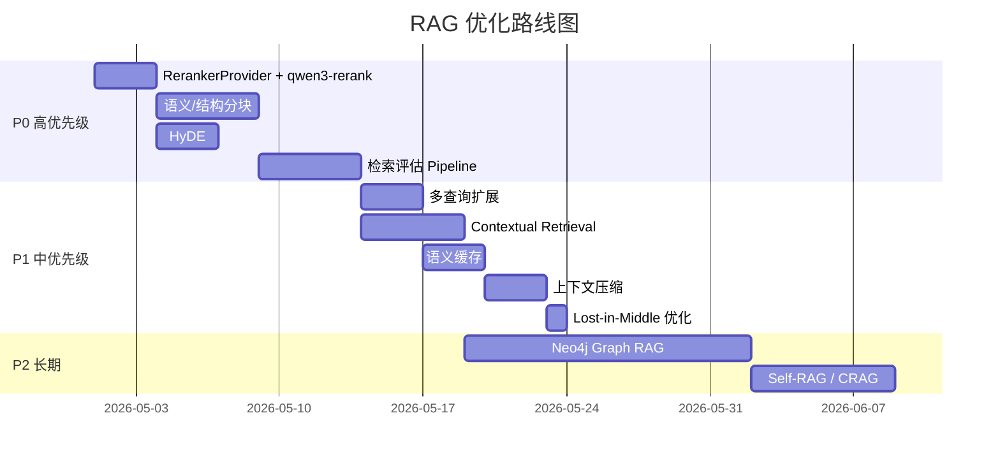

# Digital Human Agent — RAG 优化技术与改进计划

## 一、当前实现评价

### ✅ 做得好的部分
- **混合检索 + RRF 融合**：语义 + 关键词双通道，业界主流方案
- **逐层降级**：每个环节都有 fallback，鲁棒性强
- **Multi-Hop 多跳**：复杂问题拆解，避免单次检索不足
- **Query Rewrite**：LLM 改写提升检索召回
- **Web Fallback**：知识库不足时联网补充

### ⚠️ 可改进的方向

下面按 **影响力 × 实现难度** 分为 P0/P1/P2 三个优先级。

---

## 二、专项核对：ES、Rerank、Agentic RAG

> 核对时间：2026-05-15  
> 核对范围：当前仓库真实代码，不只看方案描述。

### 1. ElasticSearch：已经有 BM25 关键词检索，但还没有 IK 中文分词和精确匹配增强

**当前做到的部分**：

- 已经把 ElasticSearch 当作关键词检索后端之一，默认仍走 PostgreSQL，配置切到 `HYBRID_KEYWORD_BACKEND=elastic` 且 `ELASTICSEARCH_ENABLED=true` 后才走 ES。
- ES 作为派生索引使用，PostgreSQL / Supabase 仍是主数据源。
- ES 查询使用 `match` 搜索 `content`、`source`、`category`，并按 `_score` 排序。ES text 字段默认相似度是 BM25，所以当前已经有 BM25 关键词相关性评分。
- 当前还有 `content.ngram` 子字段，用 2-6 gram 方式增强短词、片段和部分匹配。
- 检索主链路是“向量检索 + 关键词检索并行”，再用 RRF 融合排序。

**代码落点**：

- `src/knowledge-content/elasticsearch/elasticsearch-index.service.ts`
  - 创建 ES 索引、read/write alias、`content.ngram` analyzer。
- `src/knowledge-content/keyword-retrievers/elastic-keyword-retriever.service.ts`
  - 使用 `match` 查询 `content/source/category/content.ngram`。
- `src/knowledge-content/services/knowledge-hybrid-retriever.service.ts`
  - 向量检索和关键词检索并行执行，并用 RRF 融合。
- `src/knowledge-content/services/knowledge-keyword-retriever.service.ts`
  - ES 不可用时回退到 PG 关键词检索。

**还没做到的部分**：

- 没有配置 IK 分词器。当前 analyzer 是 `standard tokenizer + lowercase + ngram`，中文分词能力不如 IK。
- 没有针对正文做明确的精确短语加权，例如 `match_phrase`。
- `source.keyword`、`category.keyword` 字段已经建了，但当前查询没有用 `term` 做精确字段命中加权。
- `content` 没有专门的中文 analyzer 字段，也没有单独的 `content.ik` / `content.exact` 这类多字段设计。

**建议优化**：

第一步先把 ES 查询升级为“三层关键词召回”：

```text
精确短语命中（match_phrase，高权重）
  + 中文分词 BM25（IK 分词，中高权重）
  + ngram 片段匹配（低权重，兜底召回）
```

推荐索引方案：

```text
content:
  type: text
  analyzer: ik_max_word
  search_analyzer: ik_smart
  fields:
    ngram:
      type: text
      analyzer: knowledge_content_ngram_analyzer
      search_analyzer: standard
```

推荐查询结构：

```text
bool.should:
  - match_phrase content, boost 8
  - match content, boost 4
  - match source/category, boost 2
  - term source.keyword/category.keyword, boost 3
  - match content.ngram, boost 1.2
```

注意：启用 IK 需要使用带 IK 插件的 ES 镜像或在镜像里安装插件；索引 analyzer 变更后不能原地修改旧字段，需要新建索引版本并回填。

### 2. Rerank：已经有重排，但现在是通用 LLM 重排，还没有抽成 Provider

**当前做到的部分**：

- 已经有两阶段检索：
  - Stage 1：向量检索 + 关键词检索 + RRF 融合，拿到候选 chunk。
  - Stage 2：rerank 后取 `finalTopK`，再交给回答生成。
- 默认检索配置里 `rerank: true`，所以正常链路会做重排。
- 当前 rerank 会把候选片段交给通用 LLM，让模型输出 JSON 分数，再按 `rerank_score` 排序。
- rerank 失败时不会让整次问答失败，而是回退到 Stage 1 排序结果。

**代码落点**：

- `src/knowledge-content/services/knowledge-search.service.ts`
  - `retrieveWithStagesInternal()` 中先做 Stage 1，再调用 `rerankerService.rerank()`。
- `src/knowledge-content/services/reranker.service.ts`
  - 当前用 `ChatOpenAI` + `KNOWLEDGE_RERANK_PROMPT` 做 LLM JSON 重排。
- `src/common/constants/knowledge.constants.ts`
  - 默认 `finalTopK: 5`、`rerank: true`。

**还没做到的部分**：

- 还没有接入专用 reranker API。
- `RERANKER_MODEL_NAME` 目前只是切换通用聊天模型，不等于调用专用 rerank API。
- LLM JSON 重排有解析失败、延迟较高、成本较高的问题。

**建议优化**：

把 `RerankerService` 拆成可切换 provider。`qwen3-rerank` 作为推荐 provider，但不要把业务流程写死在某一个模型上：

```text
RerankerService
  - RerankerProvider interface
      - DashScopeQwenRerankerProvider   // 推荐实现：qwen3-rerank
      - LlmJsonRerankerProvider         // 降级实现：当前 LLM JSON 方案
```

新增环境变量：

```text
RERANKER_PROVIDER=dashscope
DASHSCOPE_API_KEY=xxx
RERANKER_MODEL=qwen3-rerank
```

当 `RERANKER_PROVIDER=dashscope` 时，使用千问重排 API：

```text
POST https://dashscope.aliyuncs.com/compatible-api/v1/reranks
model: qwen3-rerank
documents: chunk 文本数组
query: 用户问题
top_n: finalTopK
```

返回结果里的 `index` 对应原始候选文档下标，`relevance_score` 可以映射为 `rerank_score`。官方文档说明，`qwen3-rerank` 面向文本语义检索和 RAG 应用，结果按相关性分数排序。

参考文档：<https://help.aliyun.com/zh/model-studio/text-rerank-api>

### 3. Agentic RAG：已经有 LangGraph 版自主检索流程，但策略选择还比较粗

**当前做到的部分**：

当前系统已经不是“一次检索后直接回答”的简单 RAG，而是有 LangGraph 编排：

```text
route_question
  -> simple: prepare_query
  -> complex: plan_sub_questions
prepare_query
  -> retrieve_evidence
retrieve_evidence
  -> evaluate_evidence
evaluate_evidence
  -> 证据足够: load_context -> generate_answer
  -> 证据不足且还有子问题: prepare_query -> retrieve_evidence
  -> 证据不足且可联网: web_fallback -> evaluate_evidence
```

它已经具备这些能力：

- 用 LLM 判断问题是 `simple` 还是 `complex`。
- 复杂问题会先拆成多个子问题，再逐跳检索。
- 每次检索后都会评估证据是否足够。
- 本地证据不够时，可以走联网搜索补充。
- 最终回答会同时使用本地知识和联网补充，并输出引用。

**代码落点**：

- `src/agent/langgraph/rag.graph.ts`
  - 定义完整 LangGraph 节点和跳转关系。
- `src/agent/services/rag-route.service.ts`
  - LLM 判断 simple / complex。
- `src/agent/services/multi-hop-planner.service.ts`
  - 复杂问题拆成子问题。
- `src/agent/langgraph/nodes/retrieve.node.ts`
  - 按当前问题或子问题检索证据。
- `src/agent/services/evidence-evaluator.service.ts`
  - LLM 判断证据是否足够，并生成联网搜索 query。
- `src/agent/services/web-fallback.service.ts`
  - 使用 Bocha API 做联网补充。

**还没做到的部分**：

- “是否检索”的判断还不细。当前 simple 问题基本都会检索，没有显式的“纯聊天 / 不查知识库”分支。
- “用哪种检索方式”的选择还不细。当前本地检索统一走 persona 知识库的混合检索，没有按问题动态选择：
  - vector only
  - keyword only
  - ES exact phrase
  - hybrid
  - multi-query
  - HyDE
- 证据不足后的本地补查主要依赖预先规划的子问题，还没有根据 `missingFacts` 动态生成下一条本地检索 query。
- 联网搜索当前最多尝试一次。`webSearchAttempted` 后不会继续多轮联网搜索。
- 还没有把每轮决策结果沉淀成可观察的调试报告，例如每轮为什么查、查了什么、为什么够或不够。

**结论**：

当前已经做到“Agentic RAG 的主体流程”，尤其是问题路由、多跳检索、证据评估、联网补充和最终生成。但还不是完整的“自主选择检索工具和多轮补查”的高级形态。下一步应该增强的是“策略选择”和“基于缺失信息的补查”，而不是重写整套图。

建议新增一个 `retrieval_strategy` 节点：

```text
route_question
  -> plan_retrieval_strategy
  -> retrieve_evidence
```

策略输出示例：

```json
{
  "needRetrieval": true,
  "localMode": "hybrid",
  "useExactPhrase": true,
  "useMultiQuery": false,
  "useHyDE": false,
  "allowWeb": true,
  "reason": "问题涉及知识库事实，需要优先本地检索；包含明确实体，适合短语加权"
}
```

这样可以把“要不要查、怎么查、查完够不够、不够怎么补”从固定规则升级成可解释的策略链路。

### 4. Neo4j / Graph RAG：用知识图谱补上“关系”和“多跳路径”

**核心判断**：

Milvus、ES、Neo4j 不应该互相替代，而应该分工协作：

| 系统 | 擅长什么 | 不擅长什么 | 在 RAG 里的位置 |
|------|----------|------------|----------------|
| Milvus / 向量库 | 语义模糊匹配、相似问题、同义表达 | 不理解实体关系，检索结果是文本片段 | 召回“语义上可能相关”的 chunk |
| ElasticSearch | 关键词精确命中、中文分词、BM25、过滤筛选 | 文档之间仍是文本孤岛，不会做关系推理 | 召回“词面上明确相关”的 chunk |
| Neo4j | 实体、关系、事件、层级、多跳路径 | 不适合做海量长文本模糊检索 | 找“谁和谁有什么关系、因果链、时间链、层级脉络” |

组合后的目标不是“三套检索都跑一遍”，而是让 `retrieval_strategy` 根据问题类型决定用哪些通道。

#### 4.1 数据写入：同一份知识，同时进入文本索引和图谱索引

知识库 ingest 后建议分成四层存储：

```text
PostgreSQL / Supabase
  - 主数据源：document、chunk、persona 挂载关系、原始元数据

Milvus / pgvector
  - chunk embedding
  - 用于语义召回

ElasticSearch
  - chunk text / source / category
  - 用于关键词、短语、过滤召回

Neo4j
  - Entity / Event / Topic / Document / Chunk 节点
  - 关系边和证据来源
```

Neo4j 不建议存整篇长文本。它更适合存“结构”和“证据指针”：

```text
(:Entity {name, type, aliases})
(:Event {name, time, summary})
(:Topic {name})
(:Document {id, title, source})
(:Chunk {id, source, chunkIndex})

(:Chunk)-[:MENTIONS {span, confidence}]->(:Entity)
(:Entity)-[:ALIAS_OF]->(:Entity)
(:Entity)-[:RELATED_TO {relation, confidence}]->(:Entity)
(:Event)-[:INVOLVES]->(:Entity)
(:Event)-[:CAUSES]->(:Event)
(:Event)-[:BEFORE]->(:Event)
(:Topic)-[:HAS_SUBTOPIC]->(:Topic)
(:Chunk)-[:EVIDENCE_FOR]->(:Event)
(:Document)-[:HAS_CHUNK]->(:Chunk)
```

每条关系都要带来源：

```json
{
  "documentId": "xxx",
  "chunkId": "xxx",
  "extractor": "llm-v1",
  "confidence": 0.82,
  "evidenceText": "原文中的短证据片段"
}
```

这样回答时不是“图谱说了算”，而是“图谱给出路径，chunk 原文负责支撑”。

#### 4.2 查询流程：先判断问题类型，再选择检索组合

建议把当前 `retrieval_strategy` 节点扩展为：

```json
{
  "needRetrieval": true,
  "useVector": true,
  "useKeyword": true,
  "useGraph": true,
  "graphMode": "entity_path",
  "graphMaxHops": 2,
  "useExactPhrase": true,
  "allowWeb": true,
  "reason": "问题涉及人物关系和事件原因，需要图谱路径，同时保留语义和关键词召回"
}
```

不同问题走不同组合：

| 问题类型 | 推荐通道 |
|----------|----------|
| “某个概念是什么” | 向量 + ES |
| “原文里有没有提到某句话/某术语” | ES 精确短语 + 向量 |
| “A 和 B 什么关系” | Neo4j entity path + ES/向量补证据 |
| “某事件为什么发生” | Neo4j event chain + 向量补背景 |
| “按时间线讲一下” | Neo4j `BEFORE`/时间属性 + chunk 原文 |
| “对比两个角色/方案” | Neo4j 找关联和差异点 + ES/向量补文本 |

#### 4.3 检索融合：图谱不是最终答案，而是生成候选证据

检索阶段可以并行跑三路：

```text
VectorRetriever
  -> semantic chunks

KeywordRetriever
  -> BM25 / phrase chunks

GraphRetriever
  -> graph paths
  -> graph evidence cards
  -> related chunk ids
```

`GraphRetriever` 输出不要只是一串节点名，而要变成可给 LLM 阅读的证据卡：

```text
[图谱证据 1]
路径：林黛玉 -> 关系: 爱慕/牵挂 -> 贾宝玉 -> 事件: 宝玉成婚
支撑片段：
- chunkId=abc, source=红楼梦人物关系.md, span=...
- chunkId=def, source=红楼梦情节梳理.md, span=...
可信度：0.84
```

融合策略建议：

```text
1. 向量和 ES 继续走 RRF，得到文本候选。
2. 图谱路径按 entity 命中、关系置信度、路径长度、证据 chunk 数计算 graph_score。
3. 图谱关联的 chunk id 反查原文 chunk，加入候选池。
4. 候选池统一交给 RerankerProvider。
5. qwen3-rerank 可以作为推荐 reranker，对文本 chunk 和图谱证据卡一起排序。
```

排序时不要让图谱路径直接压过原文证据。更稳的做法是：

```text
final_score = rerank_score
如果命中图谱关系，再加少量 graph_boost
如果没有原文证据支撑，不进入最终上下文
```

#### 4.4 接入当前 LangGraph 流程的位置

当前图可以从：

```text
route_question
  -> prepare_query
  -> retrieve_evidence
  -> evaluate_evidence
```

升级为：

```text
route_question
  -> plan_retrieval_strategy
  -> prepare_query
  -> retrieve_evidence
      -> vector retrieve
      -> keyword retrieve
      -> graph retrieve
      -> fusion + rerank
  -> evaluate_evidence
      -> 不够：根据 missingFacts 决定补向量、补关键词、扩图谱、或联网
  -> generate_answer
```

`evaluate_evidence` 后的补查也可以更精细：

```text
缺少定义/背景         -> 再做向量检索
缺少原文命中          -> 加强 ES 短语检索
缺少人物/事件关系     -> Neo4j 扩展 1 跳或 2 跳
本地都没有            -> web_fallback
```

#### 4.5 最小可落地版本

第一阶段不要直接做完整 GraphRAG。建议只做这几件事：

1. 先设计固定 schema：`Entity`、`Event`、`Topic`、`Document`、`Chunk`。
2. ingest 时从 chunk 抽取实体、事件、关系，写入 Neo4j，并保留 `chunkId` 证据来源。
3. 查询时只在明显关系类问题启用 `GraphRetriever`。
4. `GraphRetriever` 先支持两类查询：
   - 实体邻居：`Entity -> related entities/events`
   - 两实体路径：`Entity A -> path <= 2 hops -> Entity B`
5. 图谱结果必须回到 chunk 原文，不允许只有图谱路径就生成答案。

这版价值已经够明显：人物关系、事件因果、时间线、章节/层级脉络会比纯向量和 ES 更稳。

---

## 三、P0 — 高影响 + 低/中难度

### 1. 🔧 抽象 RerankerProvider，并接入 qwen3-rerank

**现状**：用通用 LLM + 自定义 Prompt 做 rerank，需要解析 JSON 输出，速度慢、成本高、解析易出错。

**优化**：抽出 `RerankerProvider`，让重排能力可替换。首个专用 provider 使用千问 `qwen3-rerank`，当前 LLM JSON 重排保留为 fallback。

| 方案 | 定位 |
|------|------|
| `DashScopeQwenRerankerProvider` | 推荐 provider，模型可配置为 `qwen3-rerank` |
| `LlmJsonRerankerProvider` | 降级 provider，复用当前 LLM JSON 方案 |

**收益**：
- 延迟预计明显低于通用 LLM JSON 重排
- 消除 JSON 解析失败风险
- 精排质量提升（专门训练的 reranker vs 通用聊天模型）
- 不把 RAG 主流程绑定死在某个厂商或模型上

**接口设计**：

```text
POST https://dashscope.aliyuncs.com/compatible-api/v1/reranks
Authorization: Bearer $DASHSCOPE_API_KEY
model: qwen3-rerank
query: 用户问题
documents: stage1 候选 chunk 文本数组
top_n: finalTopK
```

**结果映射**：

```text
results[].index            -> 原始 candidates 下标
results[].relevance_score  -> chunk.rerank_score
```

**建议代码结构**：

```text
src/knowledge-content/rerankers/
  reranker-provider.interface.ts
  dashscope-qwen-reranker.provider.ts
  llm-json-reranker.provider.ts

src/knowledge-content/services/reranker.service.ts
  - 读取 RERANKER_PROVIDER
  - 选择 provider
  - 统一处理 fallback、日志、AbortSignal
```

---

### 2. 🔧 语义分块替换固定分块

**现状**：`RecursiveCharacterTextSplitter(chunkSize=500, chunkOverlap=100)`，固定长度切分，可能在语义中间截断。

**优化方案**：

**方案 A — Markdown/结构感知分块**：
```
按文档结构（标题、段落、列表）切分
  → 保持语义单元完整
  → 适合结构化文档（知识库常见场景）
```

**方案 B — 语义分块（Semantic Chunking）**：
```
文本逐句 → 计算相邻句子的 embedding 相似度
  → 相似度骤降处切分 → 自适应 chunk 大小
```

**方案 C — Parent-Child 分块**：
```
大块（Parent, ~2000字）用于 LLM 上下文
小块（Child, ~200字）用于检索索引
  → 检索命中小块后，返回对应的大块给 LLM
  → 解决 "检索精准但上下文不足" 的问题
```

> [!TIP]
> **推荐组合**：结构感知分块 + Parent-Child，对数字人知识库场景效果最佳。

---

### 3. 🔧 HyDE（Hypothetical Document Embedding）

**现状**：Query Rewrite 改写查询文本，但向量检索时 query embedding 和 document embedding 的分布天然不同（问题 vs 陈述句）。

**原理**：
```
用户问题: "林黛玉的结局是什么？"
    ↓ LLM 生成假设性回答
假设文档: "在《红楼梦》中，林黛玉最终因忧郁成疾，
          在贾宝玉与薛宝钗成婚之际含恨而亡..."
    ↓ 用假设文档做 embedding
    → 与知识库中的真实文档向量更接近
```

**实现**：在 QueryRewriteService 中增加 `generateHypotheticalAnswer()`，用其 embedding 代替原始 query embedding。

**收益**：向量检索召回率显著提升（论文报告 +10~30%）。

---

### 4. 🔧 增加检索评估 Pipeline

**现状**：没有自动化的检索质量评估，只能靠人工判断。

**优化**：引入 [RAGAS](https://github.com/explodinggradients/ragas) 或自建评估：

| 指标 | 含义 |
|------|------|
| Context Precision | 检索结果中相关文档的排名 |
| Context Recall | 需要的信息是否都被检索到 |
| Faithfulness | 回答是否忠于检索到的内容 |
| Answer Relevancy | 回答是否与问题相关 |

**实现**：构建 golden test set（问题 + 标准答案 + 相关 chunks），CI 中跑自动评估。

---

## 四、P1 — 中等影响 + 中等难度

### 5. 多查询扩展（Multi-Query Expansion）

**现状**：Query Rewrite 只生成一个改写查询。

**优化**：生成 3~5 个不同角度的查询，分别检索后合并去重。

```
原始问题: "林黛玉的结局"
    ↓ LLM 生成多个变体
Q1: "红楼梦林黛玉最终命运"
Q2: "林黛玉是怎么死的"
Q3: "黛玉焚稿断痴情的情节"
    ↓ 各自检索 → 合并去重 → Rerank
```

**收益**：提升召回覆盖率，减少单一查询视角的偏差。

---

### 6. Contextual Retrieval（上下文增强检索）

**来源**：[Anthropic Contextual Retrieval](https://www.anthropic.com/news/contextual-retrieval)

**原理**：在 Ingest 时为每个 chunk 前置一段**文档级上下文摘要**：

```
原始 chunk: "她最终含恨离世，年仅十七岁。"
    ↓ 增强
增强 chunk: "[本文档描述《红楼梦》主要人物林黛玉的生平] 
            她最终含恨离世，年仅十七岁。"
```

**收益**：解决小 chunk 脱离上下文后语义不明确的问题。Anthropic 报告检索失败率降低 49%。

**代价**：Ingest 时需要额外 LLM 调用（可异步、可缓存）。

---

### 7. 语义缓存（Semantic Cache）

**现状**：每次查询都走完整的检索链路。

**优化**：
```
新查询 → 计算 embedding → 在缓存中找相似查询（cosine > 0.95）
  → 命中：直接返回缓存结果
  → 未命中：走完整链路，结果写入缓存（TTL 30min）
```

**实现**：用 Redis + 向量相似度或简单的内存 LRU + embedding 比较。

**收益**：重复/近似问题秒级响应，降低 LLM 调用成本。

---

### 8. 上下文压缩（Context Compression）

**现状**：检索到的完整 chunk 文本直接拼入 prompt。

**优化**：用 LLM 或规则对每个 chunk 提取与问题相关的关键段落：

```
chunk (500字) → 与问题相关的核心段落 (100字)
  → 同样 token 预算可以放入更多 chunk
```

**方案**：
- LangChain 的 `ContextualCompressionRetriever`
- 或自定义 extractive summarization

---

### 9. Lost-in-the-Middle 优化

**现状**：chunks 按分数降序排列后直接拼入 prompt。

**问题**：[研究表明](https://arxiv.org/abs/2307.03172) LLM 对 prompt 中间部分的内容注意力最弱。

**优化**：将最相关的 chunk 放在**开头和结尾**，次相关的放中间：

```
排序: [1st, 2nd, 3rd, 4th, 5th]
  → 重排: [1st, 3rd, 5th, 4th, 2nd]  (高→低→高 交错排列)
```

---

## 五、P2 — 高影响 + 高难度（架构级）

### 10. Neo4j Graph RAG

**思想**：从知识库中抽取实体、事件、关系和层级结构，存入 Neo4j。检索时让图谱负责关系路径，向量库负责语义召回，ES 负责关键词和短语命中。

```
知识库 → chunk → 向量索引 + ES 索引 + Neo4j 图谱
查询 → 策略判断 → 向量/关键词/图谱并行召回 → 融合排序 → RerankerProvider → 生成回答
```

**适用场景**：人物关系复杂、事件链明显、层级脉络重要的知识库。数字人场景里，角色关系、故事线、企业组织结构、产品模块关系都适合用 Neo4j 补强。

**第一阶段边界**：只做 `Entity`、`Event`、`Topic`、`Document`、`Chunk` 五类节点，以及 1-2 跳关系查询。不要一开始就做全量知识图谱平台。

**参考**：[Microsoft GraphRAG](https://github.com/microsoft/graphrag)

---

### 11. Self-RAG / Corrective RAG

**Self-RAG**：生成回答时自我评估，决定是否需要额外检索。

**CRAG（Corrective RAG）**：
```
检索结果 → 相关性评分
  → 相关：正常使用
  → 模糊：知识精炼（提取关键信息）
  → 不相关：触发 web 搜索
```

> [!NOTE]
> 当前系统的 `evaluate_evidence` + `web_fallback` 已经实现了 CRAG 的核心思想，但可以更精细化。

---

### 12. RAPTOR（递归摘要树）

**思想**：对 chunks 建立多层摘要树：
```
Layer 0: 原始 chunks
Layer 1: 每 5 个 chunks 聚类 → 生成摘要
Layer 2: 每 5 个 Layer 1 摘要 → 生成更高层摘要
检索时同时搜索所有层级
```

**收益**：支持不同粒度的问题（细节问题命中 Layer 0，概述问题命中高层）。

---

## 六、推荐改进路线图



---

## 七、快速收益矩阵

| 优化项 | 影响力 | 难度 | 预期收益 |
|--------|--------|------|---------|
| RerankerProvider + qwen3-rerank | ⭐⭐⭐⭐⭐ | ⭐⭐ | 精排更稳，模型可替换，避免 JSON 解析风险 |
| 语义/结构分块 | ⭐⭐⭐⭐ | ⭐⭐⭐ | 召回质量↑，减少截断问题 |
| HyDE | ⭐⭐⭐⭐ | ⭐⭐ | 向量召回率 +10~30% |
| 检索评估 Pipeline | ⭐⭐⭐⭐ | ⭐⭐⭐ | 可量化优化效果，建立基线 |
| 多查询扩展 | ⭐⭐⭐ | ⭐⭐ | 召回覆盖率↑ |
| Contextual Retrieval | ⭐⭐⭐⭐ | ⭐⭐⭐ | 脱离上下文的 chunk 检索失败率↓49% |
| 语义缓存 | ⭐⭐⭐ | ⭐⭐ | 重复查询秒级响应 |
| Neo4j Graph RAG | ⭐⭐⭐⭐⭐ | ⭐⭐⭐⭐⭐ | 关系、多跳路径、时间线和层级脉络能力明显增强 |

> [!IMPORTANT]
> **基于本次代码核对，建议最先做的 3 件事**：① ES 中文分词 + 精确短语加权（先把关键词检索做准）→ ② 抽 `RerankerProvider` 并接入 `qwen3-rerank`（让精排更快更稳，同时保留可替换性）→ ③ 增加 `retrieval_strategy` 节点（让 Agentic RAG 能选择向量、关键词、图谱或联网）
