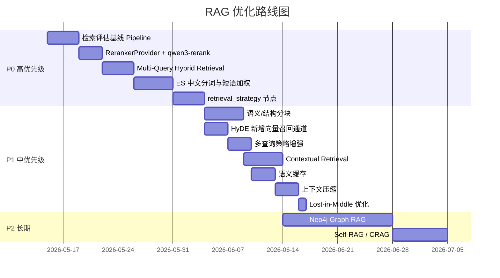

# Digital Human Agent — RAG 优化技术与改进计划

## 一、当前实现评价

### ✅ 做得好的部分
- **混合检索 + RRF 融合**：语义 + 关键词双通道，业界主流方案
- **逐层降级**：每个环节都有 fallback，鲁棒性强
- **Multi-Hop 多跳**：复杂问题拆解，避免单次检索不足
- **Query Rewrite**：LLM 改写提升检索召回，当前是单条检索 query
- **Web Fallback**：知识库不足时联网补充

### ⚠️ 可改进的方向

下面按 **影响力 × 实现难度** 分为 P0/P1/P2 三个优先级。

---

## 二、专项核对：ES、Rerank、Agentic RAG

> 核对时间：2026-05-15  
> 核对范围：当前仓库真实代码，不只看方案描述。

### 1. ElasticSearch：已经有 BM25 关键词检索，但还没有 IK 中文分词和精确匹配增强

**当前做到的部分**：

- 已经把 ElasticSearch 当作关键词检索后端之一，默认仍走 PostgreSQL，配置切到 `HYBRID_KEYWORD_BACKEND=elastic` 且 `ELASTICSEARCH_ENABLED=true` 后才走 ES。
- ES 作为派生索引使用，PostgreSQL / Supabase 仍是主数据源。
- ES 查询使用 `match` 搜索 `content`、`source`、`category`，并按 `_score` 排序。ES text 字段默认相似度是 BM25，所以当前已经有 BM25 关键词相关性评分。
- 当前还有 `content.ngram` 子字段，用 2-6 gram 方式增强短词、片段和部分匹配。
- 检索主链路是“向量检索 + 关键词检索并行”，再用 RRF 融合排序。

**代码落点**：

- `src/knowledge-content/elasticsearch/elasticsearch-index.service.ts`
  - 创建 ES 索引、read/write alias、`content.ngram` analyzer。
- `src/knowledge-content/keyword-retrievers/elastic-keyword-retriever.service.ts`
  - 使用 `match` 查询 `content/source/category/content.ngram`。
- `src/knowledge-content/services/knowledge-hybrid-retriever.service.ts`
  - 向量检索和关键词检索并行执行，并用 RRF 融合。
- `src/knowledge-content/services/knowledge-keyword-retriever.service.ts`
  - ES 不可用时回退到 PG 关键词检索。

**还没做到的部分**：

- 没有配置 IK 分词器。当前 analyzer 是 `standard tokenizer + lowercase + ngram`，中文分词能力不如 IK。
- 没有针对正文做明确的精确短语加权，例如 `match_phrase`。
- `source.keyword`、`category.keyword` 字段已经建了，但当前查询没有用 `term` 做精确字段命中加权。
- `content` 没有专门的中文 analyzer 字段，也没有单独的 `content.ik` / `content.exact` 这类多字段设计。

**建议优化**：

第一步先把 ES 查询升级为“三层关键词召回”：

```text
精确短语命中（match_phrase，高权重）
  + 中文分词 BM25（IK 分词，中高权重）
  + ngram 片段匹配（低权重，兜底召回）
```

推荐索引方案：

```text
content:
  type: text
  analyzer: ik_max_word
  search_analyzer: ik_smart
  fields:
    ngram:
      type: text
      analyzer: knowledge_content_ngram_analyzer
      search_analyzer: standard
```

推荐查询结构：

```text
bool.should:
  - match_phrase content, boost 8
  - match content, boost 4
  - match source/category, boost 2
  - term source.keyword/category.keyword, boost 3
  - match content.ngram, boost 1.2
```

注意：启用 IK 需要使用带 IK 插件的 ES 镜像或在镜像里安装插件；索引 analyzer 变更后不能原地修改旧字段，需要新建索引版本并回填。

ES 改造必须作为索引迁移任务处理，不能只改查询代码。最小执行清单：

```text
1. 将 docker-compose.elastic.yml 换成带 IK 插件的 ES 镜像，或新增自定义镜像安装 analysis-ik。
2. bump DEFAULT_ELASTICSEARCH_INDEX_VERSION，例如 v1 -> v2。
3. 新索引 mapping 增加 IK analyzer，并保留 ngram 兜底字段。
4. 通过 backfill 命令把 PostgreSQL / Supabase 里的 chunk 回填到新索引。
5. 用显式 alias 切换脚本把 read/write alias 切到新索引，保留回滚空间。
6. 用同一批 golden set 对比 PG keyword、旧 ES、新 ES 的 hit@k 和 MRR。
```

### 2. Rerank：已经有重排，但现在是通用 LLM 重排，还没有抽成 Provider

**当前做到的部分**：

- 已经有两阶段检索：
  - Stage 1：向量检索 + 关键词检索 + RRF 融合，拿到候选 chunk。
  - Stage 2：rerank 后取 `finalTopK`，再交给回答生成。
- 默认检索配置里 `rerank: true`，所以正常链路会做重排。
- 当前 rerank 会把候选片段交给通用 LLM，让模型输出 JSON 分数，再按 `rerank_score` 排序。
- rerank 失败时不会让整次问答失败，而是回退到 Stage 1 排序结果。

**代码落点**：

- `src/knowledge-content/services/knowledge-search.service.ts`
  - `retrieveWithStagesInternal()` 中先做 Stage 1，再调用 `rerankerService.rerank()`。
- `src/knowledge-content/services/reranker.service.ts`
  - 当前用 `ChatOpenAI` + `KNOWLEDGE_RERANK_PROMPT` 做 LLM JSON 重排。
- `src/common/constants/knowledge.constants.ts`
  - 默认 `finalTopK: 5`、`rerank: true`。

**还没做到的部分**：

- 还没有接入专用 reranker API。
- `RERANKER_MODEL_NAME` 目前只是切换通用聊天模型，不等于调用专用 rerank API。
- LLM JSON 重排有解析失败、延迟较高、成本较高的问题。

**建议优化**：

把 `RerankerService` 拆成可切换 provider。`qwen3-rerank` 作为推荐 provider，但不要把业务流程写死在某一个模型上：

```text
RerankerService
  - RerankerProvider interface
      - DashScopeQwenRerankerProvider   // 推荐实现：qwen3-rerank
      - LlmJsonRerankerProvider         // 降级实现：当前 LLM JSON 方案
```

新增环境变量：

```text
RERANKER_PROVIDER=dashscope
DASHSCOPE_API_KEY=xxx
RERANKER_MODEL=qwen3-rerank
```

当 `RERANKER_PROVIDER=dashscope` 时，使用千问重排 API。推荐优先接官方原生 DashScope endpoint，和用户现有 DashScope 调用方式保持一致：

```text
POST https://dashscope.aliyuncs.com/api/v1/services/rerank/text-rerank/text-rerank
model: qwen3-rerank
input.query: 用户问题
input.documents: chunk 文本数组
parameters.top_n: finalTopK
parameters.return_documents: false
```

返回结果里的 `index` 对应原始候选文档下标，`relevance_score` 可以映射为 `rerank_score`。官方文档说明，`qwen3-rerank` 面向文本语义检索和 RAG 应用，结果按相关性分数排序。DashScope 也支持不带 `input` 对象的写法，此时 `query` 和 `documents` 与 `model` 同层；两种格式不要混用。

注意：`relevance_score` 只适合在同一次 rerank 请求内比较，不要跨请求当成全局质量分，也不要持久化后用于不同 query 之间的排序。

实现边界：

- 原生 DashScope endpoint 使用 `input` / `parameters`；兼容 rerank endpoint 使用扁平参数。先固定一种 provider 形态，避免同一个 provider 同时支持两套请求体导致排障困难。
- 候选 chunk 数量用 `stage1TopK` 控制，避免一次传入过多文档。
- 单条 chunk 或图谱证据卡过长时要先截断，但必须保留 `chunkId`、`source`、核心证据文本。
- 图谱证据卡可以作为字符串 document 传入 rerank，但最终回答仍要回到原文 chunk 做支撑。
- 可以保留 `instruct`，默认使用问答检索任务；后续如果做 FAQ/相似问匹配，再切换为语义相似度排序说明。
- DashScope 调用失败、超时或返回格式异常时，回退到 `LlmJsonRerankerProvider` 或 Stage 1 排序结果。

参考文档：<https://help.aliyun.com/zh/model-studio/text-rerank-api>

### 3. Agentic RAG：已经有 LangGraph 版自主检索流程，但策略选择还比较粗

**当前做到的部分**：

当前系统已经不是“一次检索后直接回答”的简单 RAG，而是有 LangGraph 编排：

```text
route_question
  -> simple: prepare_query
  -> complex: plan_sub_questions
prepare_query
  -> retrieve_evidence
retrieve_evidence
  -> evaluate_evidence
evaluate_evidence
  -> 证据足够: load_context -> generate_answer
  -> 证据不足且还有子问题: prepare_query -> retrieve_evidence
  -> 证据不足且可联网: web_fallback -> evaluate_evidence
```

它已经具备这些能力：

- 用 LLM 判断问题是 `simple` 还是 `complex`。
- 复杂问题会先拆成多个子问题，再逐跳检索。
- 每次检索后都会评估证据是否足够。
- 本地证据不够时，可以走联网搜索补充。
- 最终回答会同时使用本地知识和联网补充，并输出引用。

**代码落点**：

- `src/agent/langgraph/rag.graph.ts`
  - 定义完整 LangGraph 节点和跳转关系。
- `src/agent/services/rag-route.service.ts`
  - LLM 判断 simple / complex。
- `src/agent/services/multi-hop-planner.service.ts`
  - 复杂问题拆成子问题。
- `src/agent/langgraph/nodes/retrieve.node.ts`
  - 按当前问题或子问题检索证据。
- `src/agent/services/evidence-evaluator.service.ts`
  - LLM 判断证据是否足够，并生成联网搜索 query。
- `src/agent/services/web-fallback.service.ts`
  - 使用 Bocha API 做联网补充。

**还没做到的部分**：

- “是否检索”的判断还不细。当前 simple 问题基本都会检索，没有显式的“纯聊天 / 不查知识库”分支。
- “用哪种检索方式”的选择还不细。当前本地检索统一走 persona 知识库的混合检索，没有按问题动态选择：
  - vector only
  - keyword only
  - ES exact phrase
  - hybrid
  - multi-query
  - HyDE
- 证据不足后的本地补查主要依赖预先规划的子问题，还没有根据 `missingFacts` 动态生成下一条本地检索 query。
- 联网搜索当前最多尝试一次。`webSearchAttempted` 后不会继续多轮联网搜索。
- 还没有把每轮决策结果沉淀成可观察的调试报告，例如每轮为什么查、查了什么、为什么够或不够。

**结论**：

当前已经做到“Agentic RAG 的主体流程”，尤其是问题路由、多跳检索、证据评估、联网补充和最终生成。但还不是完整的“自主选择检索工具和多轮补查”的高级形态。下一步应该增强的是“策略选择”和“基于缺失信息的补查”，而不是重写整套图。

建议新增一个 `retrieval_strategy` 节点，但它不能替代现有 Multi-Hop。更合理的位置是：先保留 `route_question` 和 `plan_sub_questions`，再对当前问题或每个子问题选择检索策略。

```text
route_question
  -> simple: plan_retrieval_strategy
  -> complex: plan_sub_questions -> plan_retrieval_strategy
  -> prepare_query
  -> retrieve_evidence
```

复杂问题里，`plan_retrieval_strategy` 可以对每个子问题分别输出策略。例如第一个子问题走 ES 精确短语，第二个子问题走 Neo4j 路径，第三个子问题走向量召回。

策略输出示例：

```json
{
  "needRetrieval": true,
  "useVector": true,
  "useKeyword": true,
  "useGraph": false,
  "useExactPhrase": true,
  "useMultiQuery": false,
  "useHyDE": false,
  "allowWeb": true,
  "reason": "问题涉及知识库事实，需要优先本地检索；包含明确实体，适合短语加权"
}
```

这样可以把“要不要查、怎么查、查完够不够、不够怎么补”从固定规则升级成可解释的策略链路。

### 4. Neo4j / Graph RAG：用知识图谱补上“关系”和“多跳路径”

**核心判断**：

向量库、ES、Neo4j 不应该互相替代，而应该分工协作。当前仓库已经使用 PostgreSQL pgvector 做向量召回，不需要为了多查询混合检索引入 Milvus；Milvus 只作为未来数据量和并发上来后的可选替换项。

| 系统 | 擅长什么 | 不擅长什么 | 在 RAG 里的位置 |
|------|----------|------------|----------------|
| PostgreSQL pgvector / Milvus | 语义模糊匹配、相似问题、同义表达 | 不理解实体关系，检索结果是文本片段 | 召回“语义上可能相关”的 chunk |
| ElasticSearch | 关键词精确命中、中文分词、BM25、过滤筛选 | 文档之间仍是文本孤岛，不会做关系推理 | 召回“词面上明确相关”的 chunk |
| Neo4j | 实体、关系、事件、层级、多跳路径 | 不适合做海量长文本模糊检索 | 找“谁和谁有什么关系、因果链、时间链、层级脉络” |

组合后的目标不是“三套检索都跑一遍”，而是让 `retrieval_strategy` 根据问题类型决定用哪些通道。

#### 4.1 数据写入：同一份知识，同时进入文本索引和图谱索引

知识库 ingest 后建议分成四层存储：

```text
PostgreSQL / Supabase
  - 主数据源：document、chunk、persona 挂载关系、原始元数据

PostgreSQL pgvector（当前）/ Milvus（未来可选）
  - chunk embedding
  - 用于语义召回

ElasticSearch
  - chunk text / source / category
  - 用于关键词、短语、过滤召回

Neo4j
  - Entity / Event / Topic / Document / Chunk 节点
  - 关系边和证据来源
```

Neo4j 不建议存整篇长文本。它更适合存“结构”和“证据指针”：

```text
(:Entity {name, type, aliases})
(:Event {name, time, summary})
(:Topic {name})
(:Document {id, title, source})
(:Chunk {id, source, chunkIndex})

(:Chunk)-[:MENTIONS {span, confidence}]->(:Entity)
(:Entity)-[:ALIAS_OF]->(:Entity)
(:Entity)-[:RELATED_TO {relation, confidence}]->(:Entity)
(:Event)-[:INVOLVES]->(:Entity)
(:Event)-[:CAUSES]->(:Event)
(:Event)-[:BEFORE]->(:Event)
(:Topic)-[:HAS_SUBTOPIC]->(:Topic)
(:Chunk)-[:EVIDENCE_FOR]->(:Event)
(:Document)-[:HAS_CHUNK]->(:Chunk)
```

每条关系都要带来源：

```json
{
  "documentId": "xxx",
  "chunkId": "xxx",
  "extractor": "llm-v1",
  "confidence": 0.82,
  "evidenceText": "原文中的短证据片段"
}
```

这样回答时不是“图谱说了算”，而是“图谱给出路径，chunk 原文负责支撑”。

#### 4.2 写入一致性：Neo4j 必须按派生索引处理

Neo4j 应该和 ES 一样被视为“可重建的派生索引”，不要把它变成主数据源。主数据仍然是 PostgreSQL / Supabase。

建议写入策略：

```text
1. document 和 chunk 先写入 PostgreSQL / Supabase。
2. embedding 写入 pgvector 当前表结构。
3. ES 和 Neo4j 都通过独立 sync service 写入。
4. Neo4j 写入必须幂等，用 documentId/chunkId/entity key 做 MERGE。
5. ingest 失败时，按 documentId 清理 chunk、ES、Neo4j。
6. 删除 document 时，必须同步删除 ES 文档和 Neo4j 里的 Document/Chunk 及其派生边。
7. Neo4j 失败时记录 graph_index_status，允许后台重试和手工 rebuild。
```

建议新增服务边界：

```text
KnowledgeGraphSyncService
  - safeBulkUpsertGraph(documentId, chunks, extractedGraph)
  - safeDeleteByDocumentId(documentId)
  - rebuildByDocumentId(documentId)
  - backfillByCursor(cursor, limit)
```

这样就能延续当前 ES 的处理方式：图谱检索可以暂时不可用，但不能留下脏节点和脏关系污染后续回答。

需要补齐的工程规则：

```text
幂等写入：
  - Document 用 documentId MERGE。
  - Chunk 用 chunkId MERGE。
  - Entity 用 normalizedName + type MERGE。
  - 关系边带 documentId、chunkId、extractorVersion，重复写入不产生重复边。

失败处理：
  - graph_index_status=pending/indexed/failed/stale。
  - failed/stale 的 document 不参与 GraphRetriever。
  - ES 或 Neo4j 写入失败不影响主数据写入，但必须可观测、可重试。

删除与重建：
  - 删除 document 时按 documentId 清理 Document、Chunk、MENTIONS、EVIDENCE_FOR 等派生关系。
  - rebuildByDocumentId 先清理旧图谱，再从主数据重新抽取和写入。
  - graph:backfill 支持按 document cursor 批量回填，便于新 schema 上线。

索引版本：
  - 关系抽取 prompt、schema、extractorVersion 变更后，要把旧图谱标记为 stale。
  - 新版本回填完成后再让 GraphRetriever 使用。
```

#### 4.3 查询流程：先判断问题类型，再选择检索组合

建议把当前 `retrieval_strategy` 节点扩展为：

```json
{
  "needRetrieval": true,
  "useVector": true,
  "useKeyword": true,
  "useGraph": true,
  "graphMode": "entity_path",
  "graphMaxHops": 2,
  "useExactPhrase": true,
  "allowWeb": true,
  "reason": "问题涉及人物关系和事件原因，需要图谱路径，同时保留语义和关键词召回"
}
```

不同问题走不同组合：

| 问题类型 | 推荐通道 |
|----------|----------|
| “某个概念是什么” | 向量 + ES |
| “原文里有没有提到某句话/某术语” | ES 精确短语 + 向量 |
| “A 和 B 什么关系” | Neo4j entity path + ES/向量补证据 |
| “某事件为什么发生” | Neo4j event chain + 向量补背景 |
| “按时间线讲一下” | Neo4j `BEFORE`/时间属性 + chunk 原文 |
| “对比两个角色/方案” | Neo4j 找关联和差异点 + ES/向量补文本 |

#### 4.4 检索融合：图谱不是最终答案，而是生成候选证据

检索阶段可以并行跑三路：

```text
VectorRetriever
  -> semantic chunks

KeywordRetriever
  -> BM25 / phrase chunks

GraphRetriever
  -> graph paths
  -> graph evidence cards
  -> related chunk ids
```

`GraphRetriever` 输出不要只是一串节点名，而要变成可给 LLM 阅读的证据卡：

```text
[图谱证据 1]
路径：林黛玉 -> 关系: 爱慕/牵挂 -> 贾宝玉 -> 事件: 宝玉成婚
支撑片段：
- chunkId=abc, source=红楼梦人物关系.md, span=...
- chunkId=def, source=红楼梦情节梳理.md, span=...
可信度：0.84
```

融合策略建议：

```text
1. 向量和 ES 继续走 RRF，得到文本候选。
2. 图谱路径按 entity 命中、关系置信度、路径长度、证据 chunk 数计算 graph_score。
3. 图谱关联的 chunk id 反查原文 chunk，加入候选池。
4. 候选池统一交给 RerankerProvider。
5. qwen3-rerank 可以作为推荐 reranker，对文本 chunk 和图谱证据卡一起排序。
```

排序时不要让图谱路径直接压过原文证据。更稳的做法是：

```text
final_score = rerank_score
如果命中图谱关系，再加少量 graph_boost
如果没有原文证据支撑，不进入最终上下文
```

#### 4.5 接入当前 LangGraph 流程的位置

当前图可以从：

```text
route_question
  -> complex: plan_sub_questions
  -> prepare_query
  -> retrieve_evidence
  -> evaluate_evidence
```

升级为：

```text
route_question
  -> simple: plan_retrieval_strategy
  -> complex: plan_sub_questions -> plan_retrieval_strategy
  -> prepare_query
  -> retrieve_evidence
      -> vector retrieve
      -> keyword retrieve
      -> graph retrieve
      -> fusion + rerank
  -> evaluate_evidence
      -> 不够：根据 missingFacts 决定补向量、补关键词、扩图谱、或联网
  -> generate_answer
```

`evaluate_evidence` 后的补查也可以更精细：

```text
缺少定义/背景         -> 再做向量检索
缺少原文命中          -> 加强 ES 短语检索
缺少人物/事件关系     -> Neo4j 扩展 1 跳或 2 跳
本地都没有            -> web_fallback
```

#### 4.6 最小可落地版本

第一阶段不要直接做完整 GraphRAG。建议只做这几件事：

1. 先设计固定 schema：`Entity`、`Event`、`Topic`、`Document`、`Chunk`。
2. ingest 时从 chunk 抽取实体、事件、关系，写入 Neo4j，并保留 `chunkId` 证据来源。
3. 查询时只在明显关系类问题启用 `GraphRetriever`。
4. `GraphRetriever` 先支持两类查询：
   - 实体邻居：`Entity -> related entities/events`
   - 两实体路径：`Entity A -> path <= 2 hops -> Entity B`
5. 图谱结果必须回到 chunk 原文，不允许只有图谱路径就生成答案。

这版价值已经够明显：人物关系、事件因果、时间线、章节/层级脉络会比纯向量和 ES 更稳。

---

## 三、P0 — 先把可量化主链路打稳

### 1. 增加检索评估基线 Pipeline

**现状**：当前仓库没有自动化检索质量评估，优化效果主要靠人工判断。后续要改 ES、rerank、strategy、HyDE、Graph RAG，必须先有一套稳定基线，否则很难判断收益和回归。

**优先方案**：先自建最小评估脚本，不一开始就引入 RAGAS。这个项目是 TS / NestJS，当前没有 RAGAS 或 eval 依赖，先用本仓库数据结构做轻量评估更稳。

推荐 golden set 格式：

```json
{
  "id": "rag_case_001",
  "personaId": "persona_xxx",
  "query": "林黛玉的结局是什么？",
  "expected_evidence_spans": [
    {
      "documentId": "doc_red_mansion_001",
      "source": "红楼梦人物关系.md",
      "quote": "林黛玉最终因病去世",
      "answerPoint": "林黛玉病重后去世",
      "snapshotChunkIds": ["chunk_a", "chunk_b"]
    }
  ],
  "snapshot_chunk_ids": ["chunk_a", "chunk_b"],
  "expected_answer_points": ["林黛玉病重", "宝玉成婚前后去世"],
  "retrieval_config": {
    "threshold": 0.6,
    "stage1TopK": 20,
    "finalTopK": 5,
    "rerank": true
  }
}
```

`snapshot_chunk_ids` 和 `expected_evidence_spans[].snapshotChunkIds` 只用于当前索引快照下的快速核对，不能作为长期唯一标准。后续做结构分块、Parent-Child 或重建 embedding 时，chunk id 很可能变化；真正稳定的评估依据应该是 `documentId/source + quote + answerPoint`。

第一阶段只评估检索，不评估最终回答：

| 指标 | 含义 |
|------|------|
| Stage1 evidence hit@k | 候选召回阶段是否覆盖了标准证据片段 |
| Stage2 evidence hit@k | rerank 后进入最终上下文的证据覆盖率 |
| MRR | 第一个标准证据片段的排序位置 |
| rerank_retention | rerank 是否保留了 Stage1 里的关键证据片段 |
| answer_point_coverage | 最终上下文能否支撑标准答案要点，可先人工标注 |

建议落点：

```text
eval/rag-golden-set.json
scripts/eval-rag-retrieval.ts
reports/rag-eval-YYYYMMDD.json
```

`package.json` 需要新增脚本：

```json
{
  "scripts": {
    "eval:rag": "node -r ts-node/register -r tsconfig-paths/register ./scripts/eval-rag-retrieval.ts"
  }
}
```

执行环境：

```text
必需：
  - DATABASE_URL
  - SUPABASE_URL
  - SUPABASE_SERVICE_ROLE_KEY
  - OPENAI_API_KEY 或 DASHSCOPE_API_KEY

可选：
  - ELASTICSEARCH_ENABLED=true
  - HYBRID_KEYWORD_BACKEND=elastic

没有 ES 时只跑 PG keyword + vector baseline；有 ES 时额外输出 PG keyword、旧 ES、新 ES 的对比。
```

验收标准：

```text
pnpm eval:rag
  -> 输出每个 case 的 Stage1 evidence hit@k、Stage2 evidence hit@k、MRR
  -> 输出整体均值
  -> 支持指定 personaId 和 retrieval_config
  -> 把运行配置、模型名、ES backend、索引版本写入 reports/rag-eval-YYYYMMDD.json
```

---

### 2. 抽象 RerankerProvider，并接入 qwen3-rerank

**现状**：用通用 LLM + 自定义 Prompt 做 rerank，需要解析 JSON 输出，速度慢、成本高、解析易出错。

**优化**：抽出 `RerankerProvider`，让重排能力可替换。首个专用 provider 可以使用 `qwen3-rerank`，当前 LLM JSON 重排保留为 fallback。

| 方案 | 定位 |
|------|------|
| `DashScopeQwenRerankerProvider` | 推荐 provider，模型可配置为 `qwen3-rerank` |
| `LlmJsonRerankerProvider` | 降级 provider，复用当前 LLM JSON 方案 |

**收益**：
- 延迟预计明显低于通用 LLM JSON 重排
- 消除 JSON 解析失败风险
- 精排质量提升
- 不把 RAG 主流程绑定死在某个厂商或模型上

**接口设计**：

```text
POST https://dashscope.aliyuncs.com/api/v1/services/rerank/text-rerank/text-rerank
Authorization: Bearer $DASHSCOPE_API_KEY
model: qwen3-rerank
input.query: 用户问题
input.documents: stage1 候选 chunk 文本数组
parameters.top_n: finalTopK
parameters.return_documents: false
```

**结果映射**：

```text
results[].index            -> 原始 candidates 下标
results[].relevance_score  -> chunk.rerank_score
```

注意：`relevance_score` 只在同一次请求内有比较意义，不要跨 query 比较，也不要当成全局文档质量分。

**建议代码结构**：

```text
src/knowledge-content/rerankers/
  reranker-provider.interface.ts
  dashscope-qwen-reranker.provider.ts
  llm-json-reranker.provider.ts

src/knowledge-content/services/reranker.service.ts
  - 读取 RERANKER_PROVIDER
  - 选择 provider
  - 统一处理 fallback、日志、AbortSignal
```

验收标准：

```text
同一批 golden set 下，Stage2 hit@k 和 MRR 不低于 LLM JSON rerank；
异常、超时、返回格式错误时能回退到 LlmJsonRerankerProvider 或 Stage1 排序。
```

---

### 3. Multi-Query Hybrid Retrieval 主链路

**目标**：不新增 Milvus 依赖，在当前 PostgreSQL pgvector + ElasticSearch 的基础上，达到同样的混合检索效果。

目标链路：

```text
LLM 生成 3 条多角度检索 query
  -> 每条 query 分别走 ES keyword recall + PostgreSQL pgvector vector recall
  -> 全量候选按 chunk.id 合并去重
  -> qwen3-rerank 用原始用户问题精排
  -> generate_answer 基于 top chunks 作答
```

这里的“ES + Milvus”应该理解成“关键词检索 + 向量检索”两类通道。当前仓库里的向量通道就是 PostgreSQL pgvector，因此第一版不需要引入 Milvus、Milvus SDK 或新的向量库部署。

当前代码与目标的差距：

| 位置 | 当前实现 | 需要改到 |
|------|----------|----------|
| `QueryRewriteService` | 只输出 `rewrittenQuery` 和 `keywords` | 额外输出 3 条 `expandedQueries`，每条带 `query`、`keywords`、`angle` |
| `KnowledgeSearchService` | 只对一条 `rewrite.rewrittenQuery` 做 embedding 和混合检索 | 对 3 条扩展 query 逐条 embedding，并逐条调用 hybrid retrieve |
| `KnowledgeHybridRetrieverService` | 已经支持单 query 的 vector + keyword 并行召回 | 保持单 query 职责不变，由上层循环调用，避免把多 query 状态塞进 hybrid retriever |
| `KnowledgeVectorRetrieverService` | 通过 `match_knowledge` RPC 调 pgvector | 继续作为向量通道，不新增数据库依赖 |
| `KnowledgeKeywordRetrieverService` | 可走 ES，也可回退 PG keyword | 优先 ES；ES 不可用时仍可回退 PG keyword，但 trace 必须标记 backend |
| `RerankerService` | 通用 LLM JSON rerank | 抽 provider 后优先 qwen3-rerank，失败回退当前实现 |

推荐数据结构：

```ts
export interface RetrievalQueryItem {
  index: number;
  query: string;
  keywords: string[];
  angle: 'original' | 'entity' | 'semantic' | 'symptom' | 'detail';
}

export interface KnowledgeQueryRewriteResult {
  originalQuery: string;
  rewrittenQuery: string;
  keywords: string[];
  expandedQueries: RetrievalQueryItem[];
  changed: boolean;
  reason: string;
}
```

推荐默认策略：

```text
检索串数量：
  - 默认使用 3 条 LLM 扩展 query。
  - 原始问题保留给 rerank 和最终回答。
  - 对强实体、订单号、编号类问题，可以把原始问题作为第 1 条检索串，LLM 再补 2 条变体。

召回数量：
  - perQueryTopK = max(4, ceil(stage1TopK / queryCount))
  - 每条 query 分别拿 perQueryTopK 个 ES 结果和 perQueryTopK 个 pgvector 结果。
  - 全量合并去重后，再裁剪到 globalStage1TopK。
```

去重和元数据规则：

```text
去重键：
  - 优先 chunk.id。
  - chunk.id 缺失时才退到 documentId + chunk_index。

合并时保留：
  - retrieval_sources: vector / keyword
  - matched_queries: 命中过的 query index 列表
  - keywordBackend: elastic / pg
  - vectorBackend: pgvector
  - similarity、keyword_score、hybrid_score 的最大值
```

LangGraph 接入方式：

```text
START
  -> route_question
  -> plan_sub_questions?（复杂问题保留）
  -> prepare_query
  -> retrieve_evidence
       -> KnowledgeSearchService 内部执行 multi-query hybrid retrieval
  -> evaluate_evidence
  -> load_context
  -> generate_answer
  -> END
```

第一版不建议把 `query_augment`、`es_recall`、`pgvector_recall` 都拆成独立 LangGraph 节点。当前仓库已经把知识检索封装在 `KnowledgeSearchService`，先在这个服务内完成多查询编排，并通过 trace 暴露每条 query 的召回数量、后端和去重结果，更符合现有结构。

验收标准：

```text
一次问答 trace 至少能看到：
  - LLM 生成的 3 条检索 query
  - 每条 query 的 ES resultCount
  - 每条 query 的 pgvector resultCount
  - 全量合并前候选数
  - 按 chunk.id 去重后的候选数
  - qwen3-rerank 后的 top chunk id

同一批 golden set 下：
  - Multi-Query Stage1 hit@k 高于或不低于单 query baseline
  - Stage2 evidence hit@k 不低于当前 LLM JSON rerank baseline
  - ES 关闭时仍能通过 PG keyword + pgvector 跑通，但报告里要显示 keywordBackend=pg
```

---

### 4. ES 中文分词 + 精确短语加权

**现状**：ES 已经用于 BM25 关键词检索，但当前 analyzer 仍是 `standard tokenizer + ngram`，还没有 IK 中文分词，也没有明确的 `match_phrase` 精确短语加权。

**定位**：这是主链路跑通后的质量增强项，不是 Multi-Query Hybrid Retrieval 的前置条件。当前 ES + pgvector 已经能完成“关键词 + 向量”的双通道召回，先把多查询主链路跑通，再用 ES IK 和短语加权提升中文命中质量。

**优化**：把 ES 从“能搜到”升级为“更容易搜准”：

```text
match_phrase content      高权重，命中完整短语
match content with IK     中高权重，中文分词 BM25
match content.ngram       低权重，片段兜底
term source/category      精确字段加权
```

执行清单：

```text
1. docker-compose.elastic.yml 换成带 IK 插件的 ES 镜像，或新增自定义镜像。
2. bump DEFAULT_ELASTICSEARCH_INDEX_VERSION，例如 v1 -> v2。
3. 新索引 mapping 增加 IK analyzer 和 phrase/ngram 多字段。
4. 回填 PostgreSQL / Supabase 里的 chunk 到新索引。
5. 用独立脚本切换 read/write alias，保留旧索引用于回滚。
6. 用 P0-1 的 golden set 对比 PG keyword、旧 ES、新 ES。
```

需要补两个脚本：

```text
scripts/switch-elasticsearch-alias.ts
  - 参数：--from v1 --to v2
  - 校验新索引存在、文档数大于 0、health 可用
  - 原子更新 read/write alias 指向新索引
  - 输出切换前后的 alias map

scripts/rollback-elasticsearch-alias.ts
  - 参数：--to v1
  - 将 read/write alias 切回旧索引
  - 输出切换前后的 alias map
```

注意：当前 `ensureAlias()` 只会在 alias 不存在时创建 alias；当 alias 已存在但没有指向新索引时，它只记录 warning，不会自动切换。因此 ES v2 上线不能只依赖服务启动，必须走显式切换脚本。

验收标准：

```text
明确实体、短语、中文术语类 query 的 stage1 hit@k 和 MRR 优于旧 ES。
切换 alias 后 pnpm eval:rag 的报告里能看到 elastic backend 和 v2 indexVersion。
回滚 alias 后同一批 query 能重新命中旧 ES 结果。
```

---

### 5. 增加 retrieval_strategy 节点

**现状**：当前 Agentic RAG 已经有问题路由、多跳规划、证据评估和联网补充，但本地检索方式仍基本固定为 persona 知识库混合检索。

**优化**：在保留现有 Multi-Hop 的前提下，让每个问题或子问题先选择检索策略：

```text
route_question
  -> simple: plan_retrieval_strategy
  -> complex: plan_sub_questions -> plan_retrieval_strategy
  -> prepare_query
  -> retrieve_evidence
```

策略至少包括：

```json
{
  "needRetrieval": true,
  "useVector": true,
  "useKeyword": true,
  "useGraph": false,
  "useExactPhrase": true,
  "useMultiQuery": false,
  "useHyDE": false,
  "allowWeb": true,
  "reason": "问题涉及知识库事实，需要优先本地检索；包含明确实体，适合短语加权"
}
```

第一阶段先让 strategy 控制已有通道：

```text
needRetrieval / useVector / useKeyword / useExactPhrase / allowWeb
```

等后续能力上线后，再扩展到：

```text
useMultiQuery / useHyDE / useGraph / graphMode / graphMaxHops
```

`needRetrieval=false` 必须在第一阶段落地，否则“纯聊天 / 不查知识库”仍然只是字段设计。推荐路径：

```text
route_question
  -> simple: plan_retrieval_strategy
plan_retrieval_strategy
  -> needRetrieval=false: load_context -> generate_answer
  -> needRetrieval=true: prepare_query -> retrieve_evidence
```

第一阶段代码合同：

| 位置 | 需要新增/调整 |
|------|---------------|
| `src/agent/types/rag-workflow.types.ts` | 新增 `RetrievalStrategy`、`RetrievalChannel`、`RetrievalHistoryItem.strategy` |
| `src/agent/langgraph/rag.state.ts` | 新增 `retrievalStrategy`、`retrievalStrategyReason`，初始值使用保守默认策略 |
| `src/agent/langgraph/rag.graph.ts` | 新增 `plan_retrieval_strategy` node；调整 `route_question` ends；把 `plan_sub_questions -> prepare_query` 改成 `plan_sub_questions -> plan_retrieval_strategy` |
| `src/agent/langgraph/nodes/retrieval-strategy.node.ts` | 新增节点，输出 structured strategy；失败时回退为 `needRetrieval=true,useVector=true,useKeyword=true,allowWeb=true` |
| `src/knowledge-content/types/knowledge-content.types.ts` | `RetrieveKnowledgeOptions` 增加 `strategy?: RetrievalStrategy` 或等价的 retrieval flags |
| `src/knowledge-content/services/knowledge-hybrid-retriever.service.ts` | 允许只跑 vector、只跑 keyword、或两路都跑；关闭通道时 trace 里记录原因 |
| `src/knowledge-content/keyword-retrievers/keyword-retriever.interface.ts` | 增加 `useExactPhrase?: boolean`，ES backend 用它打开 `match_phrase` 权重 |
| `src/agent/langgraph/nodes/retrieve.node.ts` | 将 state 里的 strategy 传给 `retrieveForPersona()` |

默认行为：

```text
strategy 缺失或解析失败：
  -> needRetrieval=true
  -> useVector=true
  -> useKeyword=true
  -> useExactPhrase=false
  -> allowWeb=webFallbackService.isEnabled()

useVector=false 且 useKeyword=false：
  -> 当作 needRetrieval=false，直接 load_context

needRetrieval=false：
  -> 不调用 KnowledgeSearchService
  -> 不执行 evidence evaluate
  -> retrievalHistory 记录 skipped=true 和 reason
```

LangGraph 迁移注意点：

```text
addNode('route_question', ..., { ends: ['plan_retrieval_strategy', 'plan_sub_questions'] })
addNode('plan_retrieval_strategy', ..., { ends: ['prepare_query', 'load_context'] })
addEdge('plan_sub_questions', 'plan_retrieval_strategy')
```

节点返回 `Command(goto=...)` 时，`ends` 必须列出所有可能目标，避免图编译或运行时路径不可达。

验收标准：

```text
每次回答的 trace 能看到：是否检索、用了哪些通道、为什么这样选、证据不足时下一步查什么。
needRetrieval=false 的问题不会触发 retrieve_evidence，也不会产生空证据误判。
关闭 vector 或 keyword 后，eval 报告能看到对应通道 resultCount=0 且不是错误。
```

---

## 四、P1 — 扩展召回质量和上下文质量

### 6. 语义分块替换固定分块

**现状**：`RecursiveCharacterTextSplitter(chunkSize=500, chunkOverlap=100)`，固定长度切分，可能在语义中间截断。

**优化方案**：

**方案 A — Markdown/结构感知分块**：

```text
按文档结构（标题、段落、列表）切分
  -> 保持语义单元完整
  -> 适合结构化文档
```

**方案 B — 语义分块（Semantic Chunking）**：

```text
文本逐句 -> 计算相邻句子的 embedding 相似度
  -> 相似度明显下降处切分
  -> 自适应 chunk 大小
```

**方案 C — Parent-Child 分块**：

```text
大块（Parent, ~2000 字）用于 LLM 上下文
小块（Child, ~200 字）用于检索索引
  -> 检索命中小块后，返回对应的大块给 LLM
  -> 解决“检索精准但上下文不足”的问题
```

推荐组合：结构感知分块 + Parent-Child。改动前后必须用 P0-1 golden set 对比，避免 chunk id 和召回结果大幅漂移后无法解释。

---

### 7. HyDE（Hypothetical Document Embedding）作为新增向量召回通道

**现状**：Query Rewrite 改写查询文本，但向量检索时 query embedding 和 document embedding 的分布天然不同（问题 vs 陈述句）。

**风险修正**：不要用 HyDE 的 embedding 替换整条查询。当前代码里 `rewrite.rewrittenQuery` 同时用于 query embedding、关键词检索和混合检索；直接替换会影响 ES/PG keyword 的词面命中。

**更稳的实现方式**：

```text
原始/改写 query
  -> keyword retrieve
  -> normal vector retrieve

LLM 生成 hypothetical answer
  -> hyde vector retrieve

keyword results + normal vector results + hyde vector results
  -> RRF / fusion
  -> RerankerProvider
```

实现建议：

```text
QueryRewriteService
  - generateHypotheticalAnswer(query, personaContext)
  - 输出只用于 HyDE 向量召回，不覆盖 rewrittenQuery 和 keywords

KnowledgeHybridRetrieverService
  - 支持第二路向量结果 hydeVectorResults
  - 或抽成 multi-source fusion，统一处理 vector/keyword/hyde/graph

KnowledgeSearchService
  - 保留 rewrite.rewrittenQuery 给 normal vector 和 keyword
  - 在 strategy.useHyDE=true 时额外生成 HyDE embedding
```

验收标准：

```text
HyDE 开关关闭时，检索结果与当前链路一致；
HyDE 开启时，Stage1 hit@k 提升或至少不降低，Stage2 由 rerank 负责筛掉误召回。
```

---

### 8. 多查询策略增强

**现状**：P0 已经把“3 条 query 分别 ES + pgvector，再合并去重和 rerank”作为目标主链路。本节不再重复主流程，只补后续增强点。

**优化**：在固定 3 条 query 跑稳后，再让策略层动态控制 query 数量和查询角度。

```text
简单事实问题：
  -> 1 条原始/改写 query

实体、编号、订单类问题：
  -> 原始 query + 2 条保守变体

模糊描述、口语化问题：
  -> 3 条多角度 query

复杂多跳问题：
  -> 先按子问题拆解，再给每个子问题生成 1-2 条 query
```

验收标准：

```text
query 数量可由 retrieval_strategy 控制；
无效扩展 query 不会明显稀释候选池；
总候选数、embedding 调用次数和 rerank 文档数都有上限。
```

---

### 9. Contextual Retrieval（上下文增强检索）

**来源**：[Anthropic Contextual Retrieval](https://www.anthropic.com/news/contextual-retrieval)

**原理**：在 ingest 时为每个 chunk 前置一段文档级上下文摘要：

```text
原始 chunk: “她最终含恨离世，年仅十七岁。”
  -> 增强 chunk: “[本文档描述《红楼梦》主要人物林黛玉的生平] 她最终含恨离世，年仅十七岁。”
```

**收益**：解决小 chunk 脱离上下文后语义不明确的问题。Anthropic 报告检索失败率降低 49%。

**代价**：ingest 时需要额外 LLM 调用，可异步生成并缓存。

---

### 10. 语义缓存（Semantic Cache）

**现状**：每次查询都走完整的检索链路。

**风险修正**：不建议默认缓存最终答案。当前检索是按 `personaId` 聚合多个挂载知识库，缓存命中条件必须包含 persona、知识库版本和检索配置，否则容易串结果。

更稳的缓存对象：

```text
候选检索结果
压缩后的上下文
rerank 后的 chunk id 列表
```

缓存键至少包含：

```text
normalizedQueryHash
personaId
mountedKnowledgeBaseIds
mountedKnowledgeBaseFingerprints
retrieval_config
embeddingModel
rerankerProvider
rerankerModel
allowWeb
strategyFlags(useVector/useKeyword/useGraph/useHyDE/useMultiQuery/useExactPhrase)
```

`mountedKnowledgeBaseFingerprints` 需要先定义清楚，不能只写成抽象的“版本”。当前检索挂载只读取 `knowledge_base.id` 和 `retrieval_config`，要支持缓存，至少需要在查询挂载时额外取以下信息并组合成稳定 fingerprint：

```text
knowledge_base.id
knowledge_base.updated_at
persona_knowledge_base.created_at
document_count
max(knowledge_document.created_at)
sum(knowledge_document.chunk_count)
elasticsearchIndexVersion
graphExtractorVersion
chunkingVersion
embeddingModel
```

更长期的做法是新增 `knowledge_index_version` 或 `knowledge_base.index_fingerprint` 字段。每次文档新增、删除、重建分块、重建 embedding、ES alias 切换或 Graph schema 变更时更新它，缓存键只引用这个 fingerprint。

推荐流程：

```text
新查询 -> 计算 embedding -> 在同一 persona + 同一 KB fingerprint + 同一 config 下找相似查询
  -> 命中：复用检索候选或上下文片段
  -> 未命中：走完整检索链路，写入缓存（TTL 30min）
```

---

### 11. 上下文压缩（Context Compression）

**现状**：检索到的完整 chunk 文本直接拼入 prompt。

**优化**：用 LLM 或规则对每个 chunk 提取与问题相关的关键段落：

```text
chunk (500 字) -> 与问题相关的核心段落 (100 字)
  -> 同样 token 预算可以放入更多 chunk
```

**方案**：
- LangChain 的 `ContextualCompressionRetriever`
- 自定义 extractive summarization

---

### 12. Lost-in-the-Middle 优化

**现状**：chunks 按分数降序排列后直接拼入 prompt。

**问题**：[研究表明](https://arxiv.org/abs/2307.03172) LLM 对 prompt 中间部分的内容注意力最弱。

**优化**：将最相关的 chunk 放在开头和结尾，次相关的放中间：

```text
排序: [1st, 2nd, 3rd, 4th, 5th]
  -> 重排: [1st, 3rd, 5th, 4th, 2nd]
```

---

## 五、P2 — 图谱和更高阶检索治理

### 13. Neo4j Graph RAG

**思想**：详见“二、专项核对”里的 Neo4j / Graph RAG 方案。这里作为长期架构项保留，不重复展开。

**第一阶段边界**：只做 `Entity`、`Event`、`Topic`、`Document`、`Chunk` 五类节点，以及 1-2 跳关系查询。必须先解决 graph sync 的幂等、失败清理、回填、重建和版本状态。

**接入前置条件**：

```text
1. P0-1 评估基线已经存在。
2. Graph schema 和 extractorVersion 已固定。
3. graph_index_status 能区分 pending/indexed/failed/stale。
4. GraphRetriever 不读取 failed/stale 文档。
5. 图谱证据必须回到 chunk 原文，不允许只有路径就生成答案。
```

**参考**：[Microsoft GraphRAG](https://github.com/microsoft/graphrag)

---

### 14. Self-RAG / Corrective RAG

**Self-RAG**：生成回答时自我评估，决定是否需要额外检索。

**CRAG（Corrective RAG）**：

```text
检索结果 -> 相关性评分
  -> 相关：正常使用
  -> 模糊：知识精炼，提取关键信息
  -> 不相关：触发 web 搜索
```

当前系统的 `evaluate_evidence` + `web_fallback` 已经实现了 CRAG 的核心思想，但可以进一步细化到“缺什么补什么”。

---

### 15. RAPTOR（递归摘要树）

**思想**：对 chunks 建立多层摘要树：

```text
Layer 0: 原始 chunks
Layer 1: 每 5 个 chunks 聚类 -> 生成摘要
Layer 2: 每 5 个 Layer 1 摘要 -> 生成更高层摘要
检索时同时搜索所有层级
```

**收益**：支持不同范围的问题，细节问题命中 Layer 0，概述问题命中高层。

---

## 六、推荐改进路线图



---

## 七、快速收益矩阵

| 优化项 | 影响力 | 难度 | 预期收益 |
|--------|--------|------|---------|
| 检索评估基线 Pipeline | ⭐⭐⭐⭐⭐ | ⭐⭐ | 先建立可量化基线，避免后续优化无法判断收益 |
| RerankerProvider + qwen3-rerank | ⭐⭐⭐⭐⭐ | ⭐⭐ | 精排更稳，模型可替换，避免 JSON 解析风险 |
| Multi-Query Hybrid Retrieval | ⭐⭐⭐⭐⭐ | ⭐⭐⭐ | 当前依赖内实现 3 条 query 分别 ES + pgvector 召回，再全量合并去重 |
| ES 中文分词 + 短语加权 | ⭐⭐⭐⭐⭐ | ⭐⭐⭐ | 主链路跑通后的中文关键词质量增强，减少只靠向量召回的漏检 |
| retrieval_strategy 节点 | ⭐⭐⭐⭐⭐ | ⭐⭐⭐ | 保留 Multi-Hop，同时让每个问题选择向量、关键词、图谱或联网 |
| 语义/结构分块 | ⭐⭐⭐⭐ | ⭐⭐⭐ | 召回质量提升，减少截断问题 |
| HyDE 新增向量召回通道 | ⭐⭐⭐⭐ | ⭐⭐ | 增加向量召回覆盖，同时不破坏关键词检索 |
| 多查询策略增强 | ⭐⭐⭐ | ⭐⭐ | 在主链路稳定后按问题类型控制 query 数量和查询角度 |
| Contextual Retrieval | ⭐⭐⭐⭐ | ⭐⭐⭐ | 降低小 chunk 脱离上下文后的检索失败率 |
| 语义缓存 | ⭐⭐⭐ | ⭐⭐ | 重复查询更快，降低 LLM 调用成本，同时避免跨 persona 串结果 |
| Neo4j Graph RAG | ⭐⭐⭐⭐⭐ | ⭐⭐⭐⭐⭐ | 关系、多跳路径、时间线和层级脉络能力明显增强 |

> [!IMPORTANT]
> **基于本次代码核对，建议最先做的 5 件事**：① 检索评估基线 Pipeline → ② 抽 `RerankerProvider` 并接入 `qwen3-rerank` → ③ Multi-Query Hybrid Retrieval（3 条 query 分别 ES + pgvector）→ ④ ES 中文分词 + 精确短语召回 → ⑤ 增加 `retrieval_strategy` 节点。完成这 5 件后，再进入分块、HyDE、多查询策略增强和 Graph RAG。

---

## 八、实现状态（2026-05-15）

### 已完成

1. **检索评估基线 Pipeline**
   - 新增 `eval/rag-golden-set.json`，golden case 使用 `documentId + source + quote + answerPoint` 作为稳定证据锚点，`snapshotChunkIds` 只作为当前索引快照提示。
   - 新增 `src/knowledge-content/evaluation/rag-eval.metrics.ts`，计算 Stage1 evidence hit@k、Stage2 evidence hit@k、MRR、rerank_retention、answer_point_coverage。
   - 新增 `scripts/eval-rag-retrieval.ts`，通过 `KnowledgeSearchService.retrieveForPersonaWithStages()` 生成报告，报告包含 backend、模型名、ES index version、每个 case 的检索 query 和 trace。
   - `package.json` 新增 `eval:rag`。

2. **RerankerProvider**
   - 新增 `src/knowledge-content/rerankers/reranker-provider.interface.ts`。
   - 新增 `DashScopeQwenRerankerProvider`，默认模型 `qwen3-rerank`，通过 `RERANKER_PROVIDER=dashscope` 启用。
   - 新增 `LlmJsonRerankerProvider`，复用原 LLM JSON 重排逻辑。
   - `RerankerService` 负责 provider 选择、fallback 和 AbortError 透传：DashScope 失败、超时或返回格式异常时回退 LLM JSON；LLM JSON 也失败时回退 Stage1 排序。

3. **Multi-Query Hybrid Retrieval**
   - `QueryRewriteService` 输出 `expandedQueries`，每条包含 `query`、`keywords`、`angle`。
   - `KnowledgeSearchService` 对 expanded query 逐条执行 embedding + hybrid retrieve，并按 `chunk.id` 合并去重。
   - trace 记录每条 query 的 vector result count、keyword result count、HyDE result count、keyword backend、fallbackToPg、skipped channels。
   - rerank 仍使用原始用户问题。
   - 向量通道继续使用 PostgreSQL pgvector，没有引入 Milvus。

4. **ES 精确短语和字段加权**
   - `KeywordRetrieveParams` 增加 `useExactPhrase`。
   - `ElasticKeywordRetrieverService` 在开启 `useExactPhrase` 时加入 `match_phrase content` 高权重查询。
   - ES 查询增加 `source.keyword`、`category.keyword` 的 `term` 精确加权。
   - PG fallback 逻辑保持不变。

5. **ES alias 显式切换脚本**
   - 新增 `scripts/switch-elasticsearch-alias.ts`。
   - 新增 `scripts/rollback-elasticsearch-alias.ts`。
   - `package.json` 新增 `es:alias:switch` 和 `es:alias:rollback`。
   - 当前 `ensureAlias()` 仍只负责 alias 不存在时初始化；版本迁移必须走显式脚本，不自动切换。

6. **retrieval_strategy LangGraph 合同**
   - `RagWorkflowState` / `RagGraphState` 增加 `retrievalStrategy`、`retrievalStrategyReason`。
   - 新增 `RetrievalStrategyService` 和 `plan_retrieval_strategy` 节点。
   - LangGraph 保留 `route_question`、`plan_sub_questions`、`prepare_query`、`retrieve_evidence`、`evaluate_evidence`、`web_fallback`、`load_context`、`generate_answer`，只在 route / multi-hop 后增加策略节点。
   - `retrieve.node` 将 strategy 传给 `KnowledgeSearchService.retrieveForPersona()`。
   - `needRetrieval=false` 时直接跳过 `KnowledgeSearchService` 和 `evaluate_evidence`，`retrievalHistory` 写入 `skipped=true` 和原因。
   - `allowWeb=false` 会阻止 web fallback。

7. **P1 安全项**
   - HyDE 已作为额外向量召回通道接入，受 `strategy.useHyDE` 控制，不替换原始 query / rewritten query / keyword query。
   - 多查询数量受 `strategy.queryCount` 控制。
   - Lost-in-the-Middle 排序通过 `strategy.lostInMiddle` 控制。
   - 规则式上下文压缩通过 `strategy.contextCompression` 控制。

8. **测试覆盖**
   - `reranker.service.spec.ts` 覆盖 provider fallback 和 Stage1 安全回退。
   - `knowledge-search.service.spec.ts` 覆盖 multi-query merge / de-dup、HyDE 额外向量召回通道和原始问题 rerank。
   - `retrieval-strategy.node.spec.ts` 覆盖 `needRetrieval=false` 跳过检索与正常进入检索。
   - `elastic-keyword-retriever.service.spec.ts` 覆盖 ES `match_phrase` 和 keyword 字段加权查询构造。
   - `rag-eval.metrics.spec.ts` 覆盖评估指标计算。
   - `answer-context.service.spec.ts` 覆盖 Lost-in-the-Middle 和上下文压缩。

### 阻塞或未启用

1. **`pnpm eval:rag` live 运行阻塞**
   - 脚本已能编译和启动 Nest app。
   - 沙箱内访问 Supabase 失败：`getaddrinfo ENOTFOUND aws-1-ap-southeast-1.pooler.supabase.com`。
   - 已申请脱离沙箱联网执行 `pnpm eval:rag`，审批因外部数据传输和凭据风险被拒。
   - 因此本次只能完成 eval pipeline 与单元级指标验证，不能给出真实线上 DB/API 的 eval 数值。

2. **ES IK 中文分词未启用**
   - 当前只实现了无需新镜像的短语加权和 keyword 字段加权。
   - IK 需要替换 ES 镜像或新增自定义镜像安装 analysis-ik，属于外部服务配置变化，本次未擅自修改。
   - 下一步：确认镜像方案后 bump `DEFAULT_ELASTICSEARCH_INDEX_VERSION`，创建 v2 索引，执行 `es:backfill`，再用 alias 脚本切换。

3. **语义缓存未启用**
   - 当前仓库没有 Redis、向量缓存表或明确的 cache backend。
   - 缓存键需要包含 `personaId`、挂载知识库 fingerprint、`retrieval_config`、embedding model、reranker provider/model、web flag、strategy flags。
   - 本次不添加假缓存。
   - 下一步：先设计 `knowledge_base.index_fingerprint` 或等价版本字段，再实现缓存。

4. **Neo4j Graph RAG 未完成**
   - 仓库当前没有 Neo4j 配置、graph sync service、graph_index_status、GraphRetriever。
   - 本次没有声明 Graph RAG 完成，也没有新增 Neo4j 服务。
   - 下一步：先补 graph schema、幂等写入、删除/重建/回填和状态字段，再接 GraphRetriever。

5. **语义/结构分块、Contextual Retrieval、RAPTOR 未实施**
   - 这些会改变 chunk 结构、索引内容或需要回填路径。
   - 本次先完成 P0 主链路和安全 P1 项，避免在没有新分块回滚方案时改写 ingest 数据结构。

### 已运行命令

| 命令 | 退出码 | 结果 |
|------|--------|------|
| `pnpm test --runInBand`（基线，改动前） | 0 | 22 个测试文件、53 个测试通过 |
| `pnpm build`（基线，改动前） | 0 | 构建通过 |
| `pnpm test --runInBand -- reranker.service.spec.ts elastic-keyword-retriever.service.spec.ts retrieval-strategy.node.spec.ts rag-eval.metrics.spec.ts` | 1 | 预期红灯：缺少新节点、新 metrics、provider fallback、ES 加权 |
| `pnpm test --runInBand -- reranker.service.spec.ts elastic-keyword-retriever.service.spec.ts retrieval-strategy.node.spec.ts rag-eval.metrics.spec.ts knowledge-search.service.spec.ts answer-context.service.spec.ts` | 0 | 聚焦测试通过 |
| `pnpm test --runInBand`（实现后） | 0 | 26 个测试文件、60 个测试通过 |
| `pnpm build`（首次实现后） | 1 | trace input 中 `strategy` 类型不满足 LangSmithValue |
| `pnpm build`（修复后） | 0 | 构建通过 |
| `pnpm eval:rag` | 1 | 首次为脚本 TS 推断错误，已修复 |
| `pnpm eval:rag`（修复后） | 1 | 沙箱 DNS 无法解析 Supabase；联网执行审批被拒 |
| `pnpm test --runInBand`（完成审计） | 0 | 26 个测试文件、61 个测试通过 |
| `pnpm build`（完成审计） | 0 | 构建通过 |
| `pnpm eval:rag`（完成审计） | 1 | 沙箱 DNS 无法解析 Supabase；脱离沙箱执行审批因外部数据传输风险被拒 |
| `pnpm test --runInBand -- knowledge-search.service.spec.ts`（HyDE 补强） | 0 | 1 个测试文件、5 个测试通过 |
| `git diff --check`（完成审计） | 0 | 未发现空白错误 |

### 完成度审计（2026-05-15 17:22）

按当前仓库源码和本轮重新执行的命令核对：

| 阶段 | 当前完成度 | 证据 |
|------|------------|------|
| P0 | 约 85% 到 90% | 评估脚本、RerankerProvider、Multi-Query Hybrid、retrieval_strategy、ES 短语/字段加权和 alias 脚本均已落地；ES IK 中文分词和 v2 索引迁移仍未启用。 |
| P1 | 约 35% 到 40% | HyDE、多查询数量控制、Lost-in-the-Middle、规则式上下文压缩已接入策略开关；语义/结构分块、Contextual Retrieval、语义缓存未实施。 |
| P2 | 约 10% | 现有 `evaluate_evidence` + `web_fallback` 保留了 CRAG 基础形态；Neo4j Graph RAG 和 RAPTOR 未实施。 |

本轮审计命令：

| 命令 | 退出码 | 结果 |
|------|--------|------|
| `pnpm test --runInBand` | 0 | 26 个测试文件、61 个测试通过 |
| `pnpm build` | 0 | 构建通过 |
| `pnpm eval:rag` | 1 | Nest app 可启动；TypeORM 连接 Supabase pooler 时 DNS 解析失败：`getaddrinfo ENOTFOUND aws-1-ap-southeast-1.pooler.supabase.com` |
| `pnpm test --runInBand -- knowledge-search.service.spec.ts` | 0 | HyDE 额外向量召回通道测试通过 |
| `git diff --check` | 0 | 未发现空白格式问题 |

### 后续建议

1. 用真实 persona/document/chunk id 替换 `eval/rag-golden-set.json` 里的占位值，然后在允许联网的本地环境跑 `pnpm eval:rag`。
2. 若要推进 ES IK，先确认镜像策略，再执行 v2 索引、backfill、alias switch 和 rollback 演练。
3. 若要推进缓存，先补知识库 fingerprint 字段或可计算版本，再实现缓存。
4. 若要推进 Graph RAG，先实现 graph 派生索引的同步、删除、重建和回填，再接检索。
