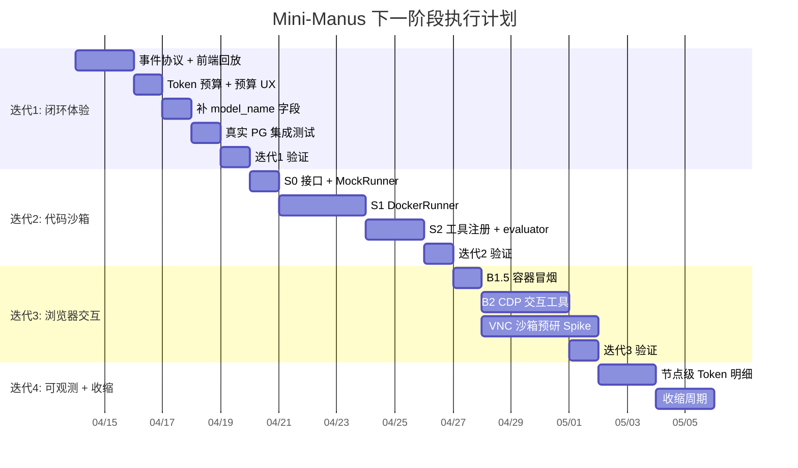

# Mini-Manus 下一阶段执行计划

> 基于《后续增强技术方案》Review 结论 + 《系统地图与维护指南》的风险边界，制定的可落地迭代计划。

## 总体策略

按照"先闭环体验 → 再扩展能力 → 最后编排升级"的节奏，分 4 个迭代推进。
每个迭代结束时必须满足三个门槛：**构建通过、关键测试覆盖、文档同步更新**。

---

## 迭代 1：事件回放 + Token 预算（约 4-6 天）

> **目标**：让用户刷新页面后不丢失执行过程，同时堵住 Token 烧钱漏洞。

### 1.1 事件协议修正 + 前端事件回放

**改动范围**：
- `backend/src/event/event.publisher.ts` — 发布前生成事件信封
- `backend/src/event/event-log.service.ts` — 支持使用外部传入的事件 id 写库
- `backend/src/event/entities/task-event.entity.ts` — 确认 `id` 可由发布层预生成
- `backend/src/task/task.controller.ts` — 事件查询接口改为稳定游标
- `frontend/src/domains/task/hooks/use-task-socket-sync.ts`
- `frontend/src/domains/run/components/timeline-section.tsx`
- `frontend/src/core/api/` 新增 `fetchTaskEvents` 接口

**核心逻辑**：
1. `EventPublisher.emit()` 在发布前先生成 `eventId = randomUUID()`
2. 后端构造统一事件信封：
   - `_eventId`
   - `_eventName`
   - `_eventCreatedAt`
   - 原业务 payload
3. `EventLogService.record()` 使用同一个 `_eventId` 写入 `task_events.id`
4. `Gateway` 推给 Socket 的 payload 也必须包含同一个 `_eventId`
5. 前端维护 `seenEventIds: Set<string>`，历史事件和 live event 都按 `_eventId` 去重
6. 用户进入任务详情页时，调用 `GET /api/tasks/:id/events?runId=xxx`
7. 将历史事件按 `event_name` 映射为 `liveRunFeed` 的格式，填充 Timeline
8. 后端事件续拉不要使用 `after_id`，第一版使用稳定复合游标：
   - `after_created_at`
   - `after_event_id`
9. 后续如果事件量明显变大，再给 `task_events` 增加 `sequence bigint`，升级为 `after_sequence` 游标

**影响链路**：
- ✅ 实时反馈链路（3.3）
- ✅ 事件落库链路
- ❌ 不影响 Agent 节点决策语义

**验证方式**：
- 启动一个任务，执行到一半时刷新页面，Timeline 应自动恢复到刷新前的状态
- 任务已完成时，进入详情页应能完整看到所有历史步骤
- 同一个事件同时从历史接口和 Socket 到达时，前端只渲染一次
- 抽查 `task_events.id` 与 Socket payload 中的 `_eventId` 必须一致

---

### 1.2 Token 总预算上限

**改动范围**：
- `backend/src/agent/token-budget.guard.ts` — 新增预算守卫
- `backend/src/agent/agent.service.ts` — 创建 `TokenBudgetGuard`，并传给 evaluator/finalizer
- `backend/src/agent/nodes/evaluator.node.ts` — 在 LLM 决策前检查预算
- `backend/src/agent/nodes/finalizer.node.ts` — 生成最终产物前检查预算
- `backend/src/agent/agent.state.ts` — 如需持久化错误语义，扩展 `errorCode`
- `backend/src/common/events/task.events.ts` — 失败事件 payload 支持结构化预算信息
- `frontend/src/domains/run/components/run-debug-panel.tsx` — 展示预算终止原因
- `frontend/src/domains/run/components/timeline-section.tsx` — 对预算终止显示 Alert

**核心逻辑**：
1. `AgentService` 读取 `TOKEN_BUDGET`（默认 100,000）和当前模型价格表
2. `AgentService` 创建全局 `TokenTrackerCallback` 与 `TokenBudgetGuard`
3. `TokenBudgetGuard` 通过闭包读取 `tokenTracker.totalTokens`，不要让 evaluator 直接访问 callback 实例
4. evaluator 在调用 LLM 前检查预算；若已超限，返回结构化失败：
   ```ts
   {
     decision: 'fail',
     reason: 'token_budget_exceeded',
     errorCode: 'token_budget_exceeded',
     metadata: {
       budgetTokens,
       usedTokens,
       estimatedCostUsd
     }
   }
   ```
5. finalizer 在生成最终产物前也必须检查预算，防止最后一步大输出继续烧 token
6. `run.failed` / `step.failed` 事件透传 `errorCode` 与预算 metadata
7. 前端对 `errorCode === 'token_budget_exceeded'` 使用特殊 Alert 文案：
   - “任务因 Token 预算耗尽被强制终止”
   - 显示 `budgetTokens / usedTokens / estimatedCostUsd`

**影响链路**：
- ✅ Agent 执行链路（3.2）的 evaluator 节点
- ✅ finalizer 入口保护
- ✅ 前端失败态展示

**验证方式**：
- 设置 `TOKEN_BUDGET=500`，执行一个需要多步的任务，应在 1-2 步后终止并显示 `token_budget_exceeded`
- Run Debug 面板显示预算上限、已用 token 和估算成本
- Timeline 以预警样式显示“预算耗尽”，不能只显示普通失败
- 正常预算（100,000）下执行不受影响

---

### 1.3 `task_runs` 补 `model_name`

**改动范围**：
- `backend/src/migrations/` — 新增迁移文件
- `backend/src/task/entities/task-run.entity.ts` — 新增 `modelName` 列
- `backend/src/agent/agent.service.ts` — Run 结束时写入 `modelName`

**影响链路**：
- ✅ 数据落库链路（3.4）
- ❌ 不影响前端（前端暂不读此字段，后续可展示）

**验证方式**：
- `pnpm build` 通过
- 新 Run 结束后，数据库 `task_runs.model_name` 有值

---

### 1.4 真实 PostgreSQL 集成测试

**改动范围**：
- `backend/test/task-run.integration-spec.ts` — 新增真实数据库集成测试
- `backend/test/jest-integration.json` — 新增集成测试配置
- `backend/package.json` — 新增 `test:integration`
- `backend/src/migrations/` — 集成测试启动时跑全量迁移

**核心逻辑**：
1. 使用真实 PostgreSQL 容器或 `TEST_DATABASE_URL`
2. 测试启动时执行 migrations，不使用 `synchronize: true`
3. AgentService 可用 mock 替代，避免真实 LLM 调用
4. 覆盖这些数据库链路：
   - `createTask` 创建 `task / revision / run`
   - `task_events` 可落库并按 task/run 查询
   - `saveTokenUsage` 能写回 `task_runs`
   - `getTaskDetail` / `getRunDetail` 能正确返回关联数据
   - `deleteTask` 删除数据库记录后不留下孤儿数据

**影响链路**：
- ✅ 数据落库链路（3.4）
- ✅ 事件回放链路
- ✅ Token 持久化链路

**验证方式**：
- `pnpm test:integration` 在真实 PostgreSQL 上通过
- migrations 可在空库执行
- 集成测试不依赖 OpenAI Key

---

## 迭代 2：代码执行沙箱 S0-S2（约 5-7 天）

> **目标**：让 Agent 具备"写代码并运行验证"的闭环能力。

### 2.1 S0：SandboxRunner 接口 + MockRunner

**改动范围**：
- `backend/src/sandbox/` — 新建模块
  - `sandbox.module.ts`
  - `interfaces/sandbox-runner.interface.ts`
  - `runners/mock.runner.ts`
  - `sandbox.service.ts`
- `backend/src/sandbox/__tests__/sandbox.service.spec.ts`

**核心逻辑**：

```ts
interface SandboxRunner {
  run(options: {
    taskId: string;
    runtime: 'node' | 'python';
    entryFile: string;
    timeoutMs: number;
    memoryLimitMb?: number;
    networkDisabled?: boolean;
  }): Promise<{
    stdout: string;
    stderr: string;
    exitCode: number;
    durationMs: number;
    truncated: boolean;
  }>;
}
```

`MockRunner` 直接返回预设结果，用于单元测试。

**验证方式**：
- `pnpm test` 包含 SandboxService 的 MockRunner 测试用例

---

### 2.2 S1：DockerRunner 真实实现

**改动范围**：
- `backend/src/sandbox/runners/docker.runner.ts`
- `package.json` 新增 `dockerode` 依赖
- `.env.example` 新增 `SANDBOX_ENABLED`, `SANDBOX_TIMEOUT_MS`, `SANDBOX_MEMORY_LIMIT_MB`

**核心逻辑**：
1. 通过 `dockerode` 连接本地 Docker Socket
2. 拉起 `node:20-alpine` 或 `python:3.12-slim` 容器
3. 将 task workspace 以 `rw` 挂载到容器 `/workspace`
4. 执行 `node /workspace/{entry}` 或 `python /workspace/{entry}`
5. 捕获 stdout/stderr（截断至 10KB）、exitCode、duration
6. 超时后 `container.kill()` + 清理

**安全约束（Docker 启动参数）**：
```
--network=none
--memory=256m
--shm-size=64m
--read-only (基础镜像层)
--user=nobody
--no-new-privileges
```

**验证方式**：
- 本地有 Docker 环境时：写一个 `console.log("hello")` 到 workspace，执行 `sandbox_run_node`，返回 stdout 包含 "hello"
- 测试超时：写一个 `while(true){}` 脚本，应在超时后返回非零 exitCode

---

### 2.3 S2：注册为工具 + evaluator 联动

**改动范围**：
- `backend/src/tool/tools/sandbox-run-node.tool.ts` — 新增
- `backend/src/tool/tools/sandbox-run-python.tool.ts` — 新增
- `backend/src/tool/tool.module.ts` — 条件注册（`SANDBOX_ENABLED`）
- `backend/src/agent/nodes/evaluator.node.ts` — 识别沙箱结果

**核心逻辑**：
1. 工具标记为 `side-effect`，受 Planner 白名单控制
2. evaluator 识别 stepRun 中 `toolName === 'sandbox_run_*'` 时，额外检查 `exitCode`
3. `exitCode !== 0` 时，evaluator 倾向 `retry`（附带 stderr 上下文给 planner 修正代码）

**验证方式**：
- 提交任务："用 Python 计算 1+1 并输出结果"
- Agent 应生成 Python 代码 → 写入 workspace → 调用 sandbox_run_python → evaluator 根据 exitCode 决策

---

## 迭代 3：浏览器部署冒烟 + 浏览器交互 B2 + VNC 预研（约 6-8 天）

> **目标**：让 Agent 能点击和输入，同时验证 VNC 路线的可行性。

### 3.1 B1.5：Playwright 容器化部署冒烟

**改动范围**：
- `docker/` 或部署配置 — 确认 API 镜像包含 Playwright Chromium 依赖
- `backend/test/browser-smoke.e2e-spec.ts` 或 `scripts/browser-smoke.ts` — 新增浏览器冒烟脚本
- `.env.example` — 补齐浏览器相关配置说明

**核心逻辑**：
1. 构建当前后端 API 镜像，镜像内必须能启动 Playwright Chromium
2. 在容器内调用现有只读工具：
   - `browser_open`
   - `browser_extract`
   - `browser_screenshot`
3. 使用一个稳定页面做 smoke test：
   - 优先本地静态 HTML
   - 其次 `https://example.com`
4. 校验截图文件真实生成，且大小大于最小阈值
5. 如果测试页面包含中文，检查截图无明显乱码或缺字

**为什么必须先做**：
- Playwright 在 Docker/服务器环境最容易缺 Chromium、字体或系统 so 依赖
- 如果不先验证底座，后续 B2 的点击/输入失败会很难判断是环境问题还是业务逻辑问题

**验证方式**：
- 在目标部署镜像内跑通 `browser_open + browser_screenshot`
- 截图文件能在 workspace 中找到
- 后端日志没有 Chromium 启动失败、字体缺失或断连错误

---

### 3.2 B2：浏览器交互工具（CDP 路线 A）

**改动范围**：
- `backend/src/tool/tools/browser/browser-click.tool.ts` — 新增
- `backend/src/tool/tools/browser/browser-type.tool.ts` — 新增
- `backend/src/tool/tools/browser/browser-wait-for.tool.ts` — 新增
- `backend/src/browser/browser-session.service.ts` — 新增交互方法
- `backend/src/browser/entities/browser-action.entity.ts` — 新增浏览器动作审计表

**核心逻辑**：
1. `browser_click`：接收 `sessionId` + `selector`，调用 `page.click(selector)`
2. `browser_type`：接收 `sessionId` + `selector` + `text`，调用 `page.fill(selector, text)`
3. `browser_wait_for`：接收 `sessionId` + `selector` + `timeoutMs`
4. 每次操作后自动截一张图存入 workspace，并记录到 `browser_actions` 审计表
5. 所有交互工具标记为 `side-effect`

**验证方式**：
- 提交任务："打开 https://example.com，点击页面上的 More information 链接，截图"
- Agent 应生成 plan → browser_open → browser_click → browser_screenshot

---

### 3.3 VNC 沙箱技术预研（Spike）

> [!IMPORTANT]
> 这是一个纯技术验证 spike，不接入主执行链路，不影响任何现有功能。

**改动范围**：
- `backend/src/sandbox/runners/vnc-container.runner.ts` — 新增（实验性）
- `docker/Dockerfile.vnc-sandbox` — 新增自定义镜像配置

**预研目标**：
1. 用 `kasmweb/chrome` 镜像手动拉起一个容器
2. 验证从 Node 后端通过 `dockerode` 启动/停止容器
3. 验证从浏览器通过 noVNC 连接容器的 WebSocket 流
4. 验证从 Playwright 通过 CDP 连接容器内 Chromium 并截图
5. 测量冷启动时间、内存占用、截图延迟

**交付物**：
- 一份技术验证报告（`docs/VNC-Sandbox-技术验证.md`）
- 包含：镜像体积、冷启动耗时、内存占用、截图质量对比、已知坑点

---

## 迭代 4：节点级 Token 明细 + 收缩周期（约 3-4 天）

> **目标**：补全可观测性，并做一次全面的代码收缩。

### 4.1 节点级 Token 拆分

**改动范围**：
- `backend/src/observability/entities/llm-call-log.entity.ts` — 新增
- `backend/src/observability/observability.module.ts` — 新增可观测性模块
- `backend/src/migrations/` — 新增迁移
- `backend/src/agent/nodes/*.node.ts` — 每个节点创建独立 `TokenTrackerCallback`
- `backend/src/event/event-log.service.ts` — 监听 `LLM_CALL_COMPLETED` 写入 `llm_call_logs`

**核心逻辑**：
1. 每个节点（planner/evaluator/finalizer/skill）在调用 LLM 前创建独立的 `TokenTrackerCallback`
2. 节点结束后 emit `TASK_EVENTS.LLM_CALL_COMPLETED`，payload 包含 `nodeName`, `inputTokens`, `outputTokens`, `durationMs`
3. `EventLogService` 监听该事件，写入 `llm_call_logs` 表
4. 全局的 `TokenTrackerCallback` 继续保留用于 Run 级聚合

**验证方式**：
- 执行一个任务后，查询 `llm_call_logs` 表应有 planner/evaluator/finalizer 各至少一条记录
- Run 级的 token 总数 ≈ 各节点明细之和

---

### 4.2 收缩周期

按照《系统地图》第 10 章的建议，做一次全面收缩：

- [ ] 删除项目中的重复逻辑和死代码
- [ ] 抽取公共类型和 helper 到 `shared/`
- [ ] 更新《系统地图与维护指南》中的模块地图（新增 SandboxModule、browser_actions 表等）
- [ ] 更新《后续增强技术方案》的完成度标注
- [ ] 校对 `.env.example` 是否包含所有新增配置项（沙箱、Token 预算等）
- [ ] 确认 `pnpm build`（前后端）+ `pnpm test` + `pnpm test:e2e` 全部通过
- [ ] 确认 `pnpm test:integration` 在真实 PostgreSQL 上通过
- [ ] 确认本阶段新增迁移可在空库执行，且不依赖 `synchronize: true`

---

## 整体时间线总览



## 风险与缓解

| 风险 | 概率 | 缓解措施 |
|------|------|---------|
| Docker 环境在部分开发机上不可用 | 中 | S0 使用 MockRunner 保证测试不依赖 Docker；CI 中标记 Docker 测试为可选 |
| PostgreSQL 集成测试环境不可用 | 中 | 支持 `TEST_DATABASE_URL` 和容器两种模式；本地无法跑时至少在 CI 或专用脚本中跑 |
| Playwright 容器环境缺依赖 | 高 | B2 前强制执行 B1.5 容器冒烟，先验证 `browser_open + screenshot` |
| VNC 镜像体积过大导致冷启动慢 | 中 | Spike 阶段测量并决策是否需要自建精简镜像 |
| 前端事件回放去重逻辑边界情况多 | 中 | 发布前生成 `_eventId`，历史事件和 Socket 事件都按 `_eventId` 去重；续拉使用复合游标 |
| Token 预算过低导致正常任务被误杀 | 低 | 默认预算设足够高（100K），环境变量可覆盖；前端用结构化 Alert 明确是预算终止 |
