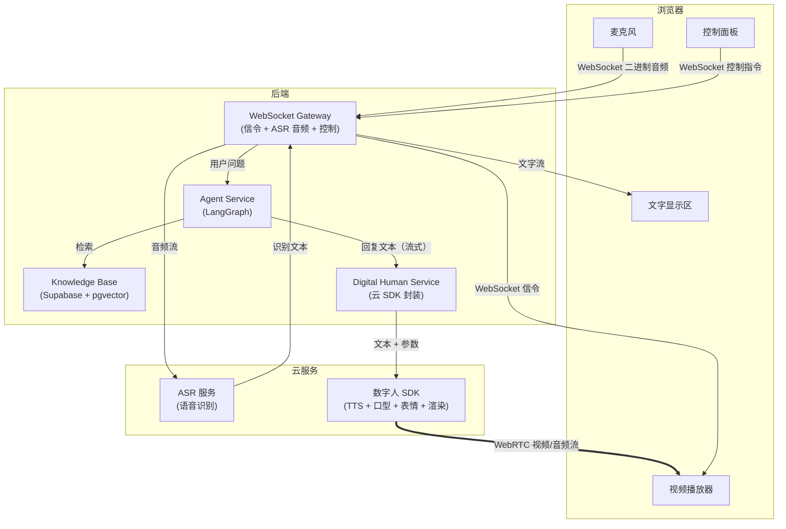
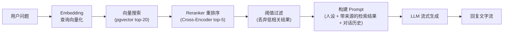
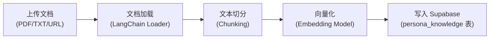

# 数字人 Agent 技术方案

> 一个以 Agent 为大脑、知识库为记忆、语音为输入、数字人为输出的实时对话系统。

---

## 1. 系统定位

这个项目把课程里已经分散实现的能力——Agent、RAG 知识库、语音识别、语音合成——组合成一个完整产品：

**用户对着一个数字人说话，数字人以特定人物的声音、表情、口型实时回答，回答内容基于注入的知识库。**

它解决的不是"模型能不能回答"的问题，而是"交互形式能不能让人觉得在和一个真人对话"的问题。

核心技术链条：

```
用户说话 → ASR 识别 → Agent 思考（RAG 检索 + 人设 Prompt）→ 文字回复
                                                              ↓
                                               数字人 SDK（TTS + 口型 + 表情）
                                                              ↓
                                                    WebRTC 推流 → 浏览器播放
```

课程里已有的模块在这个链条中的位置：

| 已有模块 | 在本项目中的角色 |
|---|---|
| `tts-stt-test` / `asr-and-tts-nest-service` | 语音识别（ASR）直接复用；TTS 在纯语音模式下复用，数字人模式下由 SDK 接管 |
| `milvus-test` / `rag-test` | 知识库检索层的**设计思路**复用（存储层从 Milvus 切换到 Supabase + pgvector） |
| `langgraph-test` | Agent 执行模式直接复用 |
| `hello-nest-langchain` | NestJS + LangChain 服务模式直接复用 |
| `task-system-test` | NestJS 模块化组织模式复用（本项目不需要 EventEmitter2 解耦——事件流比 mini-manus 简单，Gateway 直接调 Service 即可） |

---

## 2. 整体架构



---

## 3. 两种模式

这个项目支持两种交互模式，共享同一个 Agent 大脑和知识库，只是输出层不同：

### 模式 A：纯语音对话（不需要数字人）

```
用户说话 → WebSocket(binary) → ASR → 文字
文字 → Agent(RAG) → 回复文字（流式）
回复文字 → TTS(语音克隆) → WebSocket(binary) → MediaSource/SourceBuffer → 播放
同时：回复文字 → WebSocket(JSON) → 前端文字显示
```

这个模式复用 `asr-and-tts-nest-service` 的架构，升级点是：
1. TTS 使用克隆后的声音
2. Agent 接入 RAG 知识库和人设系统

### 模式 B：数字人对话

```
用户说话 → WebSocket(binary) → ASR → 文字
文字 → Agent(RAG) → 回复文字（流式）
回复文字 → 数字人 SDK → 视频+音频流 → WebRTC → 浏览器播放
同时：回复文字 → WebSocket(JSON) → 前端文字显示
WebSocket 负责：WebRTC 信令交换（SDP offer/answer, ICE candidates）
```

和模式 A 的区别：
- TTS 不再由后端单独调用，而是由数字人 SDK 内置处理
- 输出从"音频流"变成"视频 + 音频流"
- 多了 WebRTC 连接，多了信令交换

---

## 4. 三层协议

这个项目同时用到三种实时通信协议，各管各的事：

```
┌─────────────────────────────────────────────────────┐
│  WebRTC                                              │
│  数字人的视频 + 音频实时推流                            │
│  特点：P2P 媒体传输，低延迟，浏览器原生支持               │
│  只在数字人模式下使用                                   │
├─────────────────────────────────────────────────────┤
│  WebSocket                                           │
│  - 上行：麦克风音频(binary) / 控制指令(JSON)            │
│  - 下行：ASR 识别结果 / Agent 回复文字 / WebRTC 信令    │
│  - 纯语音模式下也承载 TTS 音频(binary)                  │
│  特点：双向、全双工、低延迟                              │
├─────────────────────────────────────────────────────┤
│  HTTP REST                                           │
│  - 知识库管理（上传文档、查询状态）                      │
│  - 人设配置（创建/编辑角色）                            │
│  - 会话历史查询                                        │
│  特点：请求-响应、无状态                                │
└─────────────────────────────────────────────────────┘
```

### 4.1 实现选型：统一使用原生 WebSocket

V1 统一采用浏览器原生 `WebSocket` + 后端 `ws` 风格网关，不引入 Socket.IO。这样可以直接复用 `asr-and-tts-nest-service` 的设计思路，也避免同时维护两套事件语义。

这意味着文档里的所有实时控制消息最终都落成：
- 浏览器端：`ws.addEventListener('message', ...)` + `ws.send(JSON.stringify(...))`
- 后端：`client.send(JSON.stringify(...))`
- 不使用 `ws.on('event') / ws.emit(...)` 这种 Socket.IO 风格 API

### 4.2 WebSocket 消息封包

除纯语音模式下的 TTS 音频帧外，所有实时消息都使用统一的 JSON 封包：

```typescript
interface WsEnvelope<T = unknown> {
  type: string;   // 如 webrtc:offer / webrtc:answer / conversation:text_chunk
  sessionId: string;
  turnId?: string;   // 一轮用户提问 + 一轮助手回答
  seq?: number;      // 同一 turn 内的流式顺序号
  status?: 'start' | 'streaming' | 'completed' | 'interrupted' | 'failed';
  payload: T;
}
```

推荐的消息类型：
- `session:start`
- `asr:final`
- `conversation:start`
- `conversation:text_chunk`
- `conversation:done`
- `conversation:interrupt`
- `webrtc:offer`
- `webrtc:answer`
- `webrtc:ice-candidate`
- `tts:start`
- `tts:end`
- `error`

纯语音模式下，TTS 音频继续走 Binary，但前后必须有 JSON 控制帧：
1. 服务端先发 `tts:start`，其中带 `sessionId`、`turnId`、音频编码信息
2. 服务端连续发送该 `turnId` 对应的二进制音频帧
3. 服务端最后发 `tts:end`
4. 前端只消费当前 `activeTurnId` 的音频帧，旧 turn 的迟到音频直接丢弃

### 为什么不全用 WebSocket

WebSocket 能做一切实时通信，但：

- 视频推流用 WebSocket 是灾难——没有拥塞控制、没有自适应码率、没有硬件编解码加速。WebRTC 专门为这件事设计，浏览器有原生优化。
- 知识库管理、人设配置这些低频操作用 REST 更合适——无状态、可缓存、调试方便。

### WebRTC 在这个项目中的角色

WebRTC 的难点不在使用，而在理解。

```mermaid
sequenceDiagram
    participant B as 浏览器
    participant S as 后端(信令)
    participant D as 数字人 SDK

    B->>S: WebSocket: 请求开始对话
    S->>D: 初始化数字人会话
    D->>S: SDP Offer (媒体能力描述)
    S->>B: WebSocket: 转发 SDP Offer
    B->>B: 创建 RTCPeerConnection
    B->>S: WebSocket: SDP Answer
    S->>D: 转发 SDP Answer
    Note over B,D: ICE 候选交换（多轮，省略）
    D==>>B: WebRTC: 视频+音频流（持续推送）

    Note over B,S: 对话开始后
    B->>S: WebSocket: 麦克风音频
    S->>S: ASR → Agent → 回复文字
    S->>D: 回复文字
    D==>>B: WebRTC: 数字人说话（视频+音频）
```

关键概念：
- **SDP（Session Description Protocol）**：双方交换"我支持什么编码格式、什么分辨率"
- **ICE（Interactive Connectivity Establishment）**：双方探测网络路径，找到能通的连接方式
- **信令服务器**：就是我们的 WebSocket Gateway，只负责转发 SDP 和 ICE，不碰媒体流本身

云厂商的数字人 SDK 会把 WebRTC 的细节封装好。但理解这三个概念是必要的——不然你连 SDK 的回调参数都看不懂。

---

## 5. Agent 大脑

### 5.1 职责

Agent 是整个系统的大脑。它接收用户问题，检索知识库，按照人设回答。

和 mini-manus 的 Agent 不同：
- mini-manus 的 Agent 是**任务型**——拆步骤、调工具、生成产物
- 这个 Agent 是**对话型**——理解问题、检索知识、生成符合人设的回答

所以这里**不需要 planner/executor/evaluator 四节点结构**，用一个简单的 RAG + 对话 Agent 就够了。

### 5.2 执行流程



这是一个典型的**两阶段检索**流程：第一阶段用 Embedding 向量搜索快速召回候选集（top-20），第二阶段用 Reranker 基于查询和文档的真实语境相关性重新打分，筛选出最终的 top-5。以适度的延迟代价换来显著更好的检索质量。

### 5.3 Prompt 结构

```
System:
  你是{角色名}。{角色简介}
  你的说话风格：{风格描述}
  你的专业领域：{领域描述}

  以下是与当前问题相关的知识（经过检索和重排序，按相关性从高到低）：
  ---
  [来源: {source_1}, 段落 {chunk_index_1}]
  {chunk_content_1}
  ---
  [来源: {source_2}, 段落 {chunk_index_2}]
  {chunk_content_2}
  ---
  （共 {n} 条，均已通过相关性阈值过滤）

  要求：
  1. 始终以{角色名}的身份回答
  2. 回答必须基于上述知识，不要编造不在知识库中的内容
  3. 如果知识库中没有相关信息，诚实说"这个我不太清楚"
  4. 语气和用词要符合角色人设
  5. 回答要口语化，适合语音朗读（避免长列表、代码块、复杂格式）
  6. 回答时自然地提及信息来源，例如"根据 React 19 的文档..."、"在官方指南里提到..."

History:
  {最近 N 轮对话}

User:
  {当前问题}
```

注意第 5 条：回答要口语化。这是语音场景和文字场景最大的区别——模型默认会输出 Markdown 列表、代码块、长句，这些东西 TTS 读出来会很奇怪。Prompt 里必须显式约束。

注意第 6 条：引用信息来源。语音场景下不能像文字场景那样插入 `[1]` 脚注，但可以用口语化的方式提及来源。这对用户信任至关重要——用户需要知道答案不是编的。前端文字区可以额外展示结构化的引用列表（来源文档名 + 段落位置），语音不读但文字可见。

### 5.4 对话记忆

短期记忆：最近 N 轮对话，从 `conversation_message` 表查询，拼进 Prompt 的 History 部分。不在内存中维护长期历史——每次用户提问时直接查 DB 取最近 N 条，进程重启不丢上下文。

N 的选择：语音对话轮次短、每轮文字少，N=10 通常够用。不需要像 mini-manus 那样做 result_summary 压缩——对话场景不会像任务执行那样产生大量工具输出。

长期记忆：知识库（Supabase + pgvector）。不按会话存储，按角色存储——同一个角色的知识库在所有会话中共享。

History 查询的一个关键约束：**默认只取 `status=completed` 的消息进入 Prompt**。被打断或失败的 assistant 半句回复可以保留在 UI 历史里，但不默认回灌给模型，否则会把不完整答案当成上下文。

这里的“无状态”只指**历史上下文不依赖进程内存**，不代表整个实时链路无状态。运行时仍然必须维护：
- 当前 `sessionId` / `turnId`
- `AbortController`
- 断句缓冲区
- 数字人 `speak()` 播报队列
- WebRTC ICE 回调与清理函数

V1 里这些状态放在进程内的 `RealtimeSessionRegistry`。如果后续做多实例部署，需要增加 sticky session，或者把这部分状态迁到外部会话存储。

### 5.5 关于 LangGraph

技术上，这个项目的 Agent 流程是线性的（检索 → 拼 Prompt → 流式生成），用 LangChain 的 LCEL（RunnableSequence）完全够了，不需要复杂的状态图和条件边。

但本项目仍选择 **LangGraph 作为 AgentService 的运行时骨架**，原因是教学连贯性——学生在 mini-manus 里刚学了 StateGraph，这里继续使用同一套模式，只是图退化成一个线性流程：`retrieve -> buildPrompt -> streamAnswer`。Prompt、Model、Parser、Embeddings 这些底层组件依然复用 LangChain。

如果是独立项目而非课程的一部分，直接用 LCEL 也完全合理。

### 5.6 流式输出与 TTS 衔接

Agent 的回复是流式产生的（token by token）。但 TTS 不能逐 token 喂——需要攒到一个语义完整的片段（句子）再送。

策略：**按标点断句缓冲**。

```
Agent 输出 token 流 → 缓冲区 → 遇到句号/问号/感叹号/逗号 → 刷出一段文字
                                                              ↓
                                               TTS（或数字人 SDK）→ 音频/视频
```

缓冲区逻辑：
- 遇到 `。？！；` → 立刻刷出（句子结束）
- 遇到 `，、：` → 如果缓冲区超过 15 字，刷出（防止长从句卡住）
- 缓冲区超过 50 字但没遇到标点 → 强制刷出（兜底）
- Agent 输出结束 → 刷出剩余内容

这个断句缓冲是语音对话体验的关键。太小会让 TTS 频繁启停、语音不连贯；太大会让用户等太久才听到声音。

---

## 6. 知识库与 RAG 检索

RAG（Retrieval-Augmented Generation）是这个系统的知识根基。相比让 LLM 凭训练数据回答，RAG 在运行时将检索到的事实注入 Prompt，把模型的响应锚定在真实来源上。这显著减少了幻觉，但并不能完全消除——检索质量直接决定回答质量。

本节是整个系统中教学密度最高的部分，覆盖 RAG 管线的核心环节：Embeddings、Chunking、向量数据库、元数据过滤、重排序（Reranking）、检索质量问题、幻觉控制、引用溯源。

### 6.1 知识库架构

所有数据统一存储在 Supabase（PostgreSQL + pgvector），不再分 MySQL 和 Milvus 两套存储。知识库表结构按角色组织：

```sql
-- Supabase / PostgreSQL 常用扩展
CREATE EXTENSION IF NOT EXISTS pgcrypto;
-- 启用 pgvector 扩展
CREATE EXTENSION IF NOT EXISTS vector;

CREATE TABLE persona_knowledge (
  id          UUID PRIMARY KEY DEFAULT gen_random_uuid(),
  persona_id  UUID NOT NULL REFERENCES persona(id) ON DELETE CASCADE,        -- 角色 ID，检索时的主过滤条件
  document_id UUID NOT NULL REFERENCES knowledge_document(id) ON DELETE CASCADE, -- 用于按文档删除/重建
  chunk_index INT NOT NULL,                                 -- 在原文档中的顺序，用于引用溯源
  content     TEXT NOT NULL,                                -- 知识片段原文
  source      TEXT NOT NULL,                                -- 来源（文档名、URL），用于引用展示
  category    TEXT,                                         -- 分类（背景、专业知识、FAQ 等），用于元数据过滤
  embedding   VECTOR(1536),                                 -- 向量（维度需与 Embedding 模型匹配）
  created_at  TIMESTAMPTZ DEFAULT now(),

  -- 保证同一文档重建/重试时幂等，避免重复 chunk
  UNIQUE (document_id, chunk_index)
);

-- 为向量搜索创建索引（V1 数据量小可以先不建，暴力搜索即可）
CREATE INDEX ON persona_knowledge
  USING hnsw (embedding vector_cosine_ops)
  WITH (m = 16, ef_construction = 64);

-- 为元数据过滤创建索引
CREATE INDEX ON persona_knowledge (persona_id);
CREATE INDEX ON persona_knowledge (persona_id, category);
```

`document_id` 和 `chunk_index` 的作用：删除某个文档时，一条 `DELETE FROM persona_knowledge WHERE document_id = $1` 精确删除对应的所有向量，不影响其他文档。而且因为在同一个数据库里，可以和 `knowledge_document` 表的状态更新放在同一个事务中——不会出现"结构化数据删了但向量没删"的不一致问题。`chunk_index` 还用于引用溯源——告诉用户答案来自原文档的哪个位置。

`UNIQUE(document_id, chunk_index)` 的作用：保证同一个文档在“重试入库 / 任务补偿 / 重建索引”时不会写出重复 chunk。实现时应优先使用 `INSERT ... ON CONFLICT (document_id, chunk_index) DO UPDATE` 或先删后插的幂等策略。

### 6.2 Embeddings（向量化）

Embedding 是 RAG 的第一步：把文本转成高维向量，使得语义相近的文本在向量空间中距离更近。查询时把用户问题也转成向量，在向量空间中找最近邻。

**模型选择：**

| 模型 | 维度 | 中文效果 | 延迟 | 适用场景 |
|---|---|---|---|---|
| `text-embedding-3-small` (OpenAI) | 1536 | 中等 | 低 | 英文为主、成本敏感 |
| `text-embedding-3-large` (OpenAI) | 3072（可降维） | 较好 | 中 | 通用场景 |
| `bge-m3` (BAAI) | 1024 | 优秀 | 中 | 中文为主、可本地部署 |
| `bge-large-zh-v1.5` (BAAI) | 1024 | 优秀 | 中 | 纯中文场景 |

V1 建议用 `text-embedding-3-small`（1536 维，和课程 `rag-test` 保持一致，降低切换成本）。教学时可以对比不同模型在中文检索上的效果差异——同一个查询，不同 Embedding 模型召回的结果可能完全不同，这是理解"语义漂移"问题的最佳入口。

**关键约束：`persona_knowledge` 表中 `VECTOR(1536)` 的维度必须和选用的 Embedding 模型匹配。** 如果切换到 `bge-m3`（1024 维），需要改为 `VECTOR(1024)` 并全量重建索引。pgvector 不允许不同维度的向量混存。

### 6.3 Chunking（文本切分）

Chunking 是将长文档拆分成适合检索和 Prompt 注入的短片段。切分质量直接影响检索质量——切得不好，相关信息可能被拆到两个 chunk 中，两个都检索不到。

**入库流程：**



**切分策略：**

```
RecursiveCharacterTextSplitter
├── chunk_size: 500 字符
├── chunk_overlap: 100 字符
└── separators: ["\n\n", "\n", "。", "！", "？", "；", "，", " "]
```

- **chunk_size = 500**：语音场景下检索结果要短。普通文字 RAG 常用 1000-2000，但本项目的回答需要口语化朗读，塞进 Prompt 的内容越精炼越好——长段落会稀释核心信息，导致模型回答冗长。
- **chunk_overlap = 100**：相邻 chunk 重叠 100 字符，缓解"答案刚好在切分边界"的问题。但 overlap 只是缓解，不能根治。
- **中文优先分隔符**：`separators` 列表从大到小尝试——先按段落切、再按句号切、最后才按字符切。这保证每个 chunk 尽量是语义完整的段落或句子，而不是被从句子中间截断。

**块边界问题（Chunk Boundary Problem）：**

这是 Chunking 最常见的失败模式：一段相关信息跨越了两个 chunk，导致两个 chunk 单独看都不完整，检索时都不够相关。

```
原文：React Compiler 在编译阶段自动分析组件依赖，生成最优的
      ┈┈┈┈┈┈┈┈ chunk 1 边界 ┈┈┈┈┈┈┈┈┈┈┈┈┈┈┈┈┈┈┈┈┈┈┈┈┈
      记忆化代码，开发者不再需要手动写 useMemo 和 useCallback。
      ┈┈┈┈┈┈┈┈ chunk 2 开头 ┈┈┈┈┈┈┈┈┈┈┈┈┈┈┈┈┈┈┈┈┈┈┈┈┈
```

用户问"React Compiler 有什么用"，chunk 1 只说了"分析依赖"没说结论，chunk 2 只说了"不再需要手动写"没说前因。两个 chunk 的检索得分都可能低于阈值。

缓解策略：
1. **overlap**（已采用）：100 字符的重叠让边界附近的内容在两个 chunk 中都出现
2. **合理的分隔符优先级**：优先按段落/句号切分，避免从句子中间切断
3. **chunk_size 不要太小**：太小会加剧边界问题。500 字符在语音场景下是合理的下限

**不同文档类型的切分差异：**

| 文档类型 | Loader | 切分注意点 |
|---|---|---|
| PDF | `PDFLoader` | 注意页眉/页脚/页码的噪音，可能需要预清洗 |
| TXT | `TextLoader` | 最简单，直接切分 |
| URL | `CheerioWebBaseLoader` | 需要去除导航栏、侧边栏等 HTML 噪音 |
| Markdown | `MarkdownTextSplitter` | 可以按标题层级切分，保留结构信息 |

### 6.4 向量数据库（Supabase + pgvector）

本项目使用 Supabase（托管 PostgreSQL）+ pgvector 扩展作为统一存储层，**同时承担结构化数据存储（替代 MySQL）和向量检索（替代 Milvus）两个职责**。

**为什么用 Supabase + pgvector：**
- **一个数据库搞定一切**：结构化数据（persona、conversation）和向量数据（knowledge chunks）在同一个 PostgreSQL 中，不需要 MySQL + Milvus 两套基础设施
- **事务一致性**：删除角色/文档时可以用事务同时清理结构化数据和向量数据，不会出现数据不一致
- **标准 SQL**：元数据过滤就是 WHERE 子句，支持 JOIN、子查询、聚合，比 Milvus 的 `boolean_expr` 灵活得多
- **部署简单**：Supabase 云端免费版注册即用；本地开发也只需要一个 Docker 容器（`docker run -e POSTGRES_PASSWORD=xxx ankane/pgvector`），比 Milvus 的三容器（etcd + MinIO + Milvus）轻量得多
- **LangChain 集成**：`@langchain/community` 提供 `SupabaseVectorStore`，适合快速验证或 demo

**数据库接入方式建议：**
- **推荐方案：混合使用 ORM + 原生 SQL**
- **推荐技术栈：Drizzle ORM + `pg`/PostgreSQL 直连 + 原生 SQL**
- 结构化 CRUD（`persona` / `conversation` / `knowledge_document`）和 migration：交给 ORM
- 向量检索、批量入库、`ON CONFLICT` 幂等写入、HNSW 索引、复杂 JOIN、事务清理：走原生 SQL
- **如果只能二选一，优先后端直连 PostgreSQL 连接池，而不是只依赖 Supabase JS client / PostgREST**

原因：
1. pgvector 的距离运算符、索引调优、`EXPLAIN ANALYZE`、批量写入都天然是 SQL 语义，ORM 抽象价值有限
2. 文档里强调的事务一致性、级联清理、两阶段检索调试，直连 SQL 更容易做到
3. ORM 仍然适合结构化表的 schema 管理和日常 CRUD，所以最佳实践不是“全 ORM”或“全裸 SQL”，而是分层使用

**为什么这里推荐 Drizzle，而不是 Prisma / TypeORM：**
- **Drizzle 更接近 SQL 本体**：对 PostgreSQL 方言、原生 SQL 片段、事务和 migration 的控制更直接，和 pgvector 的使用方式更契合
- **Prisma 在 pgvector 场景下不够顺手**：做结构化 CRUD 没问题，但碰到 `VECTOR(...)`、距离运算符、HNSW、复杂检索 SQL 时通常还是要大量回退到 raw SQL
- **TypeORM 更重、更偏传统 ORM**：对这种“结构化 CRUD + 向量 SQL 并存”的项目收益不高，抽象层反而容易增加复杂度

V1 推荐落地：
- 后端主链路通过 PostgreSQL 连接串直连 Supabase 数据库
- ORM 选用 Drizzle，只负责结构化表、类型推导和 migration
- RAG 检索主路径使用原生 SQL；`SupabaseVectorStore` 可作为教学演示或原型验证工具，不作为核心线上路径的唯一依赖

**pgvector 的三个距离运算符：**

| 运算符 | 含义 | 说明 |
|---|---|---|
| `<=>` | 余弦距离 | 值越小越相似，`1 - (a <=> b)` = 余弦相似度 |
| `<->` | L2 距离（欧几里得） | 值越小越相似 |
| `<#>` | 负内积 | 值越小越相似 |

本项目使用余弦距离 `<=>`。注意 pgvector 返回的是**距离**（越小越好），不是**相似度**（越大越好）。转换公式：`similarity = 1 - distance`。阈值设 `similarity ≥ 0.6`，即 `distance ≤ 0.4`。

**索引类型选择：**

| 索引类型 | 特点 | 适用场景 |
|---|---|---|
| **无索引** | 暴力搜索，100% 精确 | 数据量小（< 1 万条），V1 首选 |
| **HNSW** | 图结构索引，查询快，构建慢，内存占用高 | 数据量中等，需要低延迟 |
| **IVFFlat** | 先聚类再搜索，需要先 `CREATE INDEX` 时指定 `lists` 参数 | 数据量较大，可接受略低精度 |

V1 数据量不大（单角色几百到几千条 chunk），**不建索引直接暴力搜索**即可——精确且零配置。当知识库规模增长到查询变慢时，再加 HNSW 索引。

### 6.5 元数据过滤（Metadata Filtering）

向量搜索是"语义相似度"匹配，但有时候仅靠语义不够。元数据过滤在向量搜索之前或同时缩小候选范围，提高检索精度和速度。

**本项目的元数据字段：**

| 字段 | 过滤用途 | 示例 |
|---|---|---|
| `persona_id` | **必选过滤**——每次检索只在当前角色的知识库中搜索 | `WHERE persona_id = $1` |
| `category` | **可选过滤**——按知识分类缩小范围 | `AND category = 'FAQ'` |
| `source` | **可选过滤**——限定/排除特定文档来源 | `AND source != 'outdated-doc.pdf'` |
| `document_id` | **管理用**——按文档粒度删除/重建 | 不用于检索过滤 |

**pgvector 混合查询示例：**

```sql
-- 基础检索：仅按 persona_id 过滤
SELECT content, source, chunk_index, category,
       1 - (embedding <=> $1) AS similarity
FROM persona_knowledge
WHERE persona_id = $2
ORDER BY embedding <=> $1
LIMIT 20;  -- 第一阶段召回 top-20，交给 Reranker

-- 增强检索：persona_id + category 组合过滤
SELECT content, source, chunk_index, category,
       1 - (embedding <=> $1) AS similarity
FROM persona_knowledge
WHERE persona_id = $2 AND category = 'FAQ'
ORDER BY embedding <=> $1
LIMIT 20;

-- 还可以做 Milvus 做不到的事：JOIN 关联查询
SELECT pk.content, pk.source, pk.chunk_index,
       1 - (pk.embedding <=> $1) AS similarity,
       kd.filename, kd.status
FROM persona_knowledge pk
JOIN knowledge_document kd ON pk.document_id = kd.id
WHERE pk.persona_id = $2
  AND kd.status = 'completed'    -- 只检索已完成处理的文档
ORDER BY pk.embedding <=> $1
LIMIT 20;
```

组合过滤的好处：缩小搜索范围后，向量搜索更快，且结果更聚焦。而且因为是标准 SQL，可以做 JOIN、子查询、聚合——这是 Milvus 的 `boolean_expr` 做不到的。但不要滥用——如果 category 分得太细，可能漏掉跨分类的相关内容。V1 默认只按 `persona_id` 过滤，`category` 作为可选增强。

### 6.6 重排序（Reranking）

**这是提升检索质量最有效的单一措施。**

Embedding 向量搜索是"双编码器"模式——查询和文档各自独立编码成向量，用余弦相似度比较。这种方式快，但粗糙：它比较的是向量空间中的距离，不是真正的语义相关性。

Reranker 是"交叉编码器"模式——把查询和文档拼在一起输入模型，让模型直接判断"这个文档对这个查询有多相关"。这种方式慢，但准确得多。

**两阶段检索模式：**

```
┌─────────────────────────────────────────────────────────────┐
│  第一阶段：Embedding 向量搜索（快速、近似）                      │
│  输入：query embedding                                       │
│  范围：当前 persona 的所有 chunk（经元数据预过滤）                │
│  输出：top-20 候选集                                          │
│  耗时：~50ms                                                 │
├─────────────────────────────────────────────────────────────┤
│  第二阶段：Reranker 重排序（较慢、更准确）                       │
│  输入：原始查询文本 + top-20 候选的原始文本                      │
│  模型：Cross-Encoder（如 bge-reranker-v2-m3）                 │
│  输出：重新打分后的 top-5                                      │
│  耗时：~200ms                                                │
├─────────────────────────────────────────────────────────────┤
│  第三阶段：阈值过滤                                            │
│  Reranker 分数低于阈值的结果丢弃                                │
│  全部低于阈值 → Agent 回复"这个我不太清楚"                      │
└─────────────────────────────────────────────────────────────┘
```

**Reranker 实现选项：**

| 方案 | 特点 | 适用场景 |
|---|---|---|
| `bge-reranker-v2-m3` (本地) | 开源 Cross-Encoder，中文效果好，需要 GPU | 教学演示、生产环境 |
| Cohere Rerank API | 云服务，开箱即用，按调用计费 | 快速集成、不想自建 |
| LLM Reranking | 用 LLM 对候选结果打分 | 无额外模型、但延迟高且费 token |

V1 建议先用 LLM Reranking（利用现有的 LLM 调用，不引入新依赖），教学时可以对比不同 Reranker 的效果差异。

**LangChain 中的实现：**

```typescript
// 两阶段检索伪代码
const retriever = vectorStore.asRetriever({
  k: 20,  // 第一阶段召回 20 条
  filter: { persona_id: personaId },
});

const reranker = new CrossEncoderReranker({
  model: "bge-reranker-v2-m3",
  topK: 5,  // 重排序后取 top-5
});

// 组合成两阶段 retriever
const twoStageRetriever = retriever.pipe(reranker);
```

**为什么 top-20 → top-5 而不是直接 top-5？**

直接 top-5 的问题：Embedding 搜索是近似匹配，真正相关的 chunk 可能排在第 6-15 位（语义漂移导致排序不准）。先召回一个较大的候选集，再用更精确的 Reranker 从中筛选，能显著提高"正确答案进入 Prompt"的概率。

### 6.7 检索质量问题

**多数 RAG 失败不是模型的问题，而是检索的问题。** 模型拿到了正确的上下文通常能给出正确的回答；拿到了错误的或不完整的上下文，再好的模型也会产生错误的回答。

常见的检索失败原因：

| 问题 | 表现 | 本项目的缓解策略 |
|---|---|---|
| **语义漂移** | 用户的问法和知识库的表述方式不匹配，query embedding 和相关 chunk embedding 距离较远 | Reranker 重排序（6.6）；Embedding 模型选择要考虑中文效果 |
| **块边界问题** | 相关信息被拆分到两个 chunk 中，单个 chunk 不完整 | chunk_overlap=100（6.3）；按句号/段落优先切分 |
| **缺少元数据上下文** | chunk 脱离了原文档后语义不完整，如"它的作用是..."（"它"指代不明） | 切分时保留足够的上下文；chunk_size 不要太小 |
| **top-k 太小** | 正确的 chunk 不在前 k 个检索结果中 | 两阶段检索：先 top-20 再 rerank 到 top-5（6.6） |
| **知识库内容不足** | 用户问的问题根本不在知识库里 | 阈值过滤 + "我不太清楚"兜底（6.9） |

**调试检索问题的方法：** 知识库管理后台应提供一个"检索测试"功能——输入查询，展示两阶段检索的中间结果（向量搜索 top-20 的得分 + Reranker 重排后的得分），方便定位是哪个阶段出了问题。

### 6.8 减少幻觉

RAG 相比普通 LLM 显著减少了幻觉——通过在运行时向模型提供检索到的事实，RAG 将模型的响应锚定在真实来源上，而非依赖训练数据。但 RAG 并不能完全消除幻觉，特别是以下情况：

1. **检索结果相关但不完整**：模型拿到了部分相关信息，会"脑补"缺失的部分
2. **检索结果和问题沾边但不对口**：模型会基于似是而非的上下文编造答案
3. **Prompt 中多条检索结果互相矛盾**：模型可能选择性引用或自行"调和"

**本项目的幻觉控制策略（多层防御）：**

```
第一层：检索质量（从源头减少错误上下文）
├── 两阶段检索（向量搜索 + Reranker）
├── 元数据过滤（缩小搜索范围）
└── 合理的 Chunking（保证片段语义完整）

第二层：阈值过滤（宁缺毋滥）
├── Reranker 分数阈值：低于阈值的结果不进 Prompt
└── 全部低于阈值 → 直接走"我不太清楚"分支，不让模型看到低相关性的 context

第三层：Prompt 约束（显式指令）
├── "回答必须基于上述知识，不要编造"
├── "如果知识库中没有相关信息，诚实说不清楚"
└── "回答时提及信息来源"（引用溯源，见 6.9）

第四层：输出监控（可选，V2）
└── 对模型输出做事实核查（检查回答中的关键断言是否能在检索结果中找到依据）
```

关键原则：**宁可回答"我不太清楚"，也不要让模型在低质量上下文中硬编答案。** 对于语音对话场景尤其重要——文字场景下用户可以自己判断回答是否靠谱，语音场景下用户更容易信以为真。

### 6.9 引用与信息溯源

一个有信息溯源的 RAG 系统不只是给出答案，还会告诉你答案来自哪里。这对用户信任和调试都至关重要。

**实现方式：**

1. **检索结果带元数据**：每条 chunk 附带 `source`（文档名/URL）和 `chunk_index`（段落位置）
2. **Prompt 要求模型引用来源**：第 6 条要求"自然地提及信息来源"
3. **前端双通道展示**：
   - 语音通道：模型口语化引用，如"根据 React 19 的文档..."
   - 文字通道：在文字区下方展示结构化引用列表

```
┌─────────────────────────────────────────┐
│ 李老师：根据 React 19 的官方文档，React  │
│ Compiler 能在编译阶段自动分析组件依赖... │
│                                          │
│ 📎 引用来源：                             │
│   1. React19文档.pdf — 第 3 段            │
│   2. React19文档.pdf — 第 7 段            │
└─────────────────────────────────────────┘
```

4. **调试价值**：当答案出错时，可以追溯是哪个 chunk 导致的——是 chunk 内容本身有问题，还是 Reranker 排序出错，还是模型理解出错。没有引用溯源，排查 RAG 问题就像大海捞针。

### 6.10 人设配置

```typescript
interface Persona {
  id: string;
  name: string;                // "李老师"
  avatar_url: string;          // 数字人形象对应的 ID / URL
  voice_id: string;            // 克隆语音的 ID
  description: string;         // 角色简介
  speaking_style: string;      // "说话温和，喜欢用比喻，偶尔讲冷笑话"
  expertise: string[];         // ["机器学习", "Python", "数据分析"]
  system_prompt_extra: string; // 额外的系统提示（可选）
}
```

人设不存向量列，存在 `persona` 表的普通字段里。它是 Prompt 的一部分，不是检索的对象。

---

## 7. 语音交互层

### 7.1 语音输入（ASR）

直接复用 `asr-and-tts-nest-service` 的模式：

```
浏览器麦克风 → MediaRecorder → WebSocket(binary) → 后端 → 腾讯云 ASR → 识别结果
```

两种 ASR 模式：
- **一句话识别**（V1）：用户说完一句话后发送完整音频，批量识别。延迟高但简单。
- **实时流式识别**（V2）：音频边录边发，ASR 边听边出中间结果。延迟低但需要处理 VAD（语音活动检测）和中间结果/最终结果的区分。

V1 先用一句话识别，交互形式是"按住说话，松开发送"。这和大多数语音助手的交互一致，用户理解成本低。

这里要把按钮语义钉死：**松开按钮只表示“结束当前录音并发送识别”**；如果数字人正在思考或说话，用户再次按下按钮才表示“打断并开始新一轮录音”。不要把“松开”同时定义成“发送”和“打断”。

### 7.2 语音输出（TTS）—— 纯语音模式

在不接数字人 SDK 的情况下，TTS 复用 `asr-and-tts-nest-service` 的流式 TTS：

```
Agent 回复文字（按句缓冲）→ 腾讯云流式 TTS(WSv2) → 二进制音频帧 → WebSocket → 浏览器
```

浏览器端播放：

```javascript
// MediaSource + SourceBuffer 实现流式音频播放
const mediaSource = new MediaSource();
audio.src = URL.createObjectURL(mediaSource);

mediaSource.addEventListener('sourceopen', () => {
  const sourceBuffer = mediaSource.addSourceBuffer('audio/mpeg');
  const appendQueue = [];
  let activeTurnId = null;

  const flushQueue = () => {
    if (sourceBuffer.updating || appendQueue.length === 0) return;
    sourceBuffer.appendBuffer(appendQueue.shift());
  };

  sourceBuffer.addEventListener('updateend', flushQueue);

  ws.addEventListener('message', async (event) => {
    if (typeof event.data === 'string') {
      const msg = JSON.parse(event.data);

      if (msg.type === 'tts:start') activeTurnId = msg.turnId;
      if (msg.type === 'tts:end' && msg.turnId === activeTurnId) activeTurnId = null;
      return;
    }

    // 只追加当前 turn 的音频，旧 turn 的迟到帧直接丢弃
    if (activeTurnId && event.data instanceof Blob) {
      appendQueue.push(new Uint8Array(await event.data.arrayBuffer()));
      flushQueue();
    }
  });
});
```

MediaSource 的优势：音频边收边播，不需要等全部生成完。用户感知到的延迟 = ASR 时间 + Agent 首 token 时间 + TTS 首帧时间，通常 1-3 秒。

### 7.3 语音输出 —— 数字人模式

数字人模式下，**不需要单独调 TTS**。数字人 SDK 内部集成了：
1. 文字 → 语音（TTS，可使用克隆声音）
2. 语音 → 口型驱动
3. 口型 + 表情 + 动作 → 视频帧
4. 视频帧 → WebRTC 推流

后端只需要把 Agent 的回复文字（按句缓冲后）送给数字人 SDK，剩下的全由 SDK 处理。

---

## 8. 语音克隆

### 8.1 定位

语音克隆的目的是让数字人用目标人物的声音说话，而不是用默认的 TTS 声音。

它是一个**前置的一次性操作**，不是实时流程的一部分：

```
目标人物语音样本（3-10 分钟） → 语音克隆服务 → 生成 voice_id → 存入 Persona 配置
                                                                  ↓
                                                运行时 TTS / 数字人 SDK 使用该 voice_id
```

### 8.2 方案选择

| 方案 | 特点 | 适用场景 |
|---|---|---|
| 云厂商语音克隆 API | 开箱即用，质量稳定，按调用计费 | 生产环境、课程演示 |
| CosyVoice / GPT-SoVITS | 开源，可本地部署，需要 GPU | 教学、定制化需求 |

V1 建议用云厂商 API（和 ASR/TTS 同一家，降低集成成本）。教学时可以额外演示开源方案的部署和效果对比。

### 8.3 语音样本要求

- 时长：3-10 分钟的清晰语音
- 格式：WAV/MP3，16kHz 以上采样率
- 内容：正常语速、无背景噪音、覆盖多种语气（陈述、疑问、感叹）
- 注意：样本质量直接决定克隆效果。噪音多、语速不均匀的样本会导致克隆声音不自然

---

## 9. 数字人层

### 9.1 数字人 SDK 做了什么

从外部看，数字人 SDK 就是一个黑盒：

```
输入：文字 + voice_id + 数字人形象 ID
输出：WebRTC 视频流（包含口型同步、表情变化、身体动作的数字人视频 + 对应音频）
```

SDK 内部做了至少 4 件事：
1. **TTS**：文字 → 音频波形
2. **口型驱动（Lip Sync）**：音频波形 → 嘴型关键帧序列
3. **表情/动作生成**：基于文本语义 + 音频韵律生成面部表情和身体动作
4. **实时渲染 + 推流**：把数字人形象 + 口型 + 表情 + 动作合成视频帧，通过 WebRTC 推出

### 9.2 后端集成方式

后端不需要了解数字人渲染的细节。它只需要：

```typescript
interface DigitalHumanService {
  // 创建会话：初始化数字人，返回 WebRTC 信令信息
  createSession(personaId: string): Promise<{
    sessionId: string;
    sdpOffer: RTCSessionDescriptionInit;
  }>;

  // 交换 SDP Answer
  setAnswer(sessionId: string, sdpAnswer: RTCSessionDescriptionInit): Promise<void>;

  // 交换 ICE Candidate（浏览器 → SDK）
  addIceCandidate(sessionId: string, candidate: RTCIceCandidateInit): Promise<void>;

  // 注册 SDK → 浏览器的 ICE Candidate 回调，返回取消订阅函数
  onIceCandidate(
    sessionId: string,
    callback: (candidate: RTCIceCandidateInit) => void,
  ): () => void;

  // 发送文字让数字人说话（内部维护播报队列，前一句未完成时排队等待）
  speak(sessionId: string, turnId: string, text: string): Promise<void>;

  // 打断当前说话；如果带 turnId，则只打断当前激活轮次
  interrupt(sessionId: string, turnId?: string): Promise<void>;

  // 关闭会话，同时释放播报队列、ICE 回调和 SDK 侧资源
  closeSession(sessionId: string): Promise<void>;
}
```

整个后端只需要实现这个接口。具体 SDK 的 API 差异封装在这一层内部。

注意 `speak()` 的队列语义：连续调用 `speak()` 不应该让后一句覆盖前一句。如果 SDK 不自带排队机制，后端需要在 Service 内部维护一个 FIFO 队列——等 SDK 回调"当前句播报完毕"后再弹出下一句。`interrupt()` 清空整个队列。

**STUN/TURN**：WebRTC 在 NAT 环境下需要 STUN 服务器发现公网 IP，复杂网络环境还需要 TURN 服务器中转。云厂商的数字人 SDK 通常自带 STUN/TURN，不需要自己部署。但在选型时要确认这一点——如果厂商不提供，需要自建或使用公共 STUN 服务。

### 9.3 WebRTC 信令流程（后端视角）

后端在 WebRTC 中的角色是**信令中继**——把浏览器和数字人 SDK 之间的 SDP/ICE 消息通过 WebSocket 转发。

```typescript
// WebSocket Gateway 处理信令（原生 WebSocket 风格）
async function handleJsonMessage(client: WebSocket, raw: string) {
  const msg = JSON.parse(raw);

  if (msg.type === 'webrtc:answer') {
    await this.digitalHumanService.setAnswer(
      msg.sessionId,
      msg.payload.sdpAnswer,
    );
  }

  if (msg.type === 'webrtc:ice-candidate') {
    await this.digitalHumanService.addIceCandidate(
      msg.sessionId,
      msg.payload.candidate,
    );
  }
}

const unsubscribe = this.digitalHumanService.onIceCandidate(
  sessionId,
  (candidate) => {
    client.send(JSON.stringify({
      type: 'webrtc:ice-candidate',
      sessionId,
      payload: { candidate },
    }));
  },
);

// 会话关闭时调用 unsubscribe()
```

ICE 是双向的：浏览器把自己的候选路径告诉 SDK，SDK 也把自己的候选路径告诉浏览器。漏掉任何一个方向都会导致连接建立失败。

后端不碰媒体流。视频和音频直接从数字人 SDK 的服务器走 WebRTC 到浏览器，延迟最低。

### 9.4 打断机制

语音对话的一个重要体验：用户随时可以打断数字人说话。

打断必须级联中止整条链路，不能只停末端：

```
前端发送 { type: 'conversation:interrupt', sessionId, turnId }
       ↓
1. `RealtimeSessionRegistry` 标记当前 `turnId` 为 interrupted
2. `AbortController.abort()` → 取消 LLM 流式生成（停止扣 token）
3. 清空断句缓冲区（丢弃已缓冲但未发送的文字）
4. 清空 `speak()` 播报队列（丢弃已排队但未播报的句子）
5. `digitalHumanService.interrupt(sessionId, turnId)`（停止当前播报）
6. 前端丢弃 `turnId !== activeTurnId` 的尚未渲染文字和音频
```

如果只做“停止数字人播报”而不做 `AbortController.abort()`，会出现：用户已经打断了，LLM 还在继续生成、继续扣 token，生成的文字还会流进缓冲区、流进播报队列，数字人会在短暂停顿后又开始说旧回答。

实现方式：Agent 调用链启动时创建 `AbortController`，传入 LangChain 的 `signal` 参数。打断时调用 `controller.abort()`，整条链路同步终止。

### 9.5 会话生命周期与清理

以下场景必须显式清理旧会话，而不是只创建新会话：
1. 切换角色
2. 页面刷新 / 关闭
3. WebRTC 建连失败后重试
4. WebSocket 断线重连

统一清理动作：
- `AbortController.abort()`
- `digitalHumanService.closeSession(sessionId)`
- 调用 `onIceCandidate()` 返回的取消订阅函数
- 销毁前端 `RTCPeerConnection`
- 清空本地字幕缓冲和音频队列
- 从 `RealtimeSessionRegistry` 删除该 `sessionId` 的运行时状态

这一步不仅是资源释放问题，也影响计费和用户体验。旧会话不清理，后面很容易出现串流、串字幕和重复扣费。

---

## 10. 前端设计

### 10.1 页面布局

```
┌─────────────────────────────────────────────────────┐
│                                                      │
│              ┌──────────────────┐                    │
│              │                  │                    │
│              │   数字人视频区     │                    │
│              │   (WebRTC video) │                    │
│              │                  │                    │
│              └──────────────────┘                    │
│                                                      │
│  ┌────────────────────────────────────────────────┐  │
│  │  对话文字区（可折叠）                             │  │
│  │  用户: React Compiler 是什么？                    │  │
│  │  李老师: React Compiler 是 React 19 引入的...    │  │
│  └────────────────────────────────────────────────┘  │
│                                                      │
│         🎤 [按住说话]    ⚙️ [设置]    ⏹️ [结束]       │
│                                                      │
│  侧边栏（可折叠）：                                    │
│  ├ 角色选择                                           │
│  ├ 知识库管理                                         │
│  └ 会话历史                                           │
└─────────────────────────────────────────────────────┘
```

### 10.2 核心交互

前端需要显式维护 5 个状态，避免“发送”和“打断”混在一个按钮动作里：

| 状态 | 含义 | 麦克风按钮行为 | 下一状态 |
|---|---|---|---|
| `idle` | 空闲，未录音、未播报 | 按下开始录音 | `recording` |
| `recording` | 正在采集用户语音 | 松开结束录音并上传音频 | `thinking` |
| `thinking` | ASR / Agent 处理中，数字人尚未开口 | 再次按下：先发 `conversation:interrupt`，再开始新录音 | `recording` |
| `speaking` | 数字人正在播报 | 再次按下：先发 `conversation:interrupt`，再开始新录音 | `recording` |
| `closed` | 会话已结束 | 禁用麦克风按钮 | - |

核心交互：

| 操作 | 前端 | 后端 |
|---|---|---|
| 选择角色 | 关闭旧会话 → 初始化新 Persona 会话 → 建立 WebRTC | `closeSession(old)` → `createSession(new)` |
| 说话 | `idle` 按下开始录音，`recording` 松开发送音频 | ASR → Agent → 创建 `turnId` → speak 队列 |
| 听回答 | WebRTC video 播放 + 当前 `turnId` 的文字同步显示 | Agent 流式回复 → 按句缓冲 → 数字人 SDK |
| 打断插话 | `thinking/speaking` 状态再次按下，发送 `conversation:interrupt`，立即开始新录音 | 中断当前 `turnId`，清空缓冲与播报队列 |
| 上传知识 | 文件上传 → REST API | 文档加载 → 切分 → 向量化 → 写入 Supabase (pgvector) |
| 查看历史 | 展开侧边栏 → 加载历史对话 | 查询会话记录 |

### 10.3 WebRTC 前端接入

```javascript
// 简化的 WebRTC 接入流程（原生 WebSocket 风格）
const pc = new RTCPeerConnection(iceConfig);
const ws = new WebSocket('/ws/conversation');
const pendingRemoteCandidates = [];
let remoteDescriptionReady = false;
let currentSessionId = '';

ws.addEventListener('message', async (event) => {
  if (typeof event.data !== 'string') return;

  const msg = JSON.parse(event.data);
  if (msg.sessionId !== currentSessionId) return;

  if (msg.type === 'webrtc:offer') {
    await pc.setRemoteDescription(msg.payload.offer);
    remoteDescriptionReady = true;

    while (pendingRemoteCandidates.length > 0) {
      await pc.addIceCandidate(pendingRemoteCandidates.shift());
    }

    const answer = await pc.createAnswer();
    await pc.setLocalDescription(answer);

    ws.send(JSON.stringify({
      type: 'webrtc:answer',
      sessionId: currentSessionId,
      payload: { sdpAnswer: answer },
    }));
  }

  if (msg.type === 'webrtc:ice-candidate') {
    const candidate = msg.payload.candidate;
    if (!remoteDescriptionReady) {
      pendingRemoteCandidates.push(candidate);
    } else {
      await pc.addIceCandidate(candidate);
    }
  }
});

pc.onicecandidate = (event) => {
  if (!event.candidate) return;

  ws.send(JSON.stringify({
    type: 'webrtc:ice-candidate',
    sessionId: currentSessionId,
    payload: { candidate: event.candidate },
  }));
};

pc.ontrack = (event) => {
  videoElement.srcObject = event.streams[0];
};
```

云厂商 SDK 通常会把上面这些封装成一个 `init()` 方法。但理解底层流程对排查连接问题至关重要。

---

## 11. 后端模块划分

| 模块 | 职责 | 核心导出 |
|---|---|---|
| **GatewayModule** | WebSocket Gateway：ASR 音频接收、WebRTC 信令中继、控制指令、文字推送 | ConversationGateway |
| **RealtimeSessionModule** | 实时会话状态：`sessionId` / `turnId`、`AbortController`、断句缓冲、播报队列、ICE 清理函数 | RealtimeSessionRegistry |
| **AgentModule** | LangGraph 线性对话图：检索 + 人设 Prompt + 流式生成 | AgentService |
| **KnowledgeModule** | 知识库管理：文档上传、切分、向量化、pgvector CRUD | KnowledgeService |
| **PersonaModule** | 人设管理：角色 CRUD、语音/形象配置 | PersonaService |
| **AsrModule** | ASR 封装：音频流 → 文字 | AsrService |
| **TtsModule** | 流式 TTS 封装（纯语音模式用） | TtsService |
| **DigitalHumanModule** | 数字人 SDK 封装：会话管理、speak、interrupt | DigitalHumanService |
| **ConversationModule** | 会话记录：对话历史持久化 | ConversationService |

调用关系：


和 mini-manus 后端的区别：
- 没有 TaskModule（不是任务系统）
- 没有 EventEmitter2 解耦层（数字人项目的事件流更简单，Gateway 直接调 Service 即可）
- 多了 ASR/TTS/DigitalHuman 三个和语音相关的模块

补充说明：`ConversationGateway` 不应该自己偷偷维护复杂状态；这些状态统一收口到 `RealtimeSessionRegistry`，这样打断、重连、角色切换时才有单一真相来源。

---

## 12. 数据模型

这个项目的数据模型比 mini-manus 简单得多——不需要 revision/run/plan/step 的分层。

**所有数据统一存储在 Supabase（PostgreSQL + pgvector）中**，不再分两套存储。结构化数据和向量数据在同一个数据库里，可以用事务和外键保证一致性。

```sql
-- Supabase / PostgreSQL 常用扩展
CREATE EXTENSION IF NOT EXISTS pgcrypto;
CREATE EXTENSION IF NOT EXISTS vector;

-- 自动维护 updated_at
CREATE OR REPLACE FUNCTION set_updated_at()
RETURNS TRIGGER AS $$
BEGIN
  NEW.updated_at = now();
  RETURN NEW;
END;
$$ LANGUAGE plpgsql;

-- 角色配置
CREATE TABLE persona (
  id                  UUID PRIMARY KEY DEFAULT gen_random_uuid(),
  name                TEXT NOT NULL,                -- "李老师"
  description         TEXT,                         -- 角色简介
  speaking_style      TEXT,                         -- "说话温和，喜欢用比喻"
  expertise           JSONB DEFAULT '[]',           -- ["机器学习", "Python"]
  voice_id            TEXT,                         -- 语音克隆 ID
  avatar_id           TEXT,                         -- 数字人形象 ID
  system_prompt_extra TEXT,                         -- 额外系统提示（可选）
  created_at          TIMESTAMPTZ DEFAULT now(),
  updated_at          TIMESTAMPTZ DEFAULT now()
);

-- 会话
CREATE TABLE conversation (
  id          UUID PRIMARY KEY DEFAULT gen_random_uuid(),
  persona_id  UUID NOT NULL REFERENCES persona(id) ON DELETE CASCADE,
  created_at  TIMESTAMPTZ DEFAULT now(),
  updated_at  TIMESTAMPTZ DEFAULT now()
);

-- 对话消息
CREATE TABLE conversation_message (
  id              UUID PRIMARY KEY DEFAULT gen_random_uuid(),
  conversation_id UUID NOT NULL REFERENCES conversation(id) ON DELETE CASCADE,
  turn_id         UUID NOT NULL,                   -- 同一轮 user + assistant 的关联键
  role            TEXT NOT NULL CHECK (role IN ('user', 'assistant')),
  seq             INT NOT NULL,                    -- 同一 turn 内的顺序号
  content         TEXT NOT NULL,
  status          TEXT NOT NULL DEFAULT 'completed'
                    CHECK (status IN ('completed', 'interrupted', 'failed')),
  created_at      TIMESTAMPTZ DEFAULT now(),
  updated_at      TIMESTAMPTZ DEFAULT now(),

  -- 保证同一轮消息顺序稳定，避免重试导致重复写入
  UNIQUE (conversation_id, turn_id, role, seq)
);

-- 知识文档（原始）
CREATE TABLE knowledge_document (
  id          UUID PRIMARY KEY DEFAULT gen_random_uuid(),
  persona_id  UUID NOT NULL REFERENCES persona(id) ON DELETE CASCADE,
  filename    TEXT NOT NULL,
  status      TEXT NOT NULL DEFAULT 'pending'
                CHECK (status IN ('pending', 'processing', 'completed', 'failed')),
  chunk_count INT DEFAULT 0,
  created_at  TIMESTAMPTZ DEFAULT now(),
  updated_at  TIMESTAMPTZ DEFAULT now()
);

-- 知识片段 + 向量（详见 6.1 节）
-- persona_knowledge 表定义见 6.1，此处不重复

CREATE TRIGGER trg_persona_updated_at
BEFORE UPDATE ON persona
FOR EACH ROW EXECUTE FUNCTION set_updated_at();

CREATE TRIGGER trg_conversation_updated_at
BEFORE UPDATE ON conversation
FOR EACH ROW EXECUTE FUNCTION set_updated_at();

CREATE TRIGGER trg_conversation_message_updated_at
BEFORE UPDATE ON conversation_message
FOR EACH ROW EXECUTE FUNCTION set_updated_at();

CREATE TRIGGER trg_knowledge_document_updated_at
BEFORE UPDATE ON knowledge_document
FOR EACH ROW EXECUTE FUNCTION set_updated_at();
```

**和 MySQL + Milvus 方案的区别：**
- 原方案中 persona / conversation / conversation_message / knowledge_document 存 MySQL，persona_knowledge（向量）存 Milvus
- 现在全部在同一个 PostgreSQL 中，外键约束直接生效，删除角色时 `ON DELETE CASCADE` 可以级联清理所有关联数据
- 不需要维护两套连接池、两套健康检查、两套备份策略

补充约束：
- `updated_at` 通过数据库 Trigger 自动维护，不依赖应用层手动更新
- `conversation_message` 通过 `UNIQUE (conversation_id, turn_id, role, seq)` 保证消息顺序幂等
- `persona_knowledge` 通过 `UNIQUE (document_id, chunk_index)` 保证文档重试入库不重复

运行时状态不落数据库，统一放在 `RealtimeSessionRegistry`：

```
realtime_session                 // 运行时内存结构（V1）
├── session_id
├── conversation_id
├── persona_id
├── active_turn_id
├── abort_controller
├── sentence_buffer
├── speak_queue
├── ice_unsubscribe
└── ws_client_id
```

落库策略建议：
- 用户消息：ASR 返回最终文本后一次写入 `conversation_message`
- 助手消息：流式过程中先走内存 / WebSocket 推送，结束时合并后一次写入 DB
- 被打断的助手消息：以 `status=interrupted` 落库，默认不参与下一轮 Prompt

---

## 13. 已有实现复用清单

| 已有代码 | 复用什么 | 需要改什么 |
|---|---|---|
| `asr-and-tts-nest-service/speech.gateway.ts` | WebSocket 双协议模式（JSON + Binary）的**设计思路** | 需要重写：现有 Gateway 不支持麦克风二进制上行和 WebRTC 信令，需要新建 ConversationGateway |
| `asr-and-tts-nest-service/tencent-tts-session.ts` | 流式 TTS 会话管理的**封装模式** | 加按句缓冲逻辑 + AbortController 支持 |
| `asr-and-tts-nest-service/speech.service.ts` | ASR 一句话识别封装 | 接口可复用，但注意它是整段音频识别，不是实时流式 ASR |
| `milvus-test/src/rag.mjs` | RAG 流程的**设计思路**（检索 → 拼 Prompt → 生成） | 存储层从 Milvus SDK 改为 Supabase + pgvector SQL 查询 |
| `rag-test/src/splitters/` | 文本切分策略 | 调整 chunk_size 适配语音场景 |
| `hello-nest-langchain/src/ai/` | LangChain 流式对话链 | 加 RAG context + 人设 Prompt |
| `langgraph-test/src/02-tool-agent-graph.mjs` | LangGraph Agent 模式 | 简化为对话模式（不需要工具循环） |

---

## 14. 前置验证项

开工前需要用最小 demo 验证以下 4 个供应商相关的假设，否则实现中途可能需要返工：

| 验证项 | 要验证的假设 | 如果不成立的影响 |
|---|---|---|
| 数字人 SDK 的 `speak()` 是否支持排队 | 连续调用 speak() 时后一句等前一句说完 | 不支持则后端需要自建播报队列 |
| 语音克隆 voice_id 是否能同时用于独立 TTS 和数字人 SDK | 同一个 voice_id 在两个模式下通用 | 不通用则需要分别克隆，或只支持其中一种模式 |
| 数字人 SDK 是否自带 STUN/TURN | WebRTC 在 NAT 环境下能正常连接 | 不自带则需要自建/采购 TURN 服务 |
| 数字人 SDK 的 interrupt() 延迟 | 调用后 < 500ms 内停止播报 | 延迟太高则打断体验差，需要考虑前端本地静音兜底 |

每项验证写一个最小脚本（调 SDK API → 观察行为），半天内可以全部完成。

---

## 15. V1 范围

### 做

1. 纯语音对话模式（模式 A）：麦克风 → ASR → Agent(RAG) → TTS → 流式播放
2. 数字人对话模式（模式 B）：麦克风 → ASR → Agent(RAG) → 数字人 SDK → WebRTC
3. 知识库管理：上传文档 → 切分 → 向量化 → 两阶段检索（Embedding + Reranking）→ 引用溯源
4. 人设系统：创建角色、配置声音/形象/知识库
5. 语音克隆：上传语音样本 → 生成 voice_id
6. 按句缓冲的流式 TTS 衔接
7. 对话历史持久化
8. 前端：数字人视频区 + 对话文字区 + 按住说话 + 角色选择

### 不做

1. 实时流式 ASR（V1 用"按住说话"的一句话识别）
2. 多角色同屏对话
3. 数字人形象定制（用 SDK 预设形象）
4. 自托管语音克隆模型（用云 API）
5. 数字人视频录制/回放
6. 多人会议模式

### V1 部署假设

1. 后端先按单实例部署；如果提前上多实例，至少要有 sticky session
2. 单个 `sessionId` 同一时刻只允许一个活跃 `turnId`
3. WebRTC / 数字人 SDK 的资源由服务端显式清理，不依赖超时自动回收

---

## 16. 实现顺序

### 第一步：纯语音对话（不接数字人）

在 `asr-and-tts-nest-service` 基础上升级：
1. 接入 Supabase + pgvector 知识库（基础向量检索 + persona_id 过滤）
2. 加入人设 Prompt
3. 实现按句缓冲
4. 前端加"按住说话"交互

完成后你已经有一个能用克隆声音、基于知识库回答的语音助手。

### 第二步：完善 RAG 管线 + 知识库管理

1. 文档上传 API
2. Chunking 切分 + Embedding 向量化流水线
3. 两阶段检索：Embedding 搜索 (top-20) → Reranker 重排序 (top-5) → 阈值过滤
4. 元数据过滤（category、source）
5. 引用溯源：检索结果带来源标注，前端文字区展示引用列表
6. 检索测试功能：输入查询，展示两阶段检索中间结果（调试用）
7. 前端知识库管理界面

### 第三步：接数字人 SDK

1. 封装 DigitalHumanService
2. WebSocket 加 WebRTC 信令消息
3. 前端 WebRTC 接入
4. 打断机制

### 第四步：语音克隆

1. 封装语音克隆 API
2. 前端语音样本上传
3. 人设配置关联 voice_id

这个顺序的逻辑：先让 Agent + 知识库 + 语音跑通（核心价值），再加数字人（交互升级），最后加语音克隆（个性化）。

---

## 17. 成功标准

完整流程：

1. 创建一个角色"李老师"，上传一份 React 相关的技术文档作为知识库
2. 上传李老师的语音样本，完成语音克隆
3. 选择"李老师"角色，进入对话
4. 浏览器显示数字人形象，数字人处于待命状态
5. 按住说话："React Compiler 是什么？"
6. 数字人用李老师的声音回答，口型同步，表情自然
7. 回答内容来自上传的知识库，不编造
8. 对话文字同步显示在文字区
9. 用户可以随时打断数字人说话
10. 切换到另一个角色，知识库和声音同步切换

10 条全部走通 = 一个完整的"知识库 + 数字人 + 语音克隆 + 实时对话"系统。
