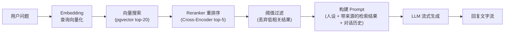
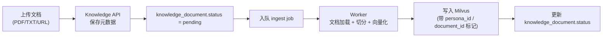
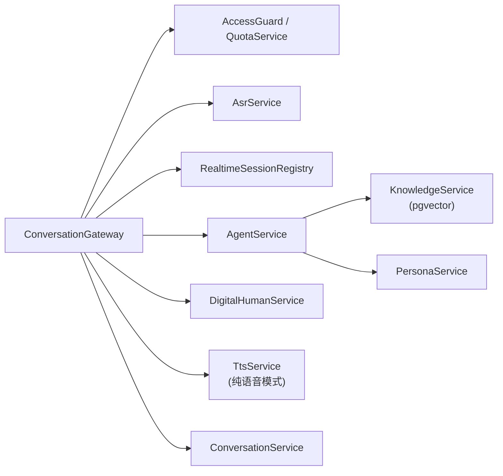

# 数字人 Agent 技术方案

> 一个以 Agent 为大脑、知识库为记忆、语音为输入、数字人为输出的实时对话系统。

---

## 1. 系统定位

这个项目把课程里已经分散实现的能力——Agent、RAG 知识库、语音识别、语音合成——组合成一个完整产品：

**用户对着一个数字人说话，数字人以特定人物的声音、表情、口型实时回答，回答内容基于注入的知识库。**

它解决的不是"模型能不能回答"的问题，而是"交互形式能不能让人觉得在和一个真人对话"的问题。

核心技术链条：

```
用户说话 → ASR 识别 → Agent 思考（RAG 检索 + 人设 Prompt）→ 文字回复
                                                              ↓
                                               数字人 SDK（TTS + 口型 + 表情）
                                                              ↓
                                                    WebRTC 推流 → 浏览器播放
```

课程里已有的模块在这个链条中的位置：

| 已有模块                                    | 在本项目中的角色                                                                                                    |
| ------------------------------------------- | ------------------------------------------------------------------------------------------------------------------- |
| `tts-stt-test` / `asr-and-tts-nest-service` | 语音识别（ASR）直接复用；TTS 在纯语音模式下复用，数字人模式下由 SDK 接管                                            |
| `milvus-test` / `rag-test`                  | 知识库检索层的**设计思路**复用（存储层从 Milvus 切换到 Supabase + pgvector）                                        |
| `langgraph-test`                            | Agent 执行模式直接复用                                                                                              |
| `hello-nest-langchain`                      | NestJS + LangChain 服务模式直接复用                                                                                 |
| `task-system-test`                          | NestJS 模块化组织模式复用（本项目不需要 EventEmitter2 解耦——事件流比 mini-manus 简单，Gateway 直接调 Service 即可） |

---

## 2. 整体架构

```mermaid
flowchart TB
    subgraph 浏览器
        MIC["麦克风"]
        CTL["控制面板"]
        TXT["文字显示区"]
        SIMLI["SimliClient\n(口型驱动 + WebRTC)"]
        VID["视频播放器"]
    end

    subgraph 后端
        GW["WebSocket Gateway\n(ASR 音频 + 控制 + PCM 推流)"]
        AS["Agent Service\n(LangGraph)"]
        KB["Knowledge Base\n(Supabase + pgvector)"]
        TTS["TTS Service\n(流式 PCM 合成)"]
        DHP["DigitalHumanProvider\n(Token 获取)"]
    end

    subgraph 云服务
        ASR["ASR 服务\n(语音识别)"]
        SIMLISVR["Simli 服务器\n(口型渲染 + WebRTC 推流)"]
    end

    MIC -->|WebSocket 二进制音频| GW
    GW -->|音频流| ASR
    ASR -->|识别文本| GW
    GW -->|用户问题| AS
    AS -->|检索| KB
    AS -->|回复文本（流式）| TTS
    TTS -->|PCM 音频帧| GW
    GW -->|WebSocket PCM binary| SIMLI
    DHP -->|simliToken| GW
    GW -->|digital-human:ready| SIMLI
    SIMLI -->|sendAudioData(pcm)| SIMLISVR
    SIMLISVR ==>|WebRTC 视频流| VID
    GW -->|文字流| TXT
    CTL -->|WebSocket 控制指令| GW
```

> **注**：后端不在 WebRTC 路径上。视频流直接从 Simli 服务器推到浏览器。后端只负责 Token 获取和 PCM 音频推流。

### 2.1 编排边界（LangGraph 与 Vercel AI SDK）

为了避免同一条对话链路出现两套编排逻辑，V1 明确如下边界：

1. 后端只保留一套编排：`LangGraph (或 LangChain LCEL)`，负责检索、Prompt、流式生成、记忆与工具调用。
2. 后端不引入 AI SDK Core 作为第二套 Agent 编排框架，避免状态与重试语义重复。
3. 前端可选接入 `@ai-sdk/vue`，仅用于文本聊天 UI 状态管理与流式渲染。
4. 语音链路不受影响：`WebSocket(binary) + ASR/TTS + WebRTC` 仍按当前方案执行。
5. 如果前端使用 `@ai-sdk/vue`，通过 transport 适配现有后端接口，不改后端核心推理流程。

---

## 3. 两种模式

这个项目支持两种交互模式，共享同一个 Agent 大脑和知识库，只是输出层不同：

### 模式 A：纯语音对话（不需要数字人）

```
用户说话 → WebSocket(binary) → ASR → 文字
文字 → Agent(RAG) → 回复文字（流式）
回复文字 → TTS(语音克隆) → WebSocket(binary) → MediaSource/SourceBuffer → 播放
同时：回复文字 → WebSocket(JSON) → 前端文字显示
```

这个模式复用 `asr-and-tts-nest-service` 的架构，升级点是：
1. TTS 使用克隆后的声音
2. Agent 接入 RAG 知识库和人设系统

### 模式 B：数字人对话（以 Simli 为例）

```
用户说话 → WebSocket(binary) → ASR → 文字
文字 → Agent(RAG) → 回复文字（流式）
回复文字 → 后端 TTS(PCM16 格式) → WebSocket binary → 前端 simliClient.sendAudioData()
                                                          ↓
                                             Simli 口型驱动 → WebRTC 视频流 → 浏览器播放
同时：回复文字 → WebSocket(JSON) → 前端文字显示
```

和模式 A 的区别：
- TTS 输出格式从 MP3 改为 PCM16（Simli 要求原始 PCM 驱动口型）
- 音频不在前端直接播放，而是喂给 Simli SDK 驱动口型
- WebRTC 连接在**前端与 Simli 服务器之间**建立，后端不参与 WebRTC 信令
- 后端发给前端的初始化消息从 `webrtc:offer` 改为 `digital-human:ready`（携带 simliToken）

> **注**：Simli 是推荐的第一个接入 Provider。其他 Provider（如 D-ID）架构类似，但驱动方式可能不同（详见第 9 节）。

---

## 4. 三层协议

这个项目同时用到三种实时通信协议，各管各的事：

```
┌─────────────────────────────────────────────────────┐
│  WebRTC                                              │
│  数字人的视频 + 音频实时推流                            │
│  特点：P2P 媒体传输，低延迟，浏览器原生支持               │
│  只在数字人模式下使用                                   │
├─────────────────────────────────────────────────────┤
│  WebSocket                                           │
│  - 上行：麦克风音频(binary) / 控制指令(JSON)            │
│  - 下行：ASR 识别结果 / Agent 回复文字 / WebRTC 信令    │
│  - 纯语音模式下也承载 TTS 音频(binary)                  │
│  特点：双向、全双工、低延迟                              │
├─────────────────────────────────────────────────────┤
│  HTTP REST                                           │
│  - 知识库管理（上传文档、查询状态）                      │
│  - 人设配置（创建/编辑角色）                            │
│  - 会话历史查询                                        │
│  特点：请求-响应、无状态                                │
└─────────────────────────────────────────────────────┘
```

### 4.1 实现选型：统一使用原生 WebSocket

V1 统一采用浏览器原生 `WebSocket` + 后端 `ws` 风格网关，不引入 Socket.IO。这样可以直接复用 `asr-and-tts-nest-service` 的设计思路，也避免同时维护两套事件语义。

这意味着文档里的所有实时控制消息最终都落成：
- 浏览器端：`ws.addEventListener('message', ...)` + `ws.send(JSON.stringify(...))`
- 后端：`client.send(JSON.stringify(...))`
- 不使用 `ws.on('event') / ws.emit(...)` 这种 Socket.IO 风格 API

### 4.2 WebSocket 消息封包

所有实时控制消息和文字流都使用统一的 JSON 封包；纯语音模式下的 TTS 音频继续走 Binary，但**每个二进制音频帧也必须带最小头部**，用于按 `turnId` / `seq` 丢弃迟到帧：

```typescript
interface WsEnvelope<T = unknown> {
  type: string;   // 如 digital-human:ready / conversation:text_chunk / tts:start
  sessionId: string;
  turnId?: string;   // 一轮用户提问 + 一轮助手回答
  seq?: number;      // 同一 turn 内的流式顺序号
  status?: 'start' | 'streaming' | 'completed' | 'interrupted' | 'failed';
  payload: T;
}
```

推荐的消息类型：

**入站（前端 → 后端）**
- `session:start`
- `conversation:text`（文字输入）
- `conversation:interrupt`
- `ping`

**出站（后端 → 前端）**
- `session:ready`
- `asr:final`
- `conversation:text_chunk`
- `conversation:done`
- `conversation:interrupted`
- `digital-human:ready`（数字人模式，携带 Provider 凭证和 speakMode）
- `digital-human:start` / `digital-human:subtitle` / `digital-human:end`
- `tts:start` / `tts:end`（纯语音模式）
- `error`

> **已移除**：`webrtc:offer` / `webrtc:answer` / `webrtc:ice-candidate`。Simli/D-ID 等主流 Provider 的 WebRTC 在前端直接与 SDK 服务器建连，后端不参与 SDP/ICE 交换。

纯语音模式下，TTS 音频继续走 Binary；数字人模式（pcm-stream）的 PCM 音频也走 Binary。Binary 负载格式统一为：

```typescript
interface TtsAudioFrameMeta {
  sessionId: string;
  turnId: string;
  seq: number;
  codec: 'audio/mpeg' | 'audio/pcm'; // 纯语音模式 mp3，数字人模式 pcm16
  isFinal?: boolean;
}
```

建议的帧格式：

```text
[4 bytes metaLength][meta JSON UTF-8][audio bytes]
```

发送规则：
1. 服务端先发 `tts:start`，其中带 `sessionId`、`turnId`、音频编码信息
2. 服务端连续发送带 `TtsAudioFrameMeta` 头部的二进制音频帧
3. 最后一帧可带 `isFinal=true`
4. 服务端最后发 `tts:end`
5. 前端解析每个音频帧头部，只消费 `meta.turnId === activeTurnId` 的音频；旧 turn 的迟到帧直接丢弃

### 为什么不全用 WebSocket

WebSocket 能做一切实时通信，但：

- 视频推流用 WebSocket 是灾难——没有拥塞控制、没有自适应码率、没有硬件编解码加速。WebRTC 专门为这件事设计，浏览器有原生优化。
- 知识库管理、人设配置这些低频操作用 REST 更合适——无状态、可缓存、调试方便。

### WebRTC 在这个项目中的角色

WebRTC 的难点不在使用，而在理解。

```mermaid
sequenceDiagram
    participant B as 浏览器
    participant S as 后端
    participant SL as Simli 服务器

    B->>S: WebSocket: session:start (mode=digital-human)
    S->>SL: REST: POST /session/e2e → simliToken
    S->>B: WebSocket: digital-human:ready { simliToken, faceId }
    B->>B: SimliClient.Initialize(simliToken)
    B->>SL: SimliClient.start() → WebRTC 握手（SDP/ICE）
    SL==>>B: WebRTC: 静默视频流（待命）

    Note over B,S: 对话开始后
    B->>S: WebSocket: 麦克风音频(binary)
    S->>S: ASR → Agent → 回复文字
    S->>S: TTS → PCM 音频
    S->>B: WebSocket: PCM binary 帧
    B->>SL: simliClient.sendAudioData(pcm)
    SL==>>B: WebRTC: 口型同步视频流
```

关键概念：
- **SDP / ICE**：WebRTC 连接协商，在**浏览器 ↔ Simli 服务器**之间完成，后端不参与
- **PCM（脉冲编码调制）**：原始音频格式，Simli 要求 PCM16（16-bit，特定采样率），用于驱动口型
- **信令**：后端只下发一次 Token，无需持续转发 SDP/ICE

Simli 把 WebRTC 细节封装在 SDK 内部。理解上面序列图足够排查接入问题。

---

## 5. Agent 大脑

### 5.1 职责

Agent 是整个系统的大脑。它接收用户问题，检索知识库，按照人设回答。

和 mini-manus 的 Agent 不同：
- mini-manus 的 Agent 是**任务型**——拆步骤、调工具、生成产物
- 这个 Agent 是**对话型**——理解问题、检索知识、生成符合人设的回答

所以这里**不需要 planner/executor/evaluator 四节点结构**，用一个简单的 RAG + 对话 Agent 就够了。

### 5.2 执行流程



这是一个典型的**两阶段检索**流程：第一阶段用 Embedding 向量搜索快速召回候选集（top-20），第二阶段用 Reranker 基于查询和文档的真实语境相关性重新打分，筛选出最终的 top-5。以适度的延迟代价换来显著更好的检索质量。

### 5.3 Prompt 结构

```
System:
  你是{角色名}。{角色简介}
  你的说话风格：{风格描述}
  你的专业领域：{领域描述}

  以下是与当前问题相关的知识（经过检索和重排序，按相关性从高到低）：
  ---
  [来源: {source_1}, 段落 {chunk_index_1}]
  {chunk_content_1}
  ---
  [来源: {source_2}, 段落 {chunk_index_2}]
  {chunk_content_2}
  ---
  （共 {n} 条，均已通过相关性阈值过滤）

  要求：
  1. 始终以{角色名}的身份回答
  2. 回答必须基于上述知识，不要编造不在知识库中的内容
  3. 如果知识库中没有相关信息，诚实说"这个我不太清楚"
  4. 语气和用词要符合角色人设
  5. 回答要口语化，适合语音朗读（避免长列表、代码块、复杂格式）
  6. 回答时自然地提及信息来源，例如"根据 React 19 的文档..."、"在官方指南里提到..."

History:
  {最近 N 轮对话}

User:
  {当前问题}
```

注意第 5 条：回答要口语化。这是语音场景和文字场景最大的区别——模型默认会输出 Markdown 列表、代码块、长句，这些东西 TTS 读出来会很奇怪。Prompt 里必须显式约束。

注意第 6 条：引用信息来源。语音场景下不能像文字场景那样插入 `[1]` 脚注，但可以用口语化的方式提及来源。这对用户信任至关重要——用户需要知道答案不是编的。前端文字区可以额外展示结构化的引用列表（来源文档名 + 段落位置），语音不读但文字可见。

### 5.4 对话记忆

短期记忆：最近 N 轮对话，从 `conversation_message` 表查询，拼进 Prompt 的 History 部分。不在内存中维护长期历史——每次用户提问时直接查 DB 取最近 N 条，进程重启不丢上下文。

N 的选择：语音对话轮次短、每轮文字少，N=10 通常够用。不需要像 mini-manus 那样做 result_summary 压缩——对话场景不会像任务执行那样产生大量工具输出。

长期记忆：知识库（Supabase + pgvector）。不按会话存储，按角色存储——同一个角色的知识库在所有会话中共享。

History 查询的一个关键约束：**默认只取 `status=completed` 的消息进入 Prompt**。被打断或失败的 assistant 半句回复可以保留在 UI 历史里，但不默认回灌给模型，否则会把不完整答案当成上下文。

这里的“无状态”只指**历史上下文不依赖进程内存**，不代表整个实时链路无状态。运行时仍然必须维护：
- 当前 `sessionId` / `turnId`
- `AbortController`
- 断句缓冲区
- 数字人 `speak()` 播报队列
- WebRTC ICE 回调与清理函数

V1 里这些状态放在进程内的 `RealtimeSessionRegistry`。如果后续做多实例部署，需要增加 sticky session，或者把这部分状态迁到外部会话存储。

### 5.5 关于 LangGraph

技术上，这个项目的 Agent 流程是线性的（检索 → 拼 Prompt → 流式生成），用 LangChain 的 LCEL（RunnableSequence）完全够了，不需要复杂的状态图和条件边。

但本项目仍选择 **LangGraph 作为 AgentService 的运行时骨架**，原因是教学连贯性——学生在 mini-manus 里刚学了 StateGraph，这里继续使用同一套模式，只是图退化成一个线性流程：`retrieve -> buildPrompt -> streamAnswer`。Prompt、Model、Parser、Embeddings 这些底层组件依然复用 LangChain。

如果是独立项目而非课程的一部分，直接用 LCEL 也完全合理。

在此基础上补充一条工程约束：

- 不在后端同时引入 “LangGraph 编排 + AI SDK Core 编排” 两套链路。
- 若使用 Vercel AI SDK，仅放在前端文本聊天层（`@ai-sdk/vue`），用于消息状态与渲染，不进入后端推理编排。
- 这样可以保持后端“单一真相来源”：会话状态、重试策略、历史记忆都由现有 Nest + LangGraph 代码维护。

### 5.6 流式输出与 TTS 衔接

Agent 的回复是流式产生的（token by token）。但 TTS 不能逐 token 喂——需要攒到一个语义完整的片段（句子）再送。

策略：**按标点断句缓冲**。

```
Agent 输出 token 流 → 缓冲区 → 遇到句号/问号/感叹号/逗号 → 刷出一段文字
                                                              ↓
                                               TTS（或数字人 SDK）→ 音频/视频
```

缓冲区逻辑：
- 遇到 `。？！；` → 立刻刷出（句子结束）
- 遇到 `，、：` → 如果缓冲区超过 15 字，刷出（防止长从句卡住）
- 缓冲区超过 50 字但没遇到标点 → 强制刷出（兜底）
- Agent 输出结束 → 刷出剩余内容

这个断句缓冲是语音对话体验的关键。太小会让 TTS 频繁启停、语音不连贯；太大会让用户等太久才听到声音。

但这里有一个前提：**输出层必须支持增量播报**。纯语音模式的流式 TTS 没问题；数字人模式则必须先验证 SDK 是否支持：
- 连续多次 `speak()` 按句输入，而不是只能整段输入
- 句段播报完成回调，便于后端继续 drain 队列
- `turnId` 级别的打断和队列清空

如果供应商只支持“整段文本一次播报”，那么数字人模式就不能直接套用这套按句缓冲策略。此时 V1 要么降级为“整段回答生成完成后再播报”，要么改成供应商提供的增量接口，不要在方案里默认这些能力一定存在。

在“LLM 输出 → 断句缓冲”之间，建议再加一个**朗读清洗器**，把偶发的 Markdown 和特殊符号清掉，再交给 TTS 或数字人 SDK：

```typescript
function normalizeForSpeech(text: string): string {
  return text
    .replace(/```[\s\S]*?```/g, ' ')
    .replace(/`([^`]+)`/g, '$1')
    .replace(/\*\*([^*]+)\*\*/g, '$1')
    .replace(/\*([^*]+)\*/g, '$1')
    .replace(/^\s*\d+\.\s+/gm, '')
    .replace(/\[([^\]]+)\]\([^)]+\)/g, '$1')
    .replace(/\s+/g, ' ')
    .trim();
}
```

这个清洗器不负责“美化文案”，只做两件事：
- 去掉会让 TTS 念出“星号、反引号、数字序号”的格式符号
- 保留原意，不做重写

### 5.7 首响应策略

语音系统除了总时延，还要关注 **TTFT（首个可感知响应时间）**。如果用户说完后 1-2 秒没有任何反馈，即使后面的答案正确，也会觉得系统“卡住了”。

建议在 `thinking` 阶段加入一个可选的**填充短句策略**：

1. 用户松开发送音频后，进入 `thinking`
2. 如果 `thinking` 超过 800ms，且还没有任何 `conversation:text_chunk`
3. 后端发一个极短的过渡句，例如“我看一下。”、“稍等，我想一下。”
4. 过渡句走当前 `turnId`，但标记 `kind='filler'`
5. filler 不写入 `conversation_message`，也不回灌到 Prompt 历史
6. 正式回答一旦开始，如果 filler 还没播完，可以让它自然播完；如果供应商支持低延迟打断，也可以直接切到正式回答

这个策略只在等待时间明显偏长时触发，不要每轮都说，否则会显得机械。

但这里有一个前提：**输出层必须支持增量播报**。纯语音模式的流式 TTS 没问题；数字人模式则必须先验证 SDK 是否支持：
- 连续多次 `speak()` 按句输入，而不是只能整段输入
- 句段播报完成回调，便于后端继续 drain 队列
- `turnId` 级别的打断和队列清空

如果供应商只支持“整段文本一次播报”，那么数字人模式就不能直接套用这套按句缓冲策略。此时 V1 要么降级为“整段回答生成完成后再播报”，要么改成供应商提供的增量接口，不要在方案里默认这些能力一定存在。

在“LLM 输出 → 断句缓冲”之间，建议再加一个**朗读清洗器**，把偶发的 Markdown 和特殊符号清掉，再交给 TTS 或数字人 SDK：

```typescript
function normalizeForSpeech(text: string): string {
  return text
    .replace(/```[\s\S]*?```/g, ' ')
    .replace(/`([^`]+)`/g, '$1')
    .replace(/\*\*([^*]+)\*\*/g, '$1')
    .replace(/\*([^*]+)\*/g, '$1')
    .replace(/^\s*\d+\.\s+/gm, '')
    .replace(/\[([^\]]+)\]\([^)]+\)/g, '$1')
    .replace(/\s+/g, ' ')
    .trim();
}
```

这个清洗器不负责“美化文案”，只做两件事：
- 去掉会让 TTS 念出“星号、反引号、数字序号”的格式符号
- 保留原意，不做重写

### 5.7 首响应策略

语音系统除了总时延，还要关注 **TTFT（首个可感知响应时间）**。如果用户说完后 1-2 秒没有任何反馈，即使后面的答案正确，也会觉得系统“卡住了”。

建议在 `thinking` 阶段加入一个可选的**填充短句策略**：

1. 用户松开发送音频后，进入 `thinking`
2. 如果 `thinking` 超过 800ms，且还没有任何 `conversation:text_chunk`
3. 后端发一个极短的过渡句，例如“我看一下。”、“稍等，我想一下。”
4. 过渡句走当前 `turnId`，但标记 `kind='filler'`
5. filler 不写入 `conversation_message`，也不回灌到 Prompt 历史
6. 正式回答一旦开始，如果 filler 还没播完，可以让它自然播完；如果供应商支持低延迟打断，也可以直接切到正式回答

这个策略只在等待时间明显偏长时触发，不要每轮都说，否则会显得机械。

---

## 6. 知识库与 RAG 检索

RAG（Retrieval-Augmented Generation）是这个系统的知识根基。相比让 LLM 凭训练数据回答，RAG 在运行时将检索到的事实注入 Prompt，把模型的响应锚定在真实来源上。这显著减少了幻觉，但并不能完全消除——检索质量直接决定回答质量。

本节是整个系统中教学密度最高的部分，覆盖 RAG 管线的核心环节：Embeddings、Chunking、向量数据库、元数据过滤、重排序（Reranking）、检索质量问题、幻觉控制、引用溯源。

### 6.1 知识库架构

所有数据统一存储在 Supabase（PostgreSQL + pgvector），不再分 MySQL 和 Milvus 两套存储。知识库表结构按角色组织：

```sql
-- Supabase / PostgreSQL 常用扩展
CREATE EXTENSION IF NOT EXISTS pgcrypto;
-- 启用 pgvector 扩展
CREATE EXTENSION IF NOT EXISTS vector;

CREATE TABLE persona_knowledge (
  id          UUID PRIMARY KEY DEFAULT gen_random_uuid(),
  persona_id  UUID NOT NULL REFERENCES persona(id) ON DELETE CASCADE,        -- 角色 ID，检索时的主过滤条件
  document_id UUID NOT NULL REFERENCES knowledge_document(id) ON DELETE CASCADE, -- 用于按文档删除/重建
  chunk_index INT NOT NULL,                                 -- 在原文档中的顺序，用于引用溯源
  content     TEXT NOT NULL,                                -- 知识片段原文
  source      TEXT NOT NULL,                                -- 来源（文档名、URL），用于引用展示
  category    TEXT,                                         -- 分类（背景、专业知识、FAQ 等），用于元数据过滤
  embedding   VECTOR(1024),                                 -- 向量（维度需与 Embedding 模型匹配）
  created_at  TIMESTAMPTZ DEFAULT now(),

  -- 保证同一文档重建/重试时幂等，避免重复 chunk
  UNIQUE (document_id, chunk_index)
);

-- 为向量搜索创建索引（V1 数据量小可以先不建，暴力搜索即可）
CREATE INDEX ON persona_knowledge
  USING hnsw (embedding vector_cosine_ops)
  WITH (m = 16, ef_construction = 64);

-- 为元数据过滤创建索引
CREATE INDEX ON persona_knowledge (persona_id);
CREATE INDEX ON persona_knowledge (persona_id, category);
```

`document_id` 和 `chunk_index` 的作用：删除某个文档时，一条 `DELETE FROM persona_knowledge WHERE document_id = $1` 精确删除对应的所有向量，不影响其他文档。而且因为在同一个数据库里，可以和 `knowledge_document` 表的状态更新放在同一个事务中——不会出现"结构化数据删了但向量没删"的不一致问题。`chunk_index` 还用于引用溯源——告诉用户答案来自原文档的哪个位置。

`UNIQUE(document_id, chunk_index)` 的作用：保证同一个文档在“重试入库 / 任务补偿 / 重建索引”时不会写出重复 chunk。实现时应优先使用 `INSERT ... ON CONFLICT (document_id, chunk_index) DO UPDATE` 或先删后插的幂等策略。

### 6.2 Embeddings（向量化）

Embedding 是 RAG 的第一步：把文本转成高维向量，使得语义相近的文本在向量空间中距离更近。查询时把用户问题也转成向量，在向量空间中找最近邻。

**模型选择：**

| 模型                              | 维度           | 中文效果 | 延迟 | 适用场景             |
| --------------------------------- | -------------- | -------- | ---- | -------------------- |
| `text-embedding-3-small` (OpenAI) | 1536           | 中等     | 低   | 英文为主、成本敏感   |
| `text-embedding-3-large` (OpenAI) | 3072（可降维） | 较好     | 中   | 通用场景             |
| `bge-m3` (BAAI)                   | 1024           | 优秀     | 中   | 中文为主、可本地部署 |
| `bge-large-zh-v1.5` (BAAI)        | 1024           | 优秀     | 中   | 纯中文场景           |

V1 建议用 `text-embedding-3-small`（1536 维，和课程 `rag-test` 保持一致，降低切换成本）。教学时可以对比不同模型在中文检索上的效果差异——同一个查询，不同 Embedding 模型召回的结果可能完全不同，这是理解"语义漂移"问题的最佳入口。

**关键约束：`persona_knowledge` 表中 `VECTOR(1024)` 的维度必须和选用的 Embedding 模型匹配。** 如果切换到 `bge-m3`（1024 维），需要改为 `VECTOR(1024)` 并全量重建索引。pgvector 不允许不同维度的向量混存。

### 6.3 Chunking（文本切分）

Chunking 是将长文档拆分成适合检索和 Prompt 注入的短片段。切分质量直接影响检索质量——切得不好，相关信息可能被拆到两个 chunk 中，两个都检索不到。

**入库流程：**



这里必须明确成**异步作业**，不要在上传 REST 请求里同步完成切分和向量化：
- 上传接口只负责保存原文件、插入 `knowledge_document` 记录、返回 `documentId`
- 后台 worker 异步执行加载、切分、向量化、写入 Milvus
- 前端通过“查询状态”接口查看 `pending / processing / completed / failed`
- 失败时把错误信息落到 `knowledge_document.error_message`，便于 UI 展示和重试

切分策略：
- chunk_size: 500 字符（语音场景下检索结果要短，不能一次塞一大段）
- chunk_overlap: 100 字符
- 语言敏感切分：中文按句号/段落优先切分

### 6.3 人设配置

```typescript
interface Persona {
  id: string;
  name: string;                // "李老师"
  avatar_url: string;          // 数字人形象对应的 ID / URL
  voice_id: string;            // 克隆语音的 ID
  description: string;         // 角色简介
  speaking_style: string;      // "说话温和，喜欢用比喻，偶尔讲冷笑话"
  expertise: string[];         // ["机器学习", "Python", "数据分析"]
  system_prompt_extra: string; // 额外的系统提示（可选）
}
```

人设不存向量列，存在 `persona` 表的普通字段里。它是 Prompt 的一部分，不是检索的对象。

---

## 7. 语音交互层

### 7.1 语音输入（ASR）

直接复用 `asr-and-tts-nest-service` 的模式：

```
浏览器麦克风 → MediaRecorder → WebSocket(binary) → 后端 → 腾讯云 ASR → 识别结果
```

两种 ASR 模式：
- **一句话识别**（V1）：用户说完一句话后发送完整音频，批量识别。延迟高但简单。
- **实时流式识别**（V2）：音频边录边发，ASR 边听边出中间结果。延迟低但需要处理 VAD（语音活动检测）和中间结果/最终结果的区分。

V1 先用一句话识别，交互形式是"按住说话，松开发送"。这和大多数语音助手的交互一致，用户理解成本低。

这里要把按钮语义钉死：**松开按钮只表示“结束当前录音并发送识别”**；如果数字人正在思考或说话，用户再次按下按钮才表示“打断并开始新一轮录音”。不要把“松开”同时定义成“发送”和“打断”。

### 7.2 语音输出（TTS）—— 纯语音模式

在不接数字人 SDK 的情况下，TTS 复用 `asr-and-tts-nest-service` 的流式 TTS：

```
Agent 回复文字（按句缓冲）→ 腾讯云流式 TTS(WSv2) → 二进制音频帧 → WebSocket → 浏览器
```

浏览器端播放：

```javascript
// MediaSource + SourceBuffer 实现流式音频播放
const mediaSource = new MediaSource();
audio.src = URL.createObjectURL(mediaSource);

const decodeAudioFrame = async (blob) => {
  const buffer = await blob.arrayBuffer();
  const view = new DataView(buffer);
  const metaLength = view.getUint32(0);
  const metaBytes = new Uint8Array(buffer, 4, metaLength);
  const meta = JSON.parse(new TextDecoder().decode(metaBytes));
  const audioBytes = new Uint8Array(buffer, 4 + metaLength);

  return { meta, audioBytes };
};

mediaSource.addEventListener('sourceopen', () => {
  const sourceBuffer = mediaSource.addSourceBuffer('audio/mpeg');
  const appendQueue = [];
  let activeTurnId = null;

  const flushQueue = () => {
    if (sourceBuffer.updating || appendQueue.length === 0) return;
    sourceBuffer.appendBuffer(appendQueue.shift());
  };

  sourceBuffer.addEventListener('updateend', flushQueue);

  ws.addEventListener('message', async (event) => {
    if (typeof event.data === 'string') {
      const msg = JSON.parse(event.data);

      if (msg.type === 'tts:start') activeTurnId = msg.turnId;
      if (msg.type === 'tts:end' && msg.turnId === activeTurnId) activeTurnId = null;
      return;
    }

    // 二进制帧也带 turnId，旧 turn 的迟到帧直接丢弃
    if (activeTurnId && event.data instanceof Blob) {
      const { meta, audioBytes } = await decodeAudioFrame(event.data);
      if (meta.turnId !== activeTurnId) return;

      appendQueue.push(audioBytes);
      flushQueue();
    }
  });
});
```

MediaSource 的优势：音频边收边播，不需要等全部生成完。用户感知到的延迟 = ASR 时间 + Agent 首 token 时间 + TTS 首帧时间，通常 1-3 秒。

### 7.3 语音输出 —— 数字人模式

数字人模式下，**不需要单独调 TTS**。数字人 SDK 内部集成了：
1. 文字 → 语音（TTS，可使用克隆声音）
2. 语音 → 口型驱动
3. 口型 + 表情 + 动作 → 视频帧
4. 视频帧 → WebRTC 推流

后端只需要把 Agent 的回复文字（按句缓冲后）送给数字人 SDK，剩下的全由 SDK 处理。

---

## 8. 语音克隆

### 8.1 定位

语音克隆的目的是让数字人用目标人物的声音说话，而不是用默认的 TTS 声音。

它是一个**前置的一次性操作**，不是实时流程的一部分：

```
目标人物语音样本（3-10 分钟） → 语音克隆服务 → 生成 voice_id → 存入 Persona 配置
                                                                  ↓
                                                运行时 TTS / 数字人 SDK 使用该 voice_id
```

### 8.2 方案选择

| 方案                   | 特点                           | 适用场景           |
| ---------------------- | ------------------------------ | ------------------ |
| 云厂商语音克隆 API     | 开箱即用，质量稳定，按调用计费 | 生产环境、课程演示 |
| CosyVoice / GPT-SoVITS | 开源，可本地部署，需要 GPU     | 教学、定制化需求   |

V1 建议用云厂商 API（和 ASR/TTS 同一家，降低集成成本）。教学时可以额外演示开源方案的部署和效果对比。

### 8.3 语音样本要求

- 时长：3-10 分钟的清晰语音
- 格式：WAV/MP3，16kHz 以上采样率
- 内容：正常语速、无背景噪音、覆盖多种语气（陈述、疑问、感叹）
- 注意：样本质量直接决定克隆效果。噪音多、语速不均匀的样本会导致克隆声音不自然

---

## 9. 数字人层

### 9.1 数字人 SDK 做了什么

不同 Provider 的定位不同：

**Simli（推荐，pcm-stream 模式）**

```
输入：PCM16 音频流（由后端 TTS 生成后通过 WebSocket 传给前端）
输出：WebRTC 视频流（口型与音频实时同步的数字人视频）
```

Simli 只做两件事：
1. **口型驱动（Lip Sync）**：PCM 音频 → 嘴型关键帧序列
2. **实时渲染 + 推流**：数字人形象 + 口型 → 视频帧 → WebRTC

TTS 和声音由**后端负责**，Simli 只管把音频"贴"到数字人脸上。这是 Simli 的核心优势——它不绑定 TTS，你可以用任意声音（包括克隆声音）。

**D-ID（text-direct 模式）**

```
输入：文字 + voice_id（或音频文件）
输出：WebRTC 视频流（D-ID 内置 TTS + 口型渲染）
```

D-ID 内部集成 TTS，直接接受文字。好处是集成简单；代价是使用 D-ID 自己的 TTS 声音，**语音克隆能力需要额外对接 D-ID 的克隆 API，不直接复用后端已有的克隆 voice_id**。

### 9.2 后端集成方式：Provider 接口设计

不同 Provider 的初始化方式和驱动方式不同，因此后端采用 **Strategy Pattern**，定义统一接口，具体 SDK 封装为可替换的 Provider 实现类。

```typescript
// digital-human.types.ts

/**
 * speakMode 决定 pipeline 走哪条路：
 * - 'pcm-stream'：后端 TTS → PCM → WebSocket → 前端喂给 SDK（Simli 使用此模式）
 * - 'text-direct'：后端 Agent 文字 → speak(text) → SDK 内置 TTS（D-ID 文字模式）
 */
export type DigitalHumanSpeakMode = 'pcm-stream' | 'text-direct';

export interface DigitalHumanSessionInfo {
  providerSessionId: string;
  speakMode: DigitalHumanSpeakMode;
  /**
   * Provider 专属凭证，由后端透传给前端（前端用来初始化 SDK）。
   * Simli：{ simliToken: string }
   * D-ID： { streamId: string, sessionToken: string }
   */
  credentials: Record<string, unknown>;
}

export interface DigitalHumanProvider {
  readonly name: string;

  /** 创建会话，返回前端初始化所需的凭证 */
  createSession(personaId: string, voiceId?: string): Promise<DigitalHumanSessionInfo>;

  /** 打断当前播报 */
  interrupt(providerSessionId: string): Promise<void>;

  /** 关闭会话，释放 SDK 资源 */
  closeSession(providerSessionId: string): Promise<void>;

  /**
   * 仅 text-direct 模式实现：发送文字驱动 SDK 内置 TTS + 口型。
   * pcm-stream 模式无需实现（音频由 TtsPipeline 直接推送到前端）。
   */
  speak?(providerSessionId: string, turnId: string, text: string): Promise<void>;
}
```

**Pipeline 根据 speakMode 路由**：

```
pcm-stream（Simli）：
  Agent → 文字 → TtsPipelineService(codec=pcm) → PCM binary 帧 → WebSocket → 前端
  前端收到 PCM → simliClient.sendAudioData() → Simli 驱动口型

text-direct（D-ID 文字模式）：
  Agent → 文字 → SpeakPipelineService → provider.speak(text) → D-ID 内置 TTS + 口型
```

**各 Provider 影响对比**：

| Provider | speakMode | 语音克隆保留 | 后端新增依赖 |
|---|---|---|---|
| Mock（当前） | 任意 | ✅ | 无 |
| Simli | `pcm-stream` | ✅（后端 TTS 完整保留） | `simli-client` SDK，REST 获取 token |
| D-ID 文字模式 | `text-direct` | ❌（D-ID 自己的 TTS） | D-ID streaming SDK |
| D-ID 音频模式 | `pcm-stream` | ✅ | D-ID streaming SDK（需确认 API 支持） |

**`SessionHandler` 发送 `digital-human:ready`**：

`createSession()` 返回后，后端向前端发送凭证，前端负责初始化 SDK：

```typescript
// session.handler.ts（数字人模式初始化）
const info = await this.digitalHumanProvider.createSession(personaId, voiceId);

this.sendJson(client, {
  type: 'digital-human:ready',
  sessionId,
  payload: {
    provider: info.providerSessionId,   // provider 名称，如 'simli'
    speakMode: info.speakMode,
    credentials: info.credentials,      // 透传给前端，provider-specific
  },
});
```

整个后端不再参与 SDP/ICE 交换。WebRTC 连接建立是**前端与 Provider 服务器之间**的事。

### 9.3 信令流程（Simli 为例）

Simli 的信令比传统 SDP/ICE 中继简单得多。后端只做一件事：**请求 Token，下发给前端**。

```
后端                                      前端（浏览器）
  │                                           │
  │ 1. POST /session/e2e → simliToken         │
  │ ─── digital-human:ready (credentials) ──►│
  │                                           │ 2. SimliClient.Initialize({ simliToken })
  │                                           │    SimliClient.start()
  │                                           │◄────── Simli WebRTC（静默待命）
  │                                           │
  │ 3. Agent → TTS(PCM) → binary frames ─────►│
  │                                           │ 4. simliClient.sendAudioData(pcm)
  │                                           │──────── Simli 驱动口型
  │                                           │◄────── WebRTC 视频（口型同步）
```

**后端完全不在 WebRTC 路径上**。后端的职责只有：
1. 调用 Simli REST API 获取 `e2eSessionToken`
2. 把 token 通过 `digital-human:ready` 下发给前端
3. 做 TTS → PCM，通过 WebSocket 把 PCM 音频帧推给前端

ICE 候选交换、SDP Offer/Answer 全部在**浏览器 ↔ Simli 服务器**之间完成，不经过后端。

### 9.4 打断机制

语音对话的一个重要体验：用户随时可以打断数字人说话。

打断必须级联中止整条链路，不能只停末端：

```
前端发送 { type: 'conversation:interrupt', sessionId, turnId }
       ↓
1. `RealtimeSessionRegistry` 标记当前 `turnId` 为 interrupted
2. `AbortController.abort()` → 取消 LLM 流式生成（停止扣 token）
3. 清空断句缓冲区（丢弃已缓冲但未发送的文字）
4. 清空 `speak()` 播报队列（丢弃已排队但未播报的句子）
5. `digitalHumanService.interrupt(sessionId, turnId)`（停止当前播报）
6. 前端丢弃 `turnId !== activeTurnId` 的尚未渲染文字和音频
```

如果只做“停止数字人播报”而不做 `AbortController.abort()`，会出现：用户已经打断了，LLM 还在继续生成、继续扣 token，生成的文字还会流进缓冲区、流进播报队列，数字人会在短暂停顿后又开始说旧回答。

实现方式：Agent 调用链启动时创建 `AbortController`，传入 LangChain 的 `signal` 参数。打断时调用 `controller.abort()`，整条链路同步终止。

### 9.5 会话生命周期与清理

以下场景必须显式清理旧会话，而不是只创建新会话：
1. 切换角色
2. 页面刷新 / 关闭
3. WebRTC 建连失败后重试
4. WebSocket 断线重连
5. 浏览器异常退出、锁屏、网络抖动导致的死连接

统一清理动作：
- `AbortController.abort()`
- `digitalHumanProvider.closeSession(providerSessionId)`
- 前端调用 `simliClient.destroy()` 销毁 WebRTC 连接
- 清空本地字幕缓冲和音频队列
- 从 `RealtimeSessionRegistry` 删除该 `sessionId` 的运行时状态

这一步不仅是资源释放问题，也影响计费和用户体验。旧会话不清理，后面很容易出现串流、串字幕和重复扣费。

除了显式关闭，还要有**超时兜底**。建议 Gateway 维护心跳和空闲超时：

- WebSocket 每 15 秒发一次 `ping`，客户端回 `pong`
- 连续 2 个心跳周期未响应，判定为死连接，后台自动执行 `closeSession(sessionId)`
- `thinking` 或 `speaking` 状态超过上限时也要兜底清理，避免第三方 SDK 卡住后持续占资源
- 心跳超时触发的清理要记录日志，便于排查“为什么用户一锁屏就断会话”

V1 虽然是单实例，但这个兜底不能省。很多真实问题不是“用户点了关闭”，而是浏览器根本来不及发关闭事件。

---

## 10. 前端设计

### 10.1 页面布局

```
┌─────────────────────────────────────────────────────┐
│                                                      │
│              ┌──────────────────┐                    │
│              │                  │                    │
│              │   数字人视频区     │                    │
│              │   (WebRTC video) │                    │
│              │                  │                    │
│              └──────────────────┘                    │
│                                                      │
│  ┌────────────────────────────────────────────────┐  │
│  │  对话文字区（可折叠）                             │  │
│  │  用户: React Compiler 是什么？                    │  │
│  │  李老师: React Compiler 是 React 19 引入的...    │  │
│  └────────────────────────────────────────────────┘  │
│                                                      │
│         🎤 [按住说话]    ⚙️ [设置]    ⏹️ [结束]       │
│                                                      │
│  侧边栏（可折叠）：                                    │
│  ├ 角色选择                                           │
│  ├ 知识库管理                                         │
│  └ 会话历史                                           │
└─────────────────────────────────────────────────────┘
```

### 10.2 核心交互

前端需要显式维护 5 个状态，避免“发送”和“打断”混在一个按钮动作里：

| 状态        | 含义                               | 麦克风按钮行为                                        | 下一状态    |
| ----------- | ---------------------------------- | ----------------------------------------------------- | ----------- |
| `idle`      | 空闲，未录音、未播报               | 按下开始录音                                          | `recording` |
| `recording` | 正在采集用户语音                   | 松开结束录音并上传音频                                | `thinking`  |
| `thinking`  | ASR / Agent 处理中，数字人尚未开口 | 再次按下：先发 `conversation:interrupt`，再开始新录音 | `recording` |
| `speaking`  | 数字人正在播报                     | 再次按下：先发 `conversation:interrupt`，再开始新录音 | `recording` |
| `closed`    | 会话已结束                         | 禁用麦克风按钮                                        | -           |

状态切换信号也要钉死，不要靠“看起来差不多”来猜：
- 纯语音模式：收到 `tts:start` 才进入 `speaking`，收到 `tts:end` 才离开 `speaking`
- 数字人模式：收到 `avatar:speaking_start` 才进入 `speaking`，收到 `avatar:speaking_end` 才离开 `speaking`
- `conversation:done` 只表示 LLM 文本生成结束，不表示音频/视频已经播完

核心交互：

| 操作     | 前端                                                                            | 后端                                       |
| -------- | ------------------------------------------------------------------------------- | ------------------------------------------ |
| 选择角色 | 关闭旧会话 → 初始化新 Persona 会话 → 建立 WebRTC                                | `closeSession(old)` → `createSession(new)` |
| 说话     | `idle` 按下开始录音，`recording` 松开发送音频                                   | ASR → Agent → 创建 `turnId` → speak 队列   |
| 听回答   | WebRTC video 播放 + 当前 `turnId` 的文字同步显示                                | Agent 流式回复 → 按句缓冲 → 数字人 SDK     |
| 打断插话 | `thinking/speaking` 状态再次按下，发送 `conversation:interrupt`，立即开始新录音 | 中断当前 `turnId`，清空缓冲与播报队列      |
| 上传知识 | 文件上传 → REST API                                                             | 文档加载 → 切分 → 向量化 → 写入 Milvus     |
| 查看历史 | 展开侧边栏 → 加载历史对话                                                       | 查询会话记录                               |

打断后立即重录时，前端必须有**防回声流程**，否则很容易把上一轮数字人的尾音重新录进 ASR：

1. 本地先把远端媒体静音：`video.muted = true`，或通过 `GainNode` 把远端音量拉到 0
2. 立即发送 `conversation:interrupt`
3. 清空本地待播字幕 / 音频队列
4. 用带回声抑制的采集参数开始录音
5. 录音期间保持远端静音，收到下一轮 `tts:start` 或 `avatar:speaking_start` 时再恢复播放

浏览器采集约束建议固定为：

```javascript
const stream = await navigator.mediaDevices.getUserMedia({
  audio: {
    channelCount: 1,
    sampleRate: 16000,
    echoCancellation: true,
    noiseSuppression: true,
    autoGainControl: true,
  },
});
```

如果数字人 SDK 最终只能走“整段文本播报”的降级路径，前端需要同步调整反馈：
- `thinking` 状态给出明显的加载动画或提示文案，不要让视频区只是静止不动
- 可以显示“正在整理回答”这类短提示，但不要把它写进对话历史
- 只有在首段音频真正开始后才切到 `speaking`

### 10.3 数字人前端接入（Provider Adapter 模式）

前端收到 `digital-human:ready` 后，根据 `payload.speakMode` 和 `payload.credentials` 选择对应的 Adapter 初始化。

**Simli Adapter（pcm-stream 模式）**

```javascript
// useDigitalHuman.js
import SimliClient from '@simliai/simli-client';

async function initSimli(credentials, videoEl, audioEl) {
  const simliClient = new SimliClient();
  simliClient.Initialize({
    apiKey: credentials.simliToken,
    faceID: credentials.faceId,
    handleSilence: true,
    videoRef: videoEl,
    audioRef: audioEl,
  });
  await simliClient.start();
  return simliClient;
}

// 收到 digital-human:ready 时
ws.addEventListener('message', async (event) => {
  const msg = JSON.parse(event.data);

  if (msg.type === 'digital-human:ready') {
    if (msg.payload.speakMode === 'pcm-stream') {
      simliClient = await initSimli(msg.payload.credentials, videoEl, audioEl);
    }
    // D-ID 等其他 Provider 在此处扩展
  }

  // 收到 PCM binary 帧时，喂给 Simli
  if (msg.type === 'tts:start') activeTurnId = msg.turnId;
});

ws.addEventListener('message', async (event) => {
  if (!(event.data instanceof ArrayBuffer)) return;
  // 解析 4 字节头部，拿到 meta.turnId 和 PCM 数据
  const view = new DataView(event.data);
  const metaLen = view.getUint32(0);
  const meta = JSON.parse(new TextDecoder().decode(event.data.slice(4, 4 + metaLen)));
  if (meta.turnId !== activeTurnId) return;

  const pcmData = new Uint8Array(event.data, 4 + metaLen);
  simliClient?.sendAudioData(pcmData);
});
```

**前端 Adapter 接口（便于扩展）**

```typescript
interface DigitalHumanAdapter {
  init(credentials: Record<string, unknown>, videoEl: HTMLVideoElement): Promise<void>;
  sendPcm(pcmData: Uint8Array): void;       // pcm-stream 模式
  sendText(text: string): void;             // text-direct 模式（预留）
  interrupt(): void;
  destroy(): void;
}
```

WebRTC 连接建立（ICE/SDP）由 Simli SDK 在 `simliClient.start()` 内部完成，前端无需手动处理 Offer/Answer。

### 10.4 前端接入 `@ai-sdk/vue` 最小改造清单

目标是只替换“文本聊天 UI 层”，不动后端推理编排与语音链路。

边界约束：

1. 后端 Agent 仍是 `Nest + LangGraph`，不改成 AI SDK Core。
2. 语音链路保持原样：`WebSocket(binary) + ASR/TTS + WebRTC`。
3. `@ai-sdk/vue` 只管理文本消息状态、流式渲染、停止生成等前端交互。

最小改造步骤：

1. 前端安装依赖（`frontend`）：
   - `pnpm add ai @ai-sdk/vue`
2. 增加文本聊天适配层 `useTextChatAdapter`：
   - 输出统一的 `messages / status / send / stop / error`
   - 对外屏蔽“当前是旧实现还是 AI SDK 实现”
3. 文本区接入 `useChat`：
   - `MessageList` 读 `messages`
   - `ChatComposer` 调 `sendMessage`
   - “停止生成”按钮调用 `stop`
4. 增加后端文本接口适配（推荐）：
   - 新增 `POST /api/chat`（仅文本）
   - 入参：`personaId`、`conversationId`、`messages`
   - 出参：按 AI SDK UIMessage 流协议返回
   - 该接口内部调用现有 `AgentService`，不新增第二套编排
5. 增加特性开关：
   - `VITE_TEXT_CHAT_MODE=legacy|ai-sdk`
   - 默认 `legacy`，联调稳定后切 `ai-sdk`

推荐的 `useChat` 初始化方式（示意）：

```typescript
import { useChat } from '@ai-sdk/vue';
import { DefaultChatTransport } from 'ai';

const { messages, status, sendMessage, stop, error } = useChat({
  transport: new DefaultChatTransport({
    api: '/api/chat',
    body: () => ({
      personaId: currentPersonaId.value,
      conversationId: currentConversationId.value,
    }),
  }),
});
```

接口约定（最小）：

| 项目 | 约定 |
| --- | --- |
| 请求方法 | `POST /api/chat` |
| 请求体 | `messages`（最近上下文）、`personaId`、`conversationId` |
| 响应 | `text/event-stream` 或 AI SDK UIMessage stream |
| 错误码 | `400` 参数错误，`401` 未鉴权，`429` 频率限制，`503` 上游暂不可用 |

回退策略：

1. `ai-sdk` 模式下连续 2 次请求失败，自动退回 `legacy` 文本实现。
2. 语音相关能力（按住说话、打断、TTS/数字人播报）不依赖该开关，始终可用。
3. 回退事件写日志，便于定位是传输协议问题还是上游模型问题。

验收清单（文本层）：

1. 发送文本可流式显示，首包延迟可观测。
2. `stop` 能中断当前文本生成。
3. 刷新页面后可恢复最近会话文本历史。
4. 同一角色切换后，`personaId` 传参正确。
5. `429/503` 错误有明确提示，不影响语音按钮可用性。

---

## 11. 后端模块划分

| 模块                      | 职责                                                                                      | 核心导出                   |
| ------------------------- | ----------------------------------------------------------------------------------------- | -------------------------- |
| **AccessModule**          | 接入控制：JWT 鉴权、限流、并发会话数限制、时长配额校验                                    | AccessGuard / QuotaService |
| **GatewayModule**         | WebSocket Gateway：ASR 音频接收、WebRTC 信令中继、控制指令、文字推送                      | ConversationGateway        |
| **RealtimeSessionModule** | 实时会话状态：`sessionId` / `turnId`、`AbortController`、断句缓冲、播报队列、ICE 清理函数 | RealtimeSessionRegistry    |
| **AgentModule**           | LangGraph 线性对话图：检索 + 人设 Prompt + 流式生成                                       | AgentService               |
| **KnowledgeModule**       | 知识库管理：文档上传、切分、向量化、Milvus CRUD                                           | KnowledgeService           |
| **PersonaModule**         | 人设管理：角色 CRUD、语音/形象配置                                                        | PersonaService             |
| **AsrModule**             | ASR 封装：音频流 → 文字                                                                   | AsrService                 |
| **TtsModule**             | 流式 TTS 封装（纯语音模式用）                                                             | TtsService                 |
| **DigitalHumanModule**    | 数字人 Provider 封装（Strategy Pattern）：Token 获取、interrupt、closeSession；speakMode 决定 pipeline 路由 | DigitalHumanProvider       |
| **ConversationModule**    | 会话记录：对话历史持久化                                                                  | ConversationService        |

调用关系：



和 mini-manus 后端的区别：
- 没有 TaskModule（不是任务系统）
- 没有 EventEmitter2 解耦层（数字人项目的事件流更简单，Gateway 直接调 Service 即可）
- 多了 ASR/TTS/DigitalHuman 三个和语音相关的模块

补充说明：`ConversationGateway` 不应该自己偷偷维护复杂状态；这些状态统一收口到 `RealtimeSessionRegistry`，这样打断、重连、角色切换时才有单一真相来源。

### 11.1 接入控制与成本保护

数字人会话和 WebRTC 推流都属于高成本资源，V1 就应该把接入控制做进去，而不是等到费用异常再补。

建议规则：
- REST API 和 WebSocket 握手统一走 JWT 鉴权
- `createSession(personaId)` 前先校验用户身份、角色访问权限、当前活跃会话数
- 单用户同一时刻最多 1 个活跃数字人会话
- 对“创建会话”“语音克隆”“文档上传”分别做限流
- 对每个用户记录日级或月级通话分钟数，超额直接拒绝创建新会话

最小拦截点：
1. WebSocket 建连时校验 token，不通过直接拒绝升级
2. `session:start` 时做并发会话数和配额校验
3. `conversation:start` 前再做一次剩余额度校验，避免长会话持续透支

如果课程场景暂时不做完整计费系统，V1 也至少要做到“鉴权 + 限流 + 单用户单会话”这三件事。

---

## 12. 数据模型

这个项目的数据模型比 mini-manus 简单得多——不需要 revision/run/plan/step 的分层。

```
persona                          // 角色配置
├── id: UUID, PK
├── name: string
├── description: text
├── speaking_style: text
├── expertise: JSON (string[])
├── voice_id: string             // 语音克隆 ID
├── avatar_id: string            // 数字人形象 ID
├── system_prompt_extra: text?
├── created_at: datetime
└── updated_at: datetime

conversation                     // 会话
├── id: UUID, PK
├── persona_id: UUID, FK
├── created_at: datetime
└── updated_at: datetime

conversation_message             // 对话消息
├── id: UUID, PK
├── conversation_id: UUID, FK
├── turn_id: UUID                // 同一轮 user + assistant 的关联键
├── role: enum(user, assistant)
├── seq: int                     // 同一 turn 内的顺序号
├── content: text
├── status: enum(completed, interrupted, failed)
├── created_at: datetime
└── updated_at: datetime

knowledge_document               // 知识文档（原始）
├── id: UUID, PK
├── persona_id: UUID, FK
├── filename: string
├── status: enum(pending, processing, completed, failed)
├── error_message: text?
├── chunk_count: int
├── created_at: datetime
└── updated_at: datetime
```

向量数据在 Milvus 里，不在 MySQL。MySQL 只存元数据。

运行时状态不落 MySQL，统一放在 `RealtimeSessionRegistry`：

```
realtime_session                 // 运行时内存结构（V1）
├── session_id
├── conversation_id
├── persona_id
├── active_turn_id
├── abort_controller
├── sentence_buffer
├── speak_queue
├── ice_unsubscribe
└── ws_client_id
```

落库策略建议：
- 用户消息：ASR 返回最终文本后一次写入 `conversation_message`
- 助手消息：流式过程中先走内存 / WebSocket 推送，结束时合并后一次写入 DB
- 被打断的助手消息：以 `status=interrupted` 落库，默认不参与下一轮 Prompt

---

## 13. 已有实现复用清单

| 已有代码                                          | 复用什么                                            | 需要改什么                                                                                |
| ------------------------------------------------- | --------------------------------------------------- | ----------------------------------------------------------------------------------------- |
| `asr-and-tts-nest-service/speech.gateway.ts`      | WebSocket 双协议模式（JSON + Binary）的**设计思路** | 需要重写：现有 Gateway 不支持麦克风二进制上行和 WebRTC 信令，需要新建 ConversationGateway |
| `asr-and-tts-nest-service/tencent-tts-session.ts` | 流式 TTS 会话管理的**封装模式**                     | 加按句缓冲逻辑 + AbortController 支持                                                     |
| `asr-and-tts-nest-service/speech.service.ts`      | ASR 一句话识别封装                                  | 接口可复用，但注意它是整段音频识别，不是实时流式 ASR                                      |
| `milvus-test/src/rag.mjs`                         | RAG 流程的**设计思路**（检索 → 拼 Prompt → 生成）   | 存储层从 Milvus SDK 改为 Supabase + pgvector SQL 查询                                     |
| `rag-test/src/splitters/`                         | 文本切分策略                                        | 调整 chunk_size 适配语音场景                                                              |
| `hello-nest-langchain/src/ai/`                    | LangChain 流式对话链                                | 加 RAG context + 人设 Prompt                                                              |
| `langgraph-test/src/02-tool-agent-graph.mjs`      | LangGraph Agent 模式                                | 简化为对话模式（不需要工具循环）                                                          |

---

## 14. 前置验证项

### 通用验证（所有 Provider）

| 验证项 | 要验证的假设 | 如果不成立的影响 |
|---|---|---|
| 语音克隆 voice_id 是否通用 | 后端 TTS 克隆的 voice_id 在数字人模式下也能使用 | 不通用则两种模式需要分别维护克隆 ID |
| 打断延迟 < 500ms | 前端调用 `interrupt()` / `simliClient.stop()` 后视频快速静止 | 延迟太高则打断体验差，需前端本地静音兜底 |
| 网络环境（STUN/TURN） | Provider 自带 STUN/TURN，能穿透常见 NAT | 不自带则需自建 TURN，额外成本 |

### Simli 专项验证

| 验证项 | 要验证的假设 | 如果不成立的影响 |
|---|---|---|
| PCM 格式要求 | Simli 接受的 PCM 格式（采样率、位深、声道）与后端 TTS 输出一致 | 需要在后端或前端加转码层 |
| `sendAudioData()` 是否支持分片喂入 | 可以按句段多次调用，不需要等全部音频生成完 | 不支持则数字人模式降级为整段播报 |
| 口型与音频对齐延迟 | 视频口型与声音基本同步（< 100ms 偏差） | 延迟明显时用户体验差，需检查是否有对齐 API |
| SimliClient 生命周期事件 | 能拿到"开始播报" / "播报结束"回调，驱动前端状态机 | 没有则前端 `speaking` 状态只能靠估算 |
| `e2eSessionToken` 有效期 | token 在会话存活期间不过期，或有刷新机制 | 过期未处理会导致 WebRTC 连接静默断开 |

### D-ID 专项验证（如选用）

| 验证项 | 要验证的假设 | 如果不成立的影响 |
|---|---|---|
| 是否支持音频输入（pcm-stream 模式） | D-ID Streaming API 接受自定义 PCM 音频而不只是文字 | 只能用 text-direct 模式，丢失语音克隆能力 |
| Streaming API 延迟 | 发文字后首帧视频延迟 < 1s | 延迟高则对话体验不自然 |

每项验证写一个最小脚本（调 API → 观察行为），核心项半天内可以全部完成。

---

## 15. V1 范围

### 做

1. 纯语音对话模式（模式 A）：麦克风 → ASR → Agent(RAG) → TTS → 流式播放
2. 数字人对话模式（模式 B）：麦克风 → ASR → Agent(RAG) → 数字人 SDK → WebRTC
3. 知识库管理：上传文档 → 切分 → 向量化 → 两阶段检索（Embedding + Reranking）→ 引用溯源
4. 人设系统：创建角色、配置声音/形象/知识库
5. 语音克隆：上传语音样本 → 生成 voice_id
6. 按句缓冲的流式 TTS 衔接
7. 对话历史持久化
8. 前端：数字人视频区 + 对话文字区 + 按住说话 + 角色选择（文本聊天层可选 `@ai-sdk/vue`，但仅作为 UI 状态层；后端编排仍是 LangGraph）
9. 基础接入控制：JWT 鉴权、单用户单会话、关键接口限流

### 不做

1. 实时流式 ASR（V1 用"按住说话"的一句话识别）
2. 多角色同屏对话
3. 数字人形象定制（用 SDK 预设形象）
4. 自托管语音克隆模型（用云 API）
5. 数字人视频录制/回放
6. 多人会议模式

### V1 部署假设

1. 后端先按单实例部署；如果提前上多实例，至少要有 sticky session
2. 单个 `sessionId` 同一时刻只允许一个活跃 `turnId`
3. WebRTC / 数字人 SDK 的资源由服务端显式清理，不依赖超时自动回收
4. WebSocket 必须开启心跳检测和死连接清理

---

## 16. 实现顺序

### 第一步：纯语音对话（不接数字人）

在 `asr-and-tts-nest-service` 基础上升级：
1. 接入 Supabase + pgvector 知识库（基础向量检索 + persona_id 过滤）
2. 加入人设 Prompt
3. 实现按句缓冲
4. 前端加"按住说话"交互

完成后你已经有一个能用克隆声音、基于知识库回答的语音助手。

### 第二步：完善 RAG 管线 + 知识库管理

1. 文档上传 API
2. Chunking 切分 + Embedding 向量化流水线
3. 两阶段检索：Embedding 搜索 (top-20) → Reranker 重排序 (top-5) → 阈值过滤
4. 元数据过滤（category、source）
5. 引用溯源：检索结果带来源标注，前端文字区展示引用列表
6. 检索测试功能：输入查询，展示两阶段检索中间结果（调试用）
7. 前端知识库管理界面

### 第三步：接数字人 SDK

1. 封装 DigitalHumanService
2. WebSocket 加 WebRTC 信令消息
3. 前端 WebRTC 接入
4. 打断机制

### 第四步：语音克隆

1. 封装语音克隆 API
2. 前端语音样本上传
3. 人设配置关联 voice_id

这个顺序的逻辑：先让 Agent + 知识库 + 语音跑通（核心价值），再加数字人（交互升级），最后加语音克隆（个性化）。

---

## 17. 成功标准

完整流程：

1. 创建一个角色"李老师"，上传一份 React 相关的技术文档作为知识库
2. 上传李老师的语音样本，完成语音克隆
3. 选择"李老师"角色，进入对话
4. 浏览器显示数字人形象，数字人处于待命状态
5. 按住说话："React Compiler 是什么？"
6. 数字人用李老师的声音回答，口型同步，表情自然
7. 回答内容来自上传的知识库，不编造
8. 对话文字同步显示在文字区
9. 用户可以随时打断数字人说话
10. 切换到另一个角色，知识库和声音同步切换

10 条全部走通 = 一个完整的"知识库 + 数字人 + 语音克隆 + 实时对话"系统。
