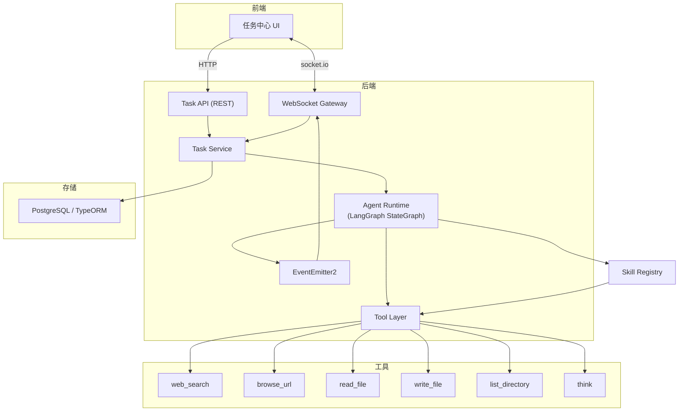
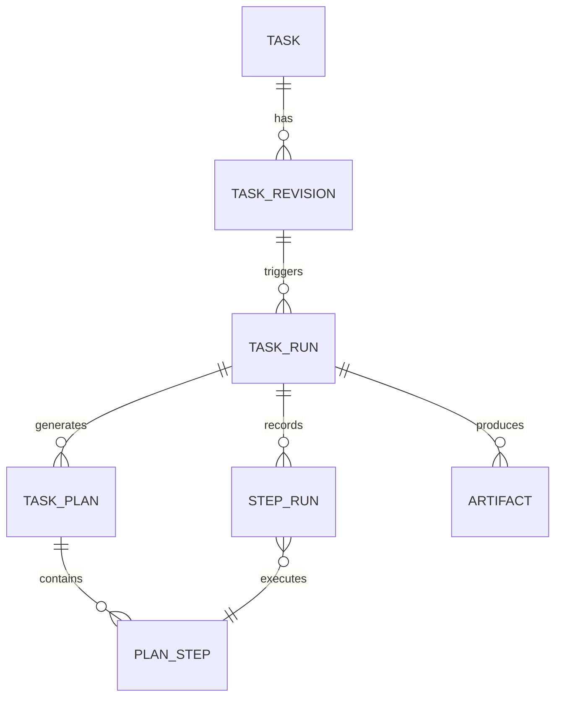
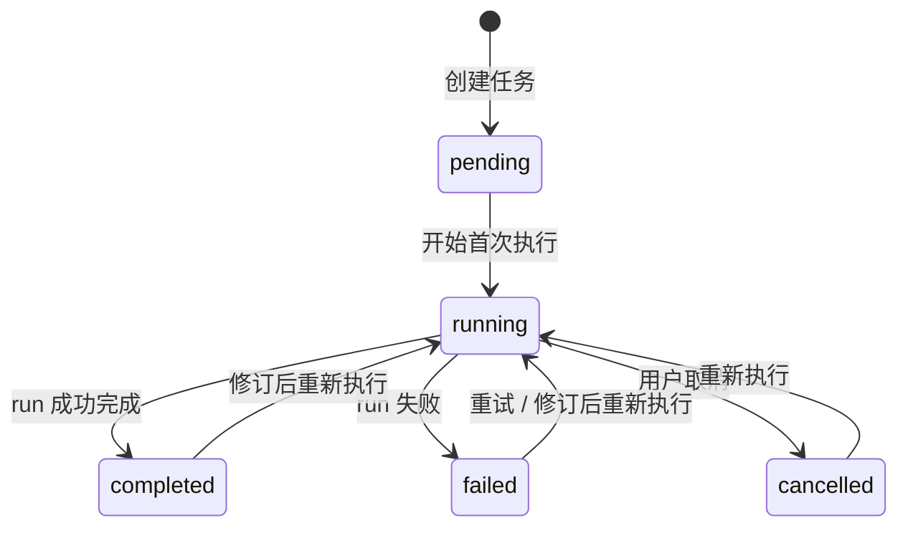
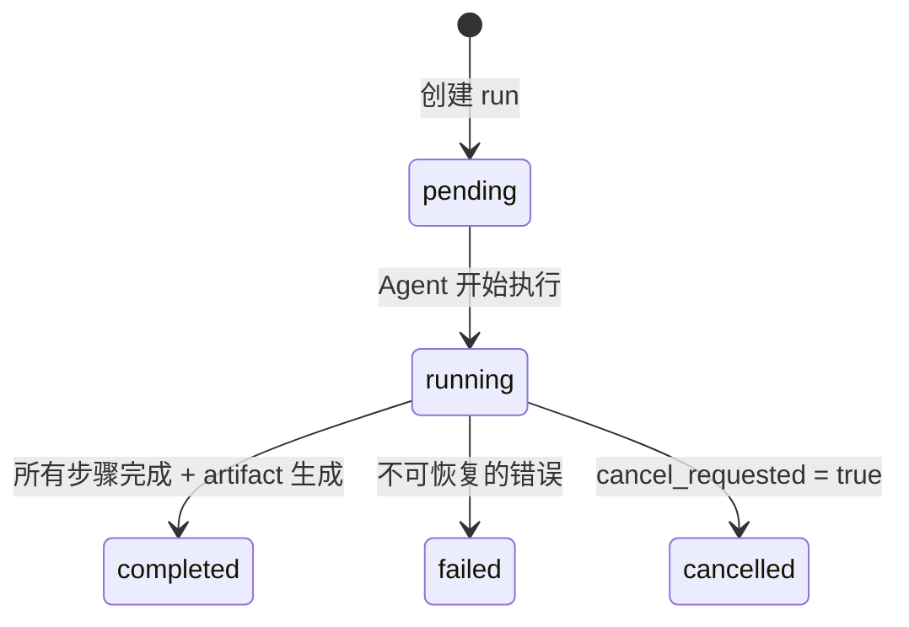
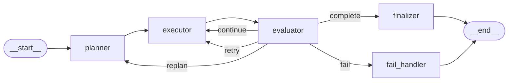
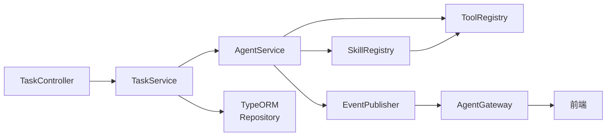

# 简易版 Manus 技术方案

> 一个以任务为中心、可规划、可执行、可回看、可修订的单 Agent 系统。

---

## 1. 系统定位

这个系统不是"聊天机器人 + 工具调用"，而是一个任务型 Agent。

两者的区别：

| | 聊天系统 | 任务系统 |
|---|---|---|
| 中心对象 | message | task |
| 用户期望 | 得到回答 | 完成任务 |
| 执行过程 | 不需要可见 | 必须可见 |
| 失败后 | 重新问一遍 | 重试 / 重规划 / 修订 |
| 交付物 | 一段文字 | 执行轨迹 + 产物 |

用户给出任务后，系统要做到 5 件事：

1. 把任务拆成可执行步骤
2. 逐步执行并实时展示过程
3. 出错时能重试或重新规划
4. 用户可以修改任务描述，系统基于新描述重新执行
5. 每次执行的完整轨迹可回看

这 5 件事决定了后面所有设计。

---

## 2. 整体架构



职责边界——每个模块只管一件事：

| 模块 | 负责 | 不负责 |
|---|---|---|
| Task API / Gateway | 接收请求，返回数据，推送事件 | 推理、规划 |
| Task Service | 任务状态管理，CRUD | Agent 执行逻辑 |
| Agent Runtime | 规划、执行、评估、决策 | 数据库操作、前端通信 |
| Skill Registry | 加载和管理 skills，供 planner 感知、executor 调用 | 不决定何时用哪个 skill |
| Tool Layer | 工具注册与执行 | 决定何时调什么工具 |
| EventEmitter2 | Agent 内部状态 → WebSocket 事件 | 存储、推理 |

关键解耦点：**Agent Runtime 不直接推 WebSocket，不直接写数据库**。它通过 EventEmitter2 发布事件，通过回调 / 返回值把执行结果交给 Task Service 去持久化。这保证 Agent 逻辑可以独立测试。

---

## 3. 数据模型

### 3.1 实体关系



和一般 Agent 系统 ERD 的关键区别：**step_run 必须关联到 plan_step**。

原因：一个 run 内可能发生重规划（replan），产生多版 plan。如果 step_run 只挂在 run 下面，重规划后你无法区分"旧计划的第 2 步"和"新计划的第 2 步"。前端的步骤视图、日志回看、重跑定位全部依赖这个关联。

### 3.2 字段定义

#### task — 任务主对象

```
task
├── id: UUID, PK
├── title: string               // 由模型从用户输入中提取
├── status: TaskStatus          // pending | running | completed | failed | cancelled
├── current_revision_id: UUID?  // 指向当前生效的 revision
├── current_run_id: UUID?       // 指向当前活跃的 run
├── created_at: datetime
└── updated_at: datetime
```

`current_run_id` 的作用：**只有 current_run_id 对应的 run 才能更新 task.status**。这防止旧 run 的延迟状态变更（比如异步落成 cancelled）覆盖新 run 已设置的状态。

#### task_revision — 用户输入版本

```
task_revision
├── id: UUID, PK
├── task_id: UUID, FK → task
├── version: int                // 1, 2, 3... 单调递增
├── input: text                 // 用户原始任务描述
└── created_at: datetime
```

**revision 是不可变的**。用户修改任务 = 新建 revision，不修改已有 revision。这是保留历史的基础。

没有 revision 会出什么问题：
1. 你不知道当前计划对应的是哪个版本的用户输入
2. 用户改完任务后，旧的执行记录会失真——它还引用着已经被覆盖的输入

#### task_run — 一次执行尝试

```
task_run
├── id: UUID, PK
├── task_id: UUID, FK → task
├── revision_id: UUID, FK → task_revision
├── status: RunStatus           // pending | running | completed | failed | cancelled
├── run_number: int             // 在该 revision 下的第几次执行
├── cancel_requested: boolean   // 协作式取消标记
├── error_message: text?
├── started_at: datetime?
├── completed_at: datetime?
└── created_at: datetime
```

**同一个 task 同时只能有一个 running 状态的 run**。如果当前有 running 的 run，新建的 run 进入 `pending` 状态排队，等旧 run 到达终态后自动启动。这避免了两个 run 同时执行、共享工作目录的竞态。V1 默认使用 PostgreSQL，推荐用 `事务 + 行级锁（SELECT ... FOR UPDATE）` 保证 `check + create` 原子性；如果需要更强的兜底，可以再加部分唯一索引约束 `status = 'running'`。

没有 run 会出什么问题：
1. 你无法区分"同一任务版本的第一次执行"和"失败后的重试"
2. 失败后只能覆盖历史，不能保留失败轨迹

#### task_plan — 执行计划

```
task_plan
├── id: UUID, PK
├── run_id: UUID, FK → task_run
├── version: int                // 同一 run 内的第几版计划（支持 replan）
└── created_at: datetime
```

plan 是容器，具体步骤在 plan_step 里。**plan 也是不可变的**——replan = 新建 plan，不修改旧 plan。

#### plan_step — 计划步骤

```
plan_step
├── id: UUID, PK
├── plan_id: UUID, FK → task_plan
├── step_index: int             // 在该 plan 内的顺序（0, 1, 2...）
├── description: string         // "调研 React Compiler 最新进展"
├── skill_name: string?         // 指定使用的 skill（如 "web_research"），为空则由 executor 自行决定工具
├── skill_input: JSONB?         // skill 的输入参数（PostgreSQL）
├── tool_hint: string?          // 不使用 skill 时，建议使用的工具名
└── created_at: datetime
```

planner 生成计划时，如果已加载的 skill 能覆盖某一步，就填 `skill_name` + `skill_input`；如果没有合适的 skill，退回到 `tool_hint`，由 executor 直接调 tool。这保证系统在没有任何 skill 时也能正常工作——skill 是增强，不是必须。

#### step_run — 步骤执行记录

```
step_run
├── id: UUID, PK
├── run_id: UUID, FK → task_run
├── plan_step_id: UUID, FK → plan_step   // ← 关键：绑定到具体计划步骤
├── execution_order: int        // 在该 run 内的实际执行顺序
├── status: StepStatus          // pending | running | completed | failed | skipped
├── executor_type: enum         // 'tool' | 'skill'（标记本步是工具直调还是 skill 执行）
├── skill_name: string?         // skill 执行时填写
├── tool_name: string?          // 工具直调时填写
├── tool_input: JSONB?
├── tool_output: JSONB?
├── skill_trace: JSONB?         // skill 内部的工具调用轨迹（数组：[{tool, input, output}, ...]）
├── llm_reasoning: text?        // 模型的推理过程
├── result_summary: text?       // 步骤结果摘要（喂给后续步骤和 planner）
├── error_message: text?
├── started_at: datetime?
└── completed_at: datetime?
```

`skill_trace` 记录 skill 内部的多次工具调用。前端可以把它展开为子步骤展示，让 skill 的执行过程可观察。

step_run 是"执行过程可观察"的基础。没有它，前端只能展示"任务完成了"，不能展示"任务是怎么一步步完成的"。

#### artifact — 产物

```
artifact
├── id: UUID, PK
├── run_id: UUID, FK → task_run
├── type: ArtifactType          // markdown | json | file
├── title: string
├── content: text
├── metadata: JSONB?
└── created_at: datetime
```

artifact 代表交付物，不代表中间过程。

### 3.3 PostgreSQL 落库约束

V1 默认数据库是 PostgreSQL，所以文档里的结构化字段统一按 `JSONB` 设计，便于存工具参数、skill trace、artifact metadata 这类半结构化数据。

推荐的数据库约束：

- `task_revision(task_id, version)` 唯一：同一 task 下 revision 版本号不能重复
- `task_run(revision_id, run_number)` 唯一：同一 revision 下 run 编号不能重复
- `task_plan(run_id, version)` 唯一：同一 run 下 plan 版本号不能重复
- `plan_step(plan_id, step_index)` 唯一：同一 plan 下步骤顺序不能重复
- `step_run(run_id, execution_order)` 唯一：同一 run 下实际执行顺序不能重复

推荐的并发约束：

- 用事务包住“读取 task 当前状态 → 创建 run → 更新 task.current_run_id”这一组操作
- 如果要把“同一 task 同时只能有一个 running run”下沉到数据库层，优先用 PostgreSQL 的**部分唯一索引**而不是只靠应用层判断

推荐的索引：

- `task(current_revision_id)`
- `task(current_run_id)`
- `task_run(task_id, status)`
- `step_run(run_id, plan_step_id)`
- `artifact(run_id)`

### 3.4 三层分离的必要性

一个例子说清楚三层为什么不能合并：

```
用户创建任务："收集 5 篇 React Compiler 的资料并整理成笔记"
  → task created
  → revision v1 created
  → run #1 started → 失败了

用户点"重试"（需求没变，只是重跑）
  → revision 不变
  → run #2 created → 成功了

用户改任务："收集 5 篇 React Compiler 在生产环境中的资料，整理成对比笔记"
  → revision v2 created
  → run #1 under v2 created
```

- 如果没有 revision：你分不清"这是需求变了"还是"单纯重试"
- 如果没有 run：你无法保留 v1 run#1 失败时的完整执行轨迹
- 如果 step_run 不挂 plan_step：replan 后你不知道某个 step_run 对应的是哪版计划的哪一步

---

## 4. 状态机

### 4.1 Task 状态



task.status 始终反映**最近一次 run 的结果**。

### 4.2 Run 状态



取消机制：**协作式取消**。

用户请求取消时，设置 `cancel_requested = true`。执行循环在每个步骤开始前检查此标记，如果为 true 则停止执行，将 run 状态设为 `cancelled`。不使用强制中断，避免工具执行到一半、数据写到一半的问题。

注意 replan 不改变 run 状态——run 仍然是 `running`，只是内部产生了一版新的 plan。

**僵尸 Run 恢复**：进程崩溃后，数据库里可能残留 `running` 状态的 run 和 step，导致用户无法重试（并发约束阻止新建 run）。应用启动时（`onModuleInit`），扫描所有 `running` 状态的 run，标记为 `failed`（error_message: "系统意外中止"），释放并发锁。

### 4.3 Step 状态

```
pending → running → completed
                  → failed
                  → skipped（因 replan 被跳过）
```

---

## 5. 执行引擎

### 5.1 LangGraph StateGraph



四个节点，各自的职责：

| 节点 | 输入 | 输出 | 职责 |
|---|---|---|---|
| **planner** | 任务描述 + 已有步骤结果摘要 | plan + plan_steps | 把任务拆成可执行步骤 |
| **executor** | 当前 plan_step + 最近几步的详细结果 | step_run（含工具/skill 调用结果） | 执行当前步骤：如果 plan_step 指定了 skill 则调用 skill，否则直接调用 tool |
| **evaluator** | 当前 step_run 的输入输出 + plan_step 描述 + 最近几步摘要 | EvaluationResult（结构化决策） | 判断下一步怎么走 |
| **finalizer** | 所有步骤的结果摘要 | artifact | 汇总执行结果，生成最终产物 |

为什么用手写 StateGraph 而不是 `createReactAgent`：

`createReactAgent` 把规划、执行、评估全部藏进了一个 ReAct 循环。对产品来说这没问题，但这个项目的目标是教学——学生需要看到 StateGraph 的每个节点、每条边是怎么定义的。手写 StateGraph 是从 while 循环到声明式状态图的关键一跳。

### 5.2 AgentState

```typescript
interface AgentState {
  // 任务上下文
  task_id: string;
  run_id: string;
  revision_input: string;

  // 计划状态
  current_plan_id: string | null;
  current_step_index: number;

  // 执行记录
  step_results: StepResultSummary[];   // 已完成步骤的摘要（不是原始 tool_output）

  // 控制参数
  replan_count: number;
  retry_count: number;
  evaluation: EvaluationResult | null;

  // LLM 上下文
  messages: BaseMessage[];
}
```

### 5.3 执行循环

用伪代码描述主流程，明确终止条件和边界情况：

```
function execute_run(task, revision, run):
    state = init_state(task, revision, run)
    set_run_status(run, 'running')
    emit('run.started')

    // ——— 规划 ———
    plan = planner(state)
    save_plan(run, plan)
    emit('plan.created', plan)

    // ——— 逐步执行 ———
    for step in plan.steps:

        // 取消检查（每步之前，从 DB 重读最新状态）
        if read_cancel_flag(run.id):
            set_run_status(run, 'cancelled')
            emit('run.cancelled')
            finalize_run(task.id)      // ← 统一收尾
            return

        // 总步数检查
        if executed_steps >= MAX_STEPS_PER_RUN:
            set_run_status(run, 'failed', '超出最大步骤数')
            emit('run.failed')
            finalize_run(task.id)      // ← 统一收尾
            return

        // 执行（先持久化再发事件，避免前端收到数据库里不存在的记录）
        step_run = create_step_run(run, step, status='running')
        emit('step.started', step_run)
        result = executor(state, step)

        // 评估
        evaluation = evaluator(state, step_run, result)

        // ——— 每个分支都必须先收口当前 step_run 的终态 ———
        switch evaluation.decision:
            case 'continue':
                update_step_run(step_run, result, status='completed')
                emit('step.completed', step_run)
                state.retry_count = 0
                continue to next step

            case 'retry':
                update_step_run(step_run, result, status='failed')
                emit('step.failed', step_run)
                if state.retry_count >= MAX_RETRIES_PER_STEP:
                    set_run_status(run, 'failed', '步骤重试次数耗尽')
                    emit('run.failed')
                    finalize_run(task.id)
                    return
                state.retry_count += 1
                // 为重试创建新的 step_run（引用同一个 plan_step）
                retry current step

            case 'replan':
                update_step_run(step_run, result, status='completed')  // 当前步骤本身成功，只是计划需要调整
                emit('step.completed', step_run)
                if state.replan_count >= MAX_REPLANS_PER_RUN:
                    set_run_status(run, 'failed', '重规划次数耗尽')
                    emit('run.failed')
                    finalize_run(task.id)
                    return
                state.replan_count += 1
                mark_remaining_steps('skipped')
                plan = planner(state)
                save_plan(run, plan)
                emit('plan.created', plan)
                restart loop with new plan

            case 'complete':
                update_step_run(step_run, result, status='completed')
                emit('step.completed', step_run)
                break out of loop

            case 'fail':
                update_step_run(step_run, result, status='failed')
                emit('step.failed', step_run)
                set_run_status(run, 'failed', evaluation.reason)
                emit('run.failed')
                finalize_run(task.id)
                return

    // ——— 生成产物 ———
    artifact = finalizer(state)
    save_artifact(run, artifact)
    emit('artifact.created', artifact)

    set_run_status(run, 'completed')
    emit('run.completed')
    finalize_run(task.id)              // ← 统一收尾

// ——— 统一收尾逻辑 ———
function finalize_run(task_id):
    // 所有 run 终态（completed / failed / cancelled）都走这里
    // 如果同一 task 下有 pending 的 run，启动最新的那个，取消其余过期的
    pending_runs = get_pending_runs(task_id, order_by='created_at DESC')
    if pending_runs is empty:
        return
    latest = pending_runs[0]
    for older in pending_runs[1:]:
        set_run_status(older, 'cancelled', '被更新的修订取代')
    execute_run(task, latest.revision, latest)  // 启动最新的 pending run
```

### 5.4 执行约束

| 约束 | 默认值 | 存在意义 |
|---|---|---|
| 单步最大重试次数 | 3 | 工具失败不会无限重试 |
| 单 run 最大重规划次数 | 2 | planner 不会反复推翻自己 |
| 单 run 最大步骤总数 | 20 | 防止无限执行 |
| 单步超时 | 60s | 工具调用不会永远等待 |

这些不是优化参数，是系统能不能停下来的前提。没有它们，一个失败的工具调用就能让 run 永远不结束。

### 5.5 上下文管理

LLM 上下文不能无限增长，尤其是工具输出可能很长（网页全文）。策略：

- **planner** 接收：revision_input + 已完成步骤的 `result_summary`（摘要，不是原始 tool_output）
- **executor** 接收：当前 plan_step 描述 + 最近 3 步的详细输入输出
- **evaluator** 接收：当前 step 的**最终结果**（tool 模式下是 tool_output，skill 模式下是 `SkillEvent { type: 'result' }` 的 output，**不是** skill_trace）+ plan_step 描述 + 最近几步的 `result_summary`（用于检测重复模式，防止 Agent 原地打转）。skill_trace 只用于前端展示和日志溯源，不喂给 evaluator

重规划时 planner 看到的是摘要，不是完整历史。这保证 replan 不会因为上下文塞满而质量下降。

---

## 6. 评估与决策

### 6.1 问题

evaluator 是整个系统里最容易"飘"的节点。

如果让模型自由输出自然语言再解析，你会遇到：
- 模型说"可以继续，但我觉得换个方向也行"——到底是 continue 还是 replan？
- 模型说"结果不太好"——是 retry 还是 fail？

### 6.2 方案：结构化评估契约

用 Zod 约束评估结果：

```typescript
const EvaluationResultSchema = z.object({
  decision: z.enum(['continue', 'retry', 'replan', 'complete', 'fail']),
  reason: z.string(),    // 写入 step_run.result_summary，也作为后续步骤的上下文
});
```

五种决策的触发条件：

| decision | 含义 | 典型触发场景 |
|---|---|---|
| `continue` | 当前步骤成功，继续下一步 | 工具返回有效结果，符合 plan_step 预期 |
| `retry` | 当前步骤失败，但值得重试 | 网络超时、搜索返回空、临时性错误 |
| `replan` | 计划本身不再可行 | 工具结果表明前提假设错误；连续重试仍失败 |
| `complete` | 任务提前完成 | 信息已经收集够了，不需要执行剩余步骤 |
| `fail` | 任务无法完成 | 根本性问题：任务本身不合理、必要资源不存在 |

用结构化输出（`withStructuredOutput`）让模型直接返回符合 schema 的 JSON，不做正则解析。

---

## 7. 事件系统

### 7.1 传输方式

WebSocket（socket.io），不用 SSE。原因：

1. 前端需要向后端发指令（取消执行、修订任务），需要双向通信
2. socket.io 的房间（room）机制天然按 task_id 隔离事件
3. 项目已有 socket.io 使用基础

### 7.2 事件类型

```typescript
// 任务级
'task.created'      → { taskId, title }
'task.updated'      → { taskId, status }

// Revision 级
'revision.created'  → { taskId, revisionId, version, input }

// Run 级
'run.started'       → { taskId, runId, revisionId }
'run.completed'     → { taskId, runId }
'run.failed'        → { taskId, runId, error }
'run.cancelled'     → { taskId, runId }

// Plan 级
'plan.created'      → { taskId, runId, planId, steps: PlanStep[] }

// Step 级
'step.started'      → { taskId, runId, stepRunId, planStepId, description }
'step.completed'    → { taskId, runId, stepRunId, resultSummary }
'step.failed'       → { taskId, runId, stepRunId, error }

// 工具级（嵌套在 step 生命周期内）
'tool.called'       → { taskId, runId, stepRunId, toolName, toolInput }
'tool.completed'    → { taskId, runId, stepRunId, toolName, toolOutput }

// 产物级
'artifact.created'  → { taskId, runId, artifactId, type, title }
```

### 7.3 架构解耦

```
Agent Runtime  ──emit──▶  EventEmitter2  ──subscribe──▶  WebSocket Gateway  ──push──▶  前端
```

Agent Runtime 只发布事件，不知道事件最终怎么送达前端。好处：

1. Agent Runtime 可以独立于任何通信协议进行测试
2. 未来如果要加 webhook、SSE、日志写入，只需要加新的 subscriber
3. Gateway 层可以做事件过滤、聚合、限流，不侵入 Agent 逻辑

### 7.4 断线恢复

V1 采用最简方案：**全量快照 + 增量事件**。

- 前端连接（或重连）时，先通过 REST API 拉取任务当前全量状态
- 连接建立后，通过 WebSocket 接收后续增量事件
- 如果前端检测到状态不一致（比如收到 step.completed 但本地没有对应的 step.started），重新拉全量

不需要 event_id、sequence、Last-Event-ID——V1 的任务执行时间短，全量拉取的成本可以接受。如果后续任务变长、步骤变多，再在事件上加 sequence 实现精确重放。

---

## 8. 工具层

### 8.1 工具清单

| 工具 | 类型 | 说明 |
|---|---|---|
| `web_search` | read-only | 调用搜索引擎 API |
| `browse_url` | read-only | 获取指定 URL 的网页内容 |
| `read_file` | read-only | 读取工作目录下的文件 |
| `write_file` | **side-effect** | 写入文件到工作目录 |
| `list_directory` | read-only | 列出目录内容 |
| `think` | read-only | 模型内部推理，不调用外部系统 |

### 8.2 read-only vs side-effect

这个分类直接影响"重跑"的安全性。

- **read-only 工具**：多次调用结果一致，重跑安全
- **side-effect 工具**：重跑可能产生副作用（重复写文件、覆盖已有内容）

V1 只有 `write_file` 有副作用。V2 如果加 `browser_navigate`、`browser_click`，也属于 side-effect。

处理策略不是给每个工具加 idempotency key（过重），而是从执行模型上隔离：

1. 每个 task 有独立的工作目录：`/tmp/mini-manus-workspaces/<taskId>/`
2. **"重跑" = 新建 run**，不是在旧 run 上继续执行。新 run 可以读到工作目录里已有的文件（前序 run 产生的），但它自己的 step_run 记录是独立的
3. 路径沙箱：`WorkspaceService.resolveSafePath()` 校验所有路径不能逃逸出工作目录

### 8.3 工具输出截断

工具返回的原始内容可能很大（`browse_url` 抓网页全文、`read_file` 读大文件）。不截断会同时打爆三个地方：LLM 上下文、数据库行大小、WebSocket payload。

规则：
- 所有工具在内部实现中必须对输出做最大长度截断（默认 5000 字符）
- 超出截断的输出末尾追加 `[内容过长已截断，共 N 字符，已显示前 5000 字符]`
- 截断后的文本存入 `step_run.tool_output`，不存原始全文
- 如果后续需要保留原始全文，落到工作目录的文件里，`tool_output` 只存文件路径引用

### 8.4 URL 安全边界

`browse_url` 如果能访问任意地址，存在 SSRF（服务端请求伪造）风险。约束：
- 只允许 `http://` 和 `https://` 协议
- 屏蔽 `localhost`、`127.0.0.1`、`0.0.0.0`、私网 IP 段（`10.*`、`172.16-31.*`、`192.168.*`）、云 metadata 地址（`169.254.169.254`）
- 响应体大小上限：1MB
- 请求超时：30s

### 8.5 统一接口

```typescript
interface Tool {
  name: string;
  description: string;          // 给模型看的工具说明
  schema: ZodSchema;            // 参数校验
  type: 'read-only' | 'side-effect';
  execute(input: unknown): Promise<ToolResult>;
}

interface ToolResult {
  success: boolean;
  output: string;               // 工具执行结果（文本）
  error?: string;               // 失败时的错误信息
}
```

ToolModule 通过工厂模式注册所有工具。Agent Runtime 通过 tool name 在 ToolRegistry 中查找并调用，不直接依赖具体工具实现。

---

## 9. Skill 层

### 9.1 Skill 和 Tool 的区别

Tool 是原子操作：搜索一次、读一个文件、写一个文件。
Skill 是**可加载的能力单元**：封装了一段完整的工作流程，内部可以调多个 tool、做多轮 LLM 推理，最终产出一个结构化结果。

```
Tool:  web_search("React Compiler") → 搜索结果列表
Skill: web_research("React Compiler 最新进展") → 搜索 + 浏览 top-3 + 摘要整理 → 结构化调研报告
```

系统在没有任何 skill 的情况下也能正常运行——executor 直接调 tool。Skill 是增强，不是前提。

### 9.2 Skill 定义

```typescript
interface Skill {
  name: string;                  // "web_research"
  description: string;           // 给 planner 看，用于决定何时使用这个 skill
  inputSchema: ZodSchema;        // 输入参数约束
  outputSchema: ZodSchema;       // 输出结构约束
  effect: 'read-only' | 'side-effect';  // 和 Tool 对齐的副作用分类

  execute(
    input: unknown,
    context: SkillContext
  ): AsyncGenerator<SkillEvent>; // 流式产出事件，最终 yield 结果
}

interface SkillContext {
  tools: ToolRegistry;           // 可以调用已注册的工具
  llm: ChatModel;                // 可以调用 LLM
  workspace: WorkspaceService;   // 可以访问工作目录
  signal: AbortSignal;           // 取消信号——skill 内部每次调 tool/llm 前检查
}

// Skill 执行过程中产出的事件（前端可展示为子步骤）
type SkillEvent =
  | { type: 'tool_call'; tool: string; input: unknown }
  | { type: 'tool_result'; tool: string; output: string }
  | { type: 'reasoning'; content: string }
  | { type: 'progress'; message: string }
  | { type: 'result'; output: unknown };
```

`AsyncGenerator` 让 skill 的执行过程是流式可观察的。V1 中 `skill_trace` 在 step 完成后写入 step_run，前端可以展开查看。V2 再做实时子步骤推送（需要扩展事件协议）。

**副作用与重试的关系**：`effect: 'side-effect'` 的 skill（如 `document_writing`，内部调了 `write_file`）在被 evaluator 判定 retry 时会整体重跑。为避免重复写入，skill 必须遵守**故障内聚原则**：
1. Skill 内部的工具调用失败时，skill 自己捕获并做微重试（micro-retry）
2. 只有 skill 认为目标彻底不可达时，才向上抛出错误
3. Evaluator 的 retry 是宏观重试——重跑整个 skill，因此 side-effect skill 的 execute() 必须保证幂等（覆盖写而非追加写）

**取消响应**：skill 执行可能持续几分钟（搜索多个网页、多轮 LLM 调用）。SkillContext 中的 `signal: AbortSignal` 让 skill 内部每次调 tool 或 LLM 前可以检查取消状态，不需要等整个 skill 跑完才响应取消。executor 消费 AsyncGenerator 时也检查 signal，一旦 abort 就终止迭代。

### 9.3 Skill 注册

V1 只支持**内置 skill**——在代码中实现 Skill 接口，启动时在 SkillModule 中注册。不支持运行时从外部目录加载 .ts 文件，因为那等于任意代码执行，和"V1 不做代码执行沙箱"矛盾。

```typescript
// SkillModule 启动时注册内置 skills
@Module({})
export class SkillModule {
  onModuleInit() {
    this.skillRegistry.register(new WebResearchSkill());
    this.skillRegistry.register(new DocumentWritingSkill());
  }
}
```

SkillRegistry 和 ToolRegistry 平行，职责对等：

| | ToolRegistry | SkillRegistry |
|---|---|---|
| 注册 | 启动时注册内置工具 | 启动时注册内置 skill |
| 查找 | 按 tool name | 按 skill name |
| 描述注入 | tool descriptions 注入 **executor** 的 prompt | skill descriptions + **inputSchema** 注入 **planner** 的 prompt |
| 调用 | executor 直接调用 | executor 路由到 skill.execute() |

关键区别：**tool descriptions 给 executor 看（它决定调哪个工具），skill descriptions 给 planner 看（它决定用哪个 skill 来规划步骤）**。

### 9.4 Planner 如何使用 Skills

planner 的 Prompt 里注入当前已加载的 skill 列表：

```
你是一个任务规划器。用户给出了一个任务，你需要把它拆成可执行的步骤。

当前系统已加载以下 skills（含输入参数定义）：
{skills_with_schemas}
// 示例：
// - web_research(input: { topic: string, depth?: number }) — 深度网络调研，搜索+浏览+摘要
// - document_writing(input: { title: string, brief: string, sources?: string[] }) — 生成结构化文档并写入文件

规划要求：
1. 如果某一步能被一个已加载的 skill 覆盖，优先使用 skill（填写 skill_name 和 skill_input）
2. 如果没有合适的 skill，直接描述需要做什么（留空 skill_name，填写 tool_hint）
3. 不要假设系统有未列出的 skill
```

这样 planner 的行为由已加载的 skills 决定。加载一个新 skill = planner 自动能规划出使用它的步骤，不需要改 planner 代码。

### 9.5 Executor 的路由逻辑

```
executor 收到 plan_step:
  if plan_step.skill_name 存在:
    skill = SkillRegistry.get(plan_step.skill_name)
    result = skill.execute(plan_step.skill_input, context)
    // 收集 SkillEvent 序列 → 存入 step_run.skill_trace
  else:
    // 退回到直接调 tool 的模式（和现在一样）
    result = call_tool(plan_step, context)
```

### 9.6 V1 内置 Skills

V1 不要求用户自定义 skill，但系统内置 2-3 个 skill 来验证加载机制：

| Skill | effect | 内部流程 | 输入 | 输出 |
|---|---|---|---|---|
| `web_research` | read-only | web_search → browse_url × N → think(摘要) | `{ topic: string, depth?: number }` | `{ findings: string, sources: string[] }` |
| `document_writing` | **side-effect** | think(大纲) → think(正文) → write_file | `{ title: string, brief: string, sources?: string[] }` | `{ file_path: string }` |

`document_writing` 是 side-effect skill，它的 execute() 必须保证幂等——同样的输入多次执行产生相同的文件（覆盖写），不会追加或创建重复文件。

有了这两个内置 skill，planner 面对"帮我调研 X 并整理成笔记"这类任务时，会规划出 2 步（research → write）而不是 7 步（search → browse → browse → browse → think → think → write）。计划更稳定，执行更可靠。

---

## 10. 后端模块划分

| 模块 | 职责 | 核心导出 |
|---|---|---|
| **TaskModule** | task / revision / run / plan / step / artifact 的 CRUD 与状态流转 | TaskService, TaskController |
| **AgentModule** | LangGraph StateGraph：planner / executor / evaluator / finalizer | AgentService |
| **ToolModule** | 工具注册、参数校验、执行 | ToolRegistry |
| **SkillModule** | Skill 加载、注册、描述注入 | SkillRegistry |
| **EventModule** | EventEmitter2 事件定义与发布辅助 | EventPublisher |
| **GatewayModule** | socket.io WebSocket Gateway, 房间管理 | AgentGateway |
| **WorkspaceModule** | 工作目录生命周期、路径沙箱 | WorkspaceService |

调用关系：



为什么不把所有逻辑放进一个 `ai.service`：

项目里现有的 Demo 都是这个结构——一个 Service 同时管推理、数据库、工具、流式输出。Demo 没问题，但任务系统不行：

1. 任务系统有 6 个实体、12 种事件、4 个执行节点。塞进一个 Service 会在 500 行内失控
2. Agent 逻辑需要独立测试——如果它依赖数据库和 WebSocket，测试就要启动整个 NestJS 应用
3. 工具层会持续扩展，它必须有独立的注册和演进空间

---

## 11. 前端结构

### 10.1 页面布局

```
┌─────────────────────────────────────────────────────┐
│  任务中心                                            │
├──────────────┬──────────────────────────────────────┤
│              │  任务标题 + 状态 + [取消] [重试] [编辑] │
│  任务列表     │──────────────────────────────────────│
│              │  Revision v2 ▾  │  Run #1 ▾          │
│  · 任务 A ●  │──────────────────────────────────────│
│  · 任务 B ✓  │  📋 计划                              │
│  · 任务 C ✗  │  ├ ✓ 1. 搜索 React Compiler 资料      │
│              │  ├ ● 2. 浏览前 3 篇文章               │
│  [+ 新任务]   │  ├ ○ 3. 整理成对比笔记               │
│              │──────────────────────────────────────│
│              │  ⏱ 执行时间线                         │
│              │  ├ [step 1] web_search: "React..."    │
│              │  │  └ 找到 12 条结果                   │
│              │  ├ [step 2] browse_url: "https://..." │
│              │  │  └ 正在读取...                      │
│              │──────────────────────────────────────│
│              │  📄 产物                               │
│              │  └ react-compiler-notes.md [预览]      │
└──────────────┴──────────────────────────────────────┘
```

### 10.2 核心交互

| 操作 | 前端行为 | 后端行为 |
|---|---|---|
| 新建任务 | 提交输入 → 进入任务详情 | 创建 task + revision v1 + run #1 → 自动执行 |
| 查看进度 | WebSocket 实时更新时间线 | Agent 每步发事件 |
| 取消 | 点取消 → 灰化步骤 | 设 cancel_requested → 循环停止 |
| 重试 | 点重试 → 时间线清空 | 同 revision 新建 run → 重新执行 |
| 编辑任务 | 弹出编辑框 → 提交 → 新时间线 | 请求取消旧 run → 新建 revision → 新建 run(pending) → 旧 run 终止后启动新 run |
| 切换历史 | Revision / Run 下拉切换 → 加载对应记录 | 返回指定 revision/run 的全量数据 |

### 10.3 为什么不是聊天页面

聊天框保留，但只作为**任务入口**——用户在聊天框里输入任务描述，提交后立刻切换到任务详情视图。

原因：用户提交任务后，关注的是"系统拆了几步、当前在第几步、哪步调了什么工具、结果是什么"。这些信息用聊天气泡展示会非常混乱——你没法在气泡里表达步骤状态、计划视图、revision/run 切换。任务中心的时间线 + 步骤卡片才是正确的信息载体。

### 10.4 前端状态管理分层

前端状态分两层：

- **Jotai**：管理页面本地 UI 状态（选中 task、revision、run、artifact、面板开关等）
- **TanStack Query**：管理服务端数据状态（任务列表、任务详情、run 详情）和缓存失效策略

这样可以把“界面状态”和“远端数据状态”拆开，避免一个状态库同时承担两类职责。

---

## 12. 版本与回退

### 11.1 四种操作

| 操作 | 语义 | 对数据模型的影响 |
|---|---|---|
| **编辑任务** | 用户改了需求 | 请求取消当前 run → 新建 revision → 新建 run（status=**pending**）→ 旧 run 到达终态后自动启动 pending run |
| **取消** | 停止当前执行 | 当前 run 标记 cancelled |
| **重试** | 同样的需求再跑一次 | 同一 revision 下新建 run |
| **重规划** | 执行中发现计划不对 | 同一 run 内新建 plan（evaluator 自动触发） |

### 11.2 "从某一步重跑"的精确语义

不是在旧 run 上回滚，而是：

1. 新建一个 run
2. planner 接收"前 N 步已有结果的摘要"作为上下文
3. planner 据此生成新计划——可能跳过已完成的工作，也可能调整后续步骤
4. 新 run 的 step_run 从头编号，但 planner 知道哪些工作已经做过

这样设计的原因：
- 不在脏状态上继续执行（side-effect 工具安全）
- 旧 run 的记录完整保留（可回看）
- 语义清晰：每个 run 都是一次完整的执行尝试

### 11.3 V1 不做什么

1. 任意历史消息编辑并自动改写后续记录
2. 多分支版本合并
3. Artifact 版本树
4. 跨 run 的步骤复用（直接把旧 step_run 挪到新 run）

---

## 13. 技术选型与边界

| 技术 | 位置 | 用在哪 | 不用在哪 |
|---|---|---|---|
| **NestJS** | 后端框架 | 模块化、DI、Controller/Service/Gateway | — |
| **TypeORM + PostgreSQL** | 持久化 | 所有实体的 CRUD、事务、状态约束 | 不承担 LLM 上下文管理 |
| **LangGraph.js** | 执行引擎 | StateGraph 定义节点与边，管理执行流 | 不管数据库、不管前端 |
| **LangChain.js** | LLM 调用 | ChatModel、Tool Calling、结构化输出 | 不做执行编排（那是 LangGraph 的事） |
| **socket.io** | 实时通信 | 事件推送、前端指令 | — |
| **Jotai** | 前端状态 | 管理本地 UI 状态（选中项、视图状态） | 不缓存服务端数据 |
| **TanStack Query** | 前端数据层 | 管理 REST 数据缓存、失效刷新、请求状态 | 不承担页面本地状态 |
| **EventEmitter2** | 内部解耦 | Agent Runtime → Gateway 的桥梁 | 不做跨进程通信 |
| **Zod** | 校验 | 工具参数、评估结果、计划结构 | — |

**关于数据库**：V1 默认使用 **PostgreSQL**，不再默认选 MySQL。原因不是 MySQL 不能用，而是这套任务系统天然更依赖事务、一致性约束、JSON 字段和复杂状态流转；PostgreSQL 更贴合这些需求。

**关于 Supabase**：可以用，但这里的定位是 **Supabase Postgres（托管 PostgreSQL）**，不是让前端直接把任务系统建成 `supabase-js` 驱动的应用。推荐方式：

1. 后端仍然使用 `NestJS + TypeORM`
2. TypeORM 通过 PostgreSQL 连接串连接到 Supabase
3. `task / revision / run / plan / step_run / artifact` 这些核心表只允许后端写
4. 前端继续通过 REST + WebSocket 和后端交互，不直接改核心任务状态
5. 任务执行过程的实时展示继续走 `socket.io`，不把 Supabase Realtime 当成主事件通道

如果后续想降低本地运维成本，本地开发可以用 Docker/Postgres，线上直接切到 Supabase；两边的数据模型和 TypeORM 代码保持一致。

**关于 Vercel AI SDK**：V1 不引入。

任务过程的实时展示通过 WebSocket 事件流完成，AI SDK 的 `useChat` / `streamText` 面向聊天场景，和任务事件流是两套协议。如果把两者混在一起，前端需要同时消费两种流、维护两套状态——复杂度会急剧上升。

如果后续要给聊天入口加流式打字效果，可以只在聊天框内引入 AI SDK，任务事件流走 WebSocket，两者互不干扰。

---

## 14. V1 范围

### 做

1. 完整的 task → revision → run → plan → plan_step → step_run → artifact 数据模型
2. 手写 LangGraph StateGraph：planner → executor → evaluator → finalizer
3. 结构化评估决策（Zod schema）
4. 6 个工具：web_search、browse_url、read_file、write_file、list_directory、think
5. Skill 加载机制：SkillRegistry + Skill 接口 + 2 个内置 skill（web_research、document_writing）
6. WebSocket 实时事件推送 + REST 全量查询
7. 任务中心 UI：任务列表 + 详情 + 执行时间线 + 产物预览（skill 执行可展开为子步骤）
8. 取消、重试、编辑任务（生成新 revision）
9. 路径沙箱（WorkspaceService）
10. 执行约束：步骤上限、重试上限、重规划上限、单步超时
11. 工具输出截断（防上下文溢出）
12. browse_url 的 URL 安全校验（防 SSRF）
13. 启动时僵尸 Run 恢复（防进程崩溃后死锁）

### 不做

1. 多 Agent 协作
2. 浏览器自动化（Playwright）
3. 代码执行沙箱
4. SSE 断线精确重放（Last-Event-ID / event sequence）
5. 多租户 / 权限系统
6. 向量记忆
7. 语音输入输出
8. Vercel AI SDK

---

## 15. 成功标准

第一版做完后，这个流程必须能走通：

1. 用户输入："帮我调研 React Compiler 的最新进展，整理成一份笔记"
2. 系统生成 3~5 步计划，实时显示在界面上
3. 系统逐步执行：搜索 → 浏览网页 → 整理内容 → 写入文件
4. 每一步的工具调用和结果实时出现在前端时间线
5. 用户可以中途取消，run 状态变为 cancelled
6. 用户可以编辑任务为"帮我调研 React Compiler 和 Vue Vapor 的对比"，系统生成新 revision 并重新执行
7. 用户可以通过下拉切换查看任何一次 revision / run 的完整执行轨迹
8. 执行完成后生成 Markdown 产物，可在界面预览

8 条全部走通 = 一个简易但成立的 Manus。

只做到"聊天 + 调工具 + 输出答案"= 还是一个聊天 Agent，不是任务型 Manus。
