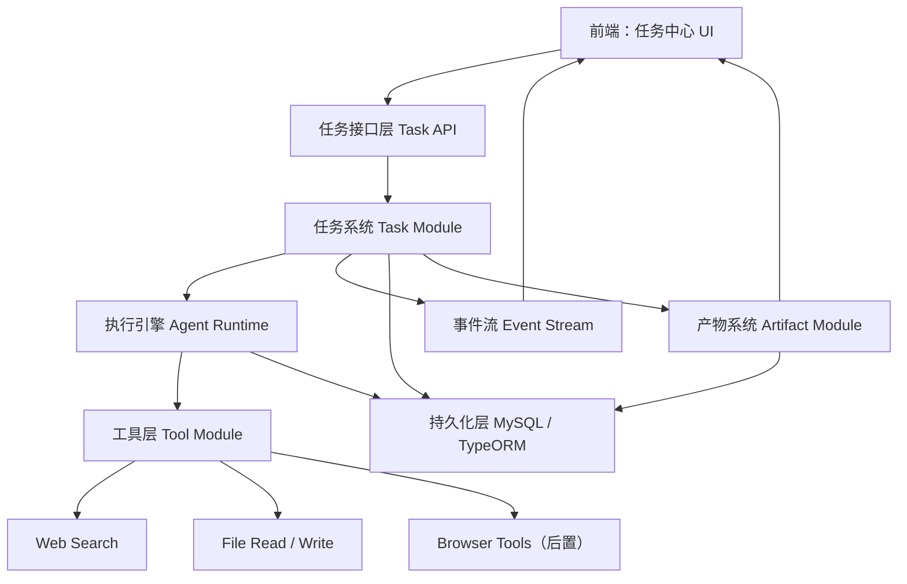
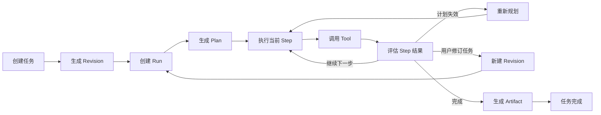
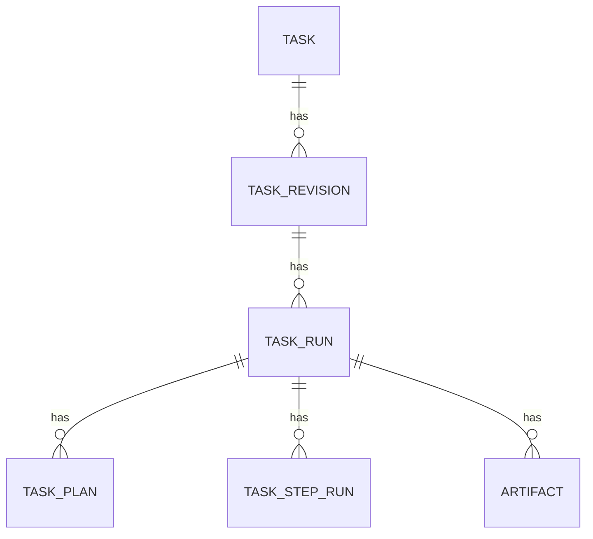
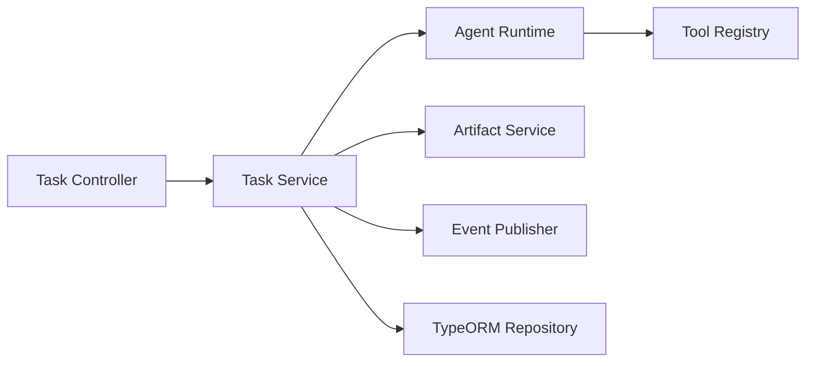
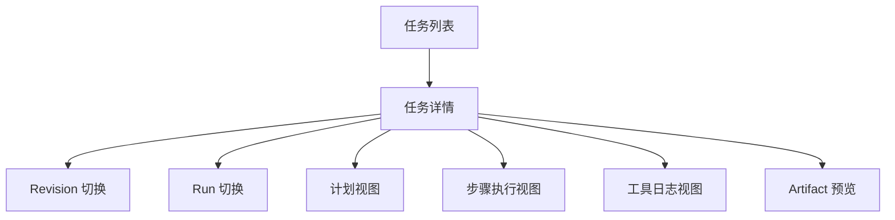

# 简易版 Manus 技术方案总览

> 一句话概括：这不是一个“会聊天的工具调用器”，而是一个“以任务为中心、可规划、可执行、可回看、可修订”的单 Agent 系统。

---

## 1. 先看全局：这个项目到底要解决什么问题

这个项目的目标，不是把现有聊天应用接几个工具，而是做出一个最小可成立的 `任务型 Agent 产品`。

它要解决的核心问题只有一个：

`用户给出一个复杂任务后，系统能把任务拆开、逐步执行、展示过程，并允许用户在执行中修订任务。`

这句话里有 5 个关键词：

1. `任务`
2. `拆解`
3. `执行`
4. `展示过程`
5. `修订`

后面的所有设计，都是围绕这 5 件事展开。

---

## 2. 整体架构图

先看地图，再看模块。

这张图表达的不是“代码目录”，而是 `职责边界`：

1. 前端负责展示任务，不负责推理。
2. 任务系统负责状态，不负责工具细节。
3. 执行引擎负责“下一步做什么”，不负责页面渲染。
4. 工具层负责执行动作，不负责决定策略。
5. 数据库负责保存任务轨迹，不承担模型上下文的职责。

---

## 3. 核心执行流程图

这个项目成立与否，取决于执行流是否清楚。

这张图里最重要的，不是工具调用，而是这 3 个动作：

1. `生成 Plan`
2. `评估 Step 结果`
3. `新建 Revision`

原因很简单：

1. 没有 Plan，系统只是碰运气地调工具。
2. 没有结果评估，系统不知道下一步该继续、重试还是重规划。
3. 没有 Revision，用户一旦编辑任务，整个系统状态就会乱。

---

## 4. 按优先级排序的核心学习路线

这一节要回答的问题是：

`先学什么，后学什么，为什么这个顺序不能乱。`

### P0：任务系统设计

为什么最优先：

1. Manus 的骨架不是 Prompt，不是工具，而是任务系统。
2. 只要任务系统没立住，前端、Agent、回退机制都会失去依附对象。

这一层要搞清楚：

1. 什么是 `task`
2. 什么是 `revision`
3. 什么是 `run`
4. 什么是 `plan`
5. 什么是 `step run`
6. 什么是 `artifact`

学完后应该能回答：

1. 用户编辑任务时，旧记录怎么保留？
2. 为什么不能直接改历史消息？
3. 一个任务为什么会有多个 run？

### P1：执行引擎

为什么第二优先：

1. 任务系统解决“对象是什么”。
2. 执行引擎解决“系统怎么动”。

第一版执行引擎建议先用 `单 Agent 循环`，不要第一天就把 LangGraph 和全部功能绑死。

执行引擎至少要负责：

1. 读取当前任务状态
2. 生成计划
3. 执行当前步骤
4. 调工具
5. 写入步骤结果
6. 判断下一步

这一层的目标不是“模型变聪明”，而是“执行可控”。

### P2：流式任务界面

为什么比浏览器工具更优先：

1. 用户看到的是任务过程，不是模型内部状态。
2. 没有任务界面，整个系统看起来和普通聊天机器人没区别。

这一层要解决：

1. 当前任务在第几步
2. 哪个工具刚刚被调用
3. 哪一步失败了
4. 当前看的是什么 revision / run

### P3：工具层

为什么放在后面：

1. 工具很多，但不是每个工具都决定系统是否成立。
2. 工具应该长在稳定的任务骨架上，而不是反过来主导设计。

第一版工具只做：

1. `web_search`
2. `file_read`
3. `file_write`

第二版再加：

1. `browser_navigate`
2. `browser_extract`
3. `browser_screenshot`

### P4：版本化、回退与重跑

为什么很重要：

1. 这部分决定系统像不像 Manus，而不是像不像普通 AI 助手。
2. 用户真正需要的不是“永远一次成功”，而是“出错后能继续处理”。

这一层要支持：

1. 编辑任务生成新 revision
2. 取消当前 run
3. 从某一步重跑
4. 基于当前 revision 重新规划

### P5：LangGraph 升级

为什么不是第一优先，但又必须学：

1. 第一版项目可以先用简单执行循环立住结构。
2. 但只要任务流开始复杂，LangGraph 就会变成必须品。

它的意义不是“替代 LangChain”，而是：

1. 让状态图显式化
2. 让分支可控
3. 让中断与恢复有归宿

### P6：浏览器自动化和工程化

这部分重要，但不该最先做。

原因：

1. 浏览器工具会显著提高不稳定性。
2. 工程化问题会在系统骨架未稳定时放大复杂度。

所以这部分应该在主干站稳后进入。

---

## 5. 推荐阅读顺序

这一节要回答的问题是：

`文档应该按什么顺序读，才能最快建立整体认知。`

### 第一轮：先读主干，不看细节

顺序：

1. 本文第 1 节到第 4 节
2. 本文第 6 节“系统主干”
3. 本文第 7 节“数据模型”
4. 本文第 8 节“版本与回退机制”

目的：

1. 先知道这个系统的核心对象是什么。
2. 先知道它的主流程是什么。

### 第二轮：再看模块边界

顺序：

1. 本文第 9 节“后端模块职责”
2. 本文第 10 节“前端页面结构”
3. 本文第 11 节“事件流设计”

目的：

1. 知道每个模块负责什么。
2. 知道前后端怎么对接。

### 第三轮：最后再看深度问题

顺序：

1. 本文第 12 节“为什么不是聊天系统”
2. 本文第 13 节“为什么要 revision / run 分层”
3. 本文第 14 节“LangGraph 在哪里引入”

目的：

1. 解决容易混淆的认知问题。
2. 为后续实现做决策准备。

---

## 6. 系统主干：哪些模块是必须成立的

这一节要回答的问题是：

`如果只保留最核心的部分，这个系统最少要有哪些东西。`

### 6.1 主干模块

主干只有 4 个：

1. `任务系统`
2. `执行引擎`
3. `流式事件系统`
4. `任务中心前端`

这 4 个模块决定系统是否成立。

#### 任务系统

职责：

1. 保存任务、版本、运行记录、产物。
2. 提供唯一真实状态来源。

为什么重要：

1. 没有它，任务编辑、回退、历史回看都无法定义。

#### 执行引擎

职责：

1. 把任务变成可执行步骤。
2. 决定下一步继续、重试还是重规划。

为什么重要：

1. 没有它，工具只是被动能力，不能形成任务执行过程。

#### 流式事件系统

职责：

1. 把后端状态变化实时推给前端。

为什么重要：

1. 用户需要看到“系统正在做什么”，而不是只看最终答案。

#### 任务中心前端

职责：

1. 展示任务、步骤、日志、产物、版本切换。

为什么重要：

1. Manus 的交互中心是任务详情页，不是聊天气泡。

---

## 7. 数据模型：整个系统的骨架

这一节要回答的问题是：

`为什么要 task / revision / run 分层，分别解决什么问题。`

### 7.1 数据模型总览

### 7.2 核心实体说明

| 实体 | 职责 | 为什么重要 |
|---|---|---|
| `task` | 任务主对象 | 统一聚合一个用户任务的全部历史 |
| `task_revision` | 用户输入版本 | 解决“编辑任务后如何保留历史” |
| `task_run` | 某个 revision 的一次执行 | 解决“同一版本可多次重试” |
| `task_plan` | 某次 run 的计划结果 | 解决“重规划后计划如何存档” |
| `task_step_run` | 每一步的执行轨迹 | 解决“过程可回看、可重跑” |
| `artifact` | 最终或中间产物 | 解决“交付结果放在哪里” |

### 7.3 为什么必须这样分

这是整个系统最关键的一层。

#### `task`

它的职责是“聚合”，不是“承载一切细节”。

它负责：

1. 代表一个用户任务
2. 挂住所有 revision 和 run
3. 作为任务列表页的主对象

#### `task_revision`

这是处理“编辑任务”的关键。

它负责：

1. 保存某一次用户输入版本
2. 让旧输入不被覆盖
3. 让系统知道当前执行基于哪一版需求

没有 revision，会出现两个问题：

1. 你不知道当前计划对应的是哪个输入版本。
2. 用户修改任务后，历史执行记录会失真。

#### `task_run`

这是处理“重试”和“取消”的关键。

它负责：

1. 表示某个 revision 的一次实际执行
2. 让同一个 revision 可以多次运行
3. 承接取消、重跑、恢复

没有 run，会出现两个问题：

1. 你无法区分“同一任务版本的第一次执行”和“重试执行”。
2. 失败后只能覆盖历史，而不是新增一轮运行记录。

#### `task_plan`

它负责：

1. 保存某次 run 生成的计划
2. 支持 run 中途重新规划

注意：

1. 计划不是永久真理。
2. 计划必须允许被替换和追加版本。

#### `task_step_run`

它是“过程可观察”的基础。

它负责：

1. 记录每一步何时开始、何时结束
2. 记录调了哪些工具
3. 记录结果摘要
4. 记录失败原因

没有它，前端只能展示“系统做完了”，不能展示“系统怎么做的”。

#### `artifact`

它代表产物，不代表聊天记录。

它负责：

1. 保存最终 Markdown
2. 保存总结、报告、结构化 JSON
3. 作为任务最终交付物

---

## 8. 版本与回退机制：为什么不能直接编辑历史消息

这一节要回答的问题是：

`用户编辑任务时，系统应该怎么处理，才不会把执行历史搞乱。`

### 8.1 先说结论

这个系统应该支持“修订任务”，不应该支持“直接覆盖历史消息”。

原因：

1. 任务型系统的中心对象是 revision，不是 message。
2. 一旦直接改历史消息，计划、步骤、产物的对应关系都会丢失。

### 8.2 第一版要支持的 4 个动作

#### 1. 编辑任务，生成新 revision

适用场景：

1. 用户想改任务描述
2. 用户想补充约束
3. 用户想修正目标

设计意图：

1. 保留旧 revision
2. 基于新 revision 新开 run

#### 2. 取消当前 run

适用场景：

1. 当前执行方向明显不对
2. 用户想立刻停止

设计意图：

1. 停止当前 run，不影响历史记录

#### 3. 从某一步重跑

适用场景：

1. 前面步骤成立，某一步失败
2. 用户想复用已有过程，不想从头跑

设计意图：

1. 提高任务处理效率
2. 保留失败轨迹

#### 4. 重新规划

适用场景：

1. 当前计划不合理
2. 工具结果表明原计划失效

设计意图：

1. 让系统可以自我修正，而不是机械执行旧计划

### 8.3 第一版先不要支持什么

1. 任意历史消息编辑并自动改写后续全部记录
2. 多分支版本合并
3. 复杂 artifact 版本树

这些都不是第一版成立的前提。

---

## 9. 后端模块职责

这一节要回答的问题是：

`后端各个模块分别负责什么，边界怎么划。`

### 9.1 推荐模块划分

| 模块 | 职责 | 为什么这样拆 |
|---|---|---|
| `task` | 任务、revision、run、plan、step 的 CRUD 与状态流转 | 让任务状态集中管理 |
| `agent` | 规划、执行、重规划、结果评估 | 让推理逻辑独立于数据库和接口 |
| `tool` | 工具注册与调用 | 让工具可以独立演进 |
| `event` | SSE 事件推送 | 让前端能实时同步状态 |
| `artifact` | 产物生成与读取 | 让结果交付有固定位置 |

### 9.2 模块调用关系

### 9.3 为什么不要把所有逻辑塞进 `ai.service`

你当前仓库里有不少示例是这种结构，这对 Demo 没问题，但对任务系统不够。

原因：

1. `ai.service` 一旦同时管推理、数据库、工具、流式事件，很快会失控。
2. 任务型系统需要显式的职责边界。

---

## 10. 前端页面结构

这一节要回答的问题是：

`前端为什么不能继续以聊天消息为中心，而要改成任务中心。`

### 10.1 页面结构建议

### 10.2 页面职责说明

#### 任务列表

作用：

1. 看全部任务
2. 快速定位任务状态
3. 进入任务详情

#### 任务详情

作用：

1. 看当前 revision / run
2. 看计划与执行轨迹
3. 做取消、重跑、修订

#### Revision 切换

作用：

1. 看任务输入是如何演变的
2. 保证修订历史可见

#### Run 切换

作用：

1. 看某个 revision 的不同执行尝试
2. 对比失败与重试

#### 步骤执行视图

作用：

1. 把抽象的 Agent 执行，变成具体的任务过程

### 10.3 为什么不建议做成纯聊天页

因为聊天页的中心对象是消息，而这个系统的中心对象是任务。

聊天框可以保留，但只能作为：

1. 任务入口

不能作为：

1. 页面主体

---

## 11. 事件流设计

这一节要回答的问题是：

`前端如何实时知道后端发生了什么。`

### 11.1 第一版建议：SSE

原因：

1. 你现有仓库已经有 SSE 基础。
2. 这个场景主要是后端推送，不需要复杂双向通道。

### 11.2 事件类型建议

| 事件 | 作用 |
|---|---|
| `task.created` | 任务已创建 |
| `revision.created` | 新 revision 已生成 |
| `run.started` | 新 run 开始 |
| `plan.created` | 计划已生成 |
| `step.started` | 某一步开始 |
| `tool.called` | 某个工具被调用 |
| `tool.completed` | 工具执行完成 |
| `step.completed` | 某一步完成 |
| `run.cancelled` | 当前 run 被取消 |
| `run.failed` | 当前 run 失败 |
| `run.completed` | 当前 run 完成 |
| `artifact.created` | 产物生成完成 |

### 11.3 事件系统的职责边界

事件系统不做：

1. 任务推理
2. 工具执行
3. 数据库存储

事件系统只做：

1. 把状态变化推给前端

---

## 12. 关键技术点

这一节要回答的问题是：

`哪些技术是真正必要的，分别放在系统哪个位置。`

### 12.1 NestJS

位置：

1. 后端主框架

作用：

1. 提供模块化结构
2. 承载任务接口、事件接口、工具接口

为什么重要：

1. 你现在的代码基础就在 Nest，延续成本最低。

### 12.2 TypeORM + MySQL

位置：

1. 持久化层

作用：

1. 保存任务、版本、执行记录、产物

为什么重要：

1. 没有持久化，就没有 revision、run、回退、回看。

### 12.3 LangChain

位置：

1. 执行引擎基础层

作用：

1. 模型调用
2. Prompt
3. Tool Calling
4. 结构化输出

为什么重要：

1. 第一版执行循环可以先基于它实现。

### 12.4 LangGraph

位置：

1. 执行引擎升级层

作用：

1. 状态图
2. 分支流转
3. 中断与恢复
4. 人工介入

为什么重要：

1. 只要系统开始出现“继续 / 重试 / 重规划 / 修订”这些分支，显式状态图就有必要。

### 12.5 Vercel AI SDK

位置：

1. 前后端流式交互辅助层

作用：

1. 消息流桥接
2. 前端流式消费

为什么重要：

1. 能降低前端流式交互的实现成本。

注意：

1. 它不应该成为任务系统的主骨架。
2. 任务主骨架仍然应该是 `task / revision / run`。

### 12.6 Playwright

位置：

1. 浏览器工具层

作用：

1. 打开网页
2. 提取信息
3. 截图

为什么重要：

1. 第二版 Manus 要增强执行力时，这是最直接的工具来源。

### 12.7 Zod

位置：

1. Tool 参数校验
2. 模型输出校验

作用：

1. 降低模型输出不稳定带来的破坏范围

为什么重要：

1. 任务型系统不能靠“猜模型不会出错”。

---

## 13. 深度解析一：为什么这个系统不是聊天系统

这一节要回答的问题是：

`为什么不能直接拿现有聊天项目改一改就当 Manus。`

### 13.1 聊天系统的中心对象

聊天系统以这些对象为中心：

1. `message`
2. `conversation`
3. `assistant reply`

### 13.2 Manus 的中心对象

Manus 以这些对象为中心：

1. `task`
2. `revision`
3. `run`
4. `step`
5. `artifact`

### 13.3 两者区别

| 维度 | 聊天系统 | 任务系统 |
|---|---|---|
| 核心对象 | 消息 | 任务 |
| 目标 | 回答用户 | 完成任务 |
| 过程 | 可有可无 | 必须可见 |
| 失败处理 | 重新问一遍 | 重试 / 重规划 / 修订 |
| 结果 | 一段回复 | 一个过程加一份产物 |

### 13.4 设计意图

这个项目必须明确站在“任务系统”这一侧。

否则后面：

1. 回退难定义
2. 前端结构会混乱
3. 执行过程很难可视化

---

## 14. 深度解析二：为什么要 revision / run 两层，而不是一层

这一节要回答的问题是：

`为什么 revision 和 run 不能合并。`

### 14.1 revision 解决“输入变化”

它回答的是：

1. 用户这次任务描述是什么版本？
2. 用户改过几次需求？

### 14.2 run 解决“执行变化”

它回答的是：

1. 这个版本任务实际跑了几次？
2. 哪次失败，哪次成功？

### 14.3 如果合并成一层会发生什么

会出现两个混乱：

1. 不知道“这是需求变了”，还是“只是重试执行”。
2. 前端无法解释当前看的历史记录属于哪一类变化。

### 14.4 一个具体例子

假设任务是：

`收集 5 篇关于 React Compiler 的资料并整理成笔记`

用户先执行了一次，失败了。
然后他没有改需求，只是点了重试。

这时应该：

1. revision 不变
2. run 新增一个

如果后来用户把任务改成：

`收集 5 篇关于 React Compiler 在生产环境中的资料并整理成对比笔记`

这时应该：

1. 新增 revision
2. 基于新 revision 新建 run

这就是两层分离的必要性。

---

## 15. 深度解析三：LangGraph 在哪里引入最合适

这一节要回答的问题是：

`什么时候该用 LangGraph，什么时候先不用。`

### 15.1 第一版可以先不用 LangGraph 做全部

原因：

1. 当前最优先的是把任务系统和前端任务界面立住。
2. 如果一开始把任务系统、版本机制、执行引擎、LangGraph 同时做，认知和实现成本会明显升高。

### 15.2 什么时候必须引入

当系统开始出现这些需求时，LangGraph 就应该进入主干：

1. 需要显式状态图
2. 需要重规划分支
3. 需要人工介入节点
4. 需要中断恢复
5. 需要更清楚的节点边界

### 15.3 推荐引入顺序

1. `V1`
先做任务系统、revision/run、事件流、简单执行循环。

2. `V2`
把执行循环替换成 LangGraph 状态图。

这样做的原因不是为了省事，而是：

1. 先把系统的“对象模型”想清楚
2. 再把系统的“执行结构”升级清楚

---

## 16. 推荐的实现顺序

这一节要回答的问题是：

`真正开始做时，第一步做什么，后面按什么顺序推进。`

### 第一步：先做任务数据模型

目标：

1. 把 `task / revision / run / plan / step_run / artifact` 定下来

原因：

1. 这是后面所有模块的共同依赖

### 第二步：做任务 API 和任务详情页

目标：

1. 能创建任务
2. 能查看任务
3. 能切换 revision / run

原因：

1. 先让系统有“任务中心”形态

### 第三步：做简单执行引擎

目标：

1. 能生成计划
2. 能逐步执行
3. 能写入 step run

原因：

1. 先验证主流程成立

### 第四步：接 SSE 事件流

目标：

1. 让任务过程实时出现在前端

### 第五步：补修订、取消、重跑

目标：

1. 让系统具备基本的 Manus 感

### 第六步：引入 LangGraph 和浏览器工具

目标：

1. 升级执行结构
2. 增强执行能力

---

## 17. 先不用看什么

这一节要回答的问题是：

`哪些东西现在不重要，先别把精力分散过去。`

### 第一版先不用做

1. 多智能体协作
2. 语音输入输出
3. 数字人
4. 复杂权限系统
5. 云端沙箱
6. 复杂 artifact 分支管理
7. 高风险 shell 工具
8. 太多外部平台接入

### 第一版先不用深挖

1. 向量记忆怎么做得更复杂
2. 超长上下文压缩策略
3. 模型路由策略
4. 多租户架构
5. 完整监控平台接入

这些都不是当前系统是否成立的前提。

---

## 18. 最后的判断标准

如果这个方案实现出来，第一版应该满足下面这些判断标准：

1. 用户可以创建一个复杂任务。
2. 系统能生成一份可见的计划。
3. 系统能逐步执行并展示过程。
4. 用户可以取消当前执行。
5. 用户可以编辑任务，生成新 revision。
6. 用户可以查看某次 run 的完整执行轨迹。
7. 系统可以生成最终产物。

如果这 7 条成立，这个项目就已经是一个“简易但成立”的 Manus 版本。

如果只做到：

1. 聊天
2. 调工具
3. 输出最终答案

那它仍然只是一个聊天 Agent，不是任务型 Manus。
